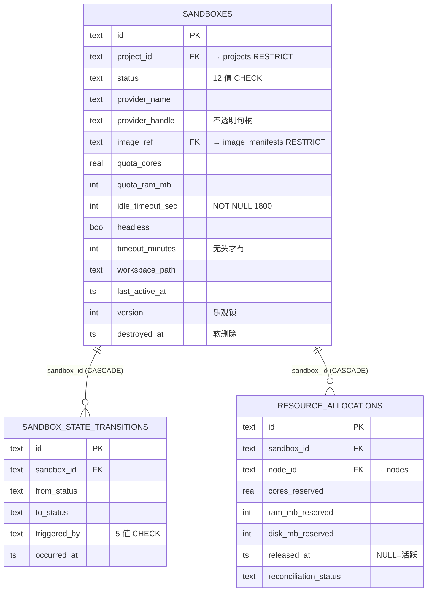
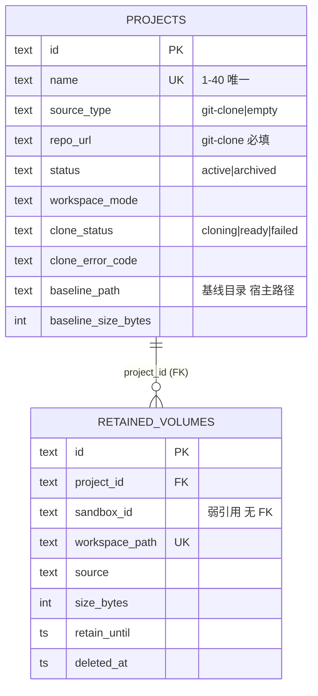
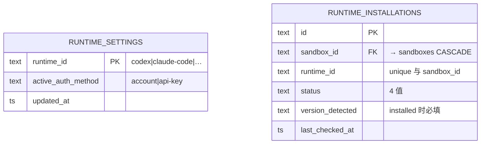
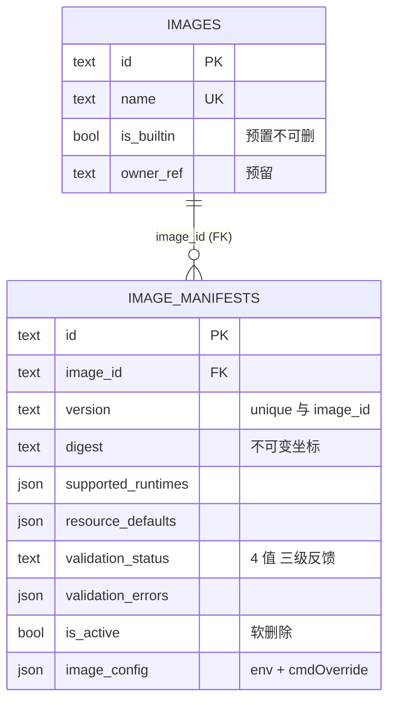
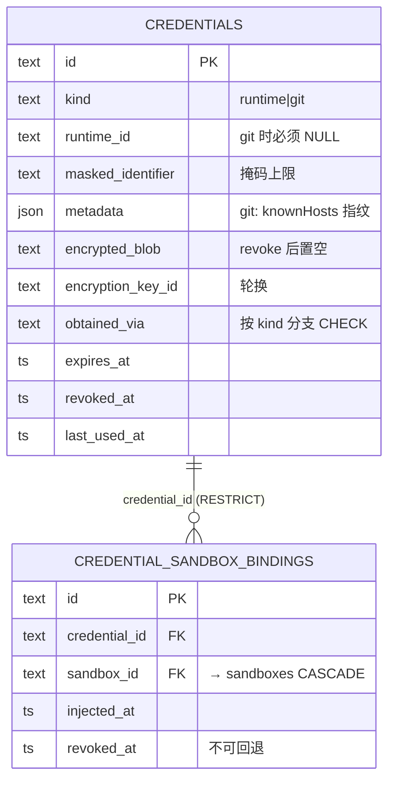
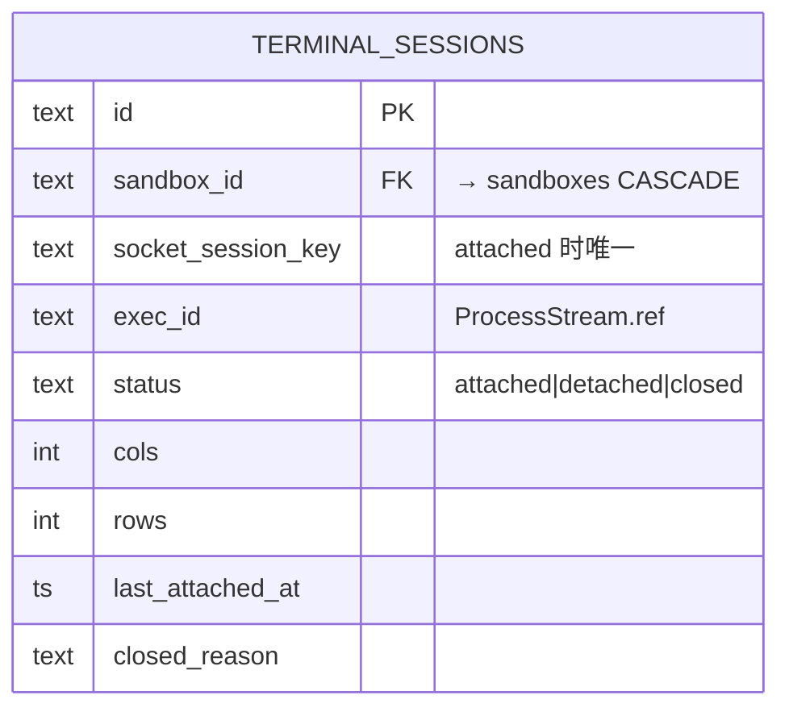
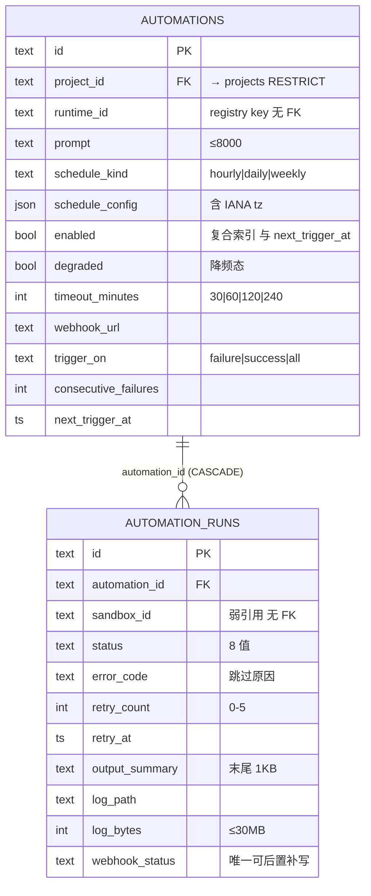
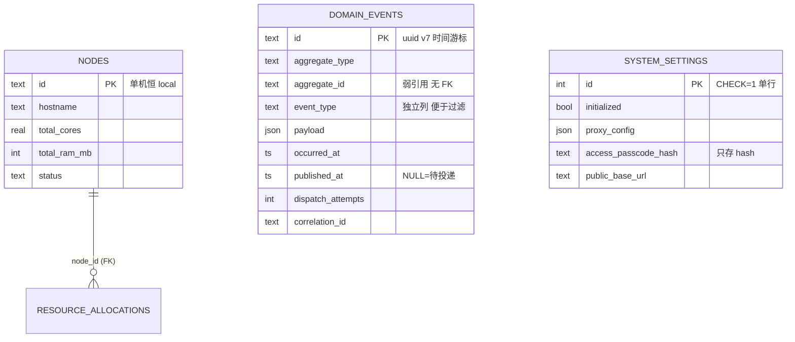
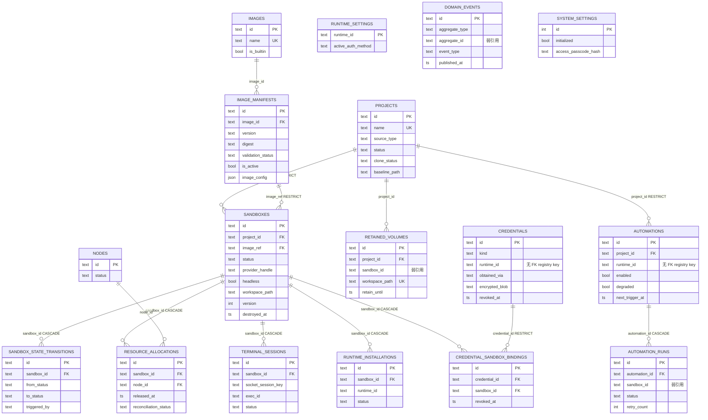

# 13 - 后端数据库设计

> 状态：✅ 可评审（基于 2026-08 调研，Drizzle 双方言实践已核实；**§2 已按 DDD 限界上下文重组为逐列定义 + 上下文内 ER + 跨上下文关联**）
> 关联文档：[01 后端目录结构](./01-后端目录结构与DDD分层.md) · [03 调度中心](./03-Sandbox调度中心.md) · [05 鉴权流转](./05-Runtime鉴权流转.md) · [11 部署与扩展预留](../shared/11-部署与扩展预留.md) · **[23 领域模型](./23-领域模型与聚合设计.md)（聚合与不变量的权威）** · [26 调用图](./26-调用图与文件级设计.md)（哪个函数读写哪张表）
> 产品依据：[P20 §6/§9](../product/20-核心使用链路.md) · [P21-3 §10 Git 凭证](../product/pages/21-3-凭证管理.md) · [P21-4 §10 运行参数](../product/pages/21-4-镜像管理.md) · [P21-6 项目](../product/pages/21-6-项目管理.md) · [P21-7 自动化](../product/pages/21-7-自动化.md)

## 1. 通用约定

| 项 | 决策 | 理由 |
|---|---|---|
| 主键 | **UUID v7**，`text` 存储 | 时间前缀有序，B-Tree 索引局部性好（v4 随机会引发页分裂）；不暴露数据量。用 `uuid` 包的 `v7()`（项目锁定的 Node 22 LTS 无原生 `crypto.randomUUIDv7()`，该 API 需更高版本，未来平滑切换） |
| ID 类型 | 双方言都用 `text`，**不用** pg 原生 `uuid` / `defaultRandom()` | 应用层统一生成（跨表关联前就要拿到 id）；未来可加业务前缀（`sbx_xxx`） |
| 时间戳 | UTC；SQLite `integer(mode:'timestamp_ms')`，PG `timestamptz`，JS 层统一 `Date` | 应用代码无感知方言 |
| 枚举 | 双方言都用 `text(...,{enum})` + CHECK，**不用 `pgEnum`** | pg 原生 enum 加值需 `ALTER TYPE`（不能进事务），加状态值体验差 |
| 软删除 | 逐表决策（见 §2 各表标注） | — |
| **命名** | 表名/列名一律 `snake_case` 复数表名；时间列统一 `*_at`；布尔列不加 `is_` 前缀（除已有的 `is_active`/`is_builtin`）；软删除列统一 `deleted_at`/`revoked_at`/`destroyed_at` 之一并在表内注明语义 | 与 Drizzle schema 字段名一一对应，双方言比对脚本（§6）按列名集合比 |
| **不变量的落位** | 单行可判定的 → **DB CHECK**；跨行唯一 → **部分唯一索引**（`WHERE` 子句，双方言均支持）；跨表/跨聚合 → **application 层**（DB 表达不了） | 三类去处的判据见 [23 §4.6](./23-领域模型与聚合设计.md)；每条 CHECK 在 §2 里都标了对应的 `I-*` 编号 |

## 2. 表清单（按限界上下文分节）

> **组织方式**：与 [23 §2](./23-领域模型与聚合设计.md) 的 7 个限界上下文一一对齐——一个上下文一节，节内含「逐列定义 → 约束 SQL → 索引 → 上下文内 ER → 跨上下文关联 → 聚合映射指针」。不属于任何上下文的平台表收在 §2.8。
> **列定义表的读法**：`类型` 用逻辑类型（`text`/`int`/`real`/`bool`/`json`/`ts`），双方言的具体写法见 §5；`ts` = UTC 时间戳（SQLite `integer(timestamp_ms)` / PG `timestamptz`）。`NULL` 列的 ✅ 表示允许 NULL。
> **聚合归属**：本文只写"表长什么样"，"哪个聚合管哪张表"的权威是 [23 §13](./23-领域模型与聚合设计.md)，每节末尾只留指针不复制内容。

### 2.0 表清单总览

| 上下文 | 表 | 性质 | 节 |
|---|---|---|---|
| **sandbox** | `sandboxes` | 聚合当前态 | §2.1 |
| | `sandbox_state_transitions` | 聚合内历史（append-only） | §2.1 |
| | `resource_allocations` | 独立聚合（配额账本） | §2.1 |
| **project** | `projects` | 聚合当前态 | §2.2 |
| | `retained_volumes` | 独立聚合（保留卷账本） | §2.2 |
| **runtime** | `runtime_settings` | 聚合（单行 per runtime） | §2.3 |
| | `runtime_installations` | 独立小聚合 | §2.3 |
| **image** | `images` | 聚合（命名分组） | §2.4 |
| | `image_manifests` | 聚合（被 sandbox 直接引用） | §2.4 |
| **credential** | `credentials` | 聚合（Vault） | §2.5 |
| | `credential_sandbox_bindings` | 独立聚合（注入台账） | §2.5 |
| **terminal** | `terminal_sessions` | 聚合 | §2.6 |
| **automation** | `automations` | 聚合 | §2.7 |
| | `automation_runs` | 独立聚合（append-only 历史） | §2.7 |
| *（平台，无聚合）* | `domain_events` | Outbox 基础设施 | §2.8 |
| | `system_settings` | 单行配置 | §2.8 |
| | `nodes` | 多节点预留 | §2.8 |

**共 17 张表**（14 张属上下文 + 3 张平台表）。跨上下文的外键只有 7 条（§2.9 汇总），其余关联一律弱引用——这是 23 §4.2「跨聚合只持 ID」在存储层的落地。

---

### 2.1 sandbox 上下文

> 领域模型见 23 §5。三张表：当前态、转移历史、配额账本。

#### 2.1.1 `sandboxes`

| 列 | 类型 | NULL | 默认 | 约束 / 索引 | 语义 |
|---|---|:--:|---|---|---|
| `id` | text | | — | **PK** | uuid v7 |
| `project_id` | text | | — | **FK→`projects.id` ON DELETE RESTRICT**；`idx(project_id, status)` | Task 挂靠的项目；删除经应用层编排级联（§2.2），RESTRICT 防误删 |
| `name` | text | ✅ | NULL | — | 用户自定义标签 |
| `status` | text | | `'pending'` | **CHECK 12 值**；`idx(status)` | 状态机当前态（03 §4，推进顺序 `pending→scheduling→preparing-workspace→creating→starting→running…`——**工作区先于实例**，审计 P0-1）。**`waiting-input` 不在此枚举**——它是 running 的运行时子态，只走 WS 与网关内存（03 §4.1 / 23 I-SBX-8） |
| `provider_name` | text | | — | — | registry key：`aio` / `boxlite` / 第三方 |
| `provider_handle` | text | ✅ | NULL | `idx(provider_handle)` | provider 返回的不透明句柄（容器 id / Box id）；对账按它反查。`status ∈ {starting,running,idle,stopping}` 时必须非空（23 I-SBX-3，应用层保证） |
| `image_ref` | text | | — | **FK→`image_manifests.id` ON DELETE RESTRICT**；`idx(image_ref)` | 使用中的镜像不可硬删，只能 `is_active=false` 下线 |
| `quota_cores` | real | | — | CHECK `> 0` | 平台自动决定（镜像 `resource_defaults` + 调度策略，03 §1），**非用户输入** |
| `quota_ram_mb` | int | | — | CHECK `> 0` | 同上 |
| `quota_disk_mb` | int | ✅ | NULL | CHECK `IS NULL OR >= 0` | 同上 |
| `labels` | json | | `'{}'` | — | 平台强制注入 `platform.managed=true`；自动化触发的 Task 含 `automation_id`（03 §8.2） |
| `idle_timeout_sec` | int | | `1800` | CHECK `> 0` | idle 回收阈值（默认 30min）。**NOT NULL**：聚合构造期即填默认值（23 I-SBX-5），列上再兜一道 |
| `headless` | bool | | `false` | — | true = 无头 Task（MCP `run_agent_task` / 自动化触发）：**不参与 idle 回收**，只受硬超时约束 |
| `timeout_minutes` | int | ✅ | NULL | CHECK 见下 | 无头硬超时，取值 30/60/120/240；交互式 Task 恒 NULL（其兜底是 idle + 24h） |
| `workspace_path` | text | ✅ | NULL | — | **Task 专属工作区的宿主绝对路径** `${DATA_ROOT}/workspaces/<sandboxId>`（审计 P0-1 方案 A，03 §7.1）。目录状态记在目录内标记文件 `.platform-workspace-state`：`preparing` → `ready` → 保留时 `kept`。**存路径而非卷名**——它同时就是 bind mount 的 source |
| `last_active_at` | ts | | 建表时刻 | `idx(last_active_at)` | Reaper 扫描依据。**唯一写入方是 TerminalGateway**，落库节流 ≥10s 一次（06 §8.3） |
| `failure_reason` | text | ✅ | NULL | — | 人话失败原因，配合 `status='failed'` |
| `version` | int | | `0` | — | **乐观锁**：写入时比对，不匹配抛冲突（23 I-SBX-7） |
| `created_at` | ts | | 建表时刻 | — | |
| `updated_at` | ts | | 建表时刻 | — | |
| `destroyed_at` | ts | ✅ | NULL | — | 非空即软删除语义，**不另设 `is_deleted`** |

**约束 SQL**：

```sql
-- 枚举值本身无序；下面的书写顺序即状态机推进顺序（03 §4，审计 P0-1 后 preparing-workspace 前移到 creating 之前）
CHECK (status IN ('pending','scheduling','preparing-workspace','creating','starting',
                  'running','idle','stopping','stopped','failed','destroying','destroyed'))
-- 23 I-SBX-5：无头必须有硬超时，交互式必须没有
CHECK ((headless = 1 AND timeout_minutes IS NOT NULL AND timeout_minutes IN (30,60,120,240))
    OR (headless = 0 AND timeout_minutes IS NULL))
CHECK (quota_cores > 0 AND quota_ram_mb > 0 AND idle_timeout_sec > 0)
```

**索引**：`(project_id, status)`（列表主查询：按项目筛 Task）· `(status)`（全局状态统计与对账）· `(provider_handle)`（对账反查）· `(image_ref)`（镜像删除前的引用检查）· `(last_active_at)`（Reaper 扫描）。
**删除策略**：终态记录保留供审计，90 天后 cron 归档。

#### 2.1.2 `sandbox_state_transitions`

| 列 | 类型 | NULL | 默认 | 约束 / 索引 | 语义 |
|---|---|:--:|---|---|---|
| `id` | text | | — | **PK** | uuid v7 |
| `sandbox_id` | text | | — | **FK→`sandboxes.id` ON DELETE CASCADE**；`idx(sandbox_id, occurred_at)` | 所属 sandbox |
| `from_status` | text | ✅ | NULL | CHECK 同 status 枚举 | 初次建记录时为 NULL |
| `to_status` | text | | — | CHECK 同 status 枚举 | |
| `reason` | text | ✅ | NULL | — | 转移原因（失败码、回收原因等） |
| `triggered_by` | text | | — | CHECK 5 值 | `scheduler` / `reaper` / `user` / `health-check` / `provider-event`。**对账特权转移必须是 `health-check`**（23 I-SBX-6） |
| `occurred_at` | ts | | 建表时刻 | — | |

```sql
CHECK (triggered_by IN ('scheduler','reaper','user','health-check','provider-event'))
```

**append-only**：无 UPDATE、无 DELETE（除随 sandbox 级联）。与 `sandboxes` 的**同事务双写**是 R-1 的有界例外 ①（23 §4.3 / §3）。

#### 2.1.3 `resource_allocations`

| 列 | 类型 | NULL | 默认 | 约束 / 索引 | 语义 |
|---|---|:--:|---|---|---|
| `id` | text | | — | **PK** | uuid v7 |
| `sandbox_id` | text | | — | **FK→`sandboxes.id` ON DELETE CASCADE**；`idx(sandbox_id)` | 占用方 |
| `node_id` | text | | `'local'` | **FK→`nodes.id`**；`idx(node_id, released_at)` | 多节点预留；单机恒 `'local'` |
| `cores_reserved` | real | | — | CHECK `> 0` | |
| `ram_mb_reserved` | int | | — | CHECK `> 0` | |
| `disk_mb_reserved` | int | | — | CHECK `> 0` | **磁盘进调度（审计 P1-9）**：互斥区内按 `projects.baseline_size_bytes × 1.2` 登记（空项目取配置下限，默认 512MB）。登记在此而非准备阶段预检，是为了**消除 TOCTOU**——并发创建时预检会一起通过、然后一起写满盘 |
| `allocated_at` | ts | | 建表时刻 | — | |
| `released_at` | ts | ✅ | NULL | — | **NULL = 当前活跃占用**；置值后不可回退（23 I-RA-1） |
| `reconciliation_status` | text | | `'pending'` | CHECK 3 值 | `confirmed` / `pending` / `orphaned`；`orphaned` **只能由对账路径写入**（23 I-RA-3） |

```sql
CHECK (reconciliation_status IN ('confirmed','pending','orphaned'))
CHECK (cores_reserved > 0 AND ram_mb_reserved > 0 AND disk_mb_reserved > 0)
-- 23 I-RA-2：同一 sandbox 同时至多一条活跃登记
CREATE UNIQUE INDEX uq_alloc_active ON resource_allocations(sandbox_id) WHERE released_at IS NULL;
```

> 该部分唯一索引在 SQLite 与 PG 均支持 `WHERE` 子句；这是把"至多一条活跃"从应用层不变量下沉到存储层的关键一招——并发创建时它是最后一道防超分配的闸。

**索引**：`(node_id, released_at)`——资源池一次扫描同时算出 cores/ram/**disk** 三个维度的 `SUM(...) WHERE released_at IS NULL`。

#### 2.1.4 上下文内 ER



#### 2.1.5 跨上下文关联

| 方向 | 关联 | 类型 | 说明 |
|---|---|---|---|
| 出 | `sandboxes.project_id` → `projects.id` | **FK RESTRICT** | 强引用：Task 必须属于某项目；项目删除走应用层编排（先销毁实例与卷再删记录），RESTRICT 保证漏了编排就报错而不是静默丢数据 |
| 出 | `sandboxes.image_ref` → `image_manifests.id` | **FK RESTRICT** | 强引用：使用中的镜像不可硬删（P21-4 §9） |
| 出 | `resource_allocations.node_id` → `nodes.id` | **FK** | 单机恒 `'local'` |
| 入 | `credential_sandbox_bindings.sandbox_id` → 本表 | FK CASCADE | 见 §2.5 |
| 入 | `terminal_sessions.sandbox_id` → 本表 | FK CASCADE | 见 §2.6 |
| 入 | `runtime_installations.sandbox_id` → 本表 | FK CASCADE | 见 §2.3 |
| 入 | `retained_volumes.sandbox_id` → 本表 | **弱引用（无 FK）** | 保留卷生命周期长于 sandbox 记录（sandbox 90 天归档后卷仍在），建 FK 会让归档删不动；见 §2.2 |
| 入 | `automation_runs.sandbox_id` → 本表 | **弱引用（无 FK）** | 跳过/missed 的 run 根本没有 sandbox；且 run 历史保留 ≥30 天、独立于 sandbox 归档；见 §2.7 |

**聚合映射**：`Sandbox`（+ 内部实体 `StateTransition`）、`ResourceAllocation` → 见 [23 §13](./23-领域模型与聚合设计.md)。

---

### 2.2 project 上下文

> 领域模型见 23 §6。

#### 2.2.1 `projects`

| 列 | 类型 | NULL | 默认 | 约束 / 索引 | 语义 |
|---|---|:--:|---|---|---|
| `id` | text | | — | **PK** | uuid v7 |
| `name` | text | | — | **UNIQUE**；CHECK 长度 1–40 | 全局唯一（23 I-PRJ-4）；项目总数 ≤50 由应用层校验 |
| `description` | text | ✅ | NULL | — | |
| `source_type` | text | | — | CHECK `('git-clone','empty')` | |
| `repo_url` | text | ✅ | NULL | CHECK 见下 | `git-clone` 时必填；公开仓与私有仓均支持（私有仓经 `credentials.kind='git'`，03 §7.3） |
| `repo_branch` | text | ✅ | NULL | — | 默认分支（MVP 不暴露选择） |
| `status` | text | | `'active'` | CHECK `('active','archived')`；`idx(status)` | 归档 v1.1；archived 项目不得发起新 Task（23 I-PRJ-5，应用层校验） |
| `default_runtime_id` | text | ✅ | NULL | — | 向导预选优化（v1.5） |
| `workspace_mode` | text | | `'per-task-copy'` | CHECK `('per-task-copy','shared')` | 共享卷协作模式 v1.1 |
| `clone_status` | text | | `'ready'` | CHECK `('cloning','ready','failed')`；`idx(clone_status)` | `source_type='empty'` 时恒 `ready`（23 I-PRJ-2）；异步 clone 编排见 03 §7.2。离开 `failed` 只有两条显式路径：`retry-clone`→`cloning`、**`convert-to-empty`→`ready`**（后者同时把 `source_type` 改 `empty` 并清空 `repo_url`/`baseline_path`，故仍满足本表的 source CHECK，23 I-PRJ-6/7） |
| `clone_error_code` | text | ✅ | NULL | CHECK 5 值 | `CLONE_FAILED_NETWORK` / `CLONE_FAILED_PERMISSION` / `DISK_INSUFFICIENT` / `TIMEOUT` / `INTERRUPTED`（03 §7.5） |
| `clone_error_message` | text | ✅ | NULL | — | 脱敏后的 git stderr 摘要（URL userinfo 与 `password=` 已过滤） |
| `baseline_path` | text | ✅ | NULL | — | **项目基线的宿主绝对路径** `${DATA_ROOT}/baselines/<projectId>`（审计 P0-1）；Task 级副本用 `cp -a --reflink=auto` 从它复制（03 §7.1）。空项目恒 NULL |
| `baseline_size_bytes` | int | ✅ | NULL | — | clone 完成后统计；**调度阶段**据此登记 `disk_mb_reserved`（03 §1，审计 P1-9），不再是准备阶段才预检 |
| `created_by` | text | ✅ | NULL | — | 多用户预留（同 `owner_ref` 语义） |
| `created_at` / `updated_at` | ts | | 建表时刻 | — | |

```sql
CHECK ((source_type = 'git-clone' AND repo_url IS NOT NULL)
    OR (source_type = 'empty'     AND repo_url IS NULL AND baseline_path IS NULL))   -- 23 I-PRJ-1/2
CHECK (clone_error_code IS NULL OR clone_error_code IN
       ('CLONE_FAILED_NETWORK','CLONE_FAILED_PERMISSION','DISK_INSUFFICIENT','TIMEOUT','INTERRUPTED'))
CHECK (length(name) BETWEEN 1 AND 40)
```

**索引**：`(status)` · `(clone_status)`（进程启动时扫中断的 clone，03 §7.2）· `unique(name)`。
**删除策略**：应用层编排级联——先按状态机销毁其下 sandbox 的实例与卷、删基线卷，再删项目记录；**保留卷不删**（P20 §6）。不用 DB 级 CASCADE，保证卷清理必然走 provider。

#### 2.2.2 `retained_volumes`

| 列 | 类型 | NULL | 默认 | 约束 / 索引 | 语义 |
|---|---|:--:|---|---|---|
| `id` | text | | — | **PK** | uuid v7 |
| `project_id` | text | | — | **FK→`projects.id`**；`idx(project_id, deleted_at)` | 「已保留卷」列表按项目查（P21-6 §3.3） |
| `sandbox_id` | text | ✅ | NULL | **弱引用，无 FK** | 来源 Task；sandbox 记录归档后置 NULL，卷仍可管理 |
| `workspace_path` | text | | — | **UNIQUE** | 保留下来的宿主目录绝对路径（原 `workspaces/<sandboxId>`）；唯一保证同一目录不被登记两次（23 I-RV-3） |
| `source` | text | | — | CHECK `('manual-destroy','automation-artifact')` | 用户勾选保留 / 自动化产物 |
| `size_bytes` | int | ✅ | NULL | — | 保留时统计 |
| `retain_until` | ts | | — | CHECK `> retained_at`；`idx(retain_until)` | 到点由 `VolumeReaper` 清理（默认 30 天；自动化取规则 `artifact_retention_days`） |
| `retained_at` | ts | | 建表时刻 | — | |
| `deleted_at` | ts | ✅ | NULL | — | 非空 = 已清理，记录保留供审计且转只读（23 I-RV-2） |

**跨上下文关联**：`project_id` → `projects`（FK）；`sandbox_id` → `sandboxes`（**弱引用**）。
**为什么 `sandbox_id` 不建 FK**：保留卷是用户显式要留下的成果，其生命周期**长于** sandbox 记录（sandbox 终态 90 天后归档删除，卷可能还在保留期内）。建 FK 会让归档作业删不动 sandbox 行，或被迫 `SET NULL` 触发额外写——弱引用 + 应用层置 NULL 更直白。

#### 2.2.3 上下文内 ER



#### 2.2.4 跨上下文关联

| 方向 | 关联 | 类型 | 说明 |
|---|---|---|---|
| 入 | `sandboxes.project_id` → `projects.id` | FK RESTRICT | §2.1 |
| 入 | `automations.project_id` → `projects.id` | FK RESTRICT | §2.7 |
| 出 | `retained_volumes.sandbox_id` → `sandboxes.id` | **弱引用** | 理由见 §2.2.2 |

**聚合映射**：`Project`、`RetainedVolume` → 见 23 §13。

---

### 2.3 runtime 上下文

> 领域模型见 23 §7。本上下文的特殊性：**runtime 的"定义"不在库里**——它来自 registry 注册的 `RuntimeAdapter`（04 §8）；库里只有围绕它的配置与状态。

#### 2.3.1 `runtime_settings`

| 列 | 类型 | NULL | 默认 | 约束 / 索引 | 语义 |
|---|---|:--:|---|---|---|
| `runtime_id` | text | | — | **PK** | `'codex'` / `'claude-code'` / 第三方注册值 |
| `active_auth_method` | text | | — | CHECK `('account','api-key')` | 二选一全局生效的模式开关（05 §4）；`materialize` 据此选凭证 |
| `updated_at` | ts | | 建表时刻 | — | |

**单行 per runtime**；首次配置凭证时随 `credentials` **同事务写入**（R-1 有界例外 ②，23 §4.3 / 24 §2.3）。
**"唯一生效"约束落在哪**：`runtime_id` 作为 PK 已经保证"一个 runtime 只有一行设置"；而"目标模式必须已有未吊销凭证"（23 I-RTS-2）是**跨表条件**，DB 无法表达，落在 application 层校验并返回 409（02 §5.1）。

#### 2.3.2 `runtime_installations`

| 列 | 类型 | NULL | 默认 | 约束 / 索引 | 语义 |
|---|---|:--:|---|---|---|
| `id` | text | | — | **PK** | uuid v7 |
| `sandbox_id` | text | | — | **FK→`sandboxes.id` ON DELETE CASCADE** | 安装发生在某个 sandbox 内 |
| `runtime_id` | text | | — | **`unique(sandbox_id, runtime_id)`** | 23 I-RIN-1 |
| `status` | text | | `'not_installed'` | CHECK 4 值 | `not_installed` / `installing` / `installed` / `failed` |
| `version_detected` | text | ✅ | NULL | CHECK 见下 | `installed` 时必须非空（23 I-RIN-2） |
| `installed_at` | ts | ✅ | NULL | — | |
| `last_checked_at` | ts | | 建表时刻 | — | |
| `error` | text | ✅ | NULL | — | |

```sql
CHECK (status IN ('not_installed','installing','installed','failed'))
CHECK (status <> 'installed' OR version_detected IS NOT NULL)   -- 23 I-RIN-2
CREATE UNIQUE INDEX uq_rt_install ON runtime_installations(sandbox_id, runtime_id);
```

#### 2.3.3 上下文内 ER



> 两张表之间**没有 FK**：`runtime_settings.runtime_id` 与 `runtime_installations.runtime_id` 都是 registry key，不是外键——registry 是运行时注册的，第三方 runtime 随时可加，建外键就要求先有一张 `runtimes` 表，那等于把插件体系钉进数据库（04 §8 明确反对）。

#### 2.3.4 跨上下文关联

| 方向 | 关联 | 类型 | 说明 |
|---|---|---|---|
| 出 | `runtime_installations.sandbox_id` → `sandboxes.id` | FK CASCADE | sandbox 没了，安装记录无意义 |
| 逻辑 | `runtime_settings.runtime_id` ↔ `credentials.runtime_id` | **无 FK（逻辑关联）** | 两侧都只是 registry key；"生效模式指向的凭证必须存在"由应用层保证 |
| 逻辑 | `*.runtime_id` ↔ registry 注册表 | **无 FK** | 见上方说明 |

**聚合映射**：`RuntimeSettings`、`RuntimeInstallation` → 见 23 §13。

---

### 2.4 image 上下文

> 领域模型见 23 §9。**`ImageManifest` 是聚合根**（被 `sandboxes.image_ref` 直接引用），`Image` 只是命名分组（23 裁决 D-8）。

#### 2.4.1 `images`

| 列 | 类型 | NULL | 默认 | 约束 / 索引 | 语义 |
|---|---|:--:|---|---|---|
| `id` | text | | — | **PK** | uuid v7 |
| `name` | text | | — | **UNIQUE** | 镜像名（不含版本） |
| `owner_ref` | text | ✅ | NULL | — | 多用户预留，恒 NULL |
| `is_builtin` | bool | | `false` | — | 预置镜像（AIO）**不可删除、仅可禁用**（23 I-IMG-4 / P21-4 §9） |
| `created_at` | ts | | 建表时刻 | — | |

#### 2.4.2 `image_manifests`

| 列 | 类型 | NULL | 默认 | 约束 / 索引 | 语义 |
|---|---|:--:|---|---|---|
| `id` | text | | — | **PK** | uuid v7；`sandboxes.image_ref` 指向它 |
| `image_id` | text | | — | **FK→`images.id`**；**`unique(image_id, version)`** | 所属镜像 |
| `version` | text | | — | 同上唯一 | 版本标签 |
| `base_image` | text | | — | — | 基础镜像 ref |
| `digest` | text | | — | CHECK 非空 | **不可变坐标**（23 I-IMG-6 / testkit IS-01） |
| `entrypoint_contract` | json | | `'{}'` | — | 入口约定（04 §7） |
| `supported_runtimes` | json | | `'[]'` | — | 由 manifest 自动计算，**不允许手填**（P21-4 §9） |
| `resource_defaults` | json | | `'{}'` | — | 调度器算 quota 的基础（03 §1） |
| `labels_required` | json | | `'[]'` | — | |
| `validation_status` | text | | `'pending'` | CHECK 4 值；`idx(validation_status)` | `pending` / `valid` / `warning` / `invalid`——**三级反馈**（P21-4 §5），`warning` 仍可选 |
| `validation_errors` | json | ✅ | NULL | — | `[{ path, code, message }]`，`invalid` 时非空（testkit IS-03） |
| `is_active` | bool | | `true` | — | 软删除位；`false` 后从向导下拉消失，**历史引用仍合法**（23 I-IMG-3） |
| `image_config` | json | ✅ | NULL | 见 §2.4.3 | 运行参数：env 键值 + secret 标记 + cmd 覆盖 |
| `registered_at` | ts | | 建表时刻 | — | |

```sql
CHECK (validation_status IN ('pending','valid','warning','invalid'))
CHECK (digest IS NOT NULL AND length(digest) > 0)
CREATE UNIQUE INDEX uq_manifest_version ON image_manifests(image_id, version);
```

**软删除**：`is_active=false` 下线不物删（保护历史 sandbox 的版本引用完整性）；`PATCH /api/images/:id { is_active?, image_config? }` 是修改本表可变字段的唯一入口（02 §5.1）；硬删由 `sandboxes.image_ref RESTRICT` 挡住。

#### 2.4.3 `image_config` 的存储形态与写入侧约束

```jsonc
// image_manifests.image_config
{
  "env": [
    { "key": "LOG_LEVEL", "value": "info", "secret": false },
    { "key": "MY_TOKEN",   "valueEncrypted": { "blob": "...", "iv": "...", "authTag": "...", "keyId": "..." }, "secret": true }
  ],
  "cmdOverride": ["python", "-u", "agent.py"]   // MVP 只读展示，v1.1 可编辑
}
```

| 约束 | 值 | 违反时（错误码见 02 §5.1） |
|---|---|---|
| 每镜像 env 条数 | **≤ 50** | `ENV_LIMIT_EXCEEDED` + 具体上限 |
| 变量名长度 | **≤ 64** 字符 | `ENV_LIMIT_EXCEEDED` |
| 变量值长度 | **≤ 4096 字节**（UTF-8 计） | `ENV_LIMIT_EXCEEDED` |
| 变量名正则 | `^[A-Za-z_][A-Za-z0-9_]*$` | `ENV_NAME_INVALID` |
| 保留名黑名单 | 见 05 §4.1（含 `CODEX_*` / `GIT_*` 前缀整体拦截） | `ENV_NAME_RESERVED` |
| 同一 manifest 内 key 唯一 | 大小写敏感 | `ENV_DUPLICATE_KEY` |

**为什么校验不落 DB CHECK**：这是 JSON 内部结构的多条复合规则，SQLite 的 json 是 TEXT（§5）无法在 CHECK 里表达。规则的唯一权威实现是值对象 `EnvVarSet`（23 §9.3，**构造即校验**），DB 只负责存。
`secret: true` 的值**永不明文入库**（字段级 AES-256-GCM，复用 Vault 的 `encryption_key_id` 轮换体系）、响应永远掩码；编辑时回传空串表示"保持不变"，应用层据此跳过覆写而非写空（23 I-IMG-5）。

#### 2.4.4 上下文内 ER



#### 2.4.5 跨上下文关联

| 方向 | 关联 | 类型 | 说明 |
|---|---|---|---|
| 入 | `sandboxes.image_ref` → `image_manifests.id` | **FK RESTRICT** | 强引用是刻意的：使用中的镜像必须删不掉，否则历史 sandbox 的镜像坐标会悬空 |

**聚合映射**：`Image`、`ImageManifest` → 见 23 §13。

---

### 2.5 credential 上下文

> 领域模型见 23 §8。**明文只在本上下文出现**，且只以 `SecretMaterial` 形态短暂存在（23 §8.3）。

#### 2.5.1 `credentials`

| 列 | 类型 | NULL | 默认 | 约束 / 索引 | 语义 |
|---|---|:--:|---|---|---|
| `id` | text | | — | **PK** | uuid v7 |
| `kind` | text | | — | CHECK `('runtime','git')`；`idx(kind, obtained_via, revoked_at)` | runtime 凭证 / Git 凭证（P21-3 §10）两条独立管道共用本表 |
| `runtime_id` | text | ✅ | NULL | CHECK 见下；`idx(runtime_id, revoked_at)` | `kind='runtime'` 时必填、`kind='git'` 时必须为 NULL（23 I-CRD-1） |
| `label` | text | ✅ | NULL | — | 用户可读标签 |
| `masked_identifier` | text | | — | — | **掩码上限**：邮箱 `a***@gmail.com` / API key `sk-...ab12` / SSH **指纹** `SHA256:…` / token 尾号。**不存明文标识** |
| `metadata` | json | ✅ | NULL | — | `kind='git'` 时存非敏感元数据：`{ provider?, knownHosts?: [{host, keyType, fingerprint, firstSeenAt}] }`。**主机公钥不是密钥，明文存**（03 §7.3） |
| `owner_ref` | text | ✅ | NULL | `idx(owner_ref)` | 多用户预留，恒 NULL |
| `encrypted_blob` | text | ✅ | NULL | — | AES-256-GCM 密文（runtime 存 `credentialFiles`；git-ssh 存私钥 PEM、git-token 存 token）。**revoke 后覆写置空** |
| `iv` | text | ✅ | NULL | — | 同上，revoke 后置空 |
| `auth_tag` | text | ✅ | NULL | — | 同上，revoke 后置空 |
| `encryption_key_id` | text | | — | — | **支持密钥轮换** |
| `obtained_via` | text | | — | CHECK 按 kind 分支 | 超集：`RuntimeAuthMethod` ∪ `{git-ssh-key, git-https-token}` |
| `issued_at` | ts | | 建表时刻 | — | |
| `expires_at` | ts | ✅ | NULL | `idx(expires_at)` | **access token 到期时刻**。`剩余 <7 天` 与 `已过期` 是派生状态不落列（23 I-CRD-7）；**刷新扫描按它取待刷新项**（05 §5.1，审计 P1-7——Codex 的 access token 是小时级，不刷新会击穿『登录一次处处可用』）。git 凭证通常 NULL（PAT 有效期用户自管） |
| `refresh_failures` | int | | `0` | — | 连续刷新失败计数；**≥3 停手**并把凭证按过期呈现引导重新授权（05 §5.1），防对着已吊销的 refresh token 无限重试 |
| `last_refreshed_at` | ts | ✅ | NULL | — | 最近一次成功刷新，运维排障用 |
| `revoked_at` | ts | ✅ | NULL | — | 非空 = 软删除；同时密文三列必须已擦除（23 I-CRD-3） |
| `last_used_at` | ts | ✅ | NULL | — | 每次 materialize / clone / ls-remote 刷新（P21-3 §10.1 展示"最后使用"） |

```sql
CHECK (kind IN ('runtime','git'))
-- 23 I-CRD-1：kind 与 runtime_id / obtained_via 的交叉约束
CHECK ((kind = 'runtime' AND runtime_id IS NOT NULL
        AND obtained_via IN ('setup-token','oauth-device','api-key','access-token-paste'))
    OR (kind = 'git'     AND runtime_id IS NULL
        AND obtained_via IN ('git-ssh-key','git-https-token')))
-- 23 I-CRD-3：吊销后密文必须已擦除
CHECK (revoked_at IS NULL OR (encrypted_blob IS NULL AND iv IS NULL AND auth_tag IS NULL))
-- 23 I-CRD-5：同 runtime 同模式、同 git 协议各至多一条未吊销生效
CREATE UNIQUE INDEX uq_cred_runtime_active ON credentials(runtime_id, obtained_via)
  WHERE kind = 'runtime' AND revoked_at IS NULL;
CREATE UNIQUE INDEX uq_cred_git_active     ON credentials(obtained_via)
  WHERE kind = 'git'     AND revoked_at IS NULL;
```

> **这三条 CHECK 是本表设计的核心**：`kind` 分支约束让"git 凭证挂了 runtime_id"这类脏数据在 DB 层就写不进去；擦除约束让"吊销了但密文还在"这个最坏中间态无法持久化——即使应用层的 `revokeAndErase` 被拆成两步写，第二步没跑成也会被 CHECK 挡回。

**索引**：`(runtime_id, revoked_at)`（取某 runtime 的生效凭证）· `(kind, obtained_via, revoked_at)`（按协议取生效 git 凭证）· `(owner_ref)`（多用户预留）· `(expires_at)`（过期预警扫描，05 §5）。
**删除策略**：**元数据永不硬删**（审计）；revoke 时物理擦除 `encrypted_blob/iv/auth_tag`——兼顾可审计与"吊销后明文真正不可恢复"。
**写入侧校验**（DB 表达不了，落 application）：SSH 私钥带 passphrase（PEM 含 `Proc-Type: 4,ENCRYPTED`/`DEK-Info:`，或 OpenSSH 新格式 KDF ≠ `none`）**拒绝保存**（23 I-CRD-6 / P21-3 §10.2）。

#### 2.5.2 `credential_sandbox_bindings`

| 列 | 类型 | NULL | 默认 | 约束 / 索引 | 语义 |
|---|---|:--:|---|---|---|
| `id` | text | | — | **PK** | uuid v7 |
| `credential_id` | text | | — | **FK→`credentials.id` ON DELETE RESTRICT** | RESTRICT 强制显式 revoke 而非误删 |
| `sandbox_id` | text | | — | **FK→`sandboxes.id` ON DELETE CASCADE**；**`unique(sandbox_id, credential_id)`** | 23 I-CSB-1 |
| `injected_at` | ts | | 建表时刻 | — | |
| `revoked_at` | ts | ✅ | NULL | — | 非空 = 已从该 sandbox 清除；**不可回退**（23 I-CSB-2） |

**它存在的唯一理由**：支撑"吊销凭证 → 联动清除已注入 sandbox 内的文件/环境变量"（05 §4 / 24 §6）。做成独立表而非 Credential 聚合的内部实体，是为了**记账时不必加载密文**（23 裁决 D-7）。

#### 2.5.3 上下文内 ER



#### 2.5.4 跨上下文关联

| 方向 | 关联 | 类型 | 说明 |
|---|---|---|---|
| 出 | `credential_sandbox_bindings.sandbox_id` → `sandboxes.id` | **FK CASCADE** | sandbox 销毁后台账无意义（凭证本体不受影响） |
| 逻辑 | `credentials.runtime_id` ↔ `runtime_settings.runtime_id` | **无 FK** | 两侧都是 registry key（§2.3.3 已述） |

**聚合映射**：`Credential`、`CredentialSandboxBinding` → 见 23 §13。

---

### 2.6 terminal 上下文

> 领域模型见 23 §10。本上下文只有一张表——`waiting-input` 与活跃度检测**都不落库**（23 裁决 D-2 / 06 §8）。

#### 2.6.1 `terminal_sessions`

| 列 | 类型 | NULL | 默认 | 约束 / 索引 | 语义 |
|---|---|:--:|---|---|---|
| `id` | text | | — | **PK** | uuid v7 |
| `sandbox_id` | text | | — | **FK→`sandboxes.id` ON DELETE CASCADE**；`idx(sandbox_id, status)` | 会话所属 sandbox |
| `socket_session_key` | text | | — | `idx(socket_session_key)`；部分唯一见下 | 断线重连的匹配键。**由服务端生成**（审计 P2-9：原为前端持久化 id——那意味着任何人猜到/拿到别人的 key 就能接管其终端）：开会话时服务端生成 128 bit 随机串下发，前端只负责存起来重连时带回。**列名 snake、对外的 URL query 参数与 TS 字段是 `socketSessionKey`（camel），映射在 gateway 层**（02 §5.1 全局约定；两种写法并存不是漏改） |
| `exec_id` | text | | — | — | `ProcessStream.ref`（04 §2.4）/ tmux session 名；重连时作为 `reuse` 传回 |
| `status` | text | | `'attached'` | CHECK `('attached','detached','closed')` | 转移 `attached ⇄ detached → closed`，closed 是终态（23 I-TRM-3） |
| `cols` | int | | — | CHECK `>= 1` | 23 I-TRM-2 |
| `rows` | int | | — | CHECK `>= 1` | 同上 |
| `opened_at` | ts | | 建表时刻 | — | |
| `last_attached_at` | ts | | 建表时刻 | — | |
| `closed_at` | ts | ✅ | NULL | — | |
| `closed_reason` | text | ✅ | NULL | — | `user-close` / `sandbox-destroyed` / `process-exit` / `timeout` |

```sql
CHECK (status IN ('attached','detached','closed'))
CHECK (cols >= 1 AND rows >= 1)
-- 23 I-TRM-1：同一 socket_session_key 同时至多一个 attached 会话
CREATE UNIQUE INDEX uq_term_attached ON terminal_sessions(socket_session_key)
  WHERE status = 'attached';
```

**跨上下文关联**：`sandbox_id` → `sandboxes`（FK CASCADE）。sandbox 销毁事件另有应用层级联把会话置 `closed`（06 §5），CASCADE 只是硬删时的兜底。

#### 2.6.2 上下文内 ER



> **本表刻意不存的东西**：`waiting_input`（网关内存态，翻转频繁，落库是写放大）、`last_output_at`（同上）、scrollback 内容（权威在 tmux session 或网关 ring buffer，06 §6）。

**聚合映射**：`TerminalSession` → 见 23 §13。

---

### 2.7 automation 上下文（v1.1）

> 领域模型见 23 §11。产品定义见 P21-7。

#### 2.7.1 `automations`

| 列 | 类型 | NULL | 默认 | 约束 / 索引 | 语义 |
|---|---|:--:|---|---|---|
| `id` | text | | — | **PK** | uuid v7 |
| `project_id` | text | | — | **FK→`projects.id` ON DELETE RESTRICT**；`idx(project_id)` | 规则挂项目；项目删除经应用层级联删规则 |
| `name` | text | | — | — | |
| `description` | text | ✅ | NULL | — | |
| `runtime_id` | text | | — | — | registry key，无 FK（§2.3.3） |
| `prompt` | text | | — | CHECK 长度 ≤ 8000 | 无头任务内容；与向导「任务指令」同一字段（P21-7 §3.2） |
| `schedule_kind` | text | | — | CHECK `('hourly','daily','weekly')` | cron 表达式 v1.2 加 `cron` 值 + expression 列 |
| `schedule_config` | json | | — | — | `{minute}` / `{time,tz}` / `{days,time,tz}`；`tz` 存 IANA 名，按**本地墙钟**语义算下次触发（03 §8.1） |
| `enabled` | bool | | `true` | **`idx(enabled, next_trigger_at)`** | 项目归档联动置 false；降频后再连续失败 7 次自动置 false |
| `degraded` | bool | | `false` | — | **降频态**：`consecutive_failures ≥ 3` 时置 true，调度压为每日一次；**原 schedule 不改写**（23 I-AUT-3） |
| `concurrency_mode` | text | | `'skip'` | CHECK `('skip','queue','concurrent')` | 后两者 v1.2 |
| `artifact_retention_days` | int | | `7` | CHECK `IN (3,7,30)` | 写入 `retained_volumes.retain_until` |
| `timeout_minutes` | int | | `120` | CHECK `IN (30,60,120,240)` | 无头硬超时；计时起点是 Task 转 running（03 §8.3） |
| `webhook_url` | text | ✅ | NULL | — | 仅 http/https + SSRF 谓词（应用层校验，03 §8.5） |
| `trigger_on` | text | | `'failure'` | CHECK `('failure','success','all')` | `timeout` 归入 failure 语义 |
| `consecutive_failures` | int | | `0` | CHECK `>= 0` | failed/timeout 累加，success 清零；**skipped 与 missed 不计**（23 I-AUT-1） |
| `last_triggered_at` | ts | ✅ | NULL | — | |
| `next_trigger_at` | ts | ✅ | NULL | 见上复合索引 | 调度器扫描依据；触发时**先推进后执行**（23 I-AUT-8） |
| `created_at` / `updated_at` | ts | | 建表时刻 | — | |

```sql
CHECK (schedule_kind IN ('hourly','daily','weekly'))
CHECK (timeout_minutes IN (30,60,120,240))          -- 23 I-AUT-5
CHECK (artifact_retention_days IN (3,7,30))
CHECK (trigger_on IN ('failure','success','all'))
CHECK (length(prompt) <= 8000)                       -- 23 I-AUT-5
CHECK (consecutive_failures >= 0)
```

**应用层校验（DB 表达不了）**：每项目规则数 ≤ **20**（23 I-AUT-7）；`webhook_url` 的 SSRF 谓词；降频/禁用阈值联动（23 I-AUT-2）。
**索引**：`(enabled, next_trigger_at)`——调度器每分钟扫描的唯一依赖，必须是复合索引（先按 enabled 过滤再按时间范围扫）。

#### 2.7.2 `automation_runs`

| 列 | 类型 | NULL | 默认 | 约束 / 索引 | 语义 |
|---|---|:--:|---|---|---|
| `id` | text | | — | **PK** | uuid v7 |
| `automation_id` | text | | — | **FK→`automations.id` ON DELETE CASCADE**；`idx(automation_id, triggered_at DESC)` | |
| `sandbox_id` | text | ✅ | NULL | **弱引用，无 FK** | 跳过/missed 时为 NULL |
| `triggered_at` | ts | | 建表时刻 | 见上复合索引 | |
| `status` | text | | `'pending'` | CHECK 8 值；`idx(status, retry_at)` | `pending`/`running`/`success`/`failed`/`timeout`/`resource-exhausted`/`skipped`/`missed`。**`resource-exhausted` 是过程态不是终态**（审计 P2-2）：它表示「因资源不足正在排队重试」，配合 `retry_count`/`retry_at` 使用；重试成功转 `running`、5 次仍失败转 **`failed`**（`error_code='RESOURCE_EXHAUSTED'`）。历史列表把它渲染成「⚠️ 资源重试中」而非失败（P21-7 §3.3） |
| `error_code` | text | ✅ | NULL | — | 跳过原因走此列：`PREVIOUS_RUNNING` / `AUTH_EXPIRED`（03 §8.2） |
| `error_message` | text | ✅ | NULL | — | |
| `retry_count` | int | | `0` | CHECK `BETWEEN 0 AND 5` | 资源不足排队重试：24min × 最多 5 次，**同一行更新**而非新建 run（23 I-AUR-2） |
| `retry_at` | ts | ✅ | NULL | 见上复合索引 | 下次重试时刻 |
| `started_at` | ts | ✅ | NULL | — | |
| `completed_at` | ts | ✅ | NULL | — | |
| `duration_sec` | int | ✅ | NULL | — | |
| `output_summary` | text | ✅ | NULL | — | stdout 末尾 1KB，列表快速预览 |
| `log_path` | text | ✅ | NULL | — | 原始 stdout/stderr 落盘路径 `data/logs/automation-runs/<runId>/output.log`（03 §8.6） |
| `log_bytes` | int | ✅ | NULL | CHECK `<= 31457280` | 10MB × 3 分片轮转上限 = 30MB（23 I-AUR-4） |
| `webhook_status` | text | ✅ | NULL | CHECK `('sent','failed','skipped')` | **唯一允许后置补写的字段**（23 I-AUR-3）；投递失败绝不影响 run 状态 |

```sql
CHECK (status IN ('pending','running','success','failed','timeout',
                  'resource-exhausted','skipped','missed'))
CHECK (retry_count BETWEEN 0 AND 5)                  -- 23 I-AUR-2
CHECK (log_bytes IS NULL OR log_bytes <= 31457280)   -- 23 I-AUR-4（30MB）
CHECK (webhook_status IS NULL OR webhook_status IN ('sent','failed','skipped'))
```

**append-only 语义**：终态记录除 `webhook_status` 外不可改（23 I-AUR-3，应用层保证）；保留 ≥30 天（P21-7 §9）。
**索引**：`(automation_id, triggered_at DESC)`（历史分页）· `(status, retry_at)`（调度器捞待重试项）。

#### 2.7.3 上下文内 ER



#### 2.7.4 跨上下文关联

| 方向 | 关联 | 类型 | 说明 |
|---|---|---|---|
| 出 | `automations.project_id` → `projects.id` | **FK RESTRICT** | 规则挂项目；删项目走应用层级联（先删规则再删项目），RESTRICT 保证漏了编排会报错 |
| 出 | `automation_runs.sandbox_id` → `sandboxes.id` | **弱引用（无 FK）** | 两条理由：① `skipped`/`missed` 的 run 根本没有 sandbox，FK 会逼出一堆 NULL 语义之外的判断；② run 历史保留 ≥30 天而 sandbox 终态 90 天归档，两者生命周期独立，FK 会互相拖住 |
| 逻辑 | `automations.runtime_id` ↔ registry | 无 FK | §2.3.3 |

**聚合映射**：`Automation`、`AutomationRun` → 见 23 §13。

---

### 2.8 平台表（不属于任何限界上下文）

> 这三张表在 23 §13 明确标注「不属于任何聚合」：`domain_events` 是 Outbox **基础设施**，`system_settings` 是**配置**（23 裁决 D-11），`nodes` 是多节点**预留**。

#### 2.8.1 `domain_events`（事件 Outbox）

| 列 | 类型 | NULL | 默认 | 约束 / 索引 | 语义 |
|---|---|:--:|---|---|---|
| `id` | text | | — | **PK** | uuid v7——**天然时间游标** |
| `aggregate_type` | text | | — | `idx(aggregate_type, aggregate_id, occurred_at)` | `Sandbox` / `Project` / `Credential` / … |
| `aggregate_id` | text | | — | **弱引用，不设 FK** | 宽表跨多聚合类型，无法建 FK；一致性交给应用层 |
| `event_type` | text | | — | — | **必须是独立列**：SQLite 的 json 是 TEXT，不支持 `->` 过滤（§5） |
| `payload` | json | | `'{}'` | — | |
| `occurred_at` | ts | | 建表时刻 | `idx(occurred_at)` | |
| `published_at` | ts | ✅ | NULL | `idx(published_at)` | **NULL = 待投递**，relay 轮询依赖 |
| `dispatch_attempts` | int | | `0` | — | |
| `last_error` | text | ✅ | NULL | — | |
| `correlation_id` | text | ✅ | NULL | — | 串联一条链路的多个事件，排障用 |

**append-only**，定期归档。

> **单进程下的投递方式（审计 P2-1）**：事务改同步后（23 §4.2），`UnitOfWork.run` 返回即代表已提交——因此**提交后立刻在进程内同步派发**给订阅者与 WS，不必等 relay 轮询。`OutboxRelay` 退化为**启动补投 + 兜底扫描**（扫 `published_at IS NULL` 且 `occurred_at` 早于 N 秒的漏网记录），把 WS 推送延迟从"最多一个轮询周期"降到接近零。多节点时再恢复为纯轮询（11 §4）。

`(occurred_at)` 是**预留索引**——对应的 since-cursor 增量拉取接口当前版本不实现，前端只消费 WS 推送（15 §2.3）。
**哪些事件进本表**：需要可靠投递的状态类事件；`sandbox.waiting_input` 与 `project.clone_progress` 是可丢失的展示信号，**不进 Outbox**（23 §4.4 / 10 §3.1）。

#### 2.8.2 `system_settings`（单行表）

| 列 | 类型 | NULL | 默认 | 约束 | 语义 |
|---|---|:--:|---|---|---|
| `id` | int | | `1` | **PK**，CHECK `= 1` | 单行锁：CHECK 保证这张表永远只有一行 |
| `initialized` | bool | | `false` | — | 初始化向导完成标记（P21-8 §2） |
| `proxy_config` | json | ✅ | NULL | — | `{httpProxy?, httpsProxy?, noProxy?}` |
| `access_passcode_hash` | text | ✅ | NULL | — | 访问口令**（审计 P0-3：从 v1.1 提前到 MVP）**，**只存 hash**（Argon2id/bcrypt，非可逆）；非空即启用（11 §3.1） |
| `access_passcode_updated_at` | ts | ✅ | NULL | — | 页面展示"最近一次生成"用 |
| `public_base_url` | text | ✅ | NULL | — | 拼 webhook 载荷里的 Task 深链（03 §8.5）；未配置时省略该字段 |
| `platform_version` | text | ✅ | NULL | — | v1.5 |
| `last_backup_at` | ts | ✅ | NULL | — | v1.5 |

```sql
CHECK (id = 1)   -- 单行锁
```

**不落本表的两样东西**：口令失败计数（按客户端 IP 存**进程内存**，5 次错锁 5 分钟——重启即清空是可接受的宽松失败模式）与 session（签名 cookie 7 天，**无服务端 session 表**）。理由见 11 §3.1。

#### 2.8.3 `nodes`（多节点预留）

| 列 | 类型 | NULL | 默认 | 约束 | 语义 |
|---|---|:--:|---|---|---|
| `id` | text | | — | **PK** | 单机固定一行 `'local'` |
| `hostname` | text | | — | — | |
| `address` | text | ✅ | NULL | — | 远端节点地址（11 §4） |
| `total_cores` | real | | — | — | 启动时 `os.cpus().length` 探测 |
| `total_ram_mb` | int | | — | — | `os.totalmem()` |
| `status` | text | | `'online'` | CHECK `('online','offline')` | |
| `last_heartbeat_at` | ts | | 建表时刻 | — | 多节点时的心跳 |

#### 2.8.4 平台表 ER



> `DOMAIN_EVENTS` 与 `SYSTEM_SETTINGS` 与任何表都无 FK 连线——前者是弱引用宽表，后者是单行配置。

---

### 2.9 跨上下文外键与弱引用汇总

**全库只有 7 条跨上下文外键**，其余跨上下文关联一律弱引用：

| # | 从 | 到 | 类型 | 为什么是强引用 |
|---|---|---|---|---|
| 1 | `sandboxes.project_id` | `projects.id` | **FK RESTRICT** | Task 必须属于某项目；RESTRICT 让"漏了级联编排"变成显式报错 |
| 2 | `sandboxes.image_ref` | `image_manifests.id` | **FK RESTRICT** | 使用中的镜像必须删不掉，否则镜像坐标悬空 |
| 3 | `credential_sandbox_bindings.sandbox_id` | `sandboxes.id` | **FK CASCADE** | 台账随 sandbox 消亡，无独立价值 |
| 4 | `terminal_sessions.sandbox_id` | `sandboxes.id` | **FK CASCADE** | 同上 |
| 5 | `runtime_installations.sandbox_id` | `sandboxes.id` | **FK CASCADE** | 同上 |
| 6 | `automations.project_id` | `projects.id` | **FK RESTRICT** | 同 #1 |
| 7 | `resource_allocations.node_id` | `nodes.id` | **FK** | 单机恒 `'local'` |

（上下文**内部**的外键另有 4 条：`sandbox_state_transitions`/`resource_allocations` → `sandboxes`、`retained_volumes` → `projects`、`image_manifests` → `images`、`credential_sandbox_bindings` → `credentials`、`automation_runs` → `automations`。）

**弱引用清单（刻意不建 FK）**：

| 从 | 到 | 不建 FK 的理由 |
|---|---|---|
| `retained_volumes.sandbox_id` | `sandboxes.id` | 保留卷生命周期**长于** sandbox 记录（sandbox 90 天归档，卷可能还在 30 天保留期内且被用户查看）；建 FK 会让归档作业删不动行 |
| `automation_runs.sandbox_id` | `sandboxes.id` | ① `skipped`/`missed` 的 run 本就没有 sandbox；② run 保留 ≥30 天 vs sandbox 归档 90 天，两条独立的清理节奏不该互相拖住 |
| `domain_events.aggregate_id` | 各聚合表 | 宽表跨多个聚合类型，**物理上无法建 FK**；Outbox 是基础设施，一致性由应用层保证 |
| `credentials.runtime_id` · `runtime_settings.runtime_id` · `automations.runtime_id` | *(registry)* | runtime 由 registry 运行时注册，**没有 `runtimes` 表**；建 FK 等于把插件体系钉进数据库（04 §8 明确反对） |
| `sandboxes.workspace_path` · `projects.baseline_path` · `retained_volumes.workspace_path` | *(宿主文件系统目录)* | 目录是 DATA_ROOT 下的外部资源，DB 只存路径；**目录是事实，表是索引**——一致性靠目录内标记文件 `.platform-workspace-state` + 启动对账的目录扫描（03 §7.6，审计 P0-1） |

**一条判据**：**跨聚合引用只持 ID**（23 §4.2）；是否升级为 FK，只看"两者的生命周期是否必须绑定"——绑定则 FK（CASCADE 或 RESTRICT 按谁该先死决定），不绑定则弱引用。

---

## 3. 状态机持久化：当前态字段 + 转移历史表（Event Sourcing Lite）

- **不选纯 Event Sourcing**：单机、十来个状态，让"当前状态"靠 replay 得出徒增读延迟——过度设计。
- **不选只留当前态**：丢审计、无法排障"为什么 failed"、无法给前端做时间线。
- **折中**：`sandboxes.status` 是读路径唯一 source of truth；每次转移**同一事务**双写 `UPDATE sandboxes` + `INSERT sandbox_state_transitions`。
- `domain_events` 与 `sandbox_state_transitions` 不冗余设计冲突：前者是**通用应用事件流**（Outbox 投递/WS 推送/未来接 MQ），后者是**状态机专用窄表**（服务"完整状态历史"查询）。同一次转移双记录，用少量存储换查询模型简单。

## 4. 配额对账（重启后 DB vs 实际容器）

```sql
SELECT ra.sandbox_id, ra.cores_reserved, ra.ram_mb_reserved, s.provider_handle, s.status
FROM resource_allocations ra
JOIN sandboxes s ON s.id = ra.sandbox_id
WHERE ra.released_at IS NULL;
```

拿到活跃分配后逐个 `SandboxProvider.inspect(handle)`，三路对比：

| 情况 | 处理 |
|---|---|
| DB 活跃 + 容器 running | `confirmed`，无操作 |
| DB 活跃 + 容器查无 | `orphaned`：status→failed（reason='container missing on reconcile'）+ `released_at=now()` 释放配额 + 记 `SandboxReconciledAsOrphan` 事件 |
| 容器存在（带 `platform.managed=true` label）+ DB 无记录 | 默认清理该容器（平台创建有严格 label 约定，查无记录即异常）；可配置切换为"信任现场反向重建记录"的宽松策略 |

**时机**：`onApplicationBootstrap` 全量对账一次；运行期每 5min 增量对账（只挑长时间未更新的活跃记录做健康检查，避免高频全量扫 provider API）。与文档 04 §6 的事件流重连补偿共用同一套对账基础设施。

## 5. Drizzle 双方言注意点

| 类型 | SQLite | Postgres | 备注 |
|---|---|---|---|
| ID | `text().primaryKey()` | 同左 | 不用 pg `uuid` |
| 布尔 | `integer({mode:'boolean'})` | `boolean()` | |
| 时间戳 | `integer({mode:'timestamp_ms'})` | `timestamp({withTimezone:true})` | JS 层都是 Date |
| JSON | `text({mode:'json'})` | `jsonb()` | SQLite json 是 TEXT，不支持 `->` 过滤——**需按内部字段过滤的（如 event_type）必须落独立列** |
| 数组 | JSON 数组 | 同左，**不用 pg `.array()`** | 双侧写法一致 |
| 枚举 | `text({enum})` | 同左，不用 pgEnum | §1 已述 |

**组织方式**：`infrastructure/persistence/schema/` 下 `*.sqlite.ts` + `*.pg.ts` 两份 schema，字段名/顺序一致 + 自定义脚本比对列名集合防漂移；两个 dialect 各自实现同一 Repository interface（Drizzle 社区推荐的双方言实践），application 层完全无感知。

## 6. 迁移策略与 CI 校验

| 阶段 | 命令 |
|---|---|
| 开发试错 | `drizzle-kit push`（直接同步 dev db，不生成文件） |
| schema 稳定 | `drizzle-kit generate` → SQL 迁移文件 + snapshot 进 PR review（重点盯 DROP COLUMN 类破坏性变更） |
| 部署 | `drizzle-kit migrate`（启动时或独立迁移 job） |

CI 四道校验（sqlite 与 pg 两套 migrations 目录各自独立走全流程）：

1. 临时目录跑 `generate` + `git diff --exit-code`——防"改了 schema.ts 没生成迁移"；
2. `drizzle-kit check`——迁移 snapshot 链路完整、无冲突分支；
3. **回放校验**：干净实例顺序执行全部历史迁移 → 再 `generate` → 断言零新迁移（证明 replay 结果 = 当前 schema 目标态，防手改迁移 SQL 偏差）；
4. 双方言 schema 列名集合比对脚本。

## 7. 全局 ER 总览

> 逐上下文的完整列定义在 §2.1–§2.8，本图只保留**主键、外键与关键判别列**，用于一眼看清 16 张表的全部关联。
> 图例：实线 = 外键；`RESTRICT` / `CASCADE` 标在关系名上；**弱引用（无 FK）在图外由 §2.9 汇总**，本图不画连线——画了会让人误以为有约束。



### 7.1 读图要点

| 要点 | 说明 |
|---|---|
| **两个聚合中心** | `PROJECTS` 与 `SANDBOXES` 是关联最密的两张表——前者是容器，后者是执行单元。其余表几乎都挂在这两者之下 |
| **RESTRICT vs CASCADE 的分工** | `RESTRICT` 用在"删除必须走应用层编排"的地方（项目→Task、镜像→Task、凭证→台账）——它把"漏了编排"变成显式报错；`CASCADE` 用在"附属数据无独立价值"的地方（转移历史、配额登记、终端会话、安装记录、注入台账、运行历史） |
| **三张表游离在外** | `DOMAIN_EVENTS`（弱引用宽表）、`SYSTEM_SETTINGS`（单行配置）、`RUNTIME_SETTINGS`（registry key 作 PK）——它们与其他表无 FK，是刻意的 |
| **弱引用不画线** | `retained_volumes.sandbox_id`、`automation_runs.sandbox_id`、`domain_events.aggregate_id` 在图上看不到连线，因为它们**真的没有 DB 约束**；理由与判据见 §2.9 |
| **没有多对多** | 唯一接近多对多的是 `credential_sandbox_bindings`（凭证 × sandbox），它是显式的关联表且带业务字段（`injected_at` / `revoked_at`），不是纯连接表 |
