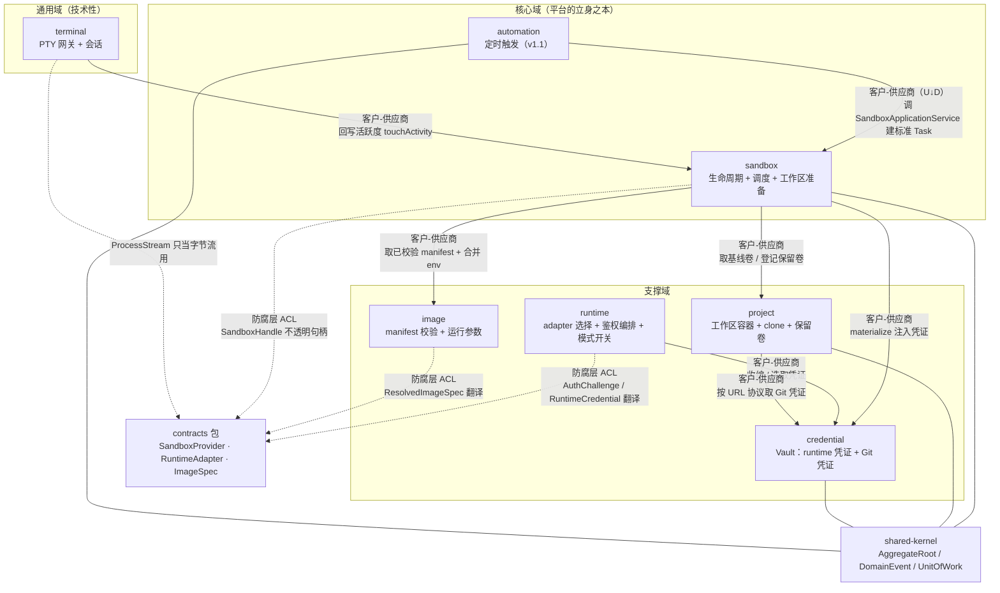

# 23 - 领域模型与聚合设计（DDD 战术层）

> 状态：✅ 可评审（2026-08 按产品定稿 P20/P21/P22 与既有技术定案 01–06/13 建模）
> 定位：[01](./01-后端目录结构与DDD分层.md) 给的是**目录与分层规则**（代码放哪），[13](./13-后端数据库设计.md) 给的是**表结构**（数据怎么存），本文补上中间缺的一层——**领域模型本身**：有哪些聚合、聚合的不变量是什么、哪些概念是值对象、领域事件从哪来到哪去。
> 关联文档：[01 分层](./01-后端目录结构与DDD分层.md) · [03 调度中心](./03-Sandbox调度中心.md) · [04 Contract 体系](./04-Contract与Registry扩展体系.md) · [05 鉴权流转](./05-Runtime鉴权流转.md) · [06 TTY 链路](./06-TTY终端链路.md) · [13 数据库](./13-后端数据库设计.md) · [24 子链路设计](./24-产品子链路后端设计.md) · [25 测试体系](./25-后端测试体系.md)
> 产品权威：[P20](../product/20-核心使用链路.md) · [P21 及 pages/*](../product/21-页面信息架构与交互.md) · [P22](../product/22-异常场景与产品补充要求.md)

**读法**：§2 上下文地图 → §3 统一语言（先对齐词汇，否则后面每一节都会误读）→ §4 建模总纲（七个上下文共用的规则）→ §5–§11 逐上下文展开 → §12/§13 两张总表（事件投影、聚合↔表）→ §14 建模裁决记录。

---

## 1. 本文与既有文档的边界

| 问题 | 答在哪 |
|---|---|
| 代码文件放哪一层、谁能 import 谁 | 01 §2/§3 |
| 表有哪些列、索引、迁移 | 13 §2/§5/§6 |
| **有哪些聚合、聚合的不变量、值对象的校验规则** | **本文** |
| 状态机的转移边与阈值定案 | 03 §4（本文只把它表达为聚合不变量，不重新定义） |
| 契约接口（SandboxProvider / RuntimeAdapter / ImageSpec）的签名 | 04（本文只说领域如何**使用**它们，不复述签名） |
| 每条产品链路的时序与事务边界 | 24 |
| 每个不变量怎么测 | 25 §3 |

**一条纪律**：本文出现的任何阈值、状态值、错误码都**不是新定义**，全部来自 01–06/13 与产品定稿；若发现本文与它们不一致，以既有文档为准并报 issue。

---

## 2. 上下文地图



### 2.1 关系型式与一句话职责

| 上下文 | 一句话职责 | 与上游的关系型式 |
|---|---|---|
| `sandbox` | 把一次「让 agent 干活」的意图变成一个受管的运行实例，并对它的整个生命周期负责 | 对 `contracts` 用**防腐层**（§4.5）；对 project/image/credential 是**客户** |
| `project` | 持有工作区的来源（git 仓库或空目录）与产物（基线卷、保留卷） | 对 `credential` 是客户（只取 Git 凭证） |
| `runtime` | 决定「用哪个 CLI、按哪种模式鉴权」，并把 CLI 的输出翻译成平台语言 | 对 `contracts` 用**防腐层**；对 `credential` 是客户 |
| `credential` | 密文的唯一保管者与唯一出口——**明文不出这个上下文的边界** | 无上游 |
| `image` | 回答「这个镜像能不能用、用它要注入什么」 | 对 `contracts` 用防腐层 |
| `terminal` | 把一条 pty 字节流可靠地接到前端，并顺带产出活跃度与等待输入两个信号 | 对 `sandbox` 是客户（回写活跃度） |
| `automation` | 定时的**发起者**——它自己不执行任何东西 | 对 `sandbox` 是客户，且是**遵奉者（Conformist）**：完全接受 sandbox 的创建契约，不要求 sandbox 为它做任何特化 |

**`shared-kernel` 是唯一的共享内核**（`AggregateRoot` / `Entity` / `ValueObject` / `DomainEvent` / `UnitOfWork` / `EventBus` 基类），七个上下文共用；它**不含任何业务概念**——一旦有人想往里塞 `SandboxStatus`，就是共享内核被滥用的信号。

### 2.2 上下文之间**不允许**的三件事

1. 不直接 import 对方的 `domain/**`（01 §3 已由 eslint-plugin-boundaries 强制）；
2. 不共享数据库事务——跨上下文一律"本地事务 + 领域事件"，最终一致（§4.4）；
3. 不跨上下文持有对象引用——只持 **ID**（`ProjectId` / `CredentialId` / `ImageRef`）。

---

## 3. 统一语言（产品词 ↔ 领域词 ↔ 代码命名）

产品文档与技术文档长期各说各话，这张表是唯一的翻译权威。**面向用户的一切文案用左列，代码与技术文档用中/右列，两者不得互串。**

| 产品词（用户看得见） | 领域词 | 代码命名 | 裁决与说明 |
|---|---|---|---|
| **Task / 任务** | *（无独立聚合）* | `Sandbox` 聚合 + `SandboxDto` | **裁决 D-1**：Task 是产品语义包装，MVP **不建独立聚合**——它没有任何 Sandbox 之外的状态与不变量（P20 §0 已明示）。前端展示层叫 task，后端一路叫 sandbox。详见 §14 D-1 |
| 项目 | Project | `Project` / `ProjectId` | |
| 任务指令 | *(值对象字段)* | `RuntimeTaskSpec.prompt` / 创建入参 `initialPrompt` | 交互式与无头**同一个字段**（P21-7 §3.2） |
| 无头任务 | Sandbox(headless) | `Sandbox.headless = true` | 与 `RuntimeTaskSpec.headless` 同义 |
| **卷保留中 / 已暂停 ⏸️** | Sandbox(stopped) | `SandboxStatus.Stopped` | 产品术语强调"卷还在"，领域只是 stopped |
| 准备工作区 | Sandbox(preparing-workspace) | `SandboxStatus.PreparingWorkspace` | 03 §4.0 定案的正式状态 |
| **等待输入 🔵** | *（无领域概念）* | `WaitingInputDetector`（infrastructure） | **裁决 D-2**：展示投影，不进领域模型（03 §4.1 红线）。详见 §14 D-2 |
| 保留的工作区成果 / 已保留卷 | RetainedVolume | `RetainedVolume` | 独立聚合（§6.2） |
| 凭证 | Credential | `Credential` / `CredentialId` | 含 runtime 与 git 两 kind |
| 帐号授权 / API Key（模式） | AuthMethod | `RuntimeAuthMethod` | 取值直接用 contract 的枚举，**不另造 UI 枚举**（04 §3） |
| 生效中（模式） | ActiveAuthMethod | `RuntimeSettings.activeAuthMethod` | 二选一全局生效 |
| 镜像 | ImageManifest | `ImageManifest` / `ImageRef` | 用户口中的"一个镜像"多指某个 **manifest 版本**（§9） |
| 运行参数 / 环境变量 | EnvVarSet | `EnvVarSet` / `EnvVar` | 值对象，构造即校验（§9.3） |
| 自动化规则 | Automation | `Automation` | |
| 运行历史（一条） | AutomationRun | `AutomationRun` | 独立聚合（§11.2） |
| 降频 | Degraded | `Automation.degraded` | 连续失败 ≥3 的中间态 |
| 终端 / 会话 | TerminalSession | `TerminalSession` | |
| *(用户完全不可见)* | ResourceQuota | `ResourceQuota` | **产品硬要求**：任务列表与发起链路不出现任何资源/配额概念（P22 §4.6） |
| 诊断 | *（不建模）* | `DiagnosticsService`（application） | 只读自检，无领域状态 |

---

## 4. 建模总纲（七个上下文共用）

### 4.1 聚合划分的三条判据

一个候选概念要独立成聚合根，**三条全中**才算：

1. **有独立的生命周期**（能先于/后于其他对象存在）；
2. **有必须原子保证的不变量**（用它自己的字段就能判定对错）；
3. **被外部按 ID 直接引用**（外部拿得到它、要按它查询）。

只中一两条的，做**聚合内实体**或**值对象**。本文每个"独立聚合"的裁决都按这三条给理由（§14）。

### 4.2 事务边界：一次事务一个聚合

- **一个 application 命令 = 一个本地事务 = 至多一个聚合的写入**（两处有界例外见 §4.3）。
- **事务是同步的（审计 P0-2 定案）**：`better-sqlite3` 的 `db.transaction(fn)` **要求同步回调**——传入 async 函数时，回调在第一个 `await` 处让出，事务包装器拿到的是一个 Promise 并立即提交，`await` 之后的写入全部落在事务**外**（静默丢失原子性）。因此：
  - 仓储接口拆成两组：**聚合读 = `async`**（IO 可等待）、**事务内写 = 同步 `saveSync(tx, agg): void`**；
  - `UnitOfWork.run(fn: (tx) => T): T` **同步返回**，回调体内不得出现任何 `await`；
  - 所有异步端口（provider / crypto / git / webhook）**一律在事务外**调用——事务内只做「已在内存里算好的值 → SQL 写入」。
  - 这不是权宜之计：单机单进程下同步事务足够快（写入是本地文件），**不为此更换驱动**。
- 跨聚合的一致性靠**领域事件 + Outbox**（13 §2 `domain_events`），接受最终一致。
- 反例（明确禁止）：在创建 sandbox 的同一事务里改 project 的字段、在吊销凭证的同一事务里改 sandbox 状态。后者必须经 `CredentialRevoked` 事件异步联动（05 §4）。

### 4.3 两处有界例外："同一业务事实的两张投影表"

| # | 例外 | 说明 |
|---|---|---|
| **①** | `sandboxes`（当前态）+ `sandbox_state_transitions`（历史） | `Sandbox` 每次状态转移必须同事务双写——13 §3 的既有定案（Event Sourcing Lite）。转移历史是聚合的**内部实体**，本就不是另一个聚合 |
| **②** | `credentials` + `runtime_settings` | **首次配置凭证**时同事务写入两者（24 §2.3；主管裁决 2026-08）。理由：单机 SQLite 下同事务成本近零，而"事件异步 + 读路径推断兜底"会引入一个 settings 缺失窗口期与一条额外推断路径，新增状态空间的成本大于规则一致性的收益 |

> **一条已被否掉的申请（存档，防重复讨论）**：13 §2.3.2 曾要求 `runtime_installations.status` 的初值在**创建流程校验阶段**落定，落到 T1 里就等于在创建事务里写 `RuntimeInstallation` 这个独立聚合（D-5）。**不为它开第三个例外**——它不是「同一业务事实的两张投影表」，只是「同一条链路上的两件事」。裁决：写入挪到 provision workflow 的短事务里（[TASK-LAUNCH-DECISIONS](../TASK-LAUNCH-DECISIONS.md) T-3 / 13 §2.3.2 / 03 §4.3）。顺带一提，它在 T1 里**物理上也做不到**——初值要经 `isInstalled(exec)` 确认，而 T1 时刻容器还不存在。

**例外条款（不得扩大解释）**：只有"**同一个业务事实同时投影到两张表**"才符合本例外——例外① 是"一次状态转移"投影为当前态与历史，例外② 是"首次配置这一个事实"投影为凭证记录与生效模式。**任何跨聚合的业务操作都不适用**（如"创建 sandbox 顺便改 project"、"吊销凭证顺便改 sandbox 状态"），一律走事件 + 最终一致。新增例外需要与本表同级的显式裁决记录。

### 4.4 领域事件的两条投递路径

| 路径 | 用于 | 可靠性 | 例子 |
|---|---|---|---|
| **Outbox**（`domain_events` 表，同事务写入 → relay 投递） | 状态类事件：需要可靠投递、需要回放、可能有多个消费方 | 至少一次 | `SandboxStateChanged` / `CredentialRevoked` |
| **进程内直推**（EventBus → WS，不落表） | 高频、可丢失的**展示信号** | 尽力而为 | clone 进度、waiting-input（10 §3.1 已定） |

判据一句话：**丢了会导致状态不一致的走 Outbox，丢了只是界面短暂不好看的直推。**

### 4.5 防腐层（ACL）：领域永不认识 contract 类型

`contracts` 包的类型（`SandboxHandle` / `ProcessStream` / `AuthChallenge` / `ResolvedImageSpec` / `SandboxProviderError`）属于**外部世界**。规则：

- **infrastructure 的 adapter 负责翻译**：contract 类型 ⇄ 领域值对象；
- **domain 层不 import contracts**（01 §3 的 lint 规则已强制 `domain` 只能依赖 domain + shared-kernel）；
- 唯一的例外是**不透明句柄**：`SandboxHandle` 的两个字段被领域当作**黑箱字符串**存取（04 §2.4 明令禁止解析其内容），因此领域侧定义自己的 `ProviderHandle` 值对象承载它，语义上等价、类型上独立。

### 4.6 不变量的编号与去处

本文每条不变量有稳定编号（`I-<上下文缩写>-<n>`），**25 号测试文档按同一编号建用例**，两边一一对应。三种落地位置：

| 位置 | 适用 | 例 |
|---|---|---|
| **聚合内**（构造函数 / 方法里 assert） | 用聚合自身字段就能判定 | I-SBX-1 状态转移合法性 |
| **值对象构造时** | 纯格式/范围校验 | I-IMG-1 EnvVarSet 命名与长度 |
| **application 层 + DB 约束**（双保险） | 跨聚合、跨行的唯一性与计数 | I-PRJ-4 项目名全局唯一、I-AUT-7 每项目 ≤20 条规则 |

第三类必须**双写**：只有 DB 约束会让错误以驱动层异常的形式冒到用户面前（错误码不可控）；只有 application 校验则并发下失效。

---

## 5. sandbox 上下文

> 主文档 03。本节把 03 的状态机与调度表达为聚合与不变量。

### 5.1 聚合根 `Sandbox`

```
Sandbox（聚合根）
├─ id: SandboxId                     值对象（uuid v7）
├─ projectId: ProjectId              ← 跨上下文，只持 ID
├─ name?: string                     用户标签
├─ status: SandboxStatus             值对象（12 值 + 转移表）
├─ providerName: string              registry key（'aio' | 'boxlite' | …）
├─ providerHandle?: ProviderHandle    值对象（不透明，§4.5）
├─ imageRef: ImageRef                ← 跨上下文，只持 ID
├─ quota: ResourceQuota              值对象
├─ workspace: WorkspaceRef?          值对象（卷名 + 就绪标记）
├─ execution: ExecutionPolicy        值对象（headless / timeoutMinutes / idleTimeoutSec）——「怎么跑」
├─ initialTask: InitialTask          值对象（prompt? / consumedAt?）——「跑什么」（TASK-LAUNCH-DECISIONS T-1）
├─ labels: Labels                    值对象（含 automationId 溯源）
├─ lastActiveAt: Date                ← 由 terminal 上下文经 application 回写（§10.4）
├─ failureReason?: string
├─ version: number                   乐观锁
└─ transitions: StateTransition[]    聚合内实体（append-only，§4.3）
```

### 5.2 不变量

| 编号 | 不变量 | 违反时 | 依据 |
|---|---|---|---|
| **I-SBX-1** | 状态转移必须命中显式转移表；`stopped→starting` 合法、`pending→running` 非法 | `InvalidSandboxTransitionError` → interface 层 409 | 03 §4 |
| **I-SBX-2** | 每次成功转移**必须**追加一条 `StateTransition`（同事务）；转移历史 append-only，不可修改删除 | 断言失败（编程错误，非用户错误） | 13 §3 |
| **I-SBX-3** | `status ∈ {starting, running, idle, stopping}` ⇒ `providerHandle` 非空 | `InvariantViolation` | 04 §2.2 create 语义 |
| **I-SBX-4** | `destroyed` 是终态：任何离开它的转移非法 | 409 | 03 §4 |
| **I-SBX-5** | `execution.headless === true` ⟺ `timeoutMinutes` 非空；`headless === false` ⟺ `timeoutMinutes` 为空且 `idleTimeoutSec` 非空（**未显式传入时由平台默认值 30min 在构造期填充**；13 §2 该列已收紧为 `NOT NULL DEFAULT 1800`，聚合与列上各兜一道） | 构造期拒绝 | 03 §4.2/§8.3 |
| **I-SBX-6** | 对账特权转移（任意非终态 → `failed`）只允许 `triggeredBy = 'health-check'`；其他调用方走常规转移表 | `InvariantViolation` | 03 §4 |
| **I-SBX-7** | 写入必须携带读取时的 `version`；不匹配即冲突（不做静默覆盖） | `ConcurrencyConflictError` → 重试或 409 | 13 §2 |
| **I-SBX-8** | 聚合**没有** `waitingInput` 字段——它不是状态（裁决 D-2） | 编译期就不存在 | 03 §4.1 |
| **I-SBX-10** | `initialTask.prompt` 长度 ≤ 8000（与 `automations.prompt` 同规格）；`consumedAt` **一旦置值不可回退、不可清空**，且 `consumedAt` 非空 ⇒ `prompt` 非空 | 构造期 / `consume()` 内断言 | [TASK-LAUNCH-DECISIONS](../TASK-LAUNCH-DECISIONS.md) T-1 · 13 §2.1.1 |
| **I-SBX-9** | `preparing-workspace` 只能从 **`scheduling`** 进入、只能去 `creating` 或 `failed`（审计 P0-1：工作区目录必须先于实例存在）；`stopped→starting` 重启**不经过**它（目录已存在） | 409 | 03 §4/§4.0 |

### 5.3 值对象

| 值对象 | 内容与校验 |
|---|---|
| `SandboxStatus` | 12 个取值 + **转移表本身**（`canTransitionTo(next): boolean`）。转移表是值对象的静态数据，不是 if-else 散落各处——这是 I-SBX-1 可穷举单测的前提 |
| `ResourceQuota` | `cores > 0`（允许小数）、`ramMb > 0`、**`diskMb > 0`（审计 P1-9：磁盘进调度后不再可选）**；不可变；提供 `plus/minus` 供资源池纯函数计算 |
| `ProviderHandle` | `{ provider, providerSandboxId }`，两字段非空且 `provider` 必须等于登记的 `providerName`（对应 04 testkit SP-01）；**禁止提供任何解析方法** |
| `ImageRef` | 不可变坐标（manifestId 或 `name:version@digest`）；相等性按值 |
| `WorkspaceRef` | `{ hostPath, state: 'preparing' \| 'ready' \| 'kept' }`——**宿主目录**（审计 P0-1），路径由 `WorkspaceNamingPolicy` 按 `DATA_ROOT/workspaces/<sandboxId>` 生成，不接受外部随意赋值；`state` 与目录内标记文件 `.platform-workspace-state` 同源 |
| `ExecutionPolicy` | `headless` + `timeoutMinutes ∈ {30,60,120,240}?` + `idleTimeoutSec?`；构造期即保证 I-SBX-5 |
| **`InitialTask`** | `{ prompt?: string; consumedAt?: Date }` + `consume(at): InitialTask`（返回新实例，`consumedAt` 已置且不可再变）。**刻意不并进 `ExecutionPolicy`**（裁决 D-14）：后者是创建期一次构造、此后不变的**策略**，还承载 I-SBX-5 那条 `headless ⟺ timeoutMinutes` 的交叉不变量；而 `consumedAt` 是**运行期会变**的一次性标记，塞进去会让构造期断言与可变字段共处一室、每次消费都要重建整个策略对象。语义上也是两件事：`ExecutionPolicy` 回答「怎么跑」，`InitialTask` 回答「跑什么」（I-SBX-10） |
| `Labels` | 键值对；平台强制注入 `platform.managed=true`（04 §2.4），`automationId` 可选 |
| `StateTransition` | 聚合内实体：`{ from?, to, reason?, triggeredBy, occurredAt }`；`triggeredBy ∈ {scheduler, reaper, user, health-check, provider-event}` |

### 5.4 独立聚合 `ResourceAllocation`（配额登记）

**裁决 D-3：独立聚合，不塞进 Sandbox。** 理由按 §4.1 三判据：① 生命周期不同——释放后（`releasedAt` 非空）仍长期留档供对账；② 不变量是**跨 sandbox 的**（资源池总量 = 全部未释放登记之和），不属于任何单个 sandbox；③ 对账按 `(nodeId, releasedAt)` 跨 sandbox 查询。

| 编号 | 不变量 |
|---|---|
| **I-RA-1** | `releasedAt` 一旦置值不可回退（释放不可撤销） |
| **I-RA-2** | 同一 sandbox 同时至多一条 `releasedAt IS NULL` 的活跃登记 |
| **I-RA-3** | `reconciliationStatus` 的 `orphaned` 只能由对账路径写入 |

### 5.5 领域服务（全部是**纯函数**，零 IO）

| 服务 | 签名要点 | 为什么是领域服务而非聚合方法 |
|---|---|---|
| `SchedulingDomainService.trySchedule(request: ResourceQuota, pool: ResourcePoolSnapshot): SchedulingDecision` | 03 §2 既有定义 | 决策需要**全局资源池视图**，不属于任何单个 Sandbox |
| `ResourcePool.snapshotOf(allocations, hostCapacity, safetyMargin): ResourcePoolSnapshot` | 15% 安全余量、CPU 超配比 | 同上；纯函数便于穷举边界 |
| `SandboxTransitionPolicy.assert(from, to, triggeredBy)` | I-SBX-1/I-SBX-6 的唯一实现处 | 转移表被聚合与对账两处使用，抽出来避免复制 |
| `WorkspaceNamingPolicy` | `project-<id>-baseline` / `sbx-<id>-workspace` | 命名规则被 sandbox 与 project 两个上下文共同依赖（放 shared 的**领域约定常量**，不是共享内核） |

### 5.6 领域事件

| 事件 | 何时产生 | 载荷要点 |
|---|---|---|
| `SandboxCreated` | 聚合首次落库（pending） | sandboxId, projectId, runtimeId, imageRef |
| `SandboxStateChanged` | **每一次**转移 | from, to, reason?, triggeredBy |
| `SandboxWorkspacePrepareFailed` | preparing-workspace 失败 | errorCode（`WORKSPACE_PREPARE_FAILED` / `DISK_INSUFFICIENT`），供清理编排订阅 |
| `SandboxReconciledAsOrphan` | 对账判定 orphaned | 供审计与前端提示 |
| `SandboxDestroyed` | 转入 destroyed 终态 | keepVolume 标记（供 project 上下文登记保留卷） |

### 5.7 仓储接口（端口，方法签名级）

**读写分离的签名约定（审计 P0-2）**：`find*` / `list*` 是 `async`；一切在事务内发生的写入是**同步**方法，第一个参数是事务句柄 `tx`。

```ts
interface SandboxRepository {
  // ── 读：async ───────────────────────────────────────────────
  findById(id: SandboxId): Promise<Sandbox | null>;
  findByProject(projectId: ProjectId, filter?: { status?: SandboxStatus[] }): Promise<Sandbox[]>;
  findByProviderHandle(handle: ProviderHandle): Promise<Sandbox | null>;   // 对账用
  listIdleCandidates(now: Date): Promise<Sandbox[]>;                        // Reaper 扫描
  listNonTerminal(): Promise<Sandbox[]>;                                    // 启动对账

  // ── 事务内写：同步 ──────────────────────────────────────────
  /** 同事务写 sandboxes + 追加 transitions；version 不匹配抛 ConcurrencyConflictError */
  saveSync(tx: Tx, sandbox: Sandbox): void;
  /** 仅刷新活跃度的窄写入（terminal 高频调用，避免加载整个聚合，§10.4）；
   *  自带一个极短事务，调用方无需持有 tx */
  touchActivity(id: SandboxId, at: Date): void;
}

interface ResourceAllocationRepository {
  listActive(nodeId: NodeId): Promise<ResourceAllocation[]>;                 // 读
  allocateSync(tx: Tx, alloc: ResourceAllocation): void;                     // 写（含 disk_mb_reserved）
  releaseSync(tx: Tx, sandboxId: SandboxId, at: Date): void;
  markReconciliationSync(tx: Tx, id: AllocationId, status: ReconciliationStatus): void;
}
```

> `Tx` 定义在 `shared-kernel`，是 drizzle 事务句柄的窄包装；**它只出现在仓储签名与 `UnitOfWork.run` 的回调参数里**，application 层不把它往下传给任何端口。

> `touchActivity` 是**有意开的一个窄口子**：活跃度是高频写、且不参与任何不变量判定，走完整聚合加载-保存会把 Reaper 的成本放大几十倍。代价是它绕过了乐观锁——可接受，因为 `lastActiveAt` 的并发写"最后一个赢"正是想要的语义。

### 5.8 与 13 表结构的映射

| 聚合 / 实体 | 表 |
|---|---|
| `Sandbox` | `sandboxes` |
| `Sandbox.transitions[]`（内部实体） | `sandbox_state_transitions` |
| `ResourceAllocation` | `resource_allocations` |
| `ResourceQuota` / `ProviderHandle` / `WorkspaceRef` / `ExecutionPolicy` / `InitialTask` | **不单独落表**——内嵌为 `sandboxes` 的列（`InitialTask` → `initial_prompt` + `initial_prompt_consumed_at`，13 §2.1.1） |

---

## 6. project 上下文

> 主文档 03 §7（clone 与工作区编排）、13 §2（projects / retained_volumes）。

### 6.1 聚合根 `Project`

```
Project（聚合根）
├─ id / name / description?
├─ source: ProjectSource             值对象（sourceType + RepoUrl? + branch?）
├─ status: ProjectStatus             active | archived
├─ workspaceMode: WorkspaceMode      per-task-copy（MVP 默认）| shared（v1.1）
├─ clone: CloneState                 值对象（status + error? + 完成时间）
├─ baseline?: BaselineDir            值对象（hostPath + sizeBytes，审计 P0-1）
└─ createdAt / updatedAt
```

| 编号 | 不变量 | 依据 |
|---|---|---|
| **I-PRJ-1** | `sourceType='git'` ⇒ `repoUrl` 非空且能被 `RepoUrl` 解析；`sourceType='empty'` ⇒ `repoUrl` 为空 | P21-6 §3.2 |
| **I-PRJ-2** | `sourceType='empty'` ⇒ `clone.status` 恒 `ready` 且 `baseline` 为空 | 03 §7.1 |
| **I-PRJ-3** | `clone.status='ready'` 且 `sourceType='git'` ⇒ `baseline` 非空 | 03 §7.1 |
| **I-PRJ-4** | `name` 长度 1–40、**全局唯一**、项目总数 ≤50 | 双保险（§4.6 第三类）：application 校验 + DB unique；P21-6 §3.2 |
| **I-PRJ-5** | `status='archived'` ⇒ 不得发起新 Task | **跨聚合规则**，落在 `SandboxApplicationService.create` 的前置校验，不在 Project 聚合内（聚合管不到别的聚合的创建）；P21-6 §4 |
| **I-PRJ-6** | `clone.status` 转移单向：`cloning → ready \| failed`，**不可隐式回退**。只有两条显式命令能离开 `failed`：`retryClone`（→`cloning`）与 `convertToEmpty`（→`ready`）；两者都**只在 `failed` 态可用**，其他状态调用即非法 | 03 §7.2 |
| **I-PRJ-7** | `convertToEmpty` 执行后必须同时满足 I-PRJ-1/2：`sourceType='empty'` ∧ `repoUrl=null` ∧ `baseline=null`——**不允许留下"空项目却挂着基线路径"的中间态**（DB CHECK 亦会拦，13 §2.2） | P21-6 §5/§9 |

### 6.2 独立聚合 `RetainedVolume`

**裁决 D-4：独立聚合。** ① 生命周期独立——sandbox 记录 90 天归档后卷仍在，产品明确"项目删除不级联删保留卷"（13 §2）；② 有自己的不变量（保留期）；③ 被「已保留卷」列表按 ID 直接管理（P21-6 §3.3）。

| 编号 | 不变量 |
|---|---|
| **I-RV-1** | `retainUntil > retainedAt`；保留期 ∈ {3, 7, 30} 天（自动化产物取规则的 `artifactRetentionDays`） |
| **I-RV-2** | `deletedAt` 非空 ⇒ 记录只读（已清理，留档审计） |
| **I-RV-3** | `workspacePath` 全局唯一——同一个宿主目录不能被登记两次 |

### 6.3 值对象

| 值对象 | 内容与校验 | 备注 |
|---|---|---|
| **`RepoUrl`** | 解析 `git@host:path` / `ssh://` / `https://`；非法格式构造失败 | **承载真正的领域逻辑**：`credentialKind(): 'git-ssh-key' \| 'git-https-token'`（**S3 新增此方法**）+ `host(): string`——03 §7.3 的"按协议自动选凭证"就是这一个方法，不散落在 clone 编排里。project 侧算出 `kind` 与 `host` 后**经门面传枚举/字符串**给 credential（`CredentialFacade.prepareGitAuth`，A3），**不把 `RepoUrl` VO 递进 credential 上下文**。SSRF/resolve+pin 见 03 §7.3（带凭证场景 DNS rebinding 从"可达性问题"升级为"token 外泄"，C4） |
| `CloneState` | `{ status, errorCode?, errorMessage?, finishedAt? }`；`errorCode ∈ {CLONE_FAILED_NETWORK, CLONE_FAILED_PERMISSION, DISK_INSUFFICIENT, TIMEOUT, INTERRUPTED}` | 03 §7.5 |
| **`CloneProgress`** | `{ phase, percent?, receivedBytes?, totalBytes? }`；`percent ∈ [0,100]` | **纯瞬时值对象，不落表**——只经事件投影到 WS（10 §3.1） |
| `BaselineDir` | `{ hostPath, sizeBytes }`——`DATA_ROOT/baselines/<projectId>` | `sizeBytes` 供**调度阶段**登记 `disk_mb_reserved`（03 §1，审计 P1-9），不再是准备阶段才预检 |
| `RetentionPeriod` | 3/7/30 天 → `retainUntil` 计算 | |

### 6.4 领域事件

| 事件 | 入 Outbox | 说明 |
|---|---|---|
| `ProjectCreated` | ✅ | |
| `ProjectCloneProgressed` | ❌ 直推 | 高频可丢失（§4.4） |
| `ProjectCloneCompleted` / `ProjectCloneFailed` | ✅ | 失败载荷带 `errorCode`，前端据此分支引导 |
| `ProjectConvertedToEmpty` | ✅ | 前端 invalidate 项目详情；审计（记录曾经的 repoUrl 已丢弃） |
| `ProjectArchived` | ✅ | automation 上下文订阅 → 联动禁用规则 |
| `ProjectDeleted` | ✅ | sandbox 上下文订阅 → 级联销毁编排 |
| `VolumeRetained` | ✅ | 由 `SandboxDestroyed(keepVolume=true)` 触发后产生 |

### 6.5 仓储接口

```ts
interface ProjectRepository {
  findById(id: ProjectId): Promise<Project | null>;
  findByName(name: string): Promise<Project | null>;          // I-PRJ-4 应用层校验
  list(filter?: { status?: ProjectStatus }): Promise<Project[]>;
  countAll(): Promise<number>;                                 // I-PRJ-4 上限
  listInterruptedClones(): Promise<Project[]>;                 // 启动扫描（03 §7.2）
  saveSync(tx: Tx, project: Project): void;
}

interface RetainedVolumeRepository {
  findById(id: RetainedVolumeId): Promise<RetainedVolume | null>;
  listByProject(projectId: ProjectId, includeDeleted?: boolean): Promise<RetainedVolume[]>;
  listExpired(now: Date): Promise<RetainedVolume[]>;           // VolumeReaper
  saveSync(tx: Tx, volume: RetainedVolume): void;
}
```

---

## 7. runtime 上下文

> 主文档 05。本上下文的特殊之处：**runtime 的"定义"不在数据库里**——它来自 registry 注册的 `RuntimeAdapter`（04 §8）。数据库里只有围绕它的**配置与状态**。

### 7.1 聚合根 `RuntimeSettings`（一个 runtime 一行）

| 编号 | 不变量 | 依据 |
|---|---|---|
| **I-RTS-1** | `activeAuthMethod ∈ {'account', 'api-key'}` | 05 §4 |
| **I-RTS-2** | 切换到的目标模式**必须已有未吊销凭证**——否则命令失败（interface 层 409），不写入 | 05 §4 / P22 §2；**跨聚合校验**，在 application 层查 credential 后再调聚合方法 |
| **I-RTS-3** | 首次配置凭证时自动创建本行，初值 = 该次配置的模式 | 13 §2 |

### 7.2 聚合根 `RuntimeInstallation`

**裁决 D-5：独立小聚合（以 `sandboxId` 弱引用），不并入 Sandbox。** 理由：它有自己的状态机（`not_installed → installing → installed | failed`），与 sandbox 的 12 态状态机彼此独立；并入会让一个聚合里跑两个状态机，且每次安装状态变更都要竞争 sandbox 的乐观锁。

| 编号 | 不变量 |
|---|---|
| **I-RIN-1** | `(sandboxId, runtimeId)` 唯一 |
| **I-RIN-2** | `installed` ⇒ `versionDetected` 非空 |

> **写入落点（TASK-LAUNCH-DECISIONS T-3）**：本聚合的**全部写入（含初值）都发生在 sandbox 的 provision workflow `starting` 段**（03 §4.3 `ensureRuntimeInstalled`），各自短事务，**绝不与创建事务 T1 同事务**（§4.3 已存档否决理由）。它的状态变更**不进 sandbox 状态机**（理由同 D-5：一个聚合不跑两个状态机），改为经 `RuntimeInstallationStateChanged` 投影为 WS `runtime.install_progress`（§12）——前端要的是「卡在哪」，一条事件就够，不必动 12 态枚举。

### 7.3 值对象

| 值对象 | 内容与校验 | 备注 |
|---|---|---|
| `RuntimeId` | `'codex'` / `'claude-code'` / 第三方注册值；必须能在 registry 解析到 | |
| `RuntimeAuthMethod` | 直接复用 contract 枚举（04 §3），**不另造** | 统一语言表已约定 |
| **`AuthChallenge`** | `{ method, kind, verificationUrl?, userCode?, expiresAt, instructions, challengeRef }`；`expiresAt` 必须是**绝对 ISO 时间**（testkit RA-05）；`instructions` / `challengeRef` 必填 | **不落表**——生命周期 ≤15 分钟，存内存 session（`challengeRef → helper pty ref` 映射）。裁决 D-6 |
| `AuthSession` | 内存实体：`{ challengeRef, runtimeId, ptyRef, startedAt, expiresAt }` | 进程重启即失效 → 前端重走 begin，符合 P22「设备码 15 分钟过期」的既有兜底 |

### 7.4 领域服务

| 服务 | 职责 |
|---|---|
| `AuthMethodPolicy` | 从 adapter 的 `getAuthMethods()` 得到可用方式；**返回顺序即推荐优先级**（04 §3），领域不重排 |
| `CredentialSelectionService`（跨 credential 边界的读服务） | 输入 `RuntimeId` + `RuntimeSettings` → 输出应当 materialize 的 `CredentialId`；Git 侧输入**凭证 `kind` 枚举**（非 `RepoUrl`，A3）→ 按 kind 选。**放在 runtime 侧还是 credential 侧？** 放 **credential 侧**（§8.5）——选择规则依赖凭证自身的 kind/obtainedVia/revoked 状态 |

### 7.5 领域事件

`RuntimeAuthChallengeIssued`（内存直推，前端已由同步响应拿到，不需 WS）· `RuntimeAuthCompleted`（✅ Outbox）· `RuntimeAuthModeChanged`（✅）· `RuntimeInstallationStateChanged`（✅，供诊断展示）。

### 7.6 仓储接口

```ts
interface RuntimeSettingsRepository {
  findByRuntime(id: RuntimeId): Promise<RuntimeSettings | null>;
  saveSync(tx: Tx, settings: RuntimeSettings): void;
}
interface RuntimeInstallationRepository {
  find(sandboxId: SandboxId, runtimeId: RuntimeId): Promise<RuntimeInstallation | null>;
  listBySandbox(sandboxId: SandboxId): Promise<RuntimeInstallation[]>;
  saveSync(tx: Tx, installation: RuntimeInstallation): void;
}
/** AuthSession 不是仓储——是内存 Map，接口放 application 层的 AuthSessionStore（进程内） */
```

---

## 8. credential 上下文

> 主文档 05。**这是整个后端安全边界最紧的一个上下文**：明文只在这里出现，并且只以 §8.3 的 `SecretMaterial` 形态短暂出现。

**上下文对外出口（唯一被许可的两条，A 裁决）**：
1. **runtime 凭证** → 门面 `CREDENTIAL_FACADE.prepareRuntimeCredential(runtimeId)` 交出 **`InjectableRuntimeCredential`**（**受控明文包装 `SecretMaterial`，非不透明句柄**——因 runtime 要注入沙箱）；由 sandbox 编排侧持 exec、调 `adapter.injectCredential(cred, exec)` **一次性 exec 注入**沙箱（写 `auth.json`/env/喂 stdin），用后 `zeroize()`（05 §4 / 27 §4，交叉评审 P0-2）。**credential 不反向持 sandbox exec**。runtime 明文因此**会到 runtime 上下文**，但只短暂存在、不持久、不落日志（I-CRD-2 放宽）。
   > **类型分家（裁决 D-18，TASK-LAUNCH-DECISIONS T-5）**：注入出口的返回类型**结构上没有 `authFile` 字段**——真 `refresh_token` 只存在于**平台专用**的 `RefreshableRuntimeCredential` 里，由**另一个方法** `prepareForRefresh(credentialId)` 交出，且**只有 05 §5.1 的刷新扫描器调它**。此前两条路径共用同一个对象、唯一防线是一句注释，实现者最省事的写法（parse 完改一个字段）漏一个分支真 refresh_token 就进沙箱了。分家后这条红线由**类型系统**保证，并由 testkit RA-15/16/17（04 §10.3）机械验证。
2. **git 凭证** → 跨上下文（project 的 clone 编排、`POST /api/credentials/git/test`）**只经门面** `CREDENTIAL_FACADE.prepareGitAuth(kind, host, scheme)` 拿一个**不透明句柄** `GitAuthContext`；**git 明文绝不越 `credential/infrastructure` 边界**；**解密 + 写 `0600` 临时密钥文件 + 组装 env / `GIT_SSH_COMMAND` + `dispose()` 清理全部落在 `credential/infrastructure` 内**，project 侧**只消费句柄、永不持有 `SecretMaterial`**。这消除了"明文不出 credential 边界"与"clone 编排要拼密钥文件"的直接矛盾（详见 27 §5 装配、03 §7.3 落地）。

```ts
// packages/contracts/src/credential-facade.port.ts —— 与既有 SANDBOX_FACADE / PROJECT_FACADE 同构的第三个跨上下文门面
export const CREDENTIAL_FACADE = Symbol('CREDENTIAL_FACADE');
export interface GitAuthContext {
  env: Record<string, string>;      // 已组装好的注入 env（token 只在此，绝不进 URL/argv）
  gitSshCommand?: string;           // SSH 场景的 GIT_SSH_COMMAND（指向本次 keyfile）
  dispose(): Promise<void>;         // 删临时密钥目录 / 清 env 引用；clone 编排在 try/finally 调
}
export type GitRemoteScheme = 'http' | 'https' | 'ssh' | 'git';
export interface CredentialFacade {
  // scheme（remote 实际协议）让 HTTPS helper key 具备 scheme 感知，明文 http 内网仓也能命中（03 §7.3 C4）
  prepareGitAuth(
    kind: 'git-ssh-key' | 'git-https-token',
    host: string,
    scheme: GitRemoteScheme,
  ): Promise<GitAuthContext>;
  // runtime 出口（S4 新增，交叉评审 P0-2）：交出【受控明文包装】供 runtime 注入沙箱，
  // 【不是】不透明句柄——因 runtime 要注入沙箱、git 不注入（出口语义不同、不平移句柄形态）。
  // 内部 forRuntime 按 active_auth_method 选凭证 → 解密产出；credential 不反向持 sandbox exec。
  //
  // ★ 裁决 D-18（S5，TASK-LAUNCH-DECISIONS T-5）：注入与刷新【类型分家】。
  //   InjectableRuntimeCredential = { runtimeId, obtainedVia, masked?, issuedAt, expiresAt?,
  //                                   credentialFiles[], env?, accessToken?, zeroize() }
  //     —— 【没有 authFile 字段】：注入路径在类型层面就拿不到真 refresh_token。
  //     —— credentialFiles[].containerPath 是【~/ 相对】形态，$HOME 在 injectCredential 内展开（D-19）。
  //   RefreshableRuntimeCredential = InjectableRuntimeCredential & { authFile: string }
  //     —— 平台专用，唯一调用方是 05 §5.1 的刷新扫描器。
  prepareRuntimeCredential(runtimeId: string): Promise<InjectableRuntimeCredential>;   // 见 04 §3
  prepareForRefresh(credentialId: string): Promise<RefreshableRuntimeCredential>;      // 仅刷新扫描器
}
```

### 8.1 聚合根 `Credential`

```
Credential（聚合根）
├─ id: CredentialId
├─ kind: 'runtime' | 'git'
├─ runtimeId?: RuntimeId              kind='runtime' 时必填
├─ obtainedVia: ObtainedVia           超集：RuntimeAuthMethod ∪ {git-ssh-key, git-https-token}
├─ masked: MaskedIdentifier           值对象（邮箱掩码 / sk-...ab12 / SHA256 指纹 / token 尾号）
├─ mode?: 'account' | 'api-key'       kind='runtime' 时由 obtainedVia 派生；git 时为空（13 §2.5.1）
├─ allowedHosts?: Host[]              git-https-token 必填（≥1，host 白名单，I-CRD-8）；git-ssh-key 可选；host 非敏感明文
├─ metadata?: CredentialMetadata      值对象（git: knownHosts 指纹表）
├─ secret: EncryptedBlob | Erased     值对象（密文 + iv + authTag + keyId）
├─ ownerRef?: string                  多用户预留，恒 null
├─ issuedAt / expiresAt? / lastUsedAt?
└─ revokedAt?
```

### 8.2 不变量

| 编号 | 不变量 | 违反时 | 依据 |
|---|---|---|---|
| **I-CRD-1** | `kind='runtime'` ⇒ `runtimeId` 非空 ∧ `obtainedVia ∈ RuntimeAuthMethod`；`kind='git'` ⇒ `runtimeId` 为空 ∧ `obtainedVia ∈ {git-ssh-key, git-https-token}` | 构造期拒绝 + DB CHECK | 13 §2 |
| **I-CRD-9** | **真 `refresh_token` 永不进沙箱（P0-3 的可执行形态，裁决 D-18）**：`injectCredential` 的入参类型**没有 `authFile` 字段**；注入产物里 `tokens.refresh_token` 的值**恰等于** shared-kernel 的占位常量（**字段必须保留**——删掉会让 codex 报 `missing field 'refresh_token'`，05 §1）。脱敏形态在凭证**出生时**由 adapter 产出并单独存字段（`RuntimeSecretPayload.credentialFiles` 与 `.authFile` 各存各的），**注入路径上不做任何 JSON 解析或字段改写** | 类型系统（编译期）+ testkit RA-15/16/17（04 §10.3） | 05 §4.3 |
| **I-CRD-2** | **明文边界（交叉评审 P0-2 放宽）**：**git 凭证明文绝不越 `credential`/`infrastructure`**（clone 在平台侧，出口是不透明句柄 `GitAuthContext`）；**runtime 凭证明文以 `SecretMaterial` 短暂存在**，credential 上下文经门面把 Vault 解密产出的 `RuntimeCredential`（**仍是受控明文包装**）交给 runtime 编排，**仅经 runtime 注入路径【一次性 exec】注入沙箱**（写 `auth.json`/env/喂 stdin）——**不持久、不落日志、用后 `zeroize()`**。**credential 不反向依赖 sandbox exec**（避免 credential→sandbox 耦合，注入由 sandbox 编排侧持 exec 调 `adapter.injectCredential`，27 §4）。读模型 `toMaskedView()` 只含掩码 | 类型系统 + 序列化钩子（§8.3）+ boundaries | 05 §4 |
| **I-CRD-3** | `revoke()` 后 `secret` 必须为 `Erased`（密文字段物理覆写置空），元数据保留 | 断言 | 05 §4 / 13 §2 |
| **I-CRD-4** | 已吊销的凭证不可 `materialize()`，不可被选为生效凭证 | `CredentialRevokedError` | 05 §4 |
| **I-CRD-5** | 同一 `(runtimeId, mode)` 至多一条未吊销生效；同一 git `obtainedVia` 至多一条未吊销生效。**"更换"（同 `obtainedVia` 存第二条）= revoke-old + insert-new 必须在同一 `UnitOfWork.run` 内**（先 `revokeAndEraseSync` 再 `saveSync`），否则撞 partial unique 索引（I4） | application 同事务 + DB 部分唯一索引 | 05 §4 / 13 §2 |
| **I-CRD-6** | `kind='git'` 且 `obtainedVia='git-ssh-key'` ⇒ 私钥**不带 passphrase**（保存前校验，无法确证无口令的格式默认拒绝，03 §7.3 F） | 保存被拒 + 人话提示 | 03 §7.3 / P21-3 §10.2 |
| **I-CRD-7** | `expiresAt` 非空时，`剩余 < 7 天` ⇒ 读模型的 `state` 为 `expiring`；`≤ now` ⇒ `expired` | 派生属性，不落独立列 | P21-3 §5 |
| **I-CRD-8** | `obtainedVia='git-https-token'` ⇒ `allowedHosts` 非空（≥1 host）；`prepareGitAuth`/clone/test **必须先校验目标 host ∈ allowedHosts** 才携带凭证，否则拒绝（防对任意 host 回吐 PAT，03 §7.3 C） | 构造期 + 使用前校验 | 03 §7.3 / 13 §2.5.1 |

### 8.3 值对象（安全相关的三个是本上下文的核心）

| 值对象 | 设计要点 |
|---|---|
| **`SecretMaterial`** | 明文包装。**真纪律（D 裁决）**——对 JS `string` 的 `toString/toJSON→[REDACTED]` 是安全剧场，`console.log` 一步绕过，故补强为四条：① 明文以 **`Buffer`/`Uint8Array`** 承载（AES-GCM `decipher` 本就返回 `Buffer`，**绝不 `.toString()` 成 string**），`zeroize() = buf.fill(0)`；② 明文存 `#private` 字段并实现 `[Symbol.for('nodejs.util.inspect.custom')]() => '[REDACTED]'`——堵住 `console.log(secret)` / `%o` 走的 `util.inspect`，**这是最常见的泄漏路径**；③ `use<T>(fn: (plain: Buffer) => T): T` 借出 `Buffer`、用完即弃，不提供裸 getter，`toString/toJSON→'[REDACTED]'` 保留；④ `use` 回调内把明文写进日志/`Error`/外层变量的**逃逸类型层拦不住**，靠 lint + review 兜住——**文档明示这是约定而非强约束**。`zeroize()` 在 `try/finally` 调用 |
| **`EncryptedBlob`** | `{ blob, iv, authTag, keyId }`；`keyId` 支撑密钥轮换。`Erased` 是它的兄弟类型（全空 + 擦除时间），**用类型而非空值**表达"已吊销"，避免忘判空 |
| `MaskedIdentifier` | 构造时就完成掩码（`a***@gmail.com` / `sk-...ab12` / `SHA256:...` / token 尾号）——**掩码逻辑只有一处**，不在各 DTO 里重复实现 |
| `CredentialMetadata` | git 用：`knownHosts: [{ host, keyType, fingerprint, firstSeenAt }]`；主机公钥不是密钥，**明文存**（13 §2 已定） |
| `ExpiryState` | `active` / `expiring` / `expired`，由 `expiresAt` 与当前时刻派生（I-CRD-7） |

**通用出口明文纪律（交叉评审 P1-5，runtime 与 git materializer 共守）**：两条出口都强制照搬 S3 git 侧写法——`crypto.decrypt` → `secret.use(buf => …)` 内完成写 env / 文件 / 喂 stdin → `finally secret.zeroize()`（`Buffer.fill(0)`）。**token / `auth.json` 只走 env / 文件 / stdin，永不进 `argv`**（防 `/proc/<pid>/cmdline`、`ps`、审计日志泄漏）；`DecryptionError` 按"凭证以 `revoked` 呈现、引导重授权"处理（05 §4.2）而**非 500**。这是 credential 上下文的**通用出口纪律**（05 §4）。

### 8.4 独立聚合 `CredentialSandboxBinding`（注入台账）

**裁决 D-7：独立聚合。** 若做成 Credential 的内部实体，则每次向 sandbox 注入凭证都要**加载并保存整个 Credential 聚合（含密文）**——既无必要，又把明文接触面从"注入的一瞬间"扩大到"每次记账"。独立后，记账只写两个 ID。

| 编号 | 不变量 |
|---|---|
| **I-CSB-1** | `(sandboxId, credentialId)` 唯一 |
| **I-CSB-2** | `revokedAt` 非空表示"已从该 sandbox 清除"，不可回退 |

> **边界（I3）**：本聚合**只登记 `kind='runtime'` 的注入**。`kind='git'` 凭证从不注入 sandbox（05 §3.2），故 git 凭证**不写任何 binding 业务代码**；吊销 git 凭证时通用 revoke 联动命中**零 binding 属正常**，**不记 error 日志**（13 §2.5.2）。

### 8.5 领域服务

| 服务 | 职责 | 纯度 |
|---|---|---|
| `CredentialSelectionService.forRuntime(runtimeId, activeMethod, candidates): CredentialId \| null` | 按生效模式选凭证（05 §4） | 纯函数（候选集由仓储先查好传入） |
| `CredentialSelectionService.forKind(kind: 'git-ssh-key' \| 'git-https-token', candidates): CredentialId \| null` | 按凭证 kind 选 Git 凭证（03 §7.3） | 纯函数——**吃枚举 `kind`，不吃 project 的 `RepoUrl` VO**（否则 `credential/domain` import `project/domain`，撞 boundaries §2.2①）；kind 由 `RepoUrl.credentialKind()` 在 project 侧算好、经门面传入（A3） |
| `ExpiryEvaluator.evaluate(cred, now): ExpiryState` | I-CRD-7 | 纯函数 |
| `CryptoService`（端口，实现在 infrastructure） | AES-256-GCM 加解密 + 密钥轮换 | 有 IO（读 master key），因此是**端口**而非领域服务 |

**跨上下文门面 `CredentialFacade`（A2 裁决，application 层）**：实现落 `credential/application/credential-facade.adapter.ts`，以 `CREDENTIAL_FACADE` token（`packages/contracts/src/credential-facade.port.ts`，§8 已给定义）装配，与既有 `SANDBOX_FACADE` / `PROJECT_FACADE` 同构。`prepareGitAuth(kind, host, scheme)` 内部：① `forKind` 选生效凭证 → ② 校验 `host ∈ allowedHosts`（I-CRD-8）→ ③ 经 `credential/infrastructure` 解密并 materialize 成 `GitAuthContext` 句柄返回（`scheme` 令 HTTPS helper key scheme 感知）。project 的 clone workflow 与 `POST /api/credentials/git/test` **`@Inject(CREDENTIAL_FACADE)` 复用同一路径**（27 §5）。

### 8.6 领域事件

`CredentialStored`（✅）· `CredentialRevoked`（✅ → sandbox 上下文订阅做联动：对**运行中沙箱**按 `credential_sandbox_bindings` 台账**强制重启/销毁 bound 活沙箱**——env 形态注入进程后外部无法 `unset`，"清除已注入 env"物理做不到；exec 清除失败超时**升级为强制销毁**，不静默记 error，交叉评审 P0-4 / 05 §4）· `CredentialInjected`（✅，记账）· `CredentialExpiring` / `CredentialExpired`（✅ → 投影为 WS `runtime-auth.status_changed`）。

### 8.7 仓储接口

```ts
interface CredentialRepository {
  findById(id: CredentialId): Promise<Credential | null>;
  listByRuntime(runtimeId: RuntimeId, includeRevoked?: boolean): Promise<Credential[]>;
  listGitCredentials(includeRevoked?: boolean): Promise<Credential[]>;
  listExpiringBefore(at: Date): Promise<Credential[]>;        // 过期预警扫描（05 §5）
  listRefreshDue(at: Date): Promise<Credential[]>;            // 刷新扫描（05 §5.1，审计 P1-7）
  saveSync(tx: Tx, cred: Credential): void;
  /** 吊销：擦除密文列并置 revokedAt，同一条 SQL 完成，避免"置了 revokedAt 但密文还在"的中间态 */
  revokeAndEraseSync(tx: Tx, id: CredentialId, at: Date): void;
  /** 刷新回写（加固 P2-2，对齐 revokeAndEraseSync 的单语句原子性）：
   *  单条 UPDATE 覆写 encrypted_blob/iv/auth_tag + expires_at + last_refreshed_at，并清零 refresh_failures；
   *  一条 SQL 完成，避免"新密文写了但 expires_at 没更"的中间态（05 §5.1 刷新扫描调用） */
  refreshSync(tx: Tx, id: CredentialId, newBlob: EncryptedBlob, newExpiresAt: Date, now: Date): void;
}
interface CredentialSandboxBindingRepository {
  listBySandbox(sandboxId: SandboxId): Promise<CredentialSandboxBinding[]>;
  listByCredential(credentialId: CredentialId): Promise<CredentialSandboxBinding[]>;  // 吊销联动
  saveSync(tx: Tx, binding: CredentialSandboxBinding): void;
}
```

---

## 9. image 上下文

> 主文档 04 §7（校验）、05 §4.1（env 合并）、13 §2（image_config）。

### 9.1 两个聚合根

**裁决 D-8：`ImageManifest` 是聚合根，`Image` 退化为命名分组聚合。**
`sandboxes.image_ref` 直接引用 manifest（13 §2），而**跨聚合引用必须指向聚合根**——若把 manifest 做成 Image 的内部实体，外部就在引用别人的内部实体，是典型反模式。代价：跨行唯一（`unique(image_id, digest)` 与 `unique(image_id, version) WHERE is_active`）不再是聚合内不变量，降级为 application 校验 + DB 唯一约束（§4.6 第三类），可接受。⚠️ 原文写的是 `unique(image_id, version)` 单条，**2026-08 随「更新 = INSERT 而非 UPDATE」修订**：digest 是身份、tag 是可变指针（13 §2.4.2 ★）。

```
Image（聚合根，轻）：id / name(unique) / ownerRef? / createdAt
ImageManifest（聚合根）：
├─ id / imageId / version / baseImage / digest
├─ entrypointContract / supportedRuntimes / resourceDefaults / labelsRequired
├─ diffIds: string[]                 rootfs.diff_ids —— 血统锚点，与 digest 同属身份（04 §7 ★血统）
├─ validation: ValidationOutcome     值对象（三级）
├─ config: ImageConfig               值对象（EnvVarSet + cmdOverride?）
├─ isActive: boolean
└─ registeredAt
```

### 9.2 不变量

| 编号 | 不变量 | 依据 |
|---|---|---|
| **I-IMG-1** | `EnvVarSet` **构造即校验**——非法集合根本构造不出来（§9.3） | 05 §4.1 |
| **I-IMG-2** | `validation.status='invalid'` 的 manifest 不可被新 sandbox 引用（已存在的引用不受影响） | 04 §7；跨聚合，落 application |
| **I-IMG-3** | `isActive=false` 的 manifest 不出现在可选列表，但**历史 sandbox 的引用仍合法**。★ 有了 I-IMG-7 之后这条从**承诺**变成**结构保证**：行不可变，引用自然指向当时那份 bits；`isActive` 同时兼任「一个 tag 的当前指针」（13 §2.4.2 ★） | P21-4 §9 / 13 §2 |
| **I-IMG-4** | 预置镜像（AIO）不可删除，仅可禁用 | P21-4 §9 |
| **I-IMG-5** | `secret=true` 的 env 值在聚合内**恒为密文**；读模型恒掩码；编辑传空串表示"保持不变"而非"清空" | 13 §2 / P21-4 §10.2 |
| **I-IMG-6** | `digest` 非空（不可变坐标；对应 testkit IS-01） | 04 §10.4 |
| **I-IMG-7** | **manifest 行一旦落库，`digest` / `baseImage` / `version` 永不 UPDATE**——升级镜像是 INSERT 新行 + 换当前指针，不是改旧行 | 13 §2.4.2 ★；跨行，落 DB 唯一索引 + application |
| **I-IMG-8** | **一个 tag 同时最多一行 `isActive`**（`unique(image_id, version) WHERE is_active`）。换当前版本必须在**同一事务**里停旧启新——`activate` 是唯一入口，同时承担「更新到新版本」与「回滚到旧版本」 | 13 §2.4.2 ★★ / 27 §6；跨行，落部分唯一索引 + application 事务 |
| **I-IMG-9** | `validationStatus='invalid'` 的 manifest **不可被 `activate`**（与 I-IMG-2 同源：不可选的东西不该被设成当前版本） | 27 §6 `activateImage` → `INVALID_STATE`(409) |

### 9.3 核心值对象 `EnvVarSet`（构造即校验）

```ts
class EnvVarSet {              // 不可变；任何"修改"返回新实例
  static create(entries: EnvVarInput[]): EnvVarSet   // 违反任一条 → 抛 EnvValidationError（带逐项 path）
}
```

| 校验 | 规则 | 错误语义（P21-4 §10.3） |
|---|---|---|
| 命名 | `^[A-Za-z_][A-Za-z0-9_]*$` | 「变量名不合法」 |
| 保留名（精确） | `ANTHROPIC_API_KEY` · `OPENAI_API_KEY` · `CLAUDE_CODE_OAUTH_TOKEN` · `SSH_PRIVATE_KEY` · `KUBECONFIG` · `HOME` · `USER` · `PATH` · `PWD` · `DOCKER_HOST` · `DOCKER_CONFIG` | 「该变量名为系统保留，请使用凭证管理配置」 |
| 保留名（前缀） | `CODEX_*` · `GIT_*` | 同上 |
| 数量 | ≤ 50 条 | 「超出上限」+ 具体上限 |
| 名长度 | ≤ 64 字符 | 同上 |
| 值长度 | ≤ 4096 **字节**（UTF-8 计） | 同上 |
| key 唯一 | 同一集合内大小写敏感去重 | 拒绝 |

**为什么是值对象而不是 service 里的一段校验**：这套规则在**三个地方**都要用（镜像保存、项目级覆盖 v1.1、Task 级覆盖），做成值对象则"存在即合法"，三处都不可能漏校验。这也是 25 §3.5 能用穷举表驱动测试的原因。

### 9.4 其他值对象

| 值对象 | 要点 |
|---|---|
| `ImageRef` | 与 sandbox 上下文共用语义（不可变坐标）；跨上下文传的是它，不是整个 manifest |
| `ValidationOutcome` | `{ status: 'valid' \| 'warning' \| 'invalid', errors: [{ path, code, message }], warnings: [...] }`；**`warning` 仍可用**（P21-4 §9），三级不是二级 |
| `ResourceDefaults` | 供调度器算 quota（03 §1）；用户不可见 |
| `SupportedRuntimes` | 由 manifest 自动计算，**不允许手填**（P21-4 §9） |
| `EnvSource` | `'image' \| 'project' \| 'task'`——合并结果里每一项的来源标签（P21-4 §10.3） |

### 9.5 领域服务 `EnvMergeService`（纯函数）

```ts
merge(image: EnvVarSet, project: EnvVarSet, task: EnvVarSet): MergedEnv
// MergedEnv = Array<{ key, value, source: EnvSource, overridden: boolean }>
```

- 三层后者覆盖前者；被覆盖项标 `overridden` 供 UI 展示「⚠️ 该变量被覆盖」。
- **不负责凭证覆盖**：凭证是 credential 上下文的事，由 application 编排在合并结果之上**最后写入**（05 §4.1「凭证永远赢靠顺序而非校验」）。领域服务保持纯净，也让 25 §3.5 能对合并逻辑做无 mock 的穷举测试。

### 9.6 领域事件与仓储

事件：`ImageRegistered` · `ImageValidated`（携带三级结果）· `ImageActivated` / `ImageDeactivated` · `ImageConfigUpdated`。

```ts
interface ImageRepository { findByName(name: string): Promise<Image | null>; saveSync(tx: Tx, image: Image): void; }
interface ImageManifestRepository {
  findById(id: ImageManifestId): Promise<ImageManifest | null>;
  findByRef(ref: ImageRef): Promise<ImageManifest | null>;
  listSelectable(): Promise<ImageManifest[]>;                        // is_active ∧ (valid|warning) —— 只有这两条
  listBuiltinAnchors(): Promise<{ ref: string; diffIds: string[] }[]>; // 血统锚点（04 §7 ★血统）
  saveSync(tx: Tx, manifest: ImageManifest): void;
}
```

⚠️ **`listSelectable` 的第三个条件「∧ 支持该 runtime」于 2026-08 整条删除，签名随之收窄**（04 §7 ★血统 ⑤）。
它按 `supportedRuntimes.includes(runtimeId)` 判定，而那回答错了问题：`supportedRuntimes` 说的是**预装了什么**，
可选性问的是**能不能跑**。血统保证了任何合规镜像都带着 base 的 node/npm ⇒ 任何 runtime 都装得上，
用「没预装」去否决可选性等于**否认一个平台已经保证的能力**，还会把那张 ⚠️ 卡（「未预装，需现装约 12.5 分钟」）
永远藏起来。实测：诚实标注 `supportedRuntimes="codex"` 之后 `?runtimeId=claude-code` 返回 **0 张**。

⚠️ **`listBuiltinAnchors` 不过滤 `is_active`**：血统是**历史事实**——一张确实基于 `base:v1` 构建的镜像，
不会因为运维方把 v1 停用、换上 v2 而变得「当初不是基于平台镜像构建的」。过滤会让换代把所有旧派生
静默变成注册不了。

---

## 10. terminal 上下文

> 主文档 06。本上下文**领域模型最薄**——它主要是技术编排；但薄不等于没有，把可穷举的纯逻辑挑出来是关键。

### 10.1 聚合根 `TerminalSession`

| 编号 | 不变量 | 依据 |
|---|---|---|
| **I-TRM-1** | 同一 `socketSessionKey` 同时至多一个 `attached` 会话 | 06 §6 |
| **I-TRM-2** | `size.cols ≥ 1 ∧ size.rows ≥ 1` | 06 §4 |
| **I-TRM-3** | 状态转移：`attached ⇄ detached → closed`；`closed` 是终态 | 06 §6 |
| **I-TRM-4** | sandbox 销毁 ⇒ 其全部会话转 `closed`（经 `SandboxStateChanged` 订阅，跨上下文最终一致） | 06 §5 |
| **I-TRM-5** | **bootstrap 会话没有 `socketSessionKey`**（裁决 D-15）：它由 provision workflow 在 `starting` 段建立、**先于任何 WS 连接存在**，因此 I-TRM-1 的「同 key 至多一个 attached」对它不适用；它以 `detached` 落库，前端首次连上时按 06 §6 的 re-attach 语义接管 | 06 §3 / 03 §4.3 |

值对象：`TerminalSize`（cols/rows）· `SocketSessionKey`（前端持久化 id）· `ExecRef`（= `ProcessStream.ref`，不透明，同 §4.5 纪律）。

### 10.2 领域里的纯逻辑：`PromptHeuristic`

**裁决 D-2 的补充**：`waiting-input` 这个**状态**不进领域模型，但判定它所用的**提示符匹配**是一段纯逻辑，值得放进 domain 做值对象/纯函数：

```ts
class PromptHeuristic {
  static readonly DEFAULT_PATTERNS: RegExp[];              // 03 §4.1 默认集
  constructor(patterns?: RegExp[]);
  looksLikePrompt(rawTail: string): boolean;               // 先剥 ANSI，取最后一个非空行，再匹配
}
```

切分理由：剥 ANSI + 取末行 + 匹配是**无 IO、可穷举**的（25 §3.6 拿真实 CLI 尾巴做表驱动测试）；而"静默计时、会话聚合、翻转上报"依赖时钟与连接状态，留在 infrastructure 的 `WaitingInputDetector`（06 §8.1）。

### 10.3 领域事件

`TerminalSessionOpened` / `Attached` / `Detached` / `Closed`（均 ✅ Outbox，量不大且对排障有用）。
**注意**：`sandbox.waiting_input` 这条 WS 事件**没有对应的领域事件**（§12 表已标注）——它由网关内存态直推，是 §4.4 第二条路径的典型。

### 10.4 跨上下文写入的唯一通道

**反方向的唯一通道（裁决 D-15 新增）**：sandbox 的 provision workflow 需要在 `starting` 段起一个 agent 会话（03 §4.3 `bootstrapAgentSession`），但**不得直接持 pty**。通道与上面对称——经 terminal 的 application 层门面：

```
provision-sandbox.workflow（sandbox/application）
   → TerminalSessionService.bootstrapAgentSession(sandboxId, taskSpec?)   ← 唯一入口
       → 自检 tmux（沙箱内 command -v）→ 未命中即 IMAGE_CONTRACT_VIOLATION（03 §4.3 ⑤）
       → tmux new-session -d -s platform-agent <cmd>（会话由沙箱内 tmux server 持有，06 §6）
       → TerminalSession.open() 落库（detached）
```

**会话归属（2026-08 修订：单档）**：会话一律由**沙箱内的 tmux server** 持有，平台侧不保持任何连接——所以平台重启不影响 agent。~~B 档（无 tmux）由网关持有 `ProcessStream` + ring buffer~~ **已取消**（tmux 升为镜像必须项，04 §7 ★）；`bootstrapAgentSession` 的 tmux 自检未命中时**响亮失败**而不是改由网关持有（03 §4.3 ⑤）。轨迹见 06 §6 与 TASK-LAUNCH-DECISIONS T-2。

terminal 需要刷新 `sandboxes.last_active_at`（06 §8.3），但**不得直接改 Sandbox 聚合**（01 §5）。通道：

```
TerminalGateway（terminal/infrastructure）
   → SandboxApplicationService.touchActivity(sandboxId, at)   ← 唯一入口
       → SandboxRepository.touchActivity(...)                  ← §5.7 有意开的窄写入
```

仓储：`TerminalSessionRepository { findByKey(async) / listBySandbox(async) / saveSync(tx,…) / closeAllOfSandboxSync(tx,…) }`（签名约定同 §5.7）。

**`waitingInput` 派生字段的取数（审计 P1-12 修正）**：sandbox 上下文**不得**直接读 terminal 的内存检测器——那是跨上下文摸内部状态。改为 terminal 的 application 层暴露一个**只读查询端口**：

```ts
// terminal/application/ports/waiting-input-query.port.ts
interface WaitingInputQueryPort {
  isWaiting(sandboxId: SandboxId): boolean;                 // 内存态，同步
  filterWaiting(ids: SandboxId[]): Set<SandboxId>;          // 列表批量查，避免 N 次调用
}
```

sandbox 的查询处理器经 DI 注入该端口拼装 `SandboxDto.waitingInput`；检测器本身仍在 `terminal/infrastructure`（06 §8）。这样跨上下文调用依然只经 application 层（§2.2 第一条）。

---

## 11. automation 上下文（v1.1）

> 主文档 03 §8。本上下文的价值在于：它把 P21-7 §5 的**决策表**变成了可穷举测试的纯函数。

### 11.1 聚合根 `Automation`

```
Automation（聚合根）
├─ id / projectId / name / description?
├─ runtimeId / prompt
├─ schedule: Schedule                 值对象（kind + config + timezone 快照 + nextOccurrence()）
├─ enabled: boolean
├─ degraded: boolean                  降频态
├─ concurrency: ConcurrencyMode       skip（MVP 唯一）| queue | concurrent（v1.2）
├─ timeout: TimeoutPolicy             30 | 60 | 120（默认）| 240 分钟
├─ retention: RetentionPeriod         3 | 7（默认）| 30 天
├─ webhook?: WebhookTarget            值对象（url + triggerOn）
├─ failureCount: number               consecutive_failures
├─ lastTriggeredAt? / nextTriggerAt?
```

| 编号 | 不变量 | 依据 |
|---|---|---|
| **I-AUT-1** | `failureCount` 只由 `failed` / `timeout` 累加，`success` 清零；**`skipped` 与 `missed` 不改变它** | 03 §8.4 |
| **I-AUT-2** | `failureCount ≥ 3` ⇒ `degraded = true`；`failureCount ≥ 10` ⇒ `enabled = false`（且 `degraded` 保持 true） | 03 §8.4 |
| **I-AUT-3** | `degraded = true` 时 `nextTriggerAt` 按"每日一次"计算，**原 `schedule` 不被改写**（恢复时按原配置重算） | 03 §8.4 |
| **I-AUT-4** | 重新启用（`enable()`）必须同时清零 `failureCount` 与 `degraded` | P21-7 §4 |
| **I-AUT-5** | `timeout.minutes ∈ {30, 60, 120, 240}`；`prompt` ≤ 8000 字符 | P21-7 §3.2 |
| **I-AUT-6** | `webhook` 为空时不发通知；非空时 `url` 必须是 http/https 且通过 SSRF 谓词（环回/链路本地/元数据地址拒绝） | 03 §8.5 |
| **I-AUT-7** | 每项目规则数 ≤ 20 | 跨聚合，application + DB 校验（§4.6 第三类） |
| **I-AUT-8** | 触发时**先推进 `nextTriggerAt` 再执行**——任何执行异常都不得导致同一时刻被反复触发 | 03 §8.1 |
| **I-AUT-9** | `timezone` 是 IANA 名且**非空**；创建后**不可被隐式改写**（编辑其他字段时必须原样保留），只有用户显式修改才变。`nextOccurrence` 只用它求值，**不读系统时区** | P21-7 §3.2 · 03 §8.1 |

### 11.2 独立聚合 `AutomationRun`

**裁决 D-9：独立聚合，不做规则的内部实体。** 运行历史保留 ≥30 天、按规则分页查（P21-7 §3.3）；若做内部实体，则每次触发都要把全部历史加载进内存才能保存规则——聚合大小随时间无界增长，是聚合划分最经典的错误。

| 编号 | 不变量 |
|---|---|
| **I-AUR-1** | 状态转移：`pending → running → success \| failed \| timeout`；`skipped` / `missed` / `resource-exhausted` 是**触发时刻直接落定**的态 |
| **I-AUR-2** | `retryCount ≤ 5`；重试**更新同一行**而非新建 run（历史显示"已排队 n/5"） |
| **I-AUR-3** | 终态记录 append-only 不可改（`webhookStatus` 是唯一允许的后置补写字段） |
| **I-AUR-4** | `logBytes ≤ 30MB`（10MB × 3 分片上限，03 §8.6） |

### 11.3 值对象（三个承载真实领域逻辑）

| 值对象 | 要点 |
|---|---|
| **`Schedule`** | `{ kind: hourly\|daily\|weekly, config, timezone: IANA }` + **`nextOccurrence(after: Date): Date`**。`timezone` 是**创建时快照**（I-AUT-9），求值**只用它**、不读系统时区——这是纯函数性的一部分：同样的 `(schedule, after)` 在任何机器上必须得到同一结果。夏令时按**本地墙钟**语义（"每天 08:00"永远是当地 08:00）、周几多选、月末边界（03 §8.1） |
| **`TriggerDecision`** | `Trigger \| Skip(reason) \| Retry(at) \| Missed` 的判别联合——决策表的**返回类型** |
| `WebhookTarget` | `{ url, triggerOn: 'failure'\|'success'\|'all' }` + `matches(outcome): boolean`（`timeout` 归入 failure 语义） |
| `TimeoutPolicy` / `RetryPolicy` / `FailurePolicy` | 分别封装 2h 默认、24min×5、3→降频/再 7→禁用；**阈值集中在这三个值对象里**，不散落在调度器代码中 |

### 11.4 领域服务 `TriggerDecisionService`（纯函数，本文档最重要的一个）

```ts
decide(input: {
  automation: Automation;
  previousRun: AutomationRun | null;
  credentialState: ExpiryState | 'none';
  schedulingDecision: SchedulingDecision;      // 来自 sandbox 上下文的资源判定结果
  now: Date;
  missedThresholdMin: number;                  // 默认 5
}): TriggerDecision
```

判定顺序**严格对应 03 §8.2 的四行**：`PREVIOUS_RUNNING` → `AUTH_EXPIRED` → 资源不足重试 → 触发。宕机 missed 的判定（`nextTriggerAt` 过期超过阈值）也在此函数内。

**零 IO**——凭证状态、上次 run、资源决策全部由 application 先查好传入。这样 03 §8.2 的整张决策表可以用一组表驱动用例穷举（25 §3.7），而不需要起数据库或时钟。

### 11.5 领域事件

| 事件 | 入 Outbox | 消费方 |
|---|---|---|
| `AutomationTriggered` | ✅ | 审计 |
| `AutomationRunFinished` | ✅ | webhook notifier（按 `triggerOn` 匹配）、失败计数与降频判定 |
| `AutomationDegraded` / `AutomationDisabled` / `AutomationReenabled` | ✅ | 前端横幅（经 REST 拉取）+ webhook |

### 11.6 仓储接口

```ts
interface AutomationRepository {
  findById(id: AutomationId): Promise<Automation | null>;
  listByProject(projectId: ProjectId): Promise<Automation[]>;
  countByProject(projectId: ProjectId): Promise<number>;               // I-AUT-7
  listDue(now: Date): Promise<Automation[]>;                            // (enabled, next_trigger_at) 索引
  saveSync(tx: Tx, automation: Automation): void;
}
interface AutomationRunRepository {
  findById(id: AutomationRunId): Promise<AutomationRun | null>;
  findLatest(automationId: AutomationId): Promise<AutomationRun | null>; // PREVIOUS_RUNNING 判定
  listByAutomation(automationId: AutomationId, page: Page): Promise<AutomationRun[]>;
  listPendingRetries(now: Date): Promise<AutomationRun[]>;               // (status, retry_at) 索引
  saveSync(tx: Tx, run: AutomationRun): void;
}
```

---

## 12. 领域事件 → WS 事件的投影总表

**方向是单向的：领域事件是源，WS 事件是投影。** 二者不是一一对应——有的领域事件没有 WS 投影（内部消费），有的 WS 事件没有领域事件（技术信号直推）。

| 领域事件 | 入 Outbox | WS 投影（10 §3） | 备注 |
|---|:--:|---|---|
| `SandboxCreated` | ✅ | `sandbox.created` | |
| `SandboxStateChanged` | ✅ | `sandbox.status_changed` | 含 `preparing-workspace`，驱动阶段进度卡 |
| `SandboxDestroyed` | ✅ | `sandbox.removed` | |
| `SandboxWorkspacePrepareFailed` | ✅ | *(经 status_changed → failed 体现)* | 独立事件供清理编排订阅 |
| `SandboxReconciledAsOrphan` | ✅ | *(经 status_changed → failed 体现)* | 审计用 |
| `ProjectCloneProgressed` | ❌ 直推 | `project.clone_progress` | 高频可丢失（§4.4） |
| `ProjectCloneCompleted` / `Failed` | ✅ | `project.clone_progress`(done/failed) | 前端另 invalidate 项目列表 |
| `CredentialExpiring` / `CredentialExpired` / `CredentialRevoked` | ✅ | `runtime-auth.status_changed` | 三个领域事件投影到**同一条** WS 事件 |
| `RuntimeAuthCompleted` / `RuntimeAuthModeChanged` | ✅ | `runtime-auth.status_changed` | 同上 |
| **`RuntimeInstallationStateChanged`** | ✅ | **`runtime.install_progress`** | **新增（TASK-LAUNCH-DECISIONS T-3）**：装 CLI 期间 `sandbox.status` 恒为 `starting`（实测现装 claude-code 可达 12.5 分钟，04 §3 ★1），没有这条事件前端只能盯着「启动实例」格子干等。**不复用 `sandbox.status_changed`**——后者的语义是「每一次状态机转移」（10 §3.1），塞进来会推出一串「状态没变的状态变更事件」，破坏前端 patch 语义 |
| `TerminalSession*` | ✅ | *(无)* | 排障用，前端不消费 |
| `AutomationRunFinished` / `AutomationDegraded` / `AutomationDisabled` | ✅ | *(无——**裁决 D-10**)* | v1.1 自动化历史走 REST 拉取，不为低频事件扩 WS 协议；触发产生的 Task 本身会发 `sandbox.created` |
| *(无领域事件)* | — | **`sandbox.waiting_input`** | 网关内存态直推（裁决 D-2 / 06 §8.2） |

---

## 13. 聚合 ↔ 13 号表结构映射总表

| 聚合 / 概念 | 表 | 关系 |
|---|---|---|
| `Sandbox` + 内部实体 `StateTransition` | `sandboxes` + `sandbox_state_transitions` | **一聚合两表**（§4.3 唯一例外） |
| `ResourceAllocation` | `resource_allocations` | 1:1 |
| `Project` | `projects` | 1:1 |
| `RetainedVolume` | `retained_volumes` | 1:1（存宿主目录路径，审计 P0-1） |
| `Image` / `ImageManifest` | `images` / `image_manifests` | 两个聚合两张表（裁决 D-8） |
| `Credential` | `credentials` | 1:1（`EnvVarSet` 之外的值对象内嵌为列） |
| `CredentialSandboxBinding` | `credential_sandbox_bindings` | 1:1 |
| `RuntimeSettings` | `runtime_settings` | 1:1（单行 per runtime） |
| `RuntimeInstallation` | `runtime_installations` | 1:1 |
| `TerminalSession` | `terminal_sessions` | 1:1 |
| `Automation` | `automations` | 1:1 |
| `AutomationRun` | `automation_runs` | 1:1 |
| **不落表的值对象** | — | `AuthChallenge`（内存 ≤15min）· `CloneProgress`（瞬时）· `TriggerDecision`（瞬时）· `PromptHeuristic`（无状态）· `SecretMaterial`（内存明文，以 `Buffer`/`Uint8Array` 承载并 `zeroize()`，禁止持久化，§8.3）· `GitAuthContext`（materialize 产物句柄，`dispose()` 即弃） |
| **内嵌为列的值对象** | — | `ResourceQuota` / `ProviderHandle` / `WorkspaceRef` / `ExecutionPolicy` → `sandboxes` 列；`EncryptedBlob` / `MaskedIdentifier` → `credentials` 列；`Schedule` / `TimeoutPolicy` / `WebhookTarget` → `automations` 列 |
| **内嵌为 JSON 的值对象** | — | `EnvVarSet` → `image_manifests.image_config`；`CredentialMetadata` → `credentials.metadata`；`allowedHosts`（Host[]）→ `credentials.allowed_hosts`（13 §2.5.1） |
| **不属于任何聚合** | `domain_events` / `system_settings` / `nodes` | Outbox 是基础设施；`system_settings` 是配置不是领域对象（单行、无不变量、无生命周期）；`nodes` 是多节点预留 |

---

## 14. 建模裁决记录

| # | 裁决 | 结论与理由 |
|---|---|---|
| **D-1** | **Task 不建独立聚合** | Task 没有任何 Sandbox 之外的状态与不变量（P20 §0 已定"MVP 阶段 Task 不需要独立的后端实体"）。建一个只做转发的聚合，只会带来两套 ID、两次持久化和永远对不齐的状态。**演进路径**：若将来 Task 需要跨多个 sandbox（重试产生新实例、一个 Task 多个 sandbox），届时 Task 才具备独立生命周期，再升格为聚合——那时 `sandboxes` 加 `task_id` 外键即可，迁移成本可控 |
| **D-2** | **`waiting-input` 不进领域模型** | 它是高频翻转的展示信号，不落库、不进状态机、不驱动任何决策（03 §4.1 红线）。进模型意味着它会诱导出"根据 waiting 状态做决定"的代码——那正是红线要防的。**但**其中的提示符匹配是纯逻辑，作为 `PromptHeuristic` 值对象进 domain（§10.2） |
| **D-3** | `ResourceAllocation` 独立聚合 | 生命周期与不变量都跨 sandbox（§5.4） |
| **D-4** | `RetainedVolume` 独立聚合 | 生命周期长于 sandbox 记录；项目删除不级联删它（§6.2） |
| **D-5** | `RuntimeInstallation` 独立小聚合 | 独立状态机，避免一个聚合两个状态机（§7.2） |
| **D-6** | `AuthChallenge` 不落表 | 生命周期 ≤15 分钟；进程重启即失效并回落到"重新获取授权码"，与 P22 既有兜底一致（§7.3） |
| **D-7** | `CredentialSandboxBinding` 独立聚合 | 记账不应加载密文（§8.4）——这是安全考量驱动的聚合划分 |
| **D-8** | `ImageManifest` 是聚合根 | 外部引用必须指向聚合根；代价是版本唯一性降级为 application + DB 双校验（§9.1） |
| **D-9** | `AutomationRun` 独立聚合 | 防止聚合随历史无界增长（§11.2） |
| **D-10** | 自动化事件不加 WS 投影 | v1.1 走 REST 拉取；不为低频事件扩协议（§12） |
| **D-11** | `system_settings` 不是领域对象 | 单行、无不变量、无生命周期——它是**配置**。放 platform/config，用 `SystemSettingsService`（application）读写，不建聚合 |
| **D-12** | 诊断（`/api/system/diagnose`）不建模 | 只读自检、无领域状态、无事务——纯 application 服务编排若干探针（02 §5.3） |
| **D-14** | **`initialPrompt` 落 `Sandbox` 聚合，不并进 `ExecutionPolicy`** | 它是发起链路唯一的用户输入，消费点（起 agent 会话）在 202 之后的 provision workflow 里，而 workflow 入参只有 `sandboxId`（26 §1）——跨请求边界就必须有存储。新建平行值对象 `InitialTask`（§5.3）而非塞进 `ExecutionPolicy`：后者是创建期一次构造的**策略**且承载 I-SBX-5，而 `consumedAt` 是运行期可变的一次性标记。**不回显进 `SandboxDto`**（10 §7.3）。详见 [TASK-LAUNCH-DECISIONS](../TASK-LAUNCH-DECISIONS.md) T-1 |
| **D-15** | **「启动时即执行」由 provision workflow 触发，不由终端网关触发** | 原设计把它绑在 `openSession` 的首个会话上 ⇒ 关掉浏览器就永不执行、MCP `create_sandbox` 没有终端故必不执行。改为 `starting` 段内的 `bootstrapAgentSession`（03 §4.3），终端网关一律 attach。**不新增状态机状态**——它没有专属清理动作，不满足 03 §4.0 立状态的三条判据。**2026-08 修订（用户裁决）**：tmux 由 SHOULD 升 **MUST**，取消无 tmux 的 B 档；自检未命中 ⇒ `starting → failed` + `IMAGE_CONTRACT_VIOLATION`。T-2 |
| **D-16** | **`RuntimeInstallation` 的写入落 provision workflow，不进 T1** | §4.3 已存档否决理由（不开第三个例外 + T1 时刻拿不到 `exec`）。安装进度不进 sandbox 状态机，改投影为 WS `runtime.install_progress`（§12）。T-3 |
| **D-17** | **无头 Task（`run_agent_task`）不进 S5** | 它缺 command handler、缺输出传输定案、且日志存储只有 automation 口径（`automation_runs.log_path`）——非自动化的无头 Task 没有 run 记录 ⇒ 无 logPath / 无查询端点 / 无 exit 落点。是一整块新设计而非收尾；S5 核心闭环（发起 → agent 真跑 → 终端可观察）不依赖它。T-4 |
| **D-18** | **注入路径与刷新路径类型分家** | 两条路径原先共用同一个带真 `refresh_token` 的对象，唯一防线是一句注释。改为 `prepareRuntimeCredential` 返回的类型**结构上就没有 `authFile`**，刷新扫描器另走 `prepareForRefresh` —— 把「注入路径拿不到真 refresh_token」变成**编译期事实**。脱敏形态在凭证**出生时**由 adapter 产出（它才认识 CLI 的文件格式），注入路径上不做任何转换（§8.2）。T-5 |
| **D-19** | **`$HOME` 展开只发生在 `injectCredential` 内部** | `prepareRuntimeCredential(runtimeId)` 的签名里没有 sandbox，构造凭证时根本不知道要注进哪个沙箱；而同一份凭证本就要能注入不同沙箱。`containerPath` 语义改为 `~/` 相对。**「两个 provider 碰巧同为 `/home/gem`」不构成硬编码理由**（04 §7 / §2.1★）。T-6 |
| **D-13** | **`CredentialFacade` 跨上下文门面 + `GitAuthContext` 句柄**（S3） | 消除"明文不出 credential 边界"与"clone 编排要拼密钥文件"的矛盾：materialize（解密+写 `0600`+组 env+`dispose`）落 `credential/infrastructure`，project 只经 `CREDENTIAL_FACADE.prepareGitAuth(kind, host, scheme)` 拿不透明句柄；选择服务吃 `kind` 枚举不吃 `RepoUrl` VO，避免 credential/domain import project/domain 撞 boundaries（§8 / §8.5 / A 裁决） |

---

## 15. 风险与备选

| 风险 | 等级 | 缓解 |
|---|---|---|
| 聚合划得过细，一条链路要协调 5 个聚合，最终一致的窗口变多 | 中 | §4.1 三判据卡住了"为分而分"；24 号文档每条链路末尾的「事务与一致性」小节逐条交代补偿动作 |
| `SecretMaterial` 的纪律靠人守（有人加个 getter 就破了） | 高 | 类型层面不提供裸 getter + lint 禁止在 credential 之外 import 它 + 25 §3.4 有"明文不得出现在序列化结果/日志"的断言用例 |
| `Task 不建聚合` 在功能扩展后需要返工 | 中 | D-1 已写明演进路径与迁移成本；产品文档同源（P20 §0），返工触发条件明确 |
| 领域事件与 WS 事件双份定义漂移 | 中 | §12 投影总表是唯一映射权威；WS 侧的类型在 10 §3 已有 `// SYNC WITH` 纪律 |
| 值对象过多导致样板代码膨胀 | 低 | shared-kernel 的 `ValueObject` 基类提供相等性与不可变性样板；只有**承载校验或行为**的概念才升格为值对象，纯数据字段不包装 |
