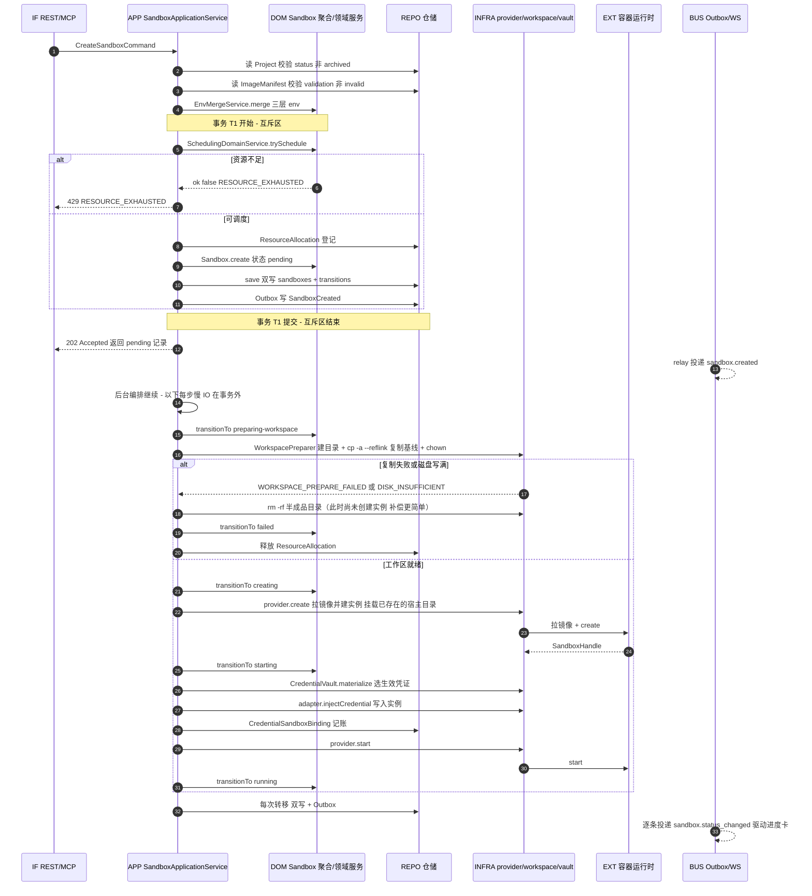
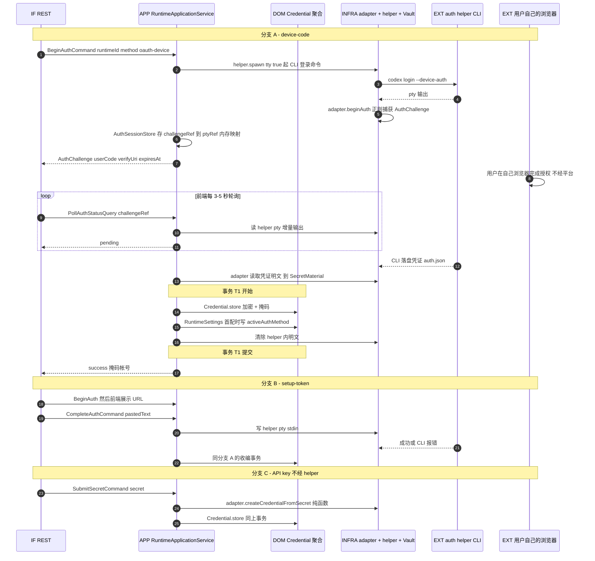
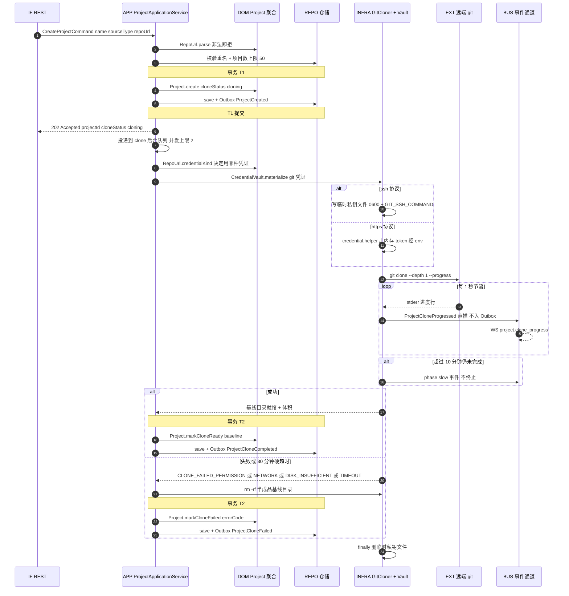
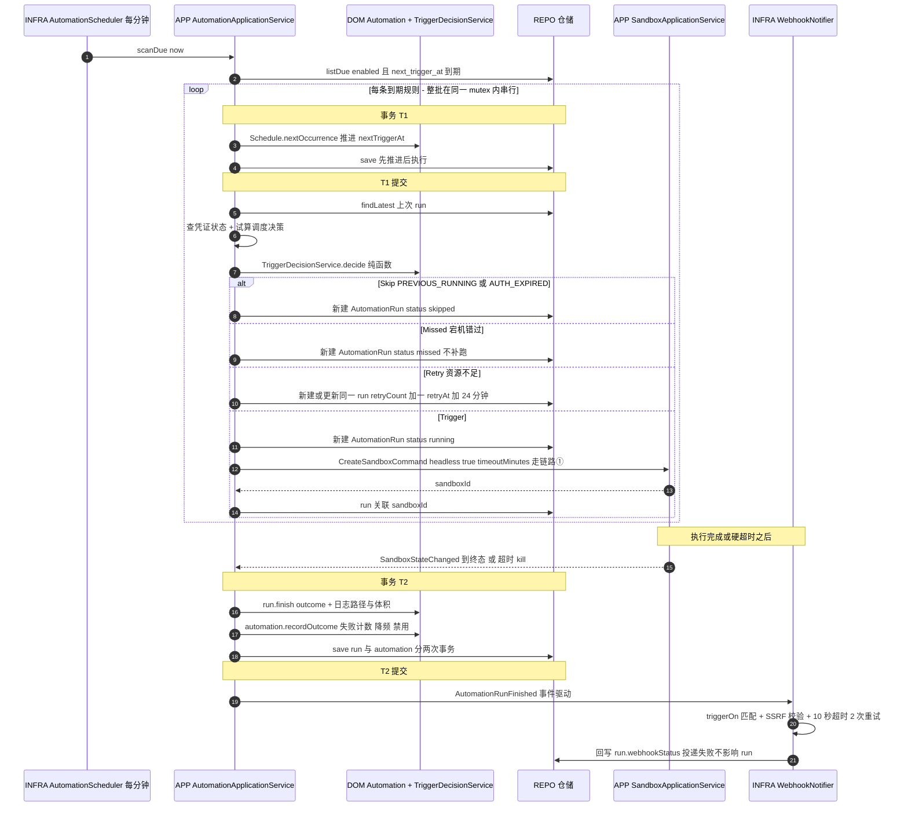
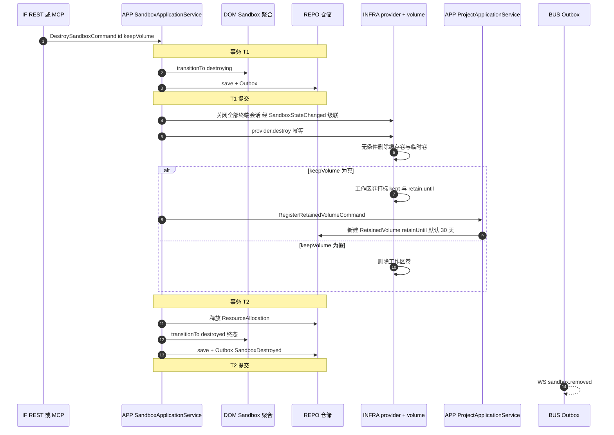
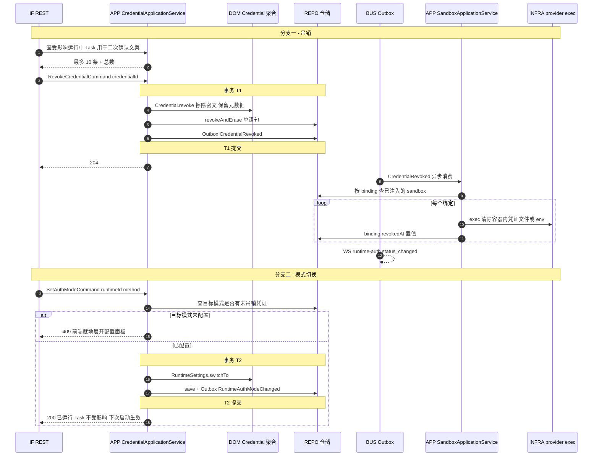
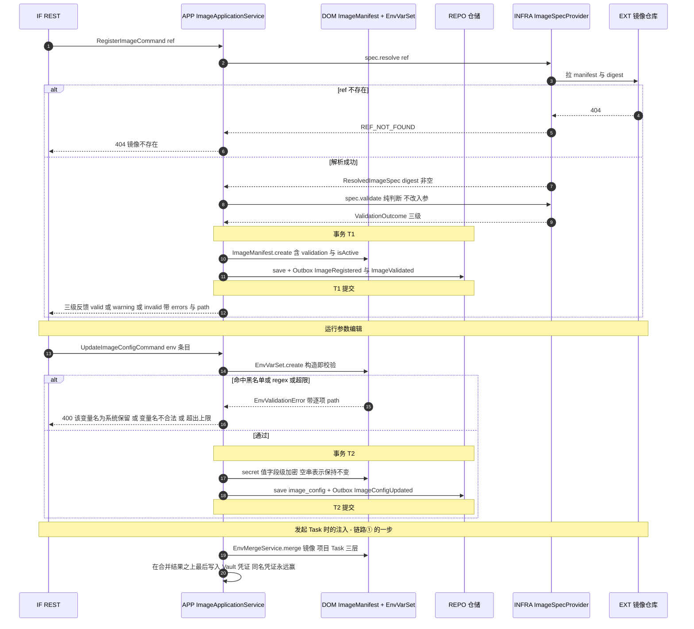
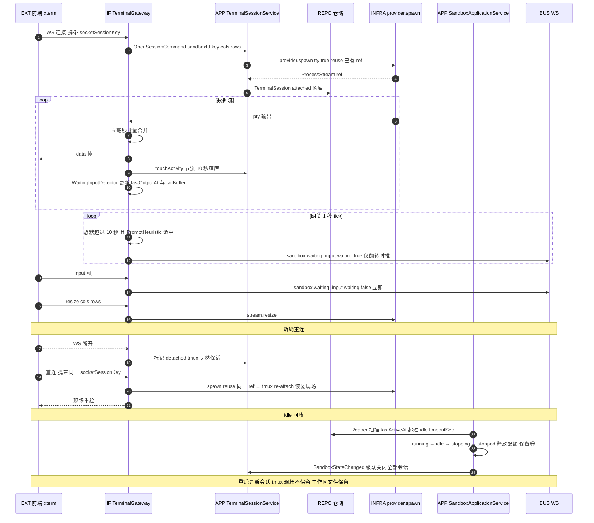

# 24 - 产品子链路的后端设计（时序 · 分层 · 事务边界）

> 状态：✅ 可评审（2026-08，按产品定稿 P20/P21/P22 与既有技术定案 01–06/13/23 编写）
> 定位：产品文档写"用户看到什么"，01/03/05/06/13 写"每个域怎么设计"，[23](./23-领域模型与聚合设计.md) 写"有哪些聚合"——**本文回答"一条产品链路落到 DDD 四层上，谁在什么时候调谁、哪一步在事务里、失败了怎么补偿"**。
> 关联文档：[23 领域模型](./23-领域模型与聚合设计.md) · [02 协议面](./02-MCP与OpenAPI双协议.md) · [03 调度中心](./03-Sandbox调度中心.md) · [05 鉴权流转](./05-Runtime鉴权流转.md) · [06 TTY 链路](./06-TTY终端链路.md) · [13 数据库](./13-后端数据库设计.md) · [25 测试体系](./25-后端测试体系.md)
> 产品权威：[P20](../product/20-核心使用链路.md) · [P21 及 pages/*](../product/21-页面信息架构与交互.md) · [P22](../product/22-异常场景与产品补充要求.md)

## 0. 读法与通用约定

### 0.1 每条链路的固定结构

1. **产品语义**（一句话 + 产品文档出处）
2. **时序图**（mermaid，泳道 = DDD 分层与外部系统）
3. **命令与服务**（command → application service → 领域对象/端口）
4. **领域事件**（产生方 → 消费方 → 是否入 Outbox）
5. **事务与一致性**（哪些同事务、哪些靠事件、失败补偿动作）

### 0.2 泳道命名（八条链路统一）

| 泳道 | 含义 |
|---|---|
| `IF` | interface 层：REST Controller / MCP Tool / WS Gateway（02 §5、06 §2） |
| `APP` | application service：协议无关门面，**事务边界的所有者** |
| `DOM` | domain：聚合、值对象、领域服务（23） |
| `REPO` | 仓储实现（infrastructure/persistence，Drizzle） |
| `INFRA` | 其他 infrastructure：provider、adapter、git、webhook、pty |
| `EXT` | 外部：容器运行时 / micro-VM、CLI、远端 git、用户浏览器 |
| `BUS` | EventBus + Outbox relay → WS 推送 |

### 0.3 三条贯穿全文的通用规则

| 规则 | 内容 | 依据 |
|---|---|---|
| **R-1 事务边界只在 APP，且事务是同步的** | 领域对象与仓储都不开事务；`UnitOfWork.run(fn: (tx) => T): T` 由 application service 持有并**同步返回**——`better-sqlite3` 的事务要求同步回调，回调里出现 `await` 会让事务在让出点提前提交（审计 P0-2，论证见 23 §4.2）。因此**事务内只做内存值→SQL 写入**，仓储的事务内写一律是同步 `saveSync(tx, agg)`。一个命令 = 一个本地事务 = 至多一个聚合写入（有界例外仅两处：① Sandbox 当前态+转移历史双写；② 首配凭证的 credentials+runtime_settings 双写，见 §2.3——共性都是"同一业务事实的两张投影表"） | 23 §4.2/§4.3 |
| **R-2 慢 IO 永远在事务外** | 拉镜像、起实例、clone、pty 交互、加解密、webhook 投递一律在事务外执行；事务只包住"读-判-写"的短临界区。**R-1 的同步事务把这条从约定升级为强制**——异步端口在同步回调里根本调不了 | 03 §3 |
| **R-3 Outbox 与业务同事务** | 需要可靠投递的领域事件与业务写入在**同一事务**里落 `domain_events`，由 relay 异步投递；可丢失的展示信号直推不落表 | 13 §2 / 23 §4.4 |

---

## 1. 链路①：发起任务主链路

**产品语义**：用户在两步向导点 [发起] → 阶段进度卡逐步推进 → 终端自动打开（P20 §3.3）。阶段固定为 初始化 → 拉镜像 → 准备工作区 → 启动实例 → 连接终端，**没有"等待登录"环节**（P20 §5 / 05 §2 决策 A）。

### 1.1 命令与服务

| 命令 | 服务方法 | 领域协作 |
|---|---|---|
| `CreateSandboxCommand{ projectId, runtime, image?, provider?, initialPrompt?, quota?, headless?, timeoutMinutes? }` | `SandboxApplicationService.create()` | `EnvMergeService`（image 上下文，纯函数）→ `SchedulingDomainService`（纯函数）→ `Sandbox.create()` → `Sandbox.transitionTo()` × N |
| — | `WorkspacePreparer.prepare(sandboxId, project)`（INFRA） | 消费 `Project.baseline` + `WorkspaceNamingPolicy` |
| — | `CredentialVault.materialize(credentialId, handle)` | `CredentialSelectionService.forRuntime()`（纯函数选取）+ `CryptoService`（端口） |

**跨上下文调用一律经对方的 application service**（01 §5）：sandbox 不 import project/image/credential 的 domain。

### 1.2 领域事件

| 事件 | 生产 | 消费 | Outbox |
|---|---|---|---|
| `SandboxCreated` | sandbox | WS `sandbox.created` | ✅ |
| `SandboxStateChanged` ×N | sandbox | WS `sandbox.status_changed`（驱动四阶段进度卡）、terminal（销毁时级联） | ✅ |
| `SandboxWorkspacePrepareFailed` | sandbox | 清理编排（rm -rf 半成品目录） | ✅ |
| `CredentialInjected` | credential | 注入台账 | ✅ |

### 1.3 事务与一致性

| 步骤 | 事务 | 说明 |
|---|---|---|
| 调度决策 + 配额登记（**含 `disk_mb_reserved`**）+ 建 pending 记录 + Outbox | **T1（同一事务，且在 `async-mutex` 互斥区内）** | 03 §3 的核心：读-改-写资源池必须串行且原子，否则并发创建会超分配。磁盘同样在此登记以消 TOCTOU（03 §1，审计 P1-9）。**T1 内全部是同步写**（R-1）：资源池快照与镜像/项目校验都在进入事务前 `await` 完成 |
| 拉镜像 / create / 复制工作区 / 注入凭证 / start | **无事务** | R-2：慢 IO 在临界区外；每步之间可能有秒到分钟级间隔 |
| 每次状态转移 | **各自独立的短事务 Tn** | 双写 `sandboxes` + `sandbox_state_transitions` + Outbox（23 §4.3） |

**失败补偿（三类，动作不同——这正是 `preparing-workspace` 独立成状态的理由，03 §4.0）**：

| 失败点 | 补偿 |
|---|---|
| `preparing-workspace` 失败 | `rm -rf` 半成品目录（标记文件 `.platform-workspace-state=preparing`）→ 回滚配额 → `failed`。**此时尚无实例**，不需要 `provider.destroy`——这是状态前移（审计 P0-1）带来的简化 |
| `creating` 失败（拉镜像/建实例） | `rm -rf` 工作区目录（目录已建但没用过）→ 回滚配额 → `status=failed` |
| `starting` 失败（注入/启动） | `provider.destroy` → **删工作区目录**（只有未被使用过的副本，无成果可言）→ 回滚配额 → `failed` |
| 进程在中途崩溃 | 启动对账兜底：`resource_allocations` 活跃但实例查无 → orphaned（13 §4）；标记为 `preparing` 的目录无条件 `rm -rf`（03 §7.6） |

**用户中途取消**（P20 §8.2「取消=终止并自动回收资源」）：与失败补偿同一套动作，只是 `failure_reason='cancelled by user'`。

---

## 2. 链路②：鉴权配置链路（三分支）

**产品语义**：向导拦截面板或凭证页内**即时完成**，不依赖任何任务 sandbox（P20 §5 / 05 §2 决策 A）。三分支：A device-code（Codex）、B setup-token（Claude Code）、C API key。

### 2.1 命令与服务

| 命令 | 服务 | 要点 |
|---|---|---|
| `BeginAuthCommand{ runtimeId, method }` | `RuntimeApplicationService.beginAuth()` | 校验 `method ∈ getAuthMethods()`，否则 `UNSUPPORTED_METHOD`（testkit RA-03） |
| `PollAuthStatusQuery{ runtimeId, challengeRef }` | `.pollAuthStatus()` | 查内存 `AuthSessionStore`；session 不存在 → `AUTH_CHALLENGE_EXPIRED` |
| `CompleteAuthCommand{ runtimeId, challengeRef, pastedText? }` | `.completeAuth()` | 写 helper pty stdin |
| `SubmitSecretCommand{ runtimeId, secret }` | `.submitSecret()` | **不经 helper、不起 pty**（05 §3.1） |

### 2.2 领域事件

`RuntimeAuthCompleted`（✅）· `CredentialStored`（✅）· `RuntimeAuthModeChanged`（✅，首配时一并产生）→ 三者都投影为 WS `runtime-auth.status_changed`（23 §12）。

### 2.3 事务与一致性

| 步骤 | 事务 |
|---|---|
| 起 helper CLI、捕获挑战、轮询、写 stdin | **无事务**（全是 pty IO，可能持续 15 分钟） |
| **凭证收编**：加密落库 + 首配时写 `runtime_settings` + Outbox | **T1 单事务，`credentials` 与 `runtime_settings` 同事务写** —— 这是 R-1 的**有界例外 #2**（与 Sandbox 当前态+转移历史双写并列；主管裁决 2026-08）。例外条款：仅限"**同一业务事实的两张投影表**"（首次配置这一个事实同时投影为凭证记录与生效模式），禁止扩大到任何跨聚合业务操作。理由：单机 SQLite 下同事务成本近零，事件异步方案会引入 settings 缺失窗口期与一条额外的读路径推断兜底——新增状态空间的成本大于规则一致性的收益 |
| 清除 helper 内明文 | 事务外，`try/finally` 保证 |

**失败与补偿**：

| 情况 | 处理 |
|---|---|
| 设备码 15 分钟过期 | `AuthSession` 到期即弃 → `AUTH_CHALLENGE_EXPIRED` → 前端 [重新获取]（P22 §2） |
| 用户浏览器侧取消 | 轮询返回 `AUTH_REJECTED` |
| 粘贴 code 无效 | CLI 报错被捕获 → `AUTH_REJECTED` + 输入框清空重试 |
| **进程重启，登录进行到一半** | `AuthSession` 是内存态（23 D-6），全部失效 → 前端下次轮询得 `AUTH_CHALLENGE_EXPIRED` → 重走 begin。**无残留**：helper pty 随进程消亡，未收编的凭证留在 helper 临时 HOME，下次 helper 重建时清空 |
| helper 容器缺失 | `PROVIDER_UNAVAILABLE` + [运行诊断]；**不降级到任务 sandbox 内登录**（11 §1.1 红线） |

---

## 3. 链路③：项目创建与 clone

**产品语义**：创建弹层填 git URL → 进度态"正在克隆…" → 就绪自动选中（P21-6 §3.2/§6）；>10min 提示、30min 硬超时、权限类失败引导去配 Git 凭证（P22 §2）。

### 3.1 命令与服务

| 命令 | 服务 | 领域协作 |
|---|---|---|
| `CreateProjectCommand{ name, sourceType, repoUrl?, repoBranch? }` | `ProjectApplicationService.create()` | `RepoUrl`（解析 + 协议判定）、`Project.create()` |
| `RetryCloneCommand{ projectId }` | `.retryClone()` | 显式把 `cloneStatus` 重置为 `cloning`（I-PRJ-6 不允许隐式回退） |
| **`ConvertToEmptyCommand{ projectId }`** | `.convertToEmpty()` | 仅 `failed` 态；`Project.convertToEmpty()` 一次性把 source/repoUrl/baseline 三者归零并置 `ready`（I-PRJ-7），**`rm -rf` 基线目录在事务外先做**（R-2），成功后单事务落库 + `ProjectConvertedToEmpty` |
| `CancelCloneCommand{ projectId }` | `.cancelClone()` | SIGTERM 子进程 → 清卷 → 删记录 |
| `TestGitCredentialCommand{ repoUrl? }` | `CredentialApplicationService.testGit()` | `git ls-remote`，**15s 超时**，只回 ok/errorCode（03 §7.4） |

### 3.2 事务与一致性

| 步骤 | 事务 | 说明 |
|---|---|---|
| 建记录（cloning） | T1 | 快，**必须在返回 202 前提交**——否则前端拿到 id 却查不到记录 |
| clone 全过程 | 无事务 | 可能 30 分钟 |
| 进度事件 | **不落表、不入 Outbox** | 可丢失展示信号（23 §4.4）；丢了不影响最终 `clone_status`（REST 可查） |
| 终态落定 | T2 | 一个聚合一次写入 |

**补偿**：

- **半成品基线卷**：失败/超时/取消三条路径都必须删（`finally` + 启动对账兜底）。
- **临时私钥文件**：`try/finally` 必删 + 进程退出钩子（03 §7.3）。
- **进程重启且 clone 中断**：启动扫描 `clone_status='cloning'` 且无子进程 → 置 `failed` + `errorCode='INTERRUPTED'` + 清卷，**不自动续跑**（与自动化"missed 不补跑"同一哲学：不擅自续跑用户看不见的长操作）。
- **权限类失败的产品闭环**：`CLONE_FAILED_PERMISSION` → 403 → 前端 [配置 Git 凭证] → 配完 [重试克隆] → `RetryCloneCommand`（P22 §2 链路）。

---

## 4. 链路④：自动化触发（v1.1）

**产品语义**：定时唤起一个标准无头 Task；触发时刻按决策表判定；失败先降频再禁用；webhook 通知（P21-7 §5/§7）。

### 4.1 命令与服务

| 命令/查询 | 服务 | 领域协作 |
|---|---|---|
| *(定时器)* | `AutomationApplicationService.scanDue(now)` | `Schedule.nextOccurrence()`、`TriggerDecisionService.decide()`（均纯函数） |
| `CreateAutomationCommand` / `UpdateAutomationCommand` | `.create()` / `.update()` | `Automation` 不变量（I-AUT-5/6/7） |
| `EnableAutomationCommand` | `.enable()` | I-AUT-4：清零 `failureCount` 与 `degraded` |
| *(事件驱动)* | `.onRunFinished(event)` | `Automation.recordOutcome()`：I-AUT-1/2/3 |

### 4.2 事务与一致性

| 步骤 | 事务 | 说明 |
|---|---|---|
| 推进 `nextTriggerAt` | **T1，独立且先行** | I-AUT-8：先推进后执行——执行阶段任何异常都不会导致同一时刻反复触发。代价：极端情况下丢一次触发（可接受，好过刷屏） |
| 建 run 记录 | 独立事务 | |
| 创建 Task | **走链路① 的完整事务序列** | 自动化**不得**绕过配额/状态机/工作区副本（P21-7 §9 / 23 §2.1 遵奉者关系） |
| run 终态 + 规则失败计数 | **两个独立事务**（run 一个、automation 一个） | R-1：两个聚合不同事务。中间崩溃 → run 已落终态但计数未更新 → 下次 `scanDue` 时按 run 历史补算（幂等：`recordOutcome` 以 run id 去重） |
| webhook 投递 | 事务外，异步 | 失败只写 `webhookStatus`，**绝不影响 run 状态**（03 §8.5） |

**整批扫描在单个 `async-mutex` 内串行**（03 §8.1）：防止上一轮未结束时下一轮重入。

**失败补偿**：

| 情况 | 处理 |
|---|---|
| 无头 Task 硬超时 | kill → sandbox `failed` → run `timeout` → **计入连续失败**（P20 §9.9） |
| 连续失败 ≥3 | `degraded=true`，`nextTriggerAt` 按每日一次重算，原 schedule 不改写（I-AUT-3） |
| 降频后再连续 7 次 | `enabled=false` + 横幅 + webhook |
| 调度器宕机 | 重启后 `nextTriggerAt` 已过期超阈值 → `missed`，**不补跑**，直接推进到下一个未来时刻 |

---

## 5. 链路⑤：销毁与保留卷

**产品语义**：销毁二次确认，默认勾选「保留工作区成果卷」；保留的卷进项目菜单「已保留卷」（P20 §6 / P21-6 §3.3）。

### 5.1 要点

| 项 | 设计 |
|---|---|
| `keepVolume` 默认值 | REST 由前端表单传（UI 默认勾选保留）；**MCP 默认 `false`**（02 §5.2：程序化消费方不该默认留下需人工清理的卷） |
| 保留期 | 默认 30 天；自动化产物取规则的 `artifactRetentionDays`（3/7/30） |
| 缓存卷与临时卷 | **无论 keepVolume 与否都删**（P22 §4.2） |
| `VolumeReaper` | 定时扫 `retainUntil <= now` → 删卷 → 置 `deletedAt`（记录留档） |
| 项目删除的级联 | `ProjectDeleted` 事件 → sandbox 上下文逐个销毁（先强停运行中的）→ **保留卷不删**（13 §2） |

### 5.2 事务与一致性

- T1（进 destroying）与 T2（落 destroyed + 释放配额）之间是**不可事务化的外部操作**（删实例、删/留卷）。
- **崩溃在中间**：sandbox 停在 `destroying`，配额未释放 → 启动对账发现"活跃登记 + 实例查无" → orphaned → 释放配额 + 置 `failed`（13 §4）。**卷不会被误删**：`kept` 标签的卷只由 `VolumeReaper` 按保留期删。
- **`provider.destroy` 必须幂等**（04 testkit SP-06）——重放补偿依赖这一点。
- 保留卷登记（PRJ 侧）与 sandbox 终态（SBX 侧）是**两个聚合两个事务**：若登记成功而 sandbox 终态失败，重放时 `RetainedVolume.workspacePath` 唯一约束（I-RV-3）保证不重复登记。

---

## 6. 链路⑥：凭证吊销与模式切换

**产品语义**：吊销二次确认并列出受影响运行中 Task；模式切换即时全局生效，切到未配置的模式返回 409 由前端就地引导补配（P21-3 §6 / P22 §2）。

### 6.1 事务与一致性

| 项 | 设计 |
|---|---|
| 吊销本体 | T1 单事务：**擦除密文与置 `revokedAt` 必须同一语句**（I-CRD-3）——否则崩在中间会留下"已吊销但密文还在"的最坏中间态 |
| 联动清除已注入文件 | **异步、经事件**（R-1：不与吊销同事务）。P20 §5.3 的产品语义只承诺"联动清除"，未承诺同步完成 |
| 清除失败 | 单个 binding 清除失败**不回滚吊销**——凭证在库里已经不可用，容器内的残留文件在下次重启时随卷/实例消失；失败记日志 + 该 binding 保留 `revokedAt` 为空供重试任务再扫 |
| 运行中 Task 的表现 | 主状态不变，列表标 ⚠️ 凭证已失效（P22 §2）——这是**读模型的派生**，不改 Sandbox 聚合 |
| 模式切换 | T2 单事务、无外部 IO；已运行 sandbox 不受影响（下次启动按新模式 materialize，05 §4） |
| 409 分支 | 校验在事务**之前**（读-判-写的判在读之后立即做，冲突窗口极小；即便竞态导致写入后目标凭证被吊销，下次 materialize 会走"生效凭证缺失"的既有失败路径） |

---

## 7. 链路⑦：镜像注册与验证

**产品语义**：提交镜像 URI → 分级反馈 ✅/⚠️/❌ → 保存后出现在向导下拉；运行参数（env）可编辑，注入时三层合并（P21-4 §5/§9/§10）。

### 7.1 要点

| 项 | 设计 | 依据 |
|---|---|---|
| 三级而非两级 | `warning` 的镜像**仍可选**，选项旁就地显示后果 | P21-4 §9 |
| `is_active` 切换与参数保存 | **同一个 `PATCH /api/images/:id { is_active?, image_config? }`**（02 §5.1）；禁用后自动从向导下拉消失，**历史 sandbox 的引用仍合法** | I-IMG-3 |
| 使用中不可硬删 | `sandboxes.image_ref RESTRICT` + 前端提前置灰 | 13 §2 |
| secret 编辑 | 传空串 = 保持不变（不是清空）；原值不写入 DOM | I-IMG-5 / P21-4 §10.2 |
| 凭证覆盖 | **不在 `EnvMergeService` 里做**——它只管三层；凭证由 application 在最后一步覆盖写入 | 05 §4.1 |

### 7.2 事务与一致性

全部是短事务 + 一次外部读（resolve/validate 在事务外先做完）。`validate()` 是**纯判断、不改入参、无副作用**（testkit IS-04），因此可以放心在事务外重复执行。校验失败**不落库**——不产生"invalid 的半成品记录"，用户重新提交即可。

---

## 8. 链路⑧：终端会话全生命周期

**产品语义**：状态转 🟢 后终端自动打开；断线自动重连 + tmux 恢复现场；空闲 30min 自动暂停，重启开**新会话**（P20 §6 / P22 §2）。

### 8.1 要点与边界

| 项 | 设计 | 依据 |
|---|---|---|
| PTY 来源 | 只有 `provider.spawn({tty:true})` 一个原语；网关不做任何解复用 | 06 §3 |
| 初始任务指令 | 携带 `initialPrompt` 时首个会话用 `buildStartCommand`（交互式用法），否则 `buildAttachCommand` | 06 §3 |
| 断线恢复 | 首选 tmux re-attach；无 tmux 镜像降级 ring buffer + grace timer，**对前端同一协议语义** | 06 §6 |
| **活跃度** | 唯一写入方是网关；节流 ≥10s 落库；走 `SandboxApplicationService.touchActivity()` 这一个跨上下文入口 | 06 §8.3 / 23 §10.4 |
| **waiting-input** | 网关内存态，只在**翻转**时推；`PromptHeuristic` 是 domain 纯函数，计时与聚合在 infrastructure | 23 §10.2 |
| idle 口径 | 终端无输入输出（**非 CPU**）；waiting-input 期间**不**刷新活跃度 | 03 §4.2 |
| 重启语义 | `stopped → starting` 开**新 agent 会话**；tmux 现场恢复只适用断线重连 | 03 §4.2 / P22 §2 |

### 8.2 事务与一致性

| 步骤 | 事务 |
|---|---|
| 建/关会话记录 | 各自短事务 |
| 数据流转发 | **无事务、无落库** |
| `touchActivity` | 窄写入，绕过乐观锁（23 §5.7）——"最后一个赢"正是想要的语义 |
| `waiting_input` | **完全不落库**；网关重启回落 `false`，10s 后自然重判（06 §8.2） |
| 会话与实例的一致性 | `provider` 侧实例消失 → 流 `onExit` → 会话置 `closed`；反向由 `SandboxStateChanged` 级联（06 §5）。两条路径都幂等，重复关闭无副作用 |

---

## 9. 八条链路的横向对照

| # | 链路 | 主 application service | 事务数 | 最长外部操作 | 关键补偿 |
|---|---|---|---|---|---|
| ① | 发起任务 | `SandboxApplicationService` | 1 互斥 + N 转移 | 拉镜像/复制工作区（分钟级） | 三类失败三种清理（含半成品卷） |
| ② | 鉴权配置 | `RuntimeApplicationService` | 1（收编） | device-code 等待（≤15min） | 内存 session 失效 → 重走 begin |
| ③ | 项目 clone | `ProjectApplicationService` | 2 | git clone（≤30min 硬超时） | rm -rf 半成品目录 + `INTERRUPTED` 不续跑 |
| ④ | 自动化触发 | `AutomationApplicationService` | 3+（含链路①） | 无头执行（≤4h 硬超时） | 先推进后执行 + 计数按 run 幂等补算 |
| ⑤ | 销毁与保留卷 | `SandboxApplicationService` | 2 | provider.destroy | 对账兜底；destroy 幂等 |
| ⑥ | 吊销/模式切换 | `CredentialApplicationService` | 1 | 逐 sandbox exec 清除 | 清除失败不回滚吊销 |
| ⑦ | 镜像注册 | `ImageApplicationService` | 1–2 | 拉 manifest | 校验失败不落库 |
| ⑧ | 终端会话 | `TerminalSessionService` | 短事务 | 会话存活期（无上限） | 双向幂等关闭 |

**一眼可见的共性**：**没有任何一条链路把外部慢操作包进事务**（R-2），也**没有任何一条链路跨聚合同事务**（R-1，有界例外仅 §2.3 注明的两处"同一业务事实投影表"双写）。这两条是本文所有设计的骨架，也是 25 号文档集成测试的主要断言方向。
