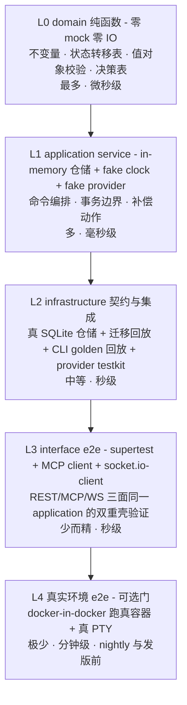

# 25 - 后端测试体系（总纲 + 逐上下文 / 逐链路测试设计）

> 状态：✅ 可评审（2026-08；与 [01](./01-后端目录结构与DDD分层.md) 分层、[09 §2](../shared/09-工程化规范.md) 工程化、[04 §10](./04-Contract与Registry扩展体系.md) testkit、[23](./23-领域模型与聚合设计.md) 领域模型、[24](./24-产品子链路后端设计.md) 子链路一致）
> 定位：后端仓库 `agent-platform-api` 的测试单一入口。前端对端是 [12](../frontend/12-前端测试体系.md)，两者互不重叠——**同一条产品链路，前端测"界面对不对"，后端测"状态与数据对不对"**。
> 关联文档：[23 领域模型](./23-领域模型与聚合设计.md)（不变量编号的定义处）· [24 子链路](./24-产品子链路后端设计.md)（集成场景的来源）· [04 §10 testkit](./04-Contract与Registry扩展体系.md) · [09 §2 CI](../shared/09-工程化规范.md)

**编号约定**：本文用例引用 23 号文档的不变量编号（`I-SBX-1` 等）与 24 号文档的链路编号（`链路①`–`链路⑧`），三份文档一一对应。**新增不变量必须同时新增用例**，这条写进 PR checklist。

---

## 1. 测试金字塔定案

### 1.1 五层分工



| 层 | 工具 | 覆盖对象 | Mock 边界 | 目录落点 | CI 阶段 |
|---|---|---|---|---|---|
| **L0** | Vitest | `packages/modules/*/domain/**`、`shared-kernel/domain` | **零 mock**——domain 按 01 §3 禁止依赖任何 IO 库，天然可测 | 与被测文件同目录 `*.spec.ts` | 第 2 道门 |
| **L1** | Vitest | `application/**`（command handlers、application service） | 仓储 = **in-memory 替身**（非 mock 库）；provider/adapter/vault = **fake 实现**；时钟 = `FakeClock` | `application/**/*.spec.ts` | 第 2 道门 |
| **L2** | Vitest + better-sqlite3 + `@platform/sandbox-contracts/testkit` | `infrastructure/**`：仓储实现、迁移、adapter 解析器、provider 实现 | 只 mock **网络与容器运行时**，DB 用真库 | `infrastructure/**/*.spec.ts` + `test/contract/**` | 第 3 道门 |
| **L3** | Vitest + `supertest` + `@modelcontextprotocol/sdk` client + `socket.io-client` | `interface/**` 与整机装配（`Test.createTestingModule` 整个 AppModule，只替换 provider registry 与外部网络） | provider 注册 fake 实现；DB 用临时文件 SQLite | `test/e2e/**` | 第 3 道门 |
| **L4** | Vitest + docker-in-docker runner | 真 `aio` 容器创建 + 真 PTY 全链路 | 不 mock 任何东西 | `test/e2e-real/**` | 可选门（nightly/发版前） |

### 1.2 测试运行器定案：**Vitest**

| 候选 | 取舍 |
|---|---|
| **Vitest（采纳）** | ① ESM 原生——项目是 NestJS 11 + Node 22 + pnpm workspaces，Jest 在 ESM + `.ts` 路径别名下的配置负担明显更重；② 与前端（bun test/Vitest 生态）心智一致，双仓协作成本低；③ `vi.useFakeTimers()` 对 §1.4 的时间控制支持完整；④ workspace 模式天然适配 `packages/modules/*` 多包结构 |
| Jest（备选） | NestJS 官方脚手架默认。若团队更看重官方模板一致性可切换——**被测代码与替身设计不依赖运行器**（本文不使用任何运行器专有 API，除 fake timers 外），切换成本仅限配置文件 |
| **`@nestjs/testing` 始终使用** | 与运行器无关：L1/L3 用 `Test.createTestingModule()` 装配 DI 图，替身经 `overrideProvider(TOKEN).useValue(fake)` 注入 |

> 09 §2.1 的后端工具链表已同步 Vitest 定案（本文档是该决策的定义处）。

### 1.3 Mock 纪律（三条硬规则）

1. **domain 层永远不 mock**——需要 mock 才能测的 domain 代码，说明它混进了 IO，是 01 §3 分层违规的信号，改代码不改测试。
2. **仓储用手写 in-memory 替身，不用 mock 库**（`vi.mock` 只用于隔离第三方 SDK）。理由：替身可以携带真实的**约束语义**（唯一性、乐观锁冲突），mock 只能记录调用；L1 要验的恰恰是"冲突时会怎样"。
3. **contract 类型只在 infrastructure 边界出现**——L1 的 fake provider 实现的是 `SandboxProvider` 接口本身（04 §2.2），不是它的 mock；这样 L1 用的假实现与 L2 跑 testkit 的真实现面对同一份契约。

### 1.4 时间、随机与并发的可控化

三者是本项目最大的不确定性来源（idle 阈值、15min 设备码、24min×5 重试、每分钟扫描、UUID v7）：

| 来源 | 措施 |
|---|---|
| 时间 | 全代码禁止直接 `new Date()` / `Date.now()`；统一注入 `Clock` 端口（`shared-kernel`）。L0/L1 用 `FakeClock`，L2/L3 用 `vi.useFakeTimers()` 推进 |
| ID | 注入 `IdGenerator` 端口；测试用确定序列（`sbx_0001`…），断言可写死 |
| 定时任务 | `SandboxReaper` / `WorkspaceReaper` / `AutomationScheduler` / `CredentialRefreshScanner` / Outbox relay 一律暴露 `runOnce()`；**测试直接调 `runOnce()`，不等真实定时器** |
| 并发 | 需要验证互斥的用例（超分配、扫描重入）用 `Promise.all` 发起 N 个并发命令 + 可控的慢 IO fake（fake 里 `await barrier`），断言最终状态而非时序 |

### 1.5 覆盖率政策（不设一刀切阈值）

| 层 | 政策 | 理由 |
|---|---|---|
| domain | **分支覆盖 ≥ 95%，且全部 `I-*` 不变量各有专属用例** | 纯函数、测试极便宜；这里的漏测直接等于业务错误 |
| application | 每个 command handler 至少一条**成功路径 + 一条主要失败/补偿路径** | 补偿动作是本项目最容易漏的地方（24 §9） |
| infrastructure | **不看覆盖率，看契约条款通过率**（04 §10 全部 MUST 100%） | 行覆盖对"实现是否符合语义"没有解释力 |
| interface | 每个端点至少一条 happy path + 一条错误码映射用例；**每条错误用例都断言 envelope 五字段完整**（10 §6.8） | 02 §6.1 的映射表是前端唯一依赖 |

**明确不追求的**：全局统一覆盖率数字。用它当门禁会诱导人写"调用一遍就断言 not throw"的空测试。

### 1.6 明确不测什么（避免重复投入）

| 不测 | 谁在测 |
|---|---|
| 前端渲染、文案、交互 | 前端 12 |
| 第三方库自身行为（Drizzle 会不会生成正确 SQL、socket.io 会不会重连） | 上游；我们只测**我们的用法**（如迁移回放、断线后 re-attach 语义） |
| 真实 OAuth 授权（需要真实帐号） | 不可自动化；用 golden fixture 回放 CLI 输出替代（04 §10.3 RA-04） |
| 真实模型 API 调用 | 不属于平台职责范围 |

---

## 2. 测试替身与固定装置（fixtures）

### 2.1 in-memory 仓储替身的最低要求

替身必须实现**与真实现相同的语义**，否则 L1 会绿而生产会红：

| 语义 | 必须实现 | 对应真实约束 |
|---|---|---|
| 乐观锁 | `save()` 时比对 `version`，不匹配抛 `ConcurrencyConflictError` | `sandboxes.version`（I-SBX-7） |
| 唯一性 | 重复 key 抛冲突（项目名、`(sandboxId, credentialId)`、`workspacePath`） | DB unique（I-PRJ-4 / I-CSB-1 / I-RV-3） |
| 双写 | `SandboxRepository.saveSync()` 同步追加 transitions | 23 §4.3 |
| 查询过滤 | `listDue` / `listIdleCandidates` / `listExpiringBefore` / `listRefreshDue` 的过滤条件与 SQL 等价 | 各仓储索引 |
| **写方法必须是同步的**（审计 P0-2） | 替身的 `saveSync(tx, agg)` 也必须是**同步函数**——若替身写成 `async` 而真实现是同步，L1 会绿而生产会红（真实现的事务里根本调不了 async）。**用类型强制**：端口签名返回 `void` 而非 `Promise<void>`，替身实现不出异步版本 | 23 §4.2 · 24 R-1 |

替身放 `test/doubles/`，**由 L2 的"替身一致性用例"守护**：同一组操作分别打到 in-memory 替身与真 SQLite 实现，断言可观察结果一致（§4.2 的 REPO-CONSIST 用例组）。

### 2.2 领域对象构造器（Object Mother + Builder）

```
test/builders/
  sandbox.builder.ts      aSandbox().running().withProject(p).headless(120).build()
  project.builder.ts      aProject().gitClone('git@github.com:org/repo.git').cloning().build()
  credential.builder.ts   aCredential().runtime('codex').apiKey().expiringIn(3, 'days').build()
  automation.builder.ts   anAutomation().daily('08:00', 'Asia/Shanghai').failedTimes(3).build()
```

原则：**默认值合法**（`aSandbox().build()` 必须是一个合法聚合），用例只声明它关心的差异——这样加字段时不用改几百个用例。

### 2.3 Golden fixture 库（CLI 输出回放）

```
test/fixtures/cli-output/
  codex/
    v0.42.0/device-auth.begin.txt        # 含设备码与 verification URL
    v0.42.0/device-auth.success.txt
    v0.42.0/login.rejected.txt
    v0.43.1/device-auth.begin.txt        # 新版本 = 新增一份，不覆盖旧的
  claude-code/
    v1.8.0/setup-token.url.txt              # 授权 URL 藏在 OSC 8 转义序列里（不是可见文本）
    v1.8.0/setup-token.token.txt            # 1 年期 token 打印到 stdout、被 pty 按行折成多段
    v1.8.0/setup-token.invalid-code.txt
  git/
    clone.progress.txt                    # Receiving objects 进度行样本
    clone.auth-failed.ssh.txt
    clone.auth-failed.https-401.txt
    clone.host-unreachable.txt
```

纪律（04 §10.3 RA-04 的落地）：

- **每支持一个新 CLI 版本必须新增一份 fixture**，旧版本样本永不删除（回归保护）；
- fixture 是**逐字节录制的真实输出**，不允许手写"看起来像"的文本；**OSC 8 超链接转义序列（claude setup-token 的 URL 藏在这里）、pty 折行的 token 片段等控制字节必须原样保留**——否则回放覆盖不到真实解析路径（捕获器 per-CLI，2026-08 live 实测，05 §1★/§6）；两种输出形态（codex device-auth 纯文本 code + claude setup-token 的 OSC 8/折行 token）都必须有 fixture；
- 录制脚本 `pnpm fixture:record -- --runtime codex --version v0.43.1` 把真实 pty 输出落盘，**敏感片段（真实 token / URL 的 state 参数）由脚本自动打码后入库**。

---

## 3. 逐上下文测试设计

> 每节列**关键被测不变量 → 断言级用例**。用例编号 `T-<上下文>-<n>`，与 23 的 `I-*` 对应。

### 3.1 sandbox 上下文

**L0 · 状态机（最高价值的一组，纯表驱动）**

| 用例 | 断言 | 对应 |
|---|---|---|
| T-SBX-1 | **穷举 12×12 转移矩阵**：对每一对 `(from, to)` 断言 `canTransitionTo` 与转移表一致 | I-SBX-1 |
| T-SBX-2 | `stopped → starting` **合法**；`pending → running` **非法**（抛 `InvalidSandboxTransitionError`） | I-SBX-1（产品直接依赖的两条） |
| T-SBX-3 | **`scheduling → preparing-workspace → creating` 合法**（审计 P0-1 顺序）；`creating → preparing-workspace` 与 `stopped → preparing-workspace` 均**非法** | I-SBX-9 |
| T-SBX-4 | `destroyed` 出发的任意转移非法 | I-SBX-4 |
| T-SBX-5 | 每次成功转移后 `transitions` 长度 +1，且 `from/to/triggeredBy/occurredAt` 正确 | I-SBX-2 |
| T-SBX-6 | 对账特权：`triggeredBy='health-check'` 时 `running → failed` 合法；`triggeredBy='user'` 时同一转移**非法** | I-SBX-6 |
| T-SBX-7 | 构造 `headless=true` 但 `timeoutMinutes=null` → 抛；`headless=false` 且 `timeoutMinutes=120` → 抛 | I-SBX-5 |
| T-SBX-8 | 转入 `running` 但 `providerHandle` 为空 → 抛 | I-SBX-3 |
| T-SBX-9 | **`Sandbox` 上不存在 `waitingInput` 字段**（类型层面断言 + 运行时 `expect(Object.keys(sandbox)).not.toContain('waitingInput')`） | I-SBX-8 / 裁决 D-2 |

**L0 · 调度与资源池**

| 用例 | 断言 |
|---|---|
| T-SBX-10 | `trySchedule` 边界：剩余恰好等于请求 → `ok`；少 1MB → `ok:false, RESOURCE_EXHAUSTED` |
| T-SBX-11 | 15% 安全余量：总量 16G 时可用上限断言为 13.6G |
| T-SBX-12 | CPU 允许超配（比例 1.5）、**内存不超配**——同一组输入下 cores 通过而 ram 拒绝 |
| T-SBX-13 | `ResourceQuota` 构造：`cores=0` / 负值 / `ramMb=0` 全部拒绝；`cores=0.5` 通过 |

**L1 · 命令编排与补偿**

| 用例 | 断言 | 对应 |
|---|---|---|
| T-SBX-20 | 创建成功路径：状态序列严格为 `pending→scheduling→preparing-workspace→creating→starting→running`，且 Outbox 里有等量 `SandboxStateChanged` | 链路① · P0-1 |
| T-SBX-21 | **拉镜像失败** → 配额被释放（`releasedAt` 非空）+ 状态 `failed`；**不调用**卷删除 | 链路① 补偿表 |
| T-SBX-22 | **工作区准备失败** → `rm -rf` 目录 + 释放配额；**断言 `provider.destroy` 未被调用**（此阶段尚无实例——审计 P0-1 前移带来的简化） | 链路① 补偿表 |
| T-SBX-23 | 磁盘预检不足 → 错误码 `DISK_INSUFFICIENT`（**不是** `WORKSPACE_PREPARE_FAILED`） | 02 §6.1 |
| T-SBX-24 | **并发创建 10 个**、资源只够 6 个 → 恰好 6 个成功、4 个 `RESOURCE_EXHAUSTED`，且资源池最终值等于 6 个之和（防超分配） | 03 §3 |
| T-SBX-24b | **磁盘维度同样防超分配**（审计 P1-9）：CPU/内存充足但磁盘只够 3 个副本 → 恰好 3 个成功；断言 `disk_mb_reserved` 之和 ≤ 可用磁盘 | 03 §1 |
| T-SBX-24c | **`UnitOfWork.run` 的回调是同步的**（审计 P0-2）：给回调传一个 async 函数应当在类型层被拒；运行时若传入返回 Promise 的函数则抛错，**不允许静默提交** | 23 §4.2 |
| T-SBX-25 | 乐观锁冲突：两个并发转移，后者拿旧 `version` → `ConcurrencyConflictError` | I-SBX-7 |
| T-SBX-26 | archived 项目下创建 → 拒绝 | I-PRJ-5 |
| T-SBX-27 | `invalid` 镜像下创建 → 拒绝；`warning` 镜像 → **允许** | I-IMG-2 / P21-4 §9 |
| T-SBX-28 | idle 回收：`FakeClock` 推进超 `idleTimeoutSec` → `Reaper.runOnce()` → `running→idle→stopped`，配额释放、`workspaceVolume` **未删** | 03 §4 |
| T-SBX-29 | **无头 Task 不参与 idle 回收**：`headless=true` 且长期无活动 → Reaper 不动它 | 03 §4.2 |
| T-SBX-30 | **`timeoutMinutes` 缺省与拒绝**（审计 P1-13）：`headless=true` 不传 → 落库为 120；`headless=false` 传 60 → **400 `INVALID_ARGUMENT`**，断言**没有触达 DB CHECK**（不是 500） | 02 §5.1 · I-SBX-5 |

### 3.2 project 上下文

| 用例 | 断言 | 对应 |
|---|---|---|
| T-PRJ-1 | `RepoUrl.parse` 表驱动：`git@github.com:o/r.git` / `ssh://git@h/r.git` → `git-ssh-key`；`https://…` → `git-https-token`；`ftp://…`、空串、缺 host → 拒绝 | 03 §7.3 |
| T-PRJ-2 | `sourceType='git'` 无 `repoUrl` → 拒绝；`empty` 带 `repoUrl` → 拒绝 | I-PRJ-1 |
| T-PRJ-3 | `empty` 项目的 `cloneStatus` 恒 `ready` 且 `baseline` 为空 | I-PRJ-2 |
| T-PRJ-4 | `cloneStatus='ready'` 且 git 但 `baseline` 为空 → 抛不变量异常 | I-PRJ-3 |
| T-PRJ-5 | 名称 0 字符 / 41 字符 → 拒绝；重名 → 拒绝；第 51 个项目 → 拒绝 | I-PRJ-4 |
| T-PRJ-6 | `failed → cloning` 的**隐式**回退被拒；`retryClone()` 显式重置通过 | I-PRJ-6 |
| **T-PRJ-11** | `convertToEmpty()`：`failed` 态调用 → `sourceType='empty'` ∧ `repoUrl=null` ∧ `baseline=null` ∧ `cloneStatus='ready'` **四条同时成立**；断言项目 id / 名称 **未变** | I-PRJ-7 |
| **T-PRJ-12** | `convertToEmpty()` 在 `cloning` / `ready` 态调用 → 拒绝（对应 REST 409） | I-PRJ-6 |
| T-PRJ-7 | `CloneProgress` 的 `percent` 越界（-1 / 101）→ 拒绝 | §6.3 |
| T-PRJ-8 | `RetainedVolume`：`retainUntil <= retainedAt` → 拒绝；保留期非 3/7/30 → 拒绝 | I-RV-1 |
| T-PRJ-9 | 同一 `volumeName` 登记两次 → 冲突 | I-RV-3 |
| T-PRJ-10 | `deletedAt` 非空后再改任何字段 → 拒绝 | I-RV-2 |

### 3.3 runtime 上下文

| 用例 | 断言 | 对应 |
|---|---|---|
| T-RTM-1 | `beginAuth` 传 `getAuthMethods()` 之外的 method → `UNSUPPORTED_METHOD` | testkit RA-03 |
| T-RTM-2 | 切换到未配置凭证的模式 → 409，且 `runtime_settings` **未被写入** | I-RTS-2 |
| T-RTM-3 | 首次配置凭证 → `runtime_settings` 被创建且初值 = 该次模式 | I-RTS-3 |
| T-RTM-4 | `AuthChallenge` 缺 `instructions` 或 `challengeRef` → 拒绝；`expiresAt` 是相对秒数而非 ISO → 拒绝 | testkit RA-05 |
| T-RTM-5 | `AuthSession` 过期（`FakeClock` 推进 15min）→ 轮询返 `AUTH_CHALLENGE_EXPIRED` | 链路② |
| T-RTM-6 | 进程重启模拟（清空 `AuthSessionStore`）→ 轮询返 `AUTH_CHALLENGE_EXPIRED` 而非 500 | 链路② / 裁决 D-6 |
| T-RTM-7 | `(sandboxId, runtimeId)` 重复安装记录 → 冲突 | I-RIN-1 |
| T-RTM-8 | `activeAuthMethod` 取 `'account'` / `'api-key'` 之外的值 → 构造拒绝 | I-RTS-1 |
| T-RTM-9 | 安装状态置 `installed` 但 `versionDetected` 为空 → 拒绝 | I-RIN-2 |

### 3.4 credential 上下文（安全断言优先级最高）

| 用例 | 断言 | 对应 |
|---|---|---|
| **T-CRD-1** | **明文不泄漏三连**：① `JSON.stringify(credential)` 结果不含明文；② `SecretMaterial.toString()` === `'[REDACTED]'`；③ 用例级 spy 捕获全部日志输出，断言不含明文子串 | I-CRD-2 |
| T-CRD-2 | `kind='git'` 带 `runtimeId` → 拒绝；`kind='runtime'` 无 `runtimeId` → 拒绝 | I-CRD-1 |
| T-CRD-3 | `obtainedVia` 与 `kind` 交叉表：`('runtime','git-ssh-key')` 拒绝、`('git','api-key')` 拒绝、四种合法组合通过 | I-CRD-1 |
| T-CRD-4 | `revoke()` 后 `secret` 类型为 `Erased`、密文三字段为空、元数据仍在 | I-CRD-3 |
| T-CRD-5 | 已吊销凭证 `materialize()` → `CredentialRevokedError` | I-CRD-4 |
| T-CRD-6 | 同 runtime 同模式已有生效凭证时再存 → 旧的按吊销语义处理，**同时刻只有一条生效** | I-CRD-5 |
| T-CRD-7 | **带 passphrase 的 SSH 私钥**：PEM 含 `Proc-Type: 4,ENCRYPTED` / `DEK-Info:` / OpenSSH 新格式 KDF≠none 三种样本 → 全部拒绝并给人话提示；无 passphrase 样本通过 | I-CRD-6 |
| T-CRD-8 | `ExpiryState`：剩 8 天 → `active`；剩 6 天 → `expiring`；已过期 → `expired`（边界用 `FakeClock`） | I-CRD-7 |
| **T-CRD-13** | **刷新扫描**（审计 P1-7）：`expires_at - now < 30min` 的凭证被 `listRefreshDue` 捞出；刷新成功后 `expires_at` 前移、`refresh_failures` 归零、`last_refreshed_at` 更新 | 05 §5.1 |
| **T-CRD-14** | 刷新连续失败 3 次 → **停手**（第 4 次扫描不再尝试）+ 凭证按过期呈现 + 推 `runtime-auth.status_changed` | 05 §5.1 |
| **T-CRD-15** | **master key 缺失**（审计 P1-11）：库里有凭证但 key 不可读 → 启动不崩溃，凭证一律以不可用/`revoked` 语义呈现并引导重新授权；**断言不出现解密异常泄漏到接口** | 05 §4.2 |
| **T-CRD-16** | **key 轮换**：轮换后逐条 `encryption_key_id` 更新且旧密文可被新 key 解出原值；轮换中途中断 → 新旧混存仍可全部解密 | 05 §4.2 |
| T-CRD-9 | `MaskedIdentifier`：邮箱 → `a***@gmail.com`；API key → `sk-...ab12`；SSH → `SHA256:` 前缀；**掩码后不可反推** | §8.3 |
| T-CRD-10 | 吊销 → 联动清除：3 个 binding 中第 2 个 exec 失败 → 吊销**不回滚**、第 1/3 个 `revokedAt` 已置、第 2 个保持空供重扫 | 链路⑥ |
| T-CRD-11 | `CredentialSelectionService.forKind('git-ssh-key')`：只配了 HTTPS token → 返回 null（而非错选）；kind 由 project 侧 `RepoUrl.credentialKind()` 算出经门面传入（23 §8.5 A3） | 03 §7.3 |
| T-CRD-12 | binding 的 `revokedAt` 置值后再改回空 → 拒绝（清除动作不可回退） | I-CSB-2 |

### 3.5 image 上下文

**L0 · `EnvVarSet` 表驱动（一张表覆盖全部规则）** —— 整组用例共同验证 **I-IMG-1**「构造即校验」：每一行都断言**非法输入构造不出对象**（抛 `EnvValidationError` 且 `path` 指向出错项），而不是"构造出来后再判断"。

| 用例 | 输入 | 期望 |
|---|---|---|
| T-IMG-1 | `LOG_LEVEL=info` | 通过 |
| T-IMG-2 | `_private=1` / `A1=x` | 通过（regex 允许下划线开头、允许小写） |
| T-IMG-3 | `1BAD=x` / `A-B=x` / `中文=x` | 拒绝「变量名不合法」 |
| T-IMG-4 | `OPENAI_API_KEY` / `ANTHROPIC_API_KEY` / `CLAUDE_CODE_OAUTH_TOKEN` / `HOME` / `PATH` / `DOCKER_HOST` | 拒绝「该变量名为系统保留」 |
| T-IMG-5 | `CODEX_FOO` / `GIT_ANYTHING` | 拒绝（**前缀整体拦截**） |
| T-IMG-6 | 51 条 | 拒绝 + 提示上限 50 |
| T-IMG-7 | 名 65 字符 | 拒绝 + 提示 64 |
| T-IMG-8 | 值用 1366 个汉字构造（UTF-8 下 **4098 字节**，但只有 1366 **字符**）| 拒绝——**证明按字节而非字符计**；同时补一条 1365 汉字（4095 字节）通过的用例卡住边界 |
| T-IMG-9 | 同集合内 `FOO` 与 `foo` | 通过（大小写敏感，是两个 key） |
| T-IMG-10 | 同集合内 `FOO` 重复两次 | 拒绝 |

**L0 · 合并与校验**

| 用例 | 断言 |
|---|---|
| T-IMG-11 | 三层合并优先级：镜像 `A=1`、项目 `A=2`、Task `A=3` → 最终 `A=3`、`source='task'`、被覆盖项标 `overridden` |
| T-IMG-12 | 只有镜像层有值时 `source='image'`，无 `overridden` |
| T-IMG-13 | **`EnvMergeService` 不做凭证覆盖**：合并结果里包含 `MY_VAR`，凭证覆盖由调用方最后 apply——断言 service 输出与凭证无关（纯函数性） |
| T-IMG-14 | `merge` 连调两次深相等（纯函数、无副作用） |

**L1/L2**

| 用例 | 断言 |
|---|---|
| T-IMG-15 | `validate` 三级：合法镜像 `valid`；缺 tmux → `warning` 且 `supportsTmux=false`（**仍可选**）；违反入口约定 → `invalid` + `errors[].path` 非空 |
| T-IMG-16 | 校验失败**不落库**（仓储 `save` 未被调用） |
| T-IMG-17 | `is_active=false` 后 `listSelectable` 不含它，但已有 sandbox 的 `findByRef` 仍能取到（**I-IMG-3**） |
| T-IMG-18 | secret 值：保存后库里为密文；读模型恒掩码；编辑传空串 → 密文**未变**；传新值 → 密文改变（**I-IMG-5**） |
| T-IMG-19 | 预置镜像删除 → 拒绝；禁用 → 通过（**I-IMG-4**） |
| T-IMG-20 | `resolve` 返回的 manifest `digest` 为空 → 注册被拒（**I-IMG-6**，对应 testkit IS-01） |

### 3.6 terminal 上下文

| 用例 | 断言 | 对应 |
|---|---|---|
| T-TRM-1 | **`PromptHeuristic` 表驱动**：`"$ "` / `"> "` / `"❯ "` / `"Do you want to continue?"` / `"[y/N] "` / `"Enter choice: "` → true；`"Receiving objects: 42%"` / `"...done"` / 空串 → false | 03 §4.1 |
| T-TRM-2 | 带 ANSI 转义与光标控制码的输入 → 剥离后正确取到末行（用真实 CLI 尾巴 fixture） | 06 §8.1 |
| T-TRM-3 | 静默 9.9s → 不上报；10.1s → 上报 `waiting:true`（`FakeClock` + `runOnce()` tick） | 03 §4.1 |
| T-TRM-4 | `waiting:true` 后收到**任意输出** → 立即 `waiting:false`；收到**任意 input 帧** → 立即 `waiting:false` | 03 §4.1 |
| T-TRM-5 | **只在翻转时推事件**：连续 5 个 tick 保持等待 → 只有 1 条事件 | 10 §3.1 |
| T-TRM-6 | 多会话聚合：2 个会话，1 个仍在刷输出 → sandbox 级**不**上报等待 | 06 §8.2 |
| T-TRM-7 | 无头 Task（无 tty 会话）→ 检测器不参与 | 03 §4.1 |
| T-TRM-8 | 活跃度节流：1s 内 100 次 data 帧 → 落库调用 ≤1 次；11s 后再来一帧 → 落库 1 次 | 06 §8.3 |
| T-TRM-9 | **waiting 期间不刷新 `lastActiveAt`** → idle 计时照常推进 | 03 §4.2 |
| T-TRM-10 | 同一 `socketSessionKey` 第二次 attach → 前一个转 detached（不并存） | I-TRM-1 |
| T-TRM-15 | **`socketSessionKey` 由服务端生成**（审计 P2-9）：客户端自带一个伪造 key 连接 → 拒绝；服务端下发的 key 长度/熵符合 128 bit | 06 §6 |
| T-TRM-16 | **`waitingInput` 经只读端口取数**（审计 P1-12）：sandbox 的列表查询调用 `WaitingInputQueryPort.filterWaiting` 一次（不是 N 次），且**不直接引用检测器** | 06 §8.2 · 23 §10.4 |
| T-TRM-11 | `resize(0, 24)` → 拒绝 | I-TRM-2 |
| T-TRM-12 | sandbox 销毁事件 → 该 sandbox 全部会话 `closed`，重复投递事件幂等 | I-TRM-4 |
| T-TRM-13 | 网关重启（清空内存态）→ `waitingInput` 派生字段回落 false，不抛错 | 06 §8.2 |
| T-TRM-14 | 会话状态转移：`attached ⇄ detached → closed` 合法；`closed → attached` **非法** | I-TRM-3 |

### 3.7 automation 上下文

**L0 · `Schedule.nextOccurrence`（时间逻辑，必须穷举）**

| 用例 | 断言 |
|---|---|
| T-AUT-1 | `daily 08:00 Asia/Shanghai`，当前 07:59 → 今天 08:00；08:01 → 明天 08:00 |
| T-AUT-2 | `hourly minute=00`，当前 10:00:00 整点 → 11:00（**不返回当前时刻**，防重复触发） |
| T-AUT-3 | `weekly [一,三,五] 08:00`，当前周三 09:00 → 本周五 08:00；周五 09:00 → 下周一 08:00 |
| T-AUT-4 | **夏令时**：`daily 08:00 America/New_York` 跨 DST 切换日 → 结果仍是当地 08:00（墙钟语义），UTC 偏移变化 |
| **T-AUT-6** | **时区快照不受环境影响**：规则 `timezone='Asia/Shanghai'`，把进程 `TZ` 改成 `America/New_York` 后重算 → `nextOccurrence` 结果**完全不变**（证明只读规则自己的列、不读系统时区，I-AUT-9） |
| **T-AUT-7** | **编辑不隐式改写时区**：只改 `prompt` 的 update 命令走完 → `timezone` 原样保留、`nextTriggerAt` 未漂移；显式传新 `timezone` 才变 |
| **T-AUT-8** | `timezone` 为空 / 非 IANA 名（如 `UTC+8`、`Asia/NotACity`）→ 构造拒绝 |
| T-AUT-5 | 月末/年末跨越正确 |

**L0 · `TriggerDecisionService`（决策表穷举，一条产品规则一条用例）**

| 用例 | 输入 | 期望 | 对应 |
|---|---|---|---|
| T-AUT-10 | 上次 run 仍 `running` | `Skip(PREVIOUS_RUNNING)` | 03 §8.2 行1 |
| T-AUT-11 | 凭证 `expired` | `Skip(AUTH_EXPIRED)` | 行2 |
| T-AUT-12 | 凭证 `none`（从未配置） | `Skip(AUTH_EXPIRED)` | 行2 |
| T-AUT-13 | 资源不足、`retryCount=0` | `Retry(now+24min)` | 行3 |
| T-AUT-14 | 资源不足、`retryCount=5` | `Fail`（终态失败，不再重试） | 行3 |
| T-AUT-15 | `nextTriggerAt` 过期 3min（阈值 5min） | `Trigger`（正常迟到，不算 missed） | 03 §8.1 |
| T-AUT-16 | `nextTriggerAt` 过期 90min | `Missed`（不补跑） | 行 missed |
| T-AUT-17 | 全部条件正常 | `Trigger` | 行4 |
| T-AUT-18 | 上次仍在跑 **且** 凭证过期 | `Skip(PREVIOUS_RUNNING)`——**判定优先级顺序断言** | 03 §8.2 判定顺序 |

**L0 · 失败计数与降频**

| 用例 | 断言 | 对应 |
|---|---|---|
| T-AUT-20 | `failed` ×1,2 → `degraded=false`；第 3 次 → `degraded=true` | I-AUT-2 |
| T-AUT-21 | 降频态下 `nextTriggerAt` 按每日一次算，**`schedule` 字段未被改写** | I-AUT-3 |
| T-AUT-22 | 降频后再失败 7 次（累计 10）→ `enabled=false`，`degraded` 仍 true | I-AUT-2 |
| T-AUT-23 | 降频态下成功一次 → `failureCount=0`、`degraded=false`、恢复原调度 | 03 §8.4 |
| T-AUT-24 | `skipped` 与 `missed` **不改变** `failureCount` | I-AUT-1 |
| T-AUT-25 | **`timeout` 计入失败**（与 `failed` 同权） | P20 §9.9 |
| T-AUT-26 | `enable()` 清零 `failureCount` 与 `degraded` | I-AUT-4 |
| T-AUT-27 | `timeout.minutes=45` → 拒绝（只允许 30/60/120/240）；`prompt` 8001 字符 → 拒绝 | I-AUT-5 |
| T-AUT-28 | 第 21 条规则 → 拒绝 | I-AUT-7 |

**L0/L1 · webhook**

| 用例 | 断言 | 对应 |
|---|---|---|
| T-AUT-30 | `triggerOn='failure'` + 成功结果 → 不发；+ `timeout` 结果 → **发**（timeout 归 failure） | I-AUT-6 |
| T-AUT-31 | SSRF：`http://127.0.0.1/x` 拒绝、`http://169.254.169.254/x` 拒绝、`http://10.0.0.5/x` **放行**（私网默认允许）、`ftp://…` 拒绝 | 03 §8.5 |
| T-AUT-32 | 投递失败 2 次重试后放弃 → `webhookStatus='failed'`，**run 状态不受影响** | 03 §8.5 |
| T-AUT-33 | `publicBaseUrl` 未配置 → 载荷**省略** `taskUrl` 字段（而非拼出错误链接） | 03 §8.5 |
| T-AUT-34 | 载荷字段完整性：schema 断言 `event/automationId/automationName/projectId/status` 等必填项 | 03 §8.5 |

**L0 · `AutomationRun` 聚合**

| 用例 | 断言 | 对应 |
|---|---|---|
| T-AUR-1 | 状态转移：`pending → running → success` 合法；`success → running` **非法**；`skipped` / `missed` 是触发时刻直接落定的终态，不可再转 | I-AUR-1 |
| T-AUR-2 | `retryCount` 递增到 5 后再 retry → 拒绝（转终态 `failed`） | I-AUR-2 |
| T-AUR-3 | 终态 run 改 `status` / `duration` → 拒绝；改 `webhookStatus` → **允许**（唯一可后置补写字段） | I-AUR-3 |
| T-AUR-4 | `logBytes` 超 30MB → 拒绝（轮转上限） | I-AUR-4 |

**L1 · 运行与日志**

| 用例 | 断言 | 对应 |
|---|---|---|
| T-AUT-40 | 重试**更新同一 run 行**（`retryCount` 递增），不新建记录 | I-AUR-2 |
| T-AUT-41 | 日志轮转：写入 35MB → 保留 3 个分片 ≤30MB，最旧被丢弃且文件头有截断标记 | I-AUR-4 |
| T-AUT-42 | `runOnce()` 扫描期间再次调用 → 第二次立即返回（mutex 防重入），不产生重复触发 | 03 §8.1 |
| T-AUT-43 | **先推进后执行**：让创建 Task 的那一步抛异常 → `nextTriggerAt` 仍已推进到下一时刻（下一分钟的扫描不会重复触发同一时刻） | I-AUT-8 |

---

## 4. infrastructure 与契约测试（L2 细化）

### 4.1 仓储与迁移（真库，不 mock DB）

| 用例组 | 内容 |
|---|---|
| **REPO-MIGRATE** | 干净临时库顺序执行全部历史迁移 → 再 `drizzle-kit generate` → 断言**零新迁移**（13 §6 第 3 道校验的自动化表达） |
| **REPO-DIALECT** | 双方言 schema 列名集合比对（13 §6 第 4 道）；PG 侧用 testcontainers，**列为可选门**（本地无 Docker 时跳过并输出 skip 报告，不静默通过） |
| **REPO-TX** | `SandboxRepository.save()` 在事务内**同时**写 `sandboxes` 与 `sandbox_state_transitions`；注入中途异常 → 两张表都无写入（原子性） |
| **REPO-LOCK** | 并发 `save()` 同一聚合 → 一个成功一个 `ConcurrencyConflictError` |
| **REPO-IDX** | `listDue` / `listIdleCandidates` / `listExpiringBefore` 的结果集与等价全表扫描过滤一致（防索引条件写错） |
| **REPO-CONSIST** | §2.1 的替身一致性：同一操作序列打到 in-memory 替身与真 SQLite，断言可观察结果一致 |
| **REPO-ERASE** | `revokeAndErase` 后**直接读原始表**断言密文列为空（不经聚合，防聚合层"看起来擦了"） |

### 4.2 CLI golden-output 回放（04 §10.3 RA-04 的落地）

| 用例组 | 内容 |
|---|---|
| **CLI-AUTH-PARSE** | 对每个 `runtime × 版本` 的 fixture，断言 `beginAuth` 解析出的 `userCode` / `verificationUrl` / `expiresAt` 与录制时的期望值一致 |
| **CLI-AUTH-ERROR** | rejected / invalid-code 样本 → 解析为 `AUTH_REJECTED`，不静默成功 |
| **CLI-OUTPUT-PARSE** | `parseOutput` 对 fixture 产出预期的 `RuntimeEvent` 序列 |
| **CLI-VERSION-MATRIX** | fixture 目录里**每个版本都必须有对应用例**（用例由目录扫描生成——新增 fixture 目录却没测，CI 直接 fail） |
| **GIT-STDERR-PARSE** | git 错误样本 → 正确分类为 `CLONE_FAILED_PERMISSION` / `CLONE_FAILED_NETWORK`；进度行 → 正确解析百分比与字节数 |

> 这组用例是 05 §6「CLI 升级改输出格式导致静默失效」这条**高危风险的唯一防线**（09 §2.3 已明令不得归入可选项）。

### 4.3 Provider testkit（04 §10）

| 项 | 落地 |
|---|---|
| 执行对象 | 内建 `aio` / `boxlite` / `ClaudeCode` / `Codex` **与第三方实现同一套**，无双重标准 |
| 准入线 | 全部 MUST 100% 通过；SHOULD 失败输出 warning 计入报告 |
| 能力位 | 声明 `true` 的位其挂靠条款**从跳过转必跑**；声明 `true` 却跑不过 = 不合格（CAP-01） |
| 产物 | `contract-conformance.json` 入 CI artifact；`GET /providers` 诊断可回显最近一次结果 |
| CI 位置 | 第 3 道门**必跑**；`aio` 需要容器运行时的用例在无 Docker 环境下 skip 并**显式报告 skip 清单**（不静默） |

### 4.4 Git 凭证落地的安全断言

| 用例 | 断言 | 对应 |
|---|---|---|
| GIT-SEC-1 | SSH 路径：临时密钥文件权限为 `0600`、目录 `0700`；命令结束后文件**不存在**（成功与失败两条路径都测） | 03 §7.3 |
| GIT-SEC-2 | HTTPS 路径：token **不出现在** 进程 argv、不出现在写入的任何文件、不出现在日志 | 03 §7.3 |
| GIT-SEC-3 | `GIT_TERMINAL_PROMPT=0` 与 `GIT_ASKPASS` 已设置（防无人值守卡死） | 03 §7.3 |
| GIT-SEC-4 | `known_hosts` 用平台私有文件（不碰 `~/.ssh/known_hosts`）；首连记录指纹；**主机密钥变更 → clone 失败**（`accept-new` 与 `no` 的关键差别） | 03 §7.3 |
| GIT-SEC-5 | 日志脱敏：含 userinfo 的 URL 与 `password=` 片段被过滤 | 03 §7.3 |

---

## 5. 逐子链路集成测试（L3，对应 24 号文档八条链路）

**统一形态**：`Test.createTestingModule(AppModule)` 整机装配，只替换 ① provider registry（fake `SandboxProvider`/`RuntimeAdapter`）② 外部网络（git、webhook）③ `Clock`/`IdGenerator`；**DB 用真 SQLite 临时文件**。断言维度固定三条：**HTTP/MCP 响应** + **DB 最终状态** + **WS 事件序列**。

### 5.1 链路① 发起任务

| 场景 | 断言 |
|---|---|
| E2E-1-happy | `POST /api/sandboxes` → 202；WS 依次收到 `sandbox.created` + 5 条 `sandbox.status_changed`，**顺序为 `scheduling→preparing-workspace→creating→starting→running`**（审计 P0-1）；DB 最终 `running` 且 `sandbox_state_transitions` 6 行 |
| E2E-1-noRes | 资源打满 → 429 + `RESOURCE_EXHAUSTED`；DB 无残留 sandbox 记录之外的配额登记 |
| E2E-1-pullFail | fake provider 抛 `IMAGE_PULL_FAILED` → 502；DB `failed`；配额已释放 |
| E2E-1-wsFail | 工作区准备抛 → DB `failed`；**目录 `rm -rf` 被调用且 `provider.create` 从未被调用**；错误码 `WORKSPACE_PREPARE_FAILED` |
| E2E-1-disk | 预检不足 → 507 + `DISK_INSUFFICIENT` |
| E2E-1-mcp | 同一场景经 **MCP `create_sandbox`** 走一遍 → 结果与 REST 等价（验证"两层壳同一门面"，02 §1） |

### 5.2 链路② 鉴权

| 场景 | 断言 |
|---|---|
| E2E-2-device | begin → 返回 fixture 里的 userCode/URL；轮询 pending ×2；helper 落盘 → 轮询 success；DB 凭证密文非空、响应只含掩码 |
| E2E-2-expire | `FakeClock` +15min → 轮询 `AUTH_CHALLENGE_EXPIRED` |
| E2E-2-paste-bad | complete 传无效 code（fixture）→ `AUTH_REJECTED`，DB 无凭证写入 |
| E2E-2-apikey | `POST .../credentials/secret` → **不触发任何 spawn**（fake provider 的 spawn 调用计数为 0），凭证已入库 |
| E2E-2-noHelper | helper 不可用 → `PROVIDER_UNAVAILABLE`；**断言未创建任何 sandbox**（决策 A 红线） |
| E2E-2-firstConfig | 首次配置后 `credentials` 与 `runtime_settings` **同事务写入**（23 §4.3 有界例外②），提交即两表齐全——**无"追平前推断"窗口**（旧的最终一致方案已废弃，审计交叉评审 P2-6）；断言：配置成功的响应里 `activeAuthMode` 已就位，不依赖后台追平 |

### 5.3 链路③ 项目 clone

| 场景 | 断言 |
|---|---|
| E2E-3-happy | `POST /api/projects` → 202 `cloning`；WS 收到 ≥2 条 `project.clone_progress`；最终 `ready` + `baselineVolume` 非空 |
| E2E-3-slow | fake git 在 10min 处未完成（`FakeClock`）→ 收到一条 `phase:'slow'` 事件且**任务未被终止** |
| E2E-3-timeout | 30min → 子进程被 kill；DB `failed` + `TIMEOUT`；半成品卷已删 |
| E2E-3-perm | fixture 401 → 403 + `CLONE_FAILED_PERMISSION`（**不是** NETWORK） |
| E2E-3-net | fixture DNS 失败 → 502 + `CLONE_FAILED_NETWORK` |
| E2E-3-convert | `POST /api/projects/:id/convert-to-empty`（failed 态）→ 200；DB `sourceType='empty'`/`cloneStatus='ready'`/`repoUrl` 为 null；**基线目录已 `rm -rf`**；**该项目下已有 Task 记录条数不变**；再调一次 → 409 |
| E2E-3-interrupt | 模拟重启（重建模块）+ 库里有 `cloning` 记录 → 启动扫描置 `failed`/`INTERRUPTED`、卷已清、**未自动续跑** |
| E2E-3-lsremote | `POST /api/credentials/git/test` 超 15s → 超时错误；响应体**不含任何 ref 名** |

### 5.4 链路④ 自动化

| 场景 | 断言 |
|---|---|
| E2E-4-trigger | `runOnce()` → 建 run + 建 headless sandbox（走完整状态机，`labels.automation_id` 存在）；`nextTriggerAt` **已在执行前推进** |
| E2E-4-prevRunning | 上次仍 running → run `skipped/PREVIOUS_RUNNING`，**不建新 sandbox** |
| E2E-4-authExpired | 凭证过期 → `skipped/AUTH_EXPIRED` + webhook 已发 |
| E2E-4-retry | 资源不足 → 同一 run `retryCount` 1→2→…；第 6 次 → `failed` |
| E2E-4-timeout | `FakeClock` 推进超 `timeout_minutes` → sandbox `failed`、run `timeout`、`failureCount` +1 |
| E2E-4-degrade | 连续 3 次失败 → `degraded=true`、`nextTriggerAt` 变每日、`schedule` 未改写、webhook 已发 |
| E2E-4-disable | 降频后再 7 次 → `enabled=false` |
| E2E-4-missed | 停表 90min 后 `runOnce()` → run `missed`、**未建 sandbox**、`nextTriggerAt` 推到未来 |
| E2E-4-logs | `GET /api/automations/runs/:id/logs` 分页返回正确字节区间；超限轮转后仍可读 |

### 5.5 链路⑤ 销毁与保留卷

| 场景 | 断言 |
|---|---|
| E2E-5-keep | `DELETE ?keepVolume=true` → **目录仍在**、`retained_volumes` 新增一行 `retainUntil = now+30d`、目录标记文件为 `kept`；WS `sandbox.removed` |
| E2E-5-drop | `keepVolume=false` → 目录已 `rm -rf`、无 retained 记录 |
| E2E-5-mcpDefault | MCP `destroy_sandbox` **不传** keepVolume → 卷被删（默认 false，02 §5.2） |
| E2E-5-cacheVol | 两种情况下**缓存与临时目录都被删** |
| E2E-5-reaper | `FakeClock` 推进过 `retainUntil` → `WorkspaceReaper.runOnce()` `rm -rf` + 置 `deletedAt`（记录仍在） |
| E2E-5-projDelete | 删项目 → 其下 sandbox 级联销毁、**保留目录未删** |
| E2E-5-crash | T1 后模拟崩溃（跳过 T2）→ 启动对账把 `destroying` 的孤儿置 `failed` + 释放配额；`kept` 目录**未被误删**；标记为 `preparing` 的半成品目录**被清理** |

### 5.6 链路⑥ 吊销与模式切换

| 场景 | 断言 |
|---|---|
| E2E-6-revoke | 吊销 → 204；DB 密文为空；异步联动后 binding `revokedAt` 已置；WS `runtime-auth.status_changed` |
| E2E-6-partialFail | 3 个 binding 第 2 个 exec 抛 → 吊销**未回滚**，1/3 已清、2 待重扫 |
| E2E-6-switch409 | 切到未配置模式 → 409；`runtime_settings` 未变 |
| E2E-6-switchOk | 切换成功 → 新建 sandbox 用新模式凭证注入；**已运行 sandbox 不受影响** |
| E2E-6-affectedList | 吊销前查受影响 Task → 最多 10 条 + 总数（P21-3 §9） |

### 5.7 链路⑦ 镜像注册

| 场景 | 断言 |
|---|---|
| E2E-7-valid / warning / invalid | 三级反馈结构正确；`invalid` **未落库** |
| E2E-7-patch | `PATCH /api/images/:id {is_active:false}` → 不再出现在可选列表；已有 sandbox 的引用仍可解析 |
| E2E-7-restrict | 删除使用中镜像 → 409（RESTRICT） |
| E2E-7-envReject | 保存 `OPENAI_API_KEY` → 400 + 保留名文案；保存 51 条 → 400 + 上限文案；**断言响应体符合错误 envelope 五字段**（审计 P1-4，10 §6.8）且 `details[].path` 指向出错项 |
| E2E-7-validatePreflight | **`POST /api/images/validate`**（注册前预检，审计 P1-3）→ 回三级结果且**库里没有新增 manifest 记录**；`POST /api/images/:id/validate` 则写回 `validationStatus` |
| E2E-7-secretKeep | 编辑 secret 传空串 → 库中密文未变 |
| E2E-7-credWins | 创建 sandbox 时镜像 env 与凭证同名 → **注入结果是凭证值**（顺序保证，05 §4.1） |

### 5.8 链路⑧ 终端

| 场景 | 断言 |
|---|---|
| E2E-8-open | WS 连接 → `spawn(tty:true)` 被调用；`terminal_sessions` 落库 `attached` |
| E2E-8-initialPrompt | 带 `initialPrompt` 创建 → 首个会话用 `buildStartCommand`；不带 → `buildAttachCommand` |
| E2E-8-reconnect | 断开后同 `socketSessionKey` 重连 → `spawn` 带 `reuse` 同一 ref（tmux re-attach 语义） |
| E2E-8-waiting | 静默 10s → 收到 `sandbox.waiting_input{waiting:true}`；发一个 input 帧 → 立即 `false`；**期间 `sandboxes` 表未被写入 status** |
| E2E-8-idle | 推进超 idle 阈值 → `Reaper.runOnce()` → `stopped`，会话级联 `closed`，卷保留 |
| E2E-8-restartNewSession | `stopped → start` → 新会话，`exec_id` 与上次**不同**（不承诺现场恢复） |
| E2E-8-resize | resize 帧 → `stream.resize` 被调用且参数一致 |

---

## 6. CI 装配

### 6.1 分层执行顺序（细化 09 §2.3）

```
install(pnpm --frozen-lockfile)
  → 第 1 道门 static-checks:  typecheck(tsc --noEmit) ∥ lint(boundaries, --max-warnings=0) ∥ prettier --check
  → 第 2 道门 fast-tests:     L0 domain ∥ L1 application            （无 DB、无容器，秒级）
  → 第 3 道门 integration:    L2 infrastructure（真 SQLite + 迁移回放 + CLI golden）
                              ∥ contract-testkit（04 §10，必跑）
                              → L3 interface e2e（supertest + MCP client + socket.io-client）
  → 第 4 道门 build:          nest build → OpenAPI 生成 → openapi.json diff 入库版本
  → 可选门 nightly:           L4 docker-in-docker 真实 sandbox + PTY 全链路；PG 方言 testcontainers
  → 镜像构建 push
```

原则与 09 一致：**最快最便宜的检查最先失败**。第 2 道门必须在 60s 内跑完——它是开发者最常等的一道。

### 6.2 门禁规则

| 项 | 规则 |
|---|---|
| L0/L1/L2/L3 | 全绿才能合并（required check） |
| contract-testkit | **MUST 条款 100%**；SHOULD 失败只 warning |
| skip 报告 | 任何因环境缺失而 skip 的用例（无 Docker、无 KVM）必须在 CI 摘要里**列出清单**——静默跳过等于没测 |
| 覆盖率 | 只对 `**/domain/**` 设门禁（分支 ≥95%）；其他层不设数字门禁（§1.5） |
| fixture 完整性 | `CLI-VERSION-MATRIX` 保证新增 fixture 目录必有用例 |
| 不变量对齐 | PR checklist：新增/修改 `I-*` 不变量必须有对应 `T-*` 用例；新增错误码必须同步 02 §6.1 与 P22 §1 |

### 6.3 与其他文档的衔接

| 衔接点 | 说明 |
|---|---|
| 09 §2.1 工具链表 | **需补一行**：测试运行器 = Vitest（本文 §1.2 是定义处） |
| 09 §2.3 CI 流水线 | 本文 §6.1 是它的细化版，阶段划分一致（install → typecheck/lint → unit → contract-testkit → build → OpenAPI → 可选 e2e） |
| 04 §10 testkit | 本文不重复条款，只规定**执行位置与准入线**（§4.3） |
| 13 §6 迁移四道校验 | 第 1/2 道由 `drizzle-kit` 命令直接执行；第 3/4 道由本文 REPO-MIGRATE / REPO-DIALECT 用例承载 |
| 10 §2.1 契约漂移 | 后端侧的 openapi.json diff 在第 4 道门；前端侧的 codegen diff 在前端 CI |
| 12 前端测试体系 | 边界：同一链路前端测界面、后端测状态与数据；**WS 事件的字段形状两侧各测各的**，共同依据 10 §3 |

---

## 7. 风险与备选

| 风险 | 等级 | 缓解 |
|---|---|---|
| **CLI 升级导致解析器静默失效** | 高 | §4.2 golden 回放 + 每新版本必新增 fixture + `CLI-VERSION-MATRIX` 强制；这是 05 §6 风险的唯一防线 |
| in-memory 替身与真仓储语义漂移（L1 绿、生产红） | 高 | §2.1 最低语义要求 + REPO-CONSIST 一致性用例组 |
| 时间相关用例变成 flaky（真 sleep、真定时器） | 中 | §1.4：禁止直接读时钟、定时任务一律 `runOnce()`、全部用 fake timers |
| L3 整机 e2e 变慢拖累 CI | 中 | 只测"三面壳 + 最终状态"，不重复 L0/L1 已覆盖的分支；真容器链路下沉到可选 nightly 门 |
| 集成测试对 fake provider 的行为假设与真实实现不符 | 中 | fake 实现的是 contract 接口本身，且真实现在同一 CI 跑 testkit——两侧对同一份契约负责（§1.3 第 3 条） |
| 安全断言（明文不泄漏）流于形式 | 中 | T-CRD-1 用**三重独立断言**（序列化 / toString / 日志 spy），任何一条破就红 |
| 用例编号与 23/24 的编号漂移 | 低 | PR checklist 强制同步；编号是三份文档间的唯一连接件 |
