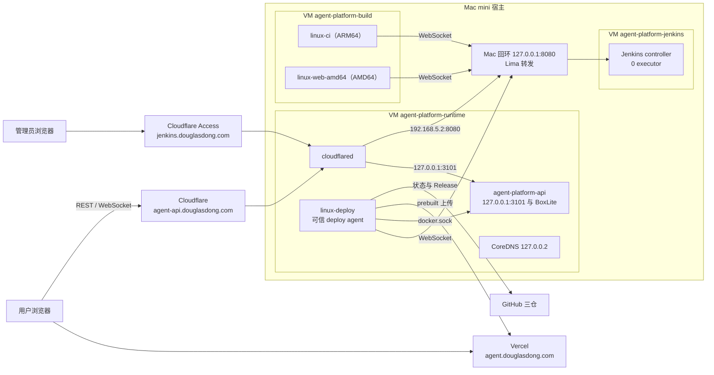

# 生产架构

- **读者**：运维、发版人与做架构评审的人。
- **用途与边界**：说明本项目生产环境（一台 Mac mini）由什么组成、为什么这样设计；不含操作步骤，端口、卷、凭据等数值见 [参考表](./参考表.md)。
- **权威范围**：组件清单、各类构建的执行位置、信任边界、隔离与暴露面事实、自动启动链。
- **适用基线**：v0.3.6（主仓 `7eb7176`，API `1a28712`）起；各项当前是否生效见 [运维记录](./运维记录.md)。

## 1. 拓扑



- 浏览器从 Vercel 加载前端，再直连 `agent-api.douglasdong.com`；API 只放行 HTTPS Origin 白名单里的来源。
- 公网请求都经 [Tunnel](./README.md#术语表) 进入 runtime VM，生产链路不需要 Mac 对局域网或公网开放端口。
- VM 内的 `192.168.5.2`（容器内名 `host.lima.internal`）就是 Mac 本机。三个 agent 经它连接 Lima 转发到 Mac 回环的 controller，Tunnel 也经它把 `jenkins` 主机名接到 controller。
- runtime VM 上的 API、Tunnel 与 deploy agent 都用同一 VM 内的 CoreDNS（DoH 到 Cloudflare），以避开宿主代理对普通 DNS 返回的 fake-IP。

## 2. 组件清单

| VM（[profile](./README.md#术语表)） | 容器                                           | 作用                                                                    | 创建与归属                                              | 监听                                         | 资源上限           |
| ------------------------------------- | ---------------------------------------------- | ----------------------------------------------------------------------- | ------------------------------------------------------- | -------------------------------------------- | ------------------ |
| `agent-platform-jenkins`              | `agent-platform-jenkins-controller-controller-1` | Jenkins 2.580.1 controller，73 个锁定插件，0 executor，中文界面       | compose 项目 `agent-platform-jenkins-controller`        | VM 内 `127.0.0.1:8080`，Lima 转发到 Mac 同端口 | 1.5 CPU / 1536 MiB |
| `agent-platform-build`                | `agent-platform-linux-ci-agent-1`              | [CI agent](./README.md#术语表) `linux-ci`：后端、文档与跨仓浏览器门禁 | compose 项目 `agent-platform-linux-ci`                  | 无                                           | 2 CPU / 3 GiB      |
| `agent-platform-build`                | `agent-platform-linux-ci-web-1`                | CI agent `linux-web-amd64`：Web 门禁与 Vercel prebuilt（经 Rosetta）    | 同上                                                    | 无                                           | 2 CPU / 4 GiB      |
| `agent-platform-runtime`              | `agent-platform-api`                           | 生产 API，内嵌 BoxLite SDK 0.9.7；privileged 加 `/dev/kvm`              | 发布工具 `api-container.mjs` 用 `docker run` 创建，不归 compose | `127.0.0.1:3101`（VM 的 host 网络）    | 6 CPU / 14 GiB     |
| `agent-platform-runtime`              | `agent-platform-tunnel`                        | cloudflared，路由在 Cloudflare 控制台远程维护                           | compose 项目 `agent-platform-runtime`                   | 指标 `127.0.0.1:20241`                       | 0.5 CPU / 256 MiB  |
| `agent-platform-runtime`              | `agent-platform-dns`                           | CoreDNS，经 DoH 解析外部域名                                            | 同上                                                    | `127.0.0.2:53`                               | 0.25 CPU / 128 MiB |
| `agent-platform-runtime`              | `agent-platform-linux-deploy`                  | [可信 deploy agent](./README.md#术语表)：发现、发布、API 替换、镜像构建与监控 | 同上                                            | 无                                           | 2 CPU / 2 GiB      |

注：
- 所有容器的重启策略都是 `unless-stopped`，日志为轮转的 `json-file`（每份 10 MB，jenkins 与 build 保留 3 份，runtime 保留 5 份）。
- runtime 上的四个容器都用 VM 的 host 网络；这里的 host 指 Linux VM，不是 Mac。
- 卷与 compose 命令见 [参考表](./参考表.md) §4–§5，VM 规格见参考表 §8，已停用的 lab controller 等遗留见参考表 §11。

## 3. 各类构建在哪跑

| 构建                                       | 执行位置                                                   | 触发                                  | 说明                                                       |
| ------------------------------------------ | ---------------------------------------------------------- | ------------------------------------- | ---------------------------------------------------------- |
| API 后端门禁（`agent-platform-native-ci`）  | build VM，`linux-ci`                                       | 发现作业；API 作业的子作业            | 11 个阶段，不构建也不推送镜像                              |
| Web 门禁与 AMD64 production prebuilt       | build VM，`linux-web-amd64`                                | 发现作业；统一发布的子作业            | 前端在本机完成生产构建，Vercel 只接收产物；AMD64 经 Rosetta 运行，QEMU 用户态模拟跑不起 Chromium |
| 文档与跨仓浏览器验收（`agent-platform-contract`） | build VM，`linux-ci`                                 | 发现作业；Web 与发布的子作业；每天 03:00 | 真实浏览器 → 编译后的 Nest → 新建的 SQLite              |
| API 镜像（Linux ARM64）                    | runtime VM 的 Docker，经 deploy agent 的 `docker.sock`      | API 作业                              | 与生产 API 共用 daemon 与磁盘；镜像不推送，打包进 Release  |
| 沙箱镜像（两档，amd64 与 arm64）           | runtime VM 的 Docker（buildx，临时 context 名 `agent-platform-runtime`） | `agent-platform-sandbox-images` | 推送到 GHCR；同样与生产共用资源                          |
| CI 与 deploy agent 镜像                    | build VM；deploy 镜像经 `docker save` / `load` 送到 runtime | 人工：升级脚本                        | 见 [发版手册](./发版手册.md) §4                            |
| controller 镜像                            | jenkins VM，按 lab 方式构建并在 `127.0.0.1:18080` 验证     | 人工                                  | 见 [发版手册](./发版手册.md) §2                            |
| DNS 镜像（`deploy/containers/dns/`）       | 只存在于 runtime VM 本地                                    | 人工                                  | 没有对应的发布作业                                         |

controller 不执行任何构建，所有作业都在三个 agent 上运行。作业运行的是 agent 镜像里固定安装的工具（`/opt/agent-platform/tools`），仓库 checkout 只作为钉住的构建输入。

## 4. 发布流水线（概念）

[统一发布](./README.md#术语表) 的单位是 [三仓组合](./README.md#术语表)：三个仓库 `main` 的 head（经 `git ls-remote` 读取）。主仓的 [gitlink](./README.md#术语表) 不参与发布，也不被校验。实际部署了哪个组合，以 `release-manifest.json` 与 GitHub Release 正文里的三个 SHA 为准。

1. [发现作业](./README.md#术语表) 每 2 分钟比较当前组合与已发布组合，不同就排一次统一发布。
2. 生成计划：固定三个 SHA，并预留版本号（自动取 `v0.3.<现有最大 patch + 1>`）；同一组合重试时沿用计划与版本号。
3. Web 作业完成门禁与 AMD64 prebuilt，并调用 contract 子作业做跨仓验收；验收结果可被重试复用。
4. API 作业：确认两个 SHA 仍是 `main` head → 跑 native-ci → 构建并打包 ARM64 镜像 → 替换生产 API（下文）。
5. 上传 Vercel prebuilt 并提升到正式域名，打包下载资产，以草稿上传 GitHub Release，逐个校验 SHA256 后正式发布。

替换生产 API 的过程：先确认 [生产空闲](./README.md#术语表)，写入 [维护屏障](./README.md#术语表) 并观察 10 秒安静窗口，再停止旧容器、把整个 `/data` 打包成备份、用 `docker run` 起新容器。新容器 readiness 与 Docker `healthy` 都通过后才解除屏障，并记录部署结果。新版本就绪失败时自动恢复数据与旧容器；恢复也无法确认时，保留锁与 [checkpoint](./README.md#术语表) 等人工核查。

由此得出几条行为：
- 只合并 Web：API 镜像身份不变，结果为 `current`，不替换 API。
- 合并 API 仓或主仓：生成新的 API 镜像（镜像身份含 `ROOT_SHA`），要等生产空闲后替换，API 中断约 1.5 分钟。
- API 作业不是 `SUCCESS` 时，不发前端也不发 Release；发现作业下一轮重新排队，没有退避。
- API 已替换而前端阶段失败时，会出现“新 API + 旧前端”的窗口，下一轮补齐；因此 API 改动要兼容上一版前端。

各阶段的执行节点、产出与失败表现见 [发版手册](./发版手册.md) §1，状态含义见 [参考表](./参考表.md) §10。

## 5. 信任边界

| 边界                    | 控制                                                                                                      |
| ----------------------- | --------------------------------------------------------------------------------------------------------- |
| PR 代码与生产           | CI agent 没有生产凭据和 Docker socket，只持有自己的 agent 连接密钥（只读卷）                              |
| 可信 deploy agent       | 独占私有卷与 runtime 的 `docker.sock`；只处理三仓 `main` 与 API 的镜像标签，从不运行 PR 代码             |
| 构建工具来源            | 作业只运行 agent 镜像内的固定工具；改工具要升级 agent 镜像才生效                                          |
| Jenkins controller      | 0 executor，关闭入站 agent 端口（agent 走 WebSocket）；唯一管理员账号、禁止注册、开启 CSRF                |
| 公网 Jenkins            | Cloudflare Access（邮箱一次性验证码）→ Tunnel 源站校验 Access JWT → Jenkins 账号登录，三道检查            |
| GitHub                  | `main` 的必需状态绑定专属 GitHub App；管理员同样受保护规则约束；仓库互动只限协作者                        |
| Vercel                  | 只上传已验收的 prebuilt，不在远端构建；发布前核对项目、团队、部署状态与别名                               |
| 生产 API                | 只监听 runtime VM 的 `127.0.0.1:3101`；只信任来自回环的 Cloudflare 头；HTTPS Origin 白名单、访问口令与 Secure cookie |
| 凭据                    | 只在 Mac 私有目录与 VM 私有卷中；不进镜像、命令参数、日志或下载包                                         |
| Mac 上的运维工具        | 账号、HOME 与宿主路径只从系统账户库与固定的相对布局推导（`host-layout.mjs`），不读环境变量；运维账号独占私有目录（0700）、私有文件（0600）与三个 Colima socket（0600）；可执行文件只认 root 与运维账号能写的位置；Jenkins 凭据只发给运维账号持有的回环监听 |

具体设置（状态名、App 权限、到期日）见 [参考表](./参考表.md) §9，凭据清单见 §6，宿主布局的推导与检查见 §12。

## 6. 隔离与暴露面

### 6.1 BoxLite 0.9.7 实际生效的隔离

只有代码确实应用的设置才算保护；`box_config` 里写着、但 0.9.7 没有应用的不算。

| 方面             | 实际状态                                                                                              |
| ---------------- | ----------------------------------------------------------------------------------------------------- |
| 主边界           | KVM 硬件虚拟化，加 bwrap 的 user、pid、ipc、uts、mount 命名空间；不含 net，shim 与 API 共用 VM 的 host 网络 |
| 附加限制         | `--clearenv`、NoNewPrivs、打开文件数 1024、单文件 1 GiB                                               |
| shim 身份        | kuid 0，在自己的 user namespace 内持有全部 capability；配置里的 uid/gid 65534 未被应用（上游 #73）    |
| seccomp          | 联网 VM 不加载 VMM 过滤器（上游 #848）；外层 API 容器为 privileged，也没有 seccomp 与 AppArmor        |
| Landlock、chroot | 未应用                                                                                                |
| cgroup           | 委派成功后每个 box 在 `/sys/fs/cgroup/boxlite/<id>`，只强制 `pids.max=1024`，停止时用 `cgroup.kill` 回收 |
| CPU 与内存       | 只受 vCPU 数、客体内存与 API 容器的 6 CPU / 14 GiB 约束                                               |
| 端口             | API 只为镜像声明的端口建映射；平台镜像不声明端口，auth helper 与任务都不发布端口                      |

注：
- BoxLite 按端口号建映射、忽略 `hostIp`，发布的端口一律监听通配地址，所以“不发布”是唯一可靠的做法。
- 端口映射在创建 box 时写定；v0.3.6 之前创建的 box 再启动仍沿用旧映射，直到销毁重建。
- 当前通过的容器策略是 privileged 加 `/dev/kvm`；只给 `SYS_ADMIN` 的尝试被 bwrap 的 proc mount 拒绝，最小权限尚未证明。

### 6.2 cgroup 委派

Docker 的私有 cgroup namespace 只把 controller 委派到容器根，而容器根的 `cgroup.subtree_control` 为空，PID 1 也在根里，BoxLite 因此给每个 box 记 `Cgroup setup failed`。API 入口在加载 API 之前调用 `api-cgroup.mjs`：把根 cgroup 的进程迁到叶子 `/api`，再向根写 `+cpu +memory +pids`，遇 `EBUSY` 有限次重试。委派失败只打一行 `cgroup-delegation status=… reason=…` 并照常启动，box 退回没有 cgroup 的状态。

委派后，`docker exec` 与 HEALTHCHECK 的进程加入 `/api`；CPU 按 cgroup 分配，API 叶子与 BoxLite 子树权重相同。关闭委派用 `runtime.env` 里的 `API_CGROUP_DELEGATION=off`，不要回退代码：`api-cgroup.mjs` 已在 [CONTAINER_INPUTS](./README.md#术语表) 里，钉住的主仓缺它时构建会失败。关闭步骤见 [运维手册](./运维手册.md) §7。

```sh
# Mac，任意目录（dk 见参考表 §0）；期望看到 status=enabled leaf=/api
dk runtime logs agent-platform-api 2>&1 | grep cgroup-delegation
```

### 6.3 Lima override 的原因

任何 VM 都能经 `192.168.5.2` 访问 Mac 回环；[hostagent](./README.md#术语表) 又会把 VM 内的监听转发到 Mac。全局 [Lima override](./README.md#术语表) 因此拦下四类转发：

| 拦截对象                    | 原因                                                                                       |
| --------------------------- | ------------------------------------------------------------------------------------------ |
| 3101（生产 API）            | API 信任回环对端带来的 `CF-Connecting-IP`；转发到 Mac 后，任一 VM（包括跑 PR 代码的 build VM）都能绕过 Cloudflare 直达 API |
| 20241（Tunnel 指标）        | 同上                                                                                       |
| VM 内绑在 `0.0.0.0` 或 `::` 的监听 | 例如 BoxLite 的随机端口，否则会出现在 Mac 的所有网卡上                              |
| 53                          | Colima 的 dnsmasq 绑 `127.0.0.1:53`，hostagent 只能经 `*:53` 的 [伪回环](./README.md#术语表) 转发，局域网可达 |

不能加“忽略全部端口”的规则：Jenkins 的 8080 与各 VM 的 `docker.sock` 都依赖转发。规则原文见 [参考表](./参考表.md) §8，修改流程见 [运维手册](./运维手册.md) §4。hostagent 只在 VM 启动时读取 override，所以改动要等该 VM 下次启动才生效。

### 6.4 剩余暴露面的通用规则

- 任一 VM（包括运行 PR 代码的 build VM）都能经 `192.168.5.2` 访问 Mac 回环上的所有服务。
- 因此 Mac 回环上不要运行无鉴权的服务；新建的 VM 同样适用这条规则。
- VM 内需要给 Mac 用的端口，只发布在 VM 的 `127.0.0.1` 上（如 `docker run -p 127.0.0.1:…`）。
- 宿主上现有服务的清单属于攻击面信息，只记在[私有笔记](./README.md#术语表)里。

## 7. 自动启动链

1. 三个系统 LaunchDaemon（每个 profile 一个）在开机时以运维账号（由 host-layout 推导，见 [参考表](./参考表.md) §12）运行 `colima --profile <p> start --foreground`；参数见参考表 §8。
2. 前台进程一直运行；它异常退出时，launchd 按 `KeepAlive.SuccessfulExit=false` 与 `StartInterval=60` 重新拉起。
3. VM 启动后，Docker 按 `unless-stopped` 恢复容器：controller、两个 CI agent、deploy agent、dns、tunnel 与 API。
4. agent 用 WebSocket 重连 controller，Tunnel 重连 Cloudflare，服务恢复。

注：
- 启动项用私有 `DOCKER_CONFIG` 并带 `--activate=false`，不改 Mac 用户默认的 docker context。
- 只执行 `colima stop` 而不结束前台进程时，launchd 认为任务仍在运行，不会拉起 VM；重启 VM 的正确做法见 [运维手册](./运维手册.md) §3。
- 应用、Tunnel 与 Jenkins 的生命周期都属于 Docker；Mac 上不再运行原生的应用守护进程。

## 8. 已知限制

| 限制                                 | 影响                                                       |
| ------------------------------------ | ---------------------------------------------------------- |
| 最小权限未证明                       | API 容器为 privileged 加 `/dev/kvm`                        |
| 单机、单盘                           | 生产数据、备份与发布缓存都在 runtime VM 的同一块盘上       |
| 构建与生产共用 runtime 的 Docker     | API 与沙箱镜像构建会占用生产 VM 的 CPU、内存与磁盘         |
| 没有告警                             | 监控作业跑在 runtime VM 上，runtime 故障时监控也停         |
| 冷启动未演练                         | 整机断电后的无人值守恢复未经证明                           |
| 含数据库迁移的发布没有放行入口       | 带 drizzle 迁移的 API 会停在 `waiting-migration-review`    |
| API 镜像身份含主仓 SHA               | 纯文档合并也会替换一次 API                                 |
| build VM 的 DNS 依赖 jenkins VM      | 重启 jenkins VM 时 build VM 约 1 分钟无法解析域名          |
| deploy agent 写死 docker 组 GID 991  | 重建 VM 后 GID 变化会让发布失败                            |

每项的现状、负责人与期限见 [运维记录](./运维记录.md) §3。
