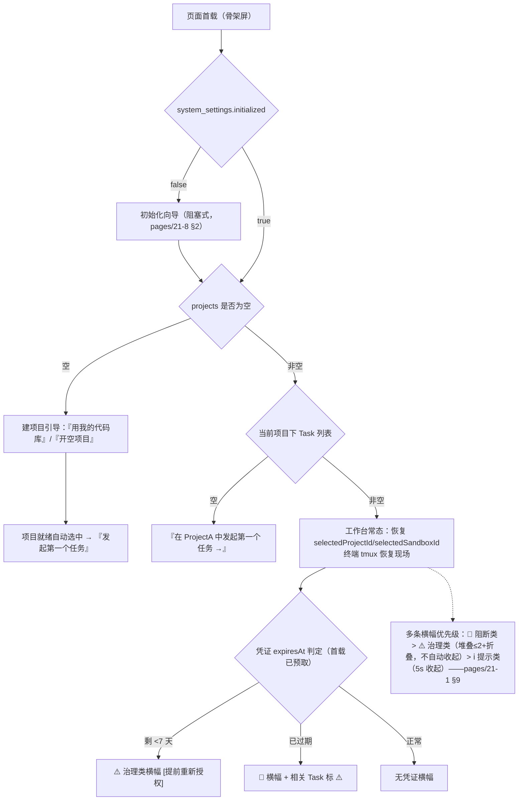
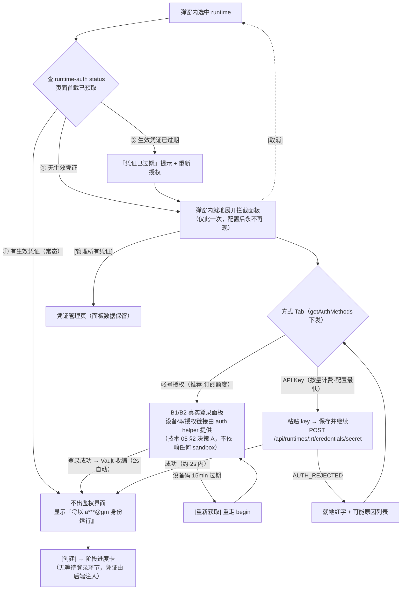
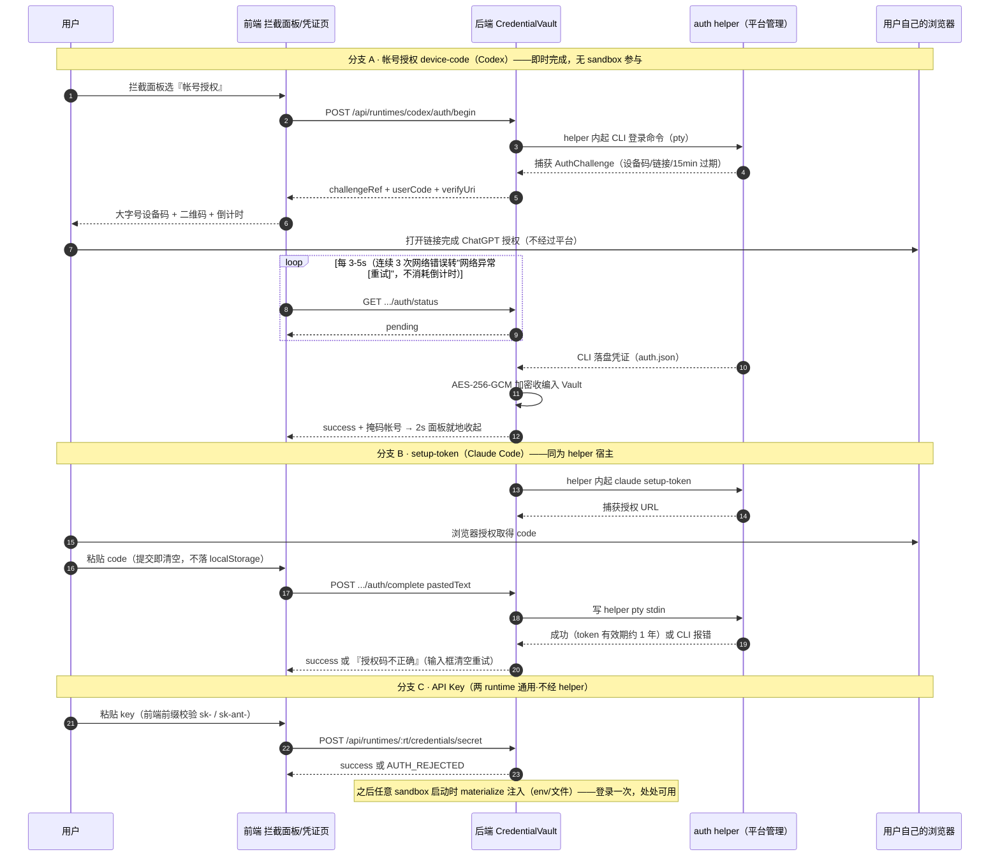
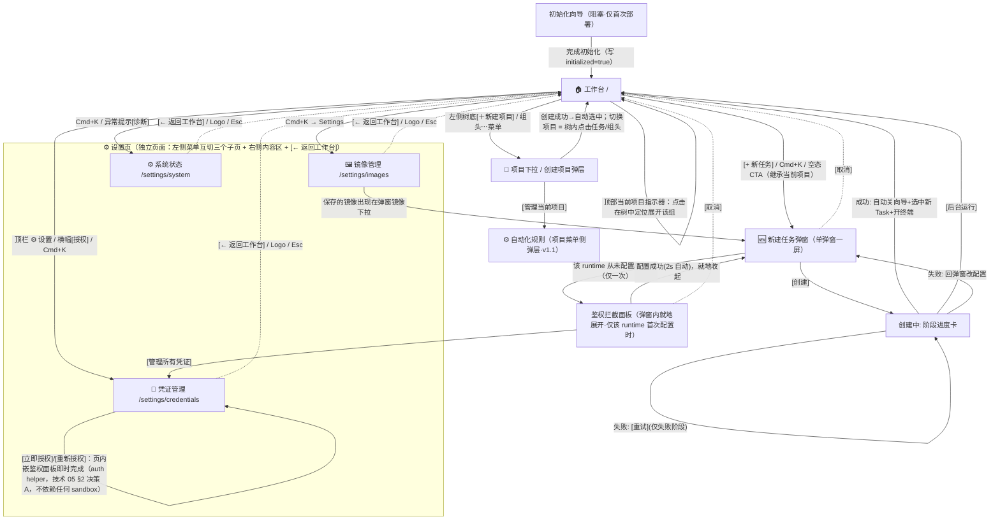

# P20 - 核心使用链路（首次进入 → 发起 Task → 选择 Runtime → 鉴权存取）

> 状态：✅ 可评审
> 定位：整个产品**最主干的一条链路**的完整定义，每一步都给出「用户所见 → 前端落点 → API → 后端流转」的前后端一体路径。UI 细节见 [P21](./21-页面信息架构与交互.md)，异常分支见 [P22](./22-异常场景与产品补充要求.md)。

## 0. 先立概念：Task 是产品的第一概念

技术文档以 sandbox 为中心，但**用户来这里不是为了"管理 sandbox"，而是为了"让一个 agent 干活"**。产品层把这次发起定义为 **Task**：

> **Task = 选定一个 runtime（Codex / Claude Code），在一个 sandbox 中发起的一次工作会话。**

| Task 形态 | 用户交互方式 | 超时与回收 | 技术映射 |
|---|---|---|---|
| **交互式会话**（MVP 默认） | 右侧 xterm 终端里直接与 agent CLI 对话；**可携带可选的初始任务指令，启动时即执行** | idle 空闲回收（默认 30min，可配）；硬超时 24h | sandbox + `spawn({tty:true})` 终端会话 + 可选 `initialPrompt`。**「启动时即执行」由后端在创建流程里保证**（技术 03 §4.3 的 `bootstrapAgentSession`）——**与用户有没有打开终端无关**：关掉浏览器照样执行，MCP 创建的 Task 也照样执行；打开终端时看到的是**已在执行中的会话**（文档 06） |
| **无头任务**（v1.1，与 MCP 同源） | 填 prompt，看流式输出与结果 | **硬超时**：30min/1h/2h/4h（可配，决策 5）；超时转 failed | `run_agent_task`（RuntimeTaskSpec，文档 02 §5 / 04 §3） |

**Task 与 sandbox 的关系**：一个 Task 落在一个 sandbox 里执行；sandbox 是资源载体（可复用——stopped 的 sandbox 重启后可发起新 Task），Task 是用户的意图单元。MVP 阶段 Task 不需要独立的后端实体——它是「创建/复用 sandbox + 起会话」的**产品语义包装**，左侧列表以 Task 视角呈现（"我的任务"而非"容器列表"）。

**Task 挂靠在 Project（项目）下**：Project = 工作区（git 仓库或空目录）+ Task 集合的容器（两种来源：clone git URL / 空项目，完整规格见 [pages/21-6](./pages/21-6-项目管理.md)）。层级为 `Project → Task → sandbox`。Project 不动摇 Task 的第一概念地位——它是分组与共享上下文，不是新的操作中心；凭证与镜像仍然全局、与项目无关。**工作区隔离采用混合方案**：MVP 默认每个 Task 独立副本（发起时克隆/复制项目工作区到专属卷——agent 大量改文件，共享卷并发写不可接受），项目级"协作共享卷"开关 v1.1 提供。

## 1. 主链路总览

```
首次进入              发起 Task（单弹窗一屏，继承项目上下文）  运行观察                结束
┌──────────┐   ┌──────────────────────────────┐   ┌─────────────┐   ┌──────────┐
│ 先建项目  │   │ ① 选 Runtime（Codex/Claude） │   │ 终端交互     │   │ Stop     │
│ (克隆 git │ → │  ⚡仅首次使用该 runtime 时插入  │ → │ (或无头输出) │ → │ (卷保留)  │
│  或空项目)│   │   无编号的「一次性全局登录」    │   │ 状态实时推送 │   │ 或 销毁   │
│ 项目就绪  │   │   拦截面板（之后永不再现）      │   │             │   │ 后续可复用│
│→"发起任务"│   │ ② 确认配置（默认值直发）→ 创建 │   │             │   │ 重启再发起│
└──────────┘   └──────────────────────────────┘   └─────────────┘   └──────────┘
```

设计原则：**鉴权是全局配置一次的事，不是任务创建的流程环节**——新建任务就是一个弹窗一屏，流程里没有鉴权环节。仅当所选 runtime 从未配置凭证时，插入一个**无编号的一次性拦截面板**（"首次使用 Codex：完成一次全局登录——此后所有任务自动使用该凭证"），完成后永不再现；用户不需要先理解"什么是凭证管理"，被拦一次顺手配完，全局生效。**项目采用"上下文先行"**——弹窗继承工作台当前项目作为「项目」行的默认值（可改选、可就地新建，见 §3.2），**不设独立"选项目"步骤**（默认值哲学：同一项目连发多个 Task 时零重复决策）。

---

## 2. (a) 第一次进入页面能看到什么

### 2.1 冷启动状态矩阵

| 状态 | 判定 | 用户看到 |
|---|---|---|
| **未初始化**（首次部署） | system_settings.initialized != true | **初始化向导**（阻塞式：出网检测 → 代理配置 → 资源确认，pages/21-8 §2），完成后进入下一行 |
| **全新实例**（无项目） | projects 空 | **建项目引导**（pages/21-6 §5）：「第一步：为你的代码建一个项目」→ [用我的代码库]（git URL 克隆，私有仓引导配 Git 凭证）/ [开空项目] → 项目就绪自动选中 → 「发起第一个任务」 |
| 有项目、无 Task | 当前项目下列表空 | 简化引导：「在 ProjectA 中发起第一个任务 →」（凭证已就绪时一步直达向导） |
| 有 Task | 任一项目下有 Task | 工作台常态：顶部当前项目指示器 + 左侧**全部项目分组任务树**（状态点，当前组高亮展开），右侧自动恢复上次选中终端（selectedSandboxId/selectedProjectId 持久化，文档 15 §3.5）；凭证过期预警横幅 |




> 交互链路图：补充自 2026-08 三方评审（已按决策 1-6 修订）

### 2.2 前后端一体链路（页面首载）

| 步骤 | 用户所见 | 前端落点 | API | 后端流转 |
|---|---|---|---|---|
| 1 | 页面骨架 + loading | `app/page.tsx` → `SandboxListContainer` | — | — |
| 2a | 项目切换器 | `useProjects`（Query `['projects','list']`） | `GET /api/projects` | 项目列表 + 各项目 Task 数聚合（文档 13 projects 表） |
| 2b | 列表或空态 | `useSandboxList`（Query `['sandboxes','list',{projectId}]`，文档 15 §2.1） | `GET /api/sandboxes?project_id=` | SandboxApplicationService.list → SQLite（文档 13） |
| 3 | 各 runtime 登录徽标 | `runtimeKeys.list()`（首载一次拉全） | `GET /api/runtimes`（聚合端点：runtime 列表 + 各自凭证状态掩码，P22 §4.11） | CredentialVault 聚合查有效凭证 → 掩码元数据（永不回明文）；单 runtime 的 `GET /api/runtimes/:rt/credentials/status` 保留给重授权后的局部刷新（05 §3） |
| 4 | 状态开始实时化 | `services/ws/sandboxEvents` 订阅 | WS `/events` | Outbox → `sandbox.*` 事件推送（文档 10 §3 / 13 §2） |
| 5 | （有 sandbox 时）终端自动恢复 | terminal registry 重建连接（文档 08 §5） | WS `/terminal?socket_session_key=` | tmux re-attach（文档 06 §6） |

---

## 3. (b) 怎么发起一个 Task

### 3.1 入口（三处，同一向导）

1. 空态主 CTA「发起第一个任务」；
2. 侧栏列表顶部「+ 新任务」常驻按钮；
3. `cmdk` 快捷面板（Cmd+K → "new task"）。

### 3.2 新建任务弹窗（单弹窗一屏）

> ★ **本轮修订：从「两步向导」改为「单弹窗一屏」。** 那个两步壳**从未被实现**——
> `21-2 §3` 列的 20 个组件里 15 个不存在，`currentModal==='wizard'` 与 `/new` 路由
> 都是它留下的化石。而**两步之间的鉴权闸门是真建成的**（§5），所以本轮丢的是壳、
> 留的是闸门：凭证缺失时闸门在弹窗内**就地展开**。
>
> 一屏放得下：runtime / provider / **分支** / 指令，其余全有默认值——"默认值哲学"
> （见本节末）本来就意味着用户要决策的东西不足以撑起两步。分支是本轮新增的那一层。

**项目归属**：★ **本轮定案——弹窗内不放项目下拉，两个弹窗不嵌套**（P21-2 §9.0）。任务归属 = 左侧树上**已选中**的项目（"上下文先行"），弹窗顶部只做只读回显「在 ProjectA 中发起」。

想给另一个项目建任务：先在树上切过去。多一次点击，换掉一层嵌套弹层与一条 `wizardReturn` 往返保值链路——**两个弹窗、两个交互**，而不是"一个交互带分支"。

**Runtime 选择区** —— 见 §4。

**一次性全局登录拦截面板** —— 仅所选 runtime **从未配置凭证**时在弹窗内就地展开，见 §5；配置一次全局生效、永不再现。已有生效凭证时弹窗就是干净的一屏（显示"将以 ✉️ a***@gmail.com 身份运行"，鉴权零感知）。

**弹窗全貌**：

```
┌─ 新建任务 ───────────────────────────────────┐
│ Runtime: Codex        身份: a***@gmail.com    │
│ 项目:   ProjectA（只读·继承自左侧树）          │
│ 分支:   main ▾（本地引用，留空=基线分支）      │
│ 模式:   ◉ 交互式终端   ○ 无头任务(v1.1)       │
│ 任务指令 (可选):                              │
│ ┌─────────────────────────────────────────┐   │
│ │ 分析这个仓库的架构并输出摘要…            │   │
│ │ （可选；填了则 agent 启动时即执行）      │   │
│ └─────────────────────────────────────────┘   │
│ 镜像:   AIO（默认）▾                          │
│ ▸ 高级选项（隔离等级 aio/boxlite、自定义镜像、  │
│            idle 回收时长）——默认折叠           │
│ 预计耗时: 同镜像 ~20s / 首次拉镜像 1–2min      │
│                          [取消]  [创建]       │
└──────────────────────────────────────────────┘
```

要点：**默认值哲学**——用户真正必须决策的只有 runtime；**任务指令是唯一鼓励填写但不强制的输入**（可选）；镜像/隔离等级全部有合理默认（AIO 镜像 / aio provider），资源分配由后端根据镜像 resource_defaults 和调度策略自动决定，用户不感知配额；高级选项折叠；鉴权不占步骤（全局一次性），常态发起就是"打开弹窗 → 创建"。

### 3.3 发起后的前后端一体链路

| 步骤 | 用户所见 | 前端落点 | API | 后端流转 |
|---|---|---|---|---|
| 1 | 点击[创建]，弹窗变阶段进度卡 | `useCreateSandbox` mutation（乐观插入列表项，状态"准备中"） | `POST /api/sandboxes { projectId（左侧树所选）, runtime, image, provider, branch?, initialPrompt? }` | 校验镜像（04 §7 validate）→ SchedulerQueue → **资源自动分配**（后端根据镜像 resource_defaults 和调度策略，用户无感）→ 返回 202 + sandbox 记录（pending） |
| 2 | 进度条逐阶段更新：✅ 初始化 → 🔄 拉取镜像 → 🔄 **准备工作区** → 🔄 **启动实例**（**装 runtime CLI、注入凭证、起 agent 会话都发生在此阶段**，03 §4.3；镜像未预装 CLI 时此阶段会显示「正在安装 …」子文案并可能持续十几分钟，P22 §2） | WS 事件驱动 `setQueryData` patch（15 §2.3） | WS `sandbox.status_changed` | provider.create/start（aio/boxlite）+ **项目工作区独立副本挂载专属卷**（pages/21-6 §9）+ `CredentialVault.materialize + injectCredential`（05 §4）；状态机逐步转移并事务双写（03 §4 / 13 §3） |
| 3 | 状态转 🟢，右侧终端自动打开并聚焦 | terminal registry 新建 Terminal + ptySocket 连接（08 §5） | WS `/terminal` | `spawn({tty:true, cmd: buildAttachCommand()})` → tmux 内起 agent CLI（06 §3） |
| 4 | 终端展示：**若填了任务指令**则回显内容 + agent 开始执行；**若未填**则显示 agent CLI 欢迎界面等待用户输入 | `TerminalContainer` 渲染 xterm，接收 pty 数据 | data 帧流 | pty 输出 16ms 批量转发（06 §7）。**注意：会话在第 2 步的「启动实例」阶段就已经起好并开始执行**（03 §4.3 ⑤），本步只是 attach——所以打开终端时可能已经有一屏输出 |
| 失败 | 阶段进度卡就地变红 + 人话原因 + [重试] | mutation onError 回滚乐观项（15 §2.4） | 错误码 | 资源登记回滚 + status=failed（03 §3，错误语义见 P22） |

---

## 4. (c) 发起时怎么选择 Codex / Claude Code

### 4.1 选择卡片（弹窗内的 Runtime 区）

```
┌─ Runtime 区（弹窗内）─────────────────────────────────┐
│                                                        │
│  ┌─ Codex ─────────────┐  ┌─ Claude Code ───────────┐  │
│  │ OpenAI · ChatGPT 订阅│  │ Anthropic · Claude 订阅  │  │
│  │ ✅ 已登录 a***@gm…   │  │ ○ 首次使用需完成一次      │  │
│  │                     │  │   全局登录（约 1 分钟）    │  │
│  │ 上次使用 ✓          │  │                          │  │
│  └─────────────────────┘  └──────────────────────────┘  │
│                                                        │
│  ▸ 更多 runtime 由管理员通过 registry 注册后出现在这里    │
│                                                        │
└────────────────────────────────────────────────────────┘
```

### 4.2 选择逻辑

| 规则 | 说明 |
|---|---|
| **鉴权状态前置可见** | 每张卡片直接显示该 runtime 的凭证状态（✅ 已登录掩码帐号 / ○ 未登录 / ⚠️ 已过期）——用户在选择时就知道选它是"秒过"还是"要登录一分钟"，不会走到半路被拦 |
| 记住上次选择 | 上次用过的 runtime 默认高亮（persist，15 §3.5） |
| runtime × 镜像联动 ⏳ | 弹窗内的镜像下拉**选项来源 = 镜像管理已启用镜像**（21-4），按所选 runtime 过滤（`supportedRuntimes`，21-4 §9）；**默认平台默认镜像 AIO**；镜像管理中禁用镜像 → 弹窗下拉自动移除；新注册镜像通过验证 → 下拉出现。**⚠️ 档的镜像仍可选**，选项旁就地显示后果：「未预装 claude-code，创建时需现装，实测约 12.5 分钟」（21-4 §9）。✅ **镜像上下文后端已实现**（本句此前写的是「整块未实现，`image` 只是自由字符串入参」，现在是反的）：`image` 入参现在必须指向一张**已注册**的镜像，门口按 `is_active` + `validationStatus != invalid` 逐行判。⏳ 仍未落地的是**弹窗里那个下拉本身**（`/settings/images` 路由与镜像 container 都还没有，21-4 §0） |
| **镜像坐标不在发起链路里解析** | 下拉里选中的是一张**注册时已钉定 digest** 的镜像，创建时按那个 digest 拉，**不重解 tag**——所以「同一个镜像发两次 Task」一定是同一份字节；上游重推同一 tag 不会无声改变下一个 Task 的行为，要更新得去镜像管理点 [检查更新]。裁决与被否方案见 21-4 §5 ★ |
| runtime 列表来源 | `GET /api/runtimes`（registry 注册的全部 RuntimeAdapter），第三方注册的 runtime 自动出现——卡片文案来自 adapter 元数据，前端零改动（04 §8） |
| 双 runtime 并行 | 不同 Task 可各选各的 runtime，互不影响；同一 sandbox 只绑定一个 runtime |

---

## 5. (d) 鉴权的存与取怎么做

### 5.1 鉴权拦截层：三分支判定（不是向导步骤——全局配置一次）

```
选定 runtime（如 Codex）
        │
        ▼ 前端查 ['runtime-auth','codex','status']（页面首载已预取，§2.2）
┌───────┴────────────────┬───────────────────────┐
▼ ① 有生效凭证           ▼ ② 无生效凭证           ▼ ③ 生效凭证已过期
不出现任何鉴权界面，      插入无编号拦截面板         "凭证已过期"提示 +
不出现任何鉴权界面，      「首次使用 Codex：完成一次  [重新授权] → 走②流程，
"将以 a***@gm 身份运行"   全局登录」，完成后自动进   成功后旧记录标记吊销
                         就地收起，**此后永不再现**
```

拦截面板正文必须明示一次性语义："只需配置一次，此后所有任务（包括其他项目）自动使用该凭证。"

分支②覆盖两种来源：**从未配置**，以及**生效凭证被吊销后的「无生效凭证」态**（吊销场景见 P22）——两者都强制走闸门完成配置才能继续。

闸门界面顶部是**方式切换 Tab：「帐号授权（推荐）」/「API Key」**（可用方式由 runtime 的 `getAuthMethods()` 下发）。两种方式的取舍向用户一句话讲明：**帐号授权使用订阅额度；API key 按量计费、配置最快**。

**模式是二选一、全局生效的**：在闸门中选择并完成配置的方式即成为该 runtime 的**当前生效模式**（`runtime_settings.active_auth_method`，技术 05 §4）；之后所有 Task 都按此模式注入，直到用户在凭证管理页显式切换。两类凭证可同时留存——切换只改"谁生效"，切回无需重新登录。




> 交互链路图：补充自 2026-08 三方评审（已按决策 1-6 修订）

### 5.2 「存」：凭证怎么进来、放在哪

| 环节 | 产品表达 | 技术落点 |
|---|---|---|
| 帐号授权的执行位置 | 用户全程只在**自己的浏览器**完成 OAuth（页面文案明示："平台不接触您的密码"） | 登录**由后端 helper 容器跑**（常驻或按需唤起，对应 Codex/Claude Code 的 CLI），平台代理设备码/授权链接到前端，成功后凭证落 Vault（技术 05 §2）。**两种模式都在拦截面板内即时完成**——面板不再等待任何 sandbox；凭证一旦写入 Vault，后续发起完全无感。 |
| Codex（oauth-device） | 大字号设备码 + 链接 + 二维码 + 15 分钟倒计时，页面自动轮询到"✅ 登录成功"（后端轮询 CLI stdout） | `POST /api/runtimes/codex/auth/begin` → helper 启动 CLI 登录命令 → 后端捕获设备码 → 返回前端 → 前端轮询 `/auth/status` → helper 捕获 code → CLI 落盘凭证 → Vault 收编 → 返回 success |
| Claude Code（setup-token） | 展示授权链接 → 用户浏览器授权 → 把 code 贴回输入框（密码遮罩，提交即清空）→ "✅ 配置完成" | `POST /api/runtimes/claude-code/auth/complete { pastedText }` → 后端直接向 Claude Code 服务验证 token → Vault 加密收编 → 返回 success |
| **API key（两 runtime 通用）** | Tab 切到「API Key」→ 粘贴 key（密码遮罩）→ [保存并继续]，**即时完成、无需等待 sandbox**；附计费说明一句 | `POST /api/runtimes/:rt/credentials/secret` → Vault 加密 → 构造 env 凭证（05 §3.1） |
| 存放 | 用户视角只有一句话："凭证已加密保存，本机所有任务共享" | 所有模式均 **AES-256-GCM 加密**入库（05 §4 / 13 §2 credentials 表，`obtained_via` 区分来源：oauth-device / setup-token / api-key）；发起 Task 时后端 `materialize(credentialRef)` 注入环境 |

### 5.3 「取」：凭证怎么被复用

| 场景 | 用户体验 | 技术落点 |
|---|---|---|
| 之后每次发起同 runtime 的 Task | **完全无感**：拦截面板永不再现，创建时自动注入 | `materialize(credentialRef)` 写回新 sandbox 的凭证路径（05 §4） |
| 复用范围 | 单机全局共享（无用户体系；多用户隔离是 v2 的 `owner_ref` 预留，13 §2） | — |
| **模式开关（二选一，全局生效）** | 同一 runtime 两类凭证可留存，但**同一时刻只有一个模式生效**——用户在凭证管理页显式切换（◉/○ 单选），切换后所有后续 Task 按新模式注入（已运行 Task 不受影响，下次启动生效）；切到未配置的模式会先引导补配 | `PUT /api/runtimes/:rt/auth-mode` + `runtime_settings.active_auth_method`（05 §4 / 13 §2） |
| 查看 | 设置 → 凭证管理：每条只显示 runtime + 掩码帐号 + 有效期 + 最近使用时间，**没有任何"查看明文"入口** | 状态接口永不回明文（05 §4） |
| 过期 | 剩余 < 7 天全局黄色横幅；过期后相关 Task 卡片标 ⚠️，发起新 Task 走 §5.1 分支③ | `expiresAt` + WS `runtime-auth.status_changed` 推送（10 §3） |
| 吊销 | 凭证管理页[吊销]（二次确认，列出受影响的运行中 Task） | revoke：擦除密文、保留审计元数据、联动清除已注入文件（05 §4 / 13 §2） |

### 5.4 鉴权全链路时序（前后端一体，无 sandbox 参与）

```
拦截面板(首次配置)  前端                后端（helper）                    Vault
     │ 点击"登录 Codex"  │                    │                              │
     │──────────────────▶│ POST /auth/begin    │                              │
     │                   │───────────────────▶│ 启动 CLI 登录命令 （不经 sandbox）  │
     │                   │                    │◀── 返回设备码 ───────────────│
     │ 显示设备码/链接 ◀──│◀── success────────│                              │
     │                   │                    │                              │
     │ 用户自己浏览器完成 OAuth（完全不经平台）│                              │
     │                   │                    │ 监听 CLI 输出           │
     │                   │ 轮询 /auth/status ▶│◀── 检测到 token 落盘 ────│
     │ "✅ 配置完成" ◀────│◀── success────────│ Vault 收编 ─────────────▶│
     │ 面板就地收起       │                    │                              │
```

---




> 交互链路图：补充自 2026-08 三方评审（已按决策 1-6 修订）

## 6. 运行观察与结束（Task 生命周期 · 决策 2 卷保留）

- **交互式 Task**：终端即工作区；断线自动重连 + tmux 恢复现场（06 §6 / 08 §3）；多标签开多个会话（06 §5）。
- **无头 Task**（v1.1）：输出面板流式渲染 `RuntimeEvent`（04 §3 parseOutput），完成显示 exit 状态。

### Task 生命周期三阶段（决策 2）

```
运行中(🟢)
    ↓ [Stop]
卷保留中(⏸️) ← 资源释放，卷保留，可重启（快）
    ↓ 30天自动过期
    ├→ [销毁]（用户主动，二次确认）
    │   ├→ ☐ 保留工作区卷（默认勾选：进项目菜单查看）
    │   └→ [确认销毁]（卷永久删除）
    └→ auto-cleanup：30天后卷自动删除（成果归档后）
```

**Stop（暂停）**：资源立即释放、卷保留，列表转 ⏸️ 状态，可重启（快于冷建，重用 sandbox 底板）；后续发起新 Task 时开**新的 agent 会话**（对话上下文不保留，工作区文件保留——文案必须明示，P22 §2）；idle 回收自动转 Stop（03 §4，阈值 30min 可配）。

**Destroy（销毁）**：弹层二次确认，默认 ☐ 保留工作区成果卷（不勾选才永久删除）；销毁时缓存卷 + 临时卷自动删除（P22 §4.2）。保留的卷在**项目菜单**可见为"已保留卷"（可再次**下载**/重新删除，v1.1）。⚠️ 「**恢复**」本轮**不做**：它的语义还没裁——新建一个 Task 挂这个卷？覆盖某个现有工作区？来源项目已删除时怎么办（`sandbox_id` 是弱引用、归档后会置 NULL）？三个问题的答案会决定端点形态，先定语义再做。

**Auto-Cleanup（30天自动清理）**：保留的卷>30天自动删除（支持 3/7/30 天可配，P21-7 §3.2 自动化规则的"成果保留期"一致）；删除前可选择**打包下载**整个工作区卷（v1.1 成果导出）。⚠️ **不做 diff 导出**（2026-08-31 定案）：agent 的常规工作流就是改完自己 `git commit`（本平台跑的正是 Claude Code / Codex），那时 `git diff` 是**空的**——用户会下到一个0 字节的「成果」，而 agent 明明干了活，属于「不报错、有文件、内容是空的」那类最坏失败；空项目（`sourceType:'empty'`）更是连基线都没有，diff 无从谈起。而工作区卷本身就是一份**完整可用的工作副本**（含 `.git` 与全部历史），解压即可继续干。

## 7. 其他链路（简版）

| 链路 | 步骤 | 详见 |
|---|---|---|
| 注册自定义镜像 ⏳ | 设置 → 镜像管理 → 提交 URI → validate 分级反馈（✅/⚠️/❌）→ **保存即把 tag 钉定为一个 digest** → 出现在新建任务弹窗的镜像下拉。✅ **后端八个端点已实现**、digest 真解真冻结；⏳ 缺的是页面（pages/21-4 §0） | pages/21-4、技术 04 §7 |
| **更新一张已注册镜像** ⏳ | 镜像管理 → 该卡片 [检查更新]（重解 tag 比对 digest）→ 有变化则给新旧 digest + 新的三级结论对比 → [更新到新版本] 才生效。**平台不自动跟随 tag**；新版本验证 ❌ 时保留当前版本。✅ 后端两个端点都在（`:id/check-update` 与 `:id/activate`，后者同时是回滚）；⏳ 缺的是页面 | pages/21-4 §5 ★、§6 |
| MCP 无头消费 | 上层 agent 连 MCP → create_sandbox → 事件感知 → run_agent_task → destroy | 技术 02 §5 |
| **自动化（v1.1）** | 项目菜单 → 自动化规则（名称 + prompt + 简化预设调度）→ 定时触发标准无头 Task（硬超时默认 2h，规则可配）→ 运行历史/成果查看 + **webhook 失败通知（v1.1）**；触发时刻的边界决策（凭证过期跳过、资源不足重试、上次未完 skip、宕机 missed 不补跑、连续失败先降频再禁用） | pages/21-7 |
| 日常运维 | 列表巡检 → 异常人话提示 → 处置（重试/Stop/销毁） | P22 |

## 8. 页面跳转总图（跨页面导航的唯一权威）

> 页面自身的规格见 [P21](./21-页面信息架构与交互.md) 及 `pages/` 逐页文档；本节只管"页面之间怎么跳"。

### 8.1 跳转图



### 8.2 跳转触发条件表

| 来源 | 目标 | 触发 | 前置条件 | 可返回 |
|---|---|---|---|---|
| 工作台 | 新建项目弹窗 | 左侧树底 [＋ 新建项目] / 组头⋯菜单（**唯一入口——不再从任务弹窗内进**） | — | ✅（关闭） |
| 工作台 | 项目菜单侧弹层 | 树组头 hover「⋯」 | — | ✅（关闭） |
| 项目创建弹层 | 工作台 | 创建成功（克隆完成）自动选中新项目 | — | — |
| 工作台 | 新建任务弹窗 | [+ 新任务] / Cmd+K / 空态 CTA | **须已有选中项目**（无项目时先走建项目引导） | ✅（取消） |
| 初始化向导 | 工作台 | 完成初始化（仅首次部署，阻塞式） | system_settings.initialized != true | —（完成前无法进入工作台） |
| 工作台 | 凭证/镜像/系统 | 顶栏 ⚙️ 设置菜单 / 横幅按钮 / Cmd+K → Settings | — | ✅（[← 返回工作台]/Logo/Esc） |
| 项目菜单（组头⋯） | 自动化规则侧弹层 | [⚙️ 自动化规则]（v1.1） | — | ✅（关闭侧弹层） |
| 新建任务弹窗 | 鉴权拦截面板 | 选 runtime（仅一次） | 该 runtime 从未配置或已过期 | ✅ |
| 拦截面板 | 回弹窗 | 配置成功（此后永不再现） | 后端 status=success | —（自动） |
| 拦截面板 | 凭证管理 | [管理所有凭证] | — | ✅（面板数据保留） |
| 新建任务弹窗 | 进度卡 | [创建] | 配置完整（默认值即完整） | ❌（创建已触发；取消=终止并自动回收资源，需确认） |
| 进度卡 | 工作台 | 成功 / [后台运行] | — | 成功自动；后台运行进度延续在列表项 |
| 进度卡 | 新建任务弹窗 | 失败回弹窗改配置 | — | ✅ |
| 凭证管理 | 页内嵌鉴权面板 | [立即授权]/[重新授权]（帐号授权类） | **无前置**——登录流跑在 auth helper（§5.2 / 技术 05 §2 决策 A），页内即时完成，不依赖也不创建任何 sandbox | ✅ |
| 凭证管理 | 页内 API key 面板 | [添加 API Key]/[更换] | **无任何前置**（不经 sandbox，05 §3.1） | ✅ |
| 任何页面 | 工作台 | Logo / Cmd+K "Home" / 浏览器返回 | — | — |

### 8.3 URL 与深链策略

| 页面 | 路由 | 深链参数 | 刷新恢复 |
|---|---|---|---|
| 工作台 | `/` | `?taskId=<id>`（自动选中并开终端，可分享；所属项目随之切换） | ✅ selectedSandboxId + selectedProjectId persist + URL 双源 |
| 新建任务弹窗 | **弹层为主**（不占路由） | ⏳ `/new` 深链未实现（`app/new/page.tsx` 不存在） | 弹层刷新即关闭（可接受权衡） |
| 凭证管理 | `/settings/credentials` | — | 列表重新请求 |
| 镜像管理 | `/settings/images` | `?filter=warning` | 搜索词 localStorage 恢复 |
| 系统状态 | `/settings/system` | — | 实时数据无状态 |

### 8.4 全局逃逸与弹层分层

- **两个万能逃逸**：Logo 点击（任何页面回工作台）+ Esc（分层关闭）。
- **Esc 分层规则**：最上层是 confirm 对话 → 只关 confirm；是 modal → 关 modal 回底层页面；是侧栏/面板 → 关面板；否则无动作。
- **modal 不堆叠**：新建任务弹窗内需要去凭证管理时**替换为路由页面**（保留浏览器后退），不嵌套 modal；吊销 confirm 是唯一允许的 modal 内二级弹层。<br>★ 本轮**取消了「创建项目弹层可嵌在任务弹窗内」这条例外**——两个新建弹窗彼此独立（P21-2 §9.0），例外与 `wizardReturn` 一并消失。
- 环境类错误 toast 一律带 [诊断] action → 系统状态页。

### 8.5 状态恢复规则（刷新 / 关标签重开 / 断线）

| 场景 | 行为 |
|---|---|
| 刷新（工作台） | 恢复上次选中 Task + 重建终端连接，tmux 恢复现场 |
| 刷新（新建任务弹窗中途） | 弹窗关闭回工作台，重开即可（拦截面板中的配置若后端已完成则不再出现——凭证已入 Vault） |
| 关标签页重开 | 前端实例必然全部重建（JS 堆已销毁）；Task 后台不受影响；点选终端时重建 WS + 新 xterm 实例，现场由 tmux 恢复（技术 06 §6） |
| 终端 WS 断线 | 黄条 + 指数退避重连 → tmux re-attach；持续失败转"连接超时 [手动重连]"（P22 §2） |
| WS /events 断线 | 列表角标"数据可能非最新"，45s 轮询兜底自动降级（技术 15 §2.2） |

## 9. 对技术方案的反向要求（本链路暴露的缺口）

1. **`GET /api/runtimes`**（runtime 列表 + 卡片元数据 + 各自凭证状态聚合）——技术文档未定义此端点，需补充到 02 的 REST 面。
2. **auth helper 编排**（5.2 决策 A）：后端需提供常驻或按需唤起的 auth helper 执行环境，用于跑 CLI 登录流（device-code/setup-token，技术 05 §2）；拦截面板内即时完成鉴权，创建流程不存在等待登录节奏——两种模式都完成于弹窗内就地展开的一次性面板，进度卡直接进入"初始化"阶段。
3. **Task 视角的列表文案**：列表项主标题用"runtime + 创建时间/自定义名"（如 "Codex · 昨天 14:32"），弱化 sandbox/容器措辞。
4. **projects 端点族**：`GET/POST/DELETE /api/projects`、`GET /api/sandboxes?project_id=`——需补进 02 的 REST/MCP 面（MCP 侧相应加 `list_projects`/`create_project` tool）。
5. **git clone 流程**：后端异步克隆（进度经 WS 事件推送）、工作区存储位置、失败错误码（仓库不可达/非公开）——需在技术侧设计（03/13 补充）。
6. **工作区独立副本准备**：Task 创建流程新增"准备工作区"阶段——把项目工作区克隆/复制到 Task 专属卷再挂载（04 §2.4 VolumeMount 面已支持，需要平台侧编排逻辑 + 状态机是否加 `preparing-workspace` 细分态待技术评估）。
7. **数据层**：13 需加 projects 表 + sandboxes.project_id 外键（已在 13 §2 落地）。
8. **「等待输入」状态判定**（决策 4，MVP）：后端/网关需提供 pty 输出静默检测（静默 >N 秒且末行匹配提示符启发式）→ 上报 `waiting-input` 子状态经 WS 推送，驱动列表 🔵 等待输入 展示（P21 §2.1）——需补进技术 03/06。
9. **自动化 webhook 通知（v1.1）**：automations 表加 webhook_url + trigger_on 字段（13 §2），失败/成功按配置 POST；无头 Task 硬超时（默认 2h，规则可配 30min/1h/2h/4h）超时转 failed 并计入连续失败——需补进技术 03。
10. **镜像坐标的可追溯性（2026-08 tag 漂移裁决的配套要求）**：镜像按注册时钉定的 `digest` 使用、由用户显式 [检查更新] 才换版本（pages/21-4 §5 ★）。更新是 **INSERT 一行新 manifest + 旧行下线**，不改旧行（13 §2.4.2 ★ / 23 I-IMG-7）——于是 `sandboxes.image_ref` 指向的行永不变，**「这个 Task 当时跑的是哪张镜像」天然可答**，不需要在 sandbox 侧额外存 digest。⚠️ 本条初版曾要求「sandbox 侧固化发起时刻的 digest」，那是在给「就地换 digest」这个**已被推翻的**裁决打补丁，随该裁决一并撤销。**仍然缺的是 [检查更新] 的端点**（重解 tag、只比对 digest、不落库）——现有 `POST /api/images/:id/validate` 是"对已钉定 digest 重跑校验"，语义不同不能顶替，需补进 10 §6 与 27 §6。完整缺口清单见 pages/21-4 §11。
