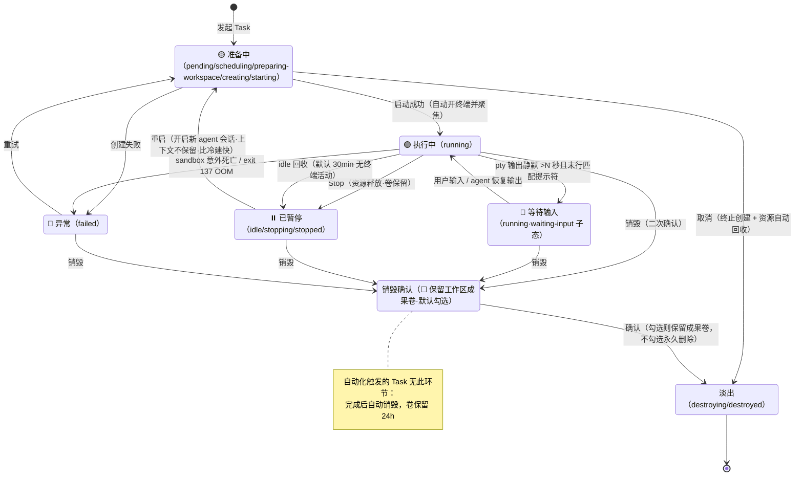

# P21 - 页面信息架构与交互（总览 + 逐页索引）

> 状态：✅ 可评审
> 本篇是页面层总览；**每个页面的完整规格已拆分到 `pages/` 子目录**（统一模板：页面目标 / 进入方式 / 布局线框 / 组件清单 / 状态矩阵 / 交互细节 / 数据依赖 / 退出路径 / 边界规则）。流程链路权威定义见 [P20](./20-核心使用链路.md)（主链路 §1-3、选择逻辑 §4、鉴权流程 §5）。

## 1. 页面清单与逐页规格索引

| 页面 | 路由 | 一句话职责 | 细化规格 |
|---|---|---|---|
| 工作台 | `/` | 主工作区：Task 列表 + 终端 + 全局横幅 | [pages/21-1-工作台](./pages/21-1-工作台.md) |
| 发起任务向导 | modal（深链 `/new`） | 两步发起：选 runtime → 确认（第一次使用 runtime 时插入无编号鉴权拦截面板），+ 进度卡 | [pages/21-2-发起任务向导](./pages/21-2-发起任务向导.md) |
| 设置·凭证管理 | `/settings/credentials` | 掩码查看 / 重授权 / 吊销 | [pages/21-3-凭证管理](./pages/21-3-凭证管理.md) |
| 设置·镜像管理 ⏳ | `/settings/images`（**后端已就绪，路由尚不存在**） | 注册 OCI 镜像 / 验证分级 / 启停 | [pages/21-4-镜像管理](./pages/21-4-镜像管理.md)（实现状态见其 §0） |
| 设置·系统状态 | `/settings/system` | 资源水位 / provider 健康 / 一键诊断 | [pages/21-5-系统状态](./pages/21-5-系统状态.md) |
| 项目管理 | 左侧任务树 + 弹层（无独立路由） | 项目创建（树底/确认步）/ 切换（树内点击）/ 删除（组头⋯菜单）；Task 的容器 | [pages/21-6-项目管理](./pages/21-6-项目管理.md) |
| 自动化（v1.1） | 项目菜单内侧弹层（无独立路由） | 定时唤起无头 Task：规则 CRUD / 简化预设调度 / 运行历史 | [pages/21-7-自动化](./pages/21-7-自动化.md) |
| 部署与初始化 | 首次冷启动向导 + 21-5 内区块 | 私有化部署：出网检测/代理/资源确认、访问口令(v1.1)、升级备份(v1.5) | [pages/21-8-部署与初始化](./pages/21-8-部署与初始化.md) |

导航结构：

```
工作台 /（绝大多数时间停留）
├── 顶部: 当前项目指示器【📁 ProjectA】(点击树内定位) + 全局横幅位 + cmdk + ⚙️设置
├── 左侧: 全部项目分组任务树（组头折叠/⋯菜单 + 树底[＋新建项目] + 新任务/搜索/过滤）
├── 右侧: 选中 Task 的终端（多标签）/ 空态引导
└── 弹层: 发起任务向导（modal）· 项目创建/管理弹层
设置 /settings/{credentials, images, system}（独立页面，隐藏任务侧栏）
├── 左侧: 设置菜单（凭证管理 / 镜像管理 / 系统状态 互切）+ [← 返回工作台]
└── 右侧: 当前子页内容区
```

独立鉴权页在 v1.1 前不存在——鉴权是向导 Step 1 和 Step 2 之间的无编号拦截面板（仅该 runtime 首次配置时，两种模式都即时完成，P20 §5）；凭证管理页做查看/吊销/重授权入口（页内即时完成，auth helper）。

## 2. 跨页面共享的可视化规范

### 2.1 状态可视化（12 个技术状态 → 6 个用户状态）

**技术状态机顺序**（后端 scheduler）：`pending → scheduling → preparing-workspace → creating → starting → running`（决策 P0-1）  
**用户界面展示顺序**（向导进度卡分段名）：「初始化」→「拉取镜像」→「准备工作区」→「启动实例」  
**状态→展示格子映射**：`pending→初始化` | `scheduling→初始化` | `preparing-workspace→准备工作区` | `creating→拉取镜像` | `starting→启动实例`

> 注：技术状态机顺序与用户显示顺序刻意不同——后端技术实现上先备工作区再建实例，但在进度卡向用户展示时采用"拉镜像→准备工作区→启动"的自然感知序（技术 03 §4.0 详述理由）；两个顺序在各自领域都是最优的。

| 用户状态 | 技术状态（技术 03 §4） | 视觉 | 可用操作 |
|---|---|---|---|
| 🟡 准备中 | pending / scheduling / preparing-workspace / creating / starting | 脉冲黄点 + 阶段进度 | 取消 |
| 🟢 运行中 | running（正在执行） | 稳定绿点 | 终端 / Stop / 销毁 |
| 🔵 等待输入 | running（waiting-input 子态：pty 输出静默 >N 秒且末行匹配提示符——**MVP，决策 4**） | 稳定蓝点 + "等待你的输入" | 终端输入 / Stop / 销毁 |
| ⏸️ 已暂停 | idle / stopping / stopped | 灰方块（idle 标"空闲回收"） | 重启（快）/ 销毁 |
| 🔴 异常 | failed | 红点 + 人话原因（P22 §1） | 重试 / 销毁 |
| （淡出） | destroying / destroyed | 淡出动画后移除 | — |




> 交互链路图：补充自 2026-08 三方评审（已按决策 1-6 修订）

### 2.2 凭证状态三态（卡片徽标 / 横幅 / 列表标记三处联动同源）

`✅ 已配置（掩码）` / `○ 未配置` / `⚠️ 已过期或失效`（<7 天为黄色预警态）。
凭证**类型徽标**双轨：`🎫 帐号授权（订阅额度）` / `🔑 API Key（按量计费）`；同 runtime 两类可留存，但**模式二选一、[生效中] 徽标唯一**，在凭证管理页单选切换、全局生效（技术 05 §4）。

### 2.3 镜像验证三级

`✅ 有效` / `⚠️ 可用但有警告（附后果说明）` / `❌ 无效（附 errors + 查看要求链接）`。

三处联动同源（卡片徽标 / 注册弹窗结果区 / 向导镜像下拉的选项旁说明），规格见 [P21-4 §5](./pages/21-4-镜像管理.md)。三条跨页必须共同遵守的口径：

| 口径 | 内容 |
|---|---|
| **⚠️ 档目前只有一种** | 「未预装 `claude-code`，创建时需现装，**实测约 12.5 分钟**」（04 §7 ★ 实测 753 秒）。⚠️ 早期文档里的例子「缺 tmux → 不支持断线现场恢复」**已失效**：tmux 于 2026-08 由「建议」升为「必须」，缺它的镜像整档移进 ❌（`IMAGE_TMUX_MISSING`），**不可能再出现在警告档**。中间档不是装各种小毛病的筐，新增警告要同步回 P21-4 §5 |
| **⚠️ 不阻断** | 三级不是二级——warning 档的镜像**仍可选、仍可保存**，只是在选项旁就地显示后果说明；❌ 才阻断 |
| **绿勾属于 digest，不属于 tag** | 三级结论描述的是注册时**钉定的那个不可变镜像坐标**，不会随时间失效；会漂移的是"tag 现在还指向不指向它"，由 P21-4 的 [检查更新] 回答（裁决与理由见 P21-4 §5 ★） |

> **实现状态（2026-08 复核；本块此前写的是「整块未开工、digest 是硬编码占位」，那些话现在是反的）**：
> ✅ 后端已落地——8 个 `/api/images` operation、`images` / `image_manifests` 两张表、`digest` 由 `resolve()` 真解并冻结。
> ⏳ **`/settings/images` 路由仍不存在**，所以本节的口径**仍不是可验收的现状**（P21-4 §0）。

## 3. 全局交互约定（所有页面共同遵守）

| 约定 | 规则 |
|---|---|
| 破坏性操作 | 一律二次确认 + 明示后果（销毁=弹层含「☐ 保留工作区成果卷」默认勾选，不勾选才永久删除——决策 2；吊销=列受影响 Task） |
| 长操作 | 一律阶段化进度 + 预计耗时；>10min 卡住显示"⚠️ 可能卡住"+ 强制操作入口 |
| 键盘优先 | Cmd+K 全局面板（新任务/切 Task/设置）；Esc 分层关闭（P20 §8.4）；终端区快捷键不与全局冲突 |
| 暗色终端风格 | 全局默认暗色（shadcn OKLCH 定制，技术 07 §1）；终端区纯黑底 |
| 空状态 | 每个列表类界面必有空态设计（引导 CTA，不出现空表格） |
| 错误提示 | 永不裸抛错误码；一律"人话原因 + 行动按钮"（P22 §1）；环境类错误附 [诊断] |
| Task 措辞 | 面向用户的一切文案用 "任务/Task"，不出现 "sandbox/容器" |
