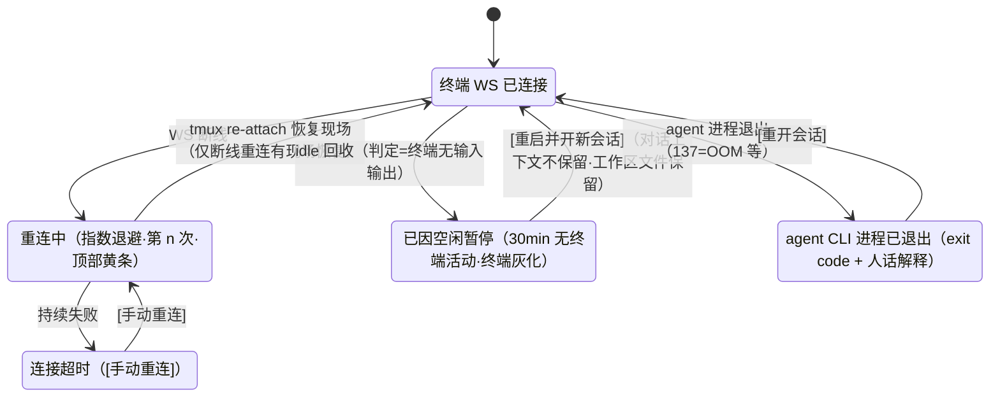
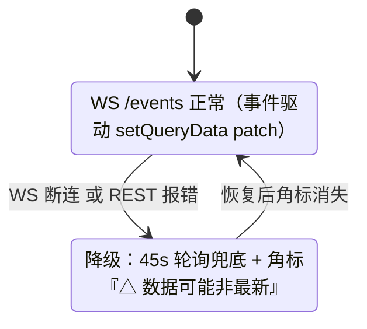

# P22 - 异常场景与产品补充要求

> 状态：✅ 可评审
> 关联：[P20 核心使用链路](./20-核心使用链路.md) · [P21 页面信息架构](./21-页面信息架构与交互.md)；错误码以技术 04 §4 为准

## 1. 错误码 → 用户语义映射

| 技术错误码 | 用户看到 | 恢复引导 |
|---|---|---|
| `RESOURCE_EXHAUSTED` | "❌ 当前任务较多，资源暂时不足" | [停止部分任务] / [稍后重试] |
| `IMAGE_PULL_FAILED` | "❌ 镜像拉取失败（网络或镜像名错误）" | [重试] / [检查镜像地址] |
| `MANIFEST_INVALID` | "❌ 镜像不满足平台约定" + 具体 errors（注册/重验证时给出；**2026-08 起「缺少 tmux」属于这一档**——tmux 已是必须项，缺它即无效镜像，不再是可保存的警告） | [查看镜像要求] |
| **`IMAGE_CONTRACT_VIOLATION`** | "❌ 镜像不满足平台约定（缺少 tmux），任务已停止"。**说明**：这张镜像注册时通过了校验，但真正启动时实测发现缺 tmux（镜像换了 tag 或上游变更）。Task 转 🔴，**不会退化成一个「能用但平台一重启就丢会话」的终端** | [换一张含 tmux 的镜像] / [查看镜像要求]；**不给 [重试]**（重试不会改变镜像内容） |
| **`INSTALL_FAILED`** | "❌ 运行时 CLI 安装失败（该镜像未预装，现装未成功）" | [重试] / [换一张预装该 CLI 的镜像]。**说明**：安装发生在「启动实例」阶段内，失败时 Task 转 🔴；未预装的镜像现装**可能耗时十几分钟**（实测 12.5 分钟），期间进度卡「启动实例」下会显示「正在安装 …」子文案，**不是卡死** |
| `PROVIDER_UNAVAILABLE` | "🔴 运行时无响应（容器服务未启动？）" | [运行诊断] |
| `TIMEOUT` | "⏱️ 操作超时" | [重试] / [强制停止] |
| `INVALID_STATE` | "⚠️ 当前状态不允许此操作" | 自动刷新后按新状态操作 |
| `AUTH_CHALLENGE_EXPIRED` | "⏳ 授权码已过期（15 分钟有效）" | [重新发起授权] |
| `AUTH_REJECTED` | 帐号授权："❌ 授权被拒绝或取消"；API key："❌ API Key 无效或无权限" | [重试] / [重新输入 Key]；附检查订阅/额度状态提示 |
| `UNSUPPORTED_METHOD` | （不应触达用户；触达即 bug 上报） | — |
| exit 137（OOM，事件层） | "内存不足被终止" | [重新发起任务] |

原则：**每条错误必须同时给「发生了什么（人话）」和「现在能做什么（按钮）」**，禁止裸抛错误码。

## 2. 链路级异常场景

### 项目阶段

| 场景 | 表现 | 处置 |
|---|---|---|
| git clone 失败·网络/URL 类 | 创建弹层就地红字："仓库不可访问：检查 URL 或网络" | [重试] / [改为空项目] |
| git clone 失败·权限类（401/403/permission denied） | "克隆失败：无权访问该仓库" | [配置 Git 凭证] → 凭证管理 Git 分区 → 配置完成回弹层 [重试克隆]（后端错误码必须区分权限类与网络类） |
| SSH 主机指纹首次连接 | 自动信任并记录指纹（21-3 §10 决策） | 指纹在凭证详情可核对 |
| clone 超时（大仓库） | 进度态持续显示已下载量；>10min 提示"⚠️ 仓库较大或网络缓慢" | [继续等待] / [取消] |
| 删除项目 | 二次确认列出级联后果："将删除该项目下 N 个 Task 及其数据卷（保留的成果卷除外）" | 确认后级联销毁 |
| 工作区副本准备失败（磁盘不足等） | 进度卡"准备工作区"阶段红 | [重试] / 磁盘不足时引导清理（诊断入口） |

### 发起 Task 阶段（P20 §3.3 失败分支）

| 场景 | 表现 | 处置 |
|---|---|---|
| 资源不足 | 阶段进度卡第一步即红："当前任务较多，资源暂时不足" | [停止部分任务] / [稍后重试] |
| 拉镜像超时/失败 | 第二步红 + 网络提示 | [重试]（已完成的初始化不重跑）；连续失败提示检查代理（§3） |
| **运行时 CLI 现装耗时过长**（镜像未预装） | 「启动实例」格子下出现子文案「正在安装 claude-code…」并持续数分钟至十几分钟 | **不是卡死，不弹「可能卡住」标签**（该标签的 10min 计时只针对无子文案的停滞）；超过预期可 [强制停止] 后换一张预装该 CLI 的镜像 |
| **运行时 CLI 安装失败** | 「启动实例」阶段红 + "运行时 CLI 安装失败" | [重试] / [换镜像]（§1 `INSTALL_FAILED`） |
| 创建整体 >10min | "⚠️ 可能卡住"标签 | [强制停止]（二次确认），资源自动回收 |
| 用户中途关页 | 创建继续在后台进行 | 回来后列表如实显示当前阶段（状态机在后端，13 §3） |
| 无头 Task 超时（v1.1决策5） | 运行到配置超时时间（默认 2h，30min/1h/2h/4h 可配）后，Task 转 🔴 failed + "任务超时，执行已终止"（计入连续失败计数） | 自动化规则连续失败≥3 次**先降频为每日一次**，降频后再连续失败 7 次才自动禁用（21-7 §5）；列表 [重新发起] + [更改超时] |

### 终端使用阶段

| 场景 | 表现 | 处置 |
|---|---|---|
| WS 断线 | 终端顶部黄条"正在重连…（第 n 次）"，指数退避 | 恢复后 tmux 重绘现场；持续失败转"连接超时 [手动重连]" |
| Task 被 idle 回收 | 终端灰化 + "已因空闲暂停（30min 无终端活动）。**重启会开启新的 agent 会话，之前的对话上下文不会保留；工作区文件已保留**" | [重启并开新会话]（文案不得暗示"恢复现场"——tmux 现场恢复仅适用于断线重连，不适用于回收后重启） |
| agent CLI 进程退出 | 终端显示 exit code + 人话解释（137=OOM 等） | [重开会话] / [查看完整日志] |
| sandbox 意外死亡 | 列表转 🔴 + WS 推送即时反映（04 §6 watchEvents） | 详情展示 reconcile 原因（13 §4） |

**未映射错误码的兜底**：任何未进入本表的错误码显示「操作失败（错误码 XXX）[重试] [运行诊断]」——绝不裸抛。toast 停留时长：无 action 4s、含 action 8s。

> 交互链路图：补充自 2026-08 三方评审（已按决策 1-6 修订）

### 鉴权阶段（P20 §5 分支）

| 场景 | 表现 | 处置 |
|---|---|---|
| 设备码 15 分钟过期 | 倒计时归零 → "已过期" | [重新获取授权码]（重新走 begin） |
| 用户浏览器侧取消授权 | 轮询返回 `AUTH_REJECTED` | 提示 + [重试] |
| 粘贴的 code 无效 | CLI 报错被捕获 | "授权码不正确，请重新复制"（输入框清空重试） |
| 凭证剩余 < 7 天 | 全局黄色横幅 + 凭证页黄字 | [提前重新授权]（成功后无缝替换，运行中 Task 下次启动生效） |
| 凭证已过期 | 红色横幅 + 相关 Task 标 ⚠️ | 发起新 Task 时走闸门分支③强制重授权 |
| 切换到未配置凭证的模式 | 后端 409 | 前端不直接报错：就地展开该模式配置面板，配置完成自动切换（P21-3） |
| 吊销生效中模式的凭证 | 该模式转不可用 | 确认弹层额外警示；吊销后引导切换到另一模式或转「未配置」态 |
| 凭证被吊销/过期后，运行中的 Task | 列表项标 **⚠️ 凭证已失效**（不改主状态）；终端顶部红条"该任务的凭证已失效，agent 将无法继续调用模型 [重新授权]" | 重新授权后新任务即时生效；运行中 Task 下次重启生效 |
| device-code 轮询遇网络错误 | 连续 3 次网络错误转"网络异常 [重试]"（不消耗设备码倒计时） | [重试] 恢复轮询 |

### 自动化触发阶段（v1.1，决策表详见 pages/21-7 §5）

| 场景 | 表现 | 处置 |
|---|---|---|
| 触发时凭证过期/吊销 | 跳过 + 历史记 `skipped/AUTH_EXPIRED` | 横幅"规则 X 因凭证过期已暂停 [重新授权]" |
| 触发时资源不足 | 排队重试（24min×5 次，≈2h 窗口） | 历史显示"资源临时不足，已排队（3/5）"；超限终态失败 |
| 上次触发未跑完 | 默认 skip | 历史记 `skipped/PREVIOUS_RUNNING` |
| 调度器宕机错过触发 | **不补跑**，记 `missed` | 历史可见；catchup 选项 v1.2 |
| 连续失败 ≥3 次 | 先降频（每日重试一次，🟡 + 横幅 + webhook）；降频后连续失败 7 次自动禁用 | 禁用后列表 🔴 + 横幅 + [重新启用]（启用清零计数） |

### 环境/部署阶段

| 场景 | 表现 | 处置 |
|---|---|---|
| 容器运行时不可达 | 全局红条 "🔴 运行时无响应" | [运行诊断]（§3） |
| WS /events 断连 | 列表标"数据可能非最新"角标 | 自动降级 45s 轮询兜底（15 §2.2），恢复后消失 |
| 网络受限（代理环境） | 拉镜像/授权链接失败集中出现 | 诊断脚本检测 + docker-compose 预留 `HTTP_PROXY`（技术 11） |

## 3. 诊断能力（一键自检）

`[运行诊断]` 触发后端自检并输出逐项结果：容器运行时连通性（aio）、/dev/kvm 可用性（boxlite）、磁盘余量、端口占用、外网连通（镜像仓库/授权域名）、WS 回环测试。每项 ✅/❌ + 修复建议命令。另提供 `./diagnose.sh` 脚本用于后端进程本身起不来的场景。

## 4. 产品补充要求清单（技术文档未定义的缺口，实现时逐项核对）

1. **空状态与首次引导**：工作台欢迎态三步引导卡（P20 §2.1）；凭证/镜像页空态 CTA。
2. **删除确认**：销毁 Task 二次确认，弹层含「☐ 保留工作区成果卷（默认勾选）」——不勾选才永久删除并明示（决策 2，pages/21-6 §9 同源）；吊销凭证列出受影响运行中 Task。
3. **长操作进度**：创建阶段化进度（含镜像拉取字节数）+ 预计/已耗时并显（P21 §3）。
4. **凭证过期提前提醒**：7 天阈值黄色预警（对应技术 05 §5 过期推送）。
5. **终端多标签**：Ctrl+Tab 切换（后端多路复用已支持，技术 06 §5）。
6. **资源信息只在运维视角**：任务列表与发起链路**不出现任何资源/配额概念**（后端自动分配）；系统资源使用情况仅在系统状态页（21-5）展示。
7. **API 限流语义**：MCP/REST 限流返回标准 code + `retryAfterSec`；⚠️ **技术缺口：限流实现未在技术文档定义，标记为 v1.5 技术项**。
8. **镜像注册反馈分级**：✅/⚠️/❌ 三级 + 具体后果说明（对应技术 04 §7 warning 机制）。
9. **关键数字预期管理**：所有耗时/阈值（创建耗时、idle 30min 默认、设备码 15min）UI 前置告知。
10. **诊断入口**：§3；环境类错误一律附带[运行诊断]按钮。
11. **`GET /api/runtimes` 端点**：⚠️ **技术缺口：P20 §4.2 需要的 runtime 列表 + 凭证状态聚合端点，需补进技术 02 的 REST 面**。
12. **auth helper 编排**：帐号授权登录流跑在平台 auth helper（技术 05 §2 决策 A），拦截面板/凭证页内即时完成；创建流程**不存在等待登录环节**（决策 1）。
13. **projects 端点族与 git clone 流程**：⚠️ **技术缺口**——`GET/POST/DELETE /api/projects`、按项目过滤 Task、异步 clone（进度 WS 推送）、工作区独立副本准备阶段（P20 §9 第 4–6 条，13 §2 已加表）。
14. **项目上下文一致性**：向导、列表、深链（`?taskId=`）三处的当前项目必须联动（选中 Task 自动切到其所属项目）。
15. **自动化技术缺口（v1.1）**：⚠️ 后端调度器（每分钟扫描 `(enabled, next_trigger_at)` + 宕机恢复按"missed 不补跑"语义）、**无头 Task 的 stdout/stderr 完整捕获与存储**（落盘/轮转/查询接口，RuntimeAdapter parseOutput 之外的原始日志链路）、automations 端点族（pages/21-7 §8；13 §2 表已落）。
16. **Git 凭证技术缺口（MVP）**：⚠️ clone 时凭证使用链路（SSH agent/临时密钥文件 vs HTTPS credential helper）、known_hosts 自动信任实现、`git ls-remote` 测试连接端点、错误码区分权限/网络类（P22 §2 依赖）、credentials 表扩展 kind 列（13 §2）。
17. **镜像参数技术缺口（MVP）**：⚠️ `image_config` 合并引擎（镜像→项目→Task 三层 + 凭证优先）、保留变量名黑名单校验、secret 值加密存取（同 Vault 密钥体系）、env 变量名/长度校验规则（pages/21-4 §10.5）。
18. **私有化部署技术缺口**：⚠️ `system_settings` 表 + 初始化端点（出网检测/代理配置/资源确认）、访问口令 Guard 实现（v1.1，NoopAuthGuard 替换）、备份导出（凭证密文默认不入包）、版本检查静默失败（pages/21-8 §6）。
