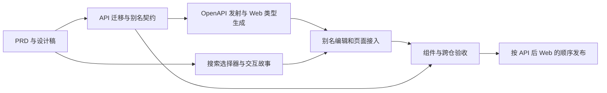

# 任务选择搜索与镜像别名

新建任务里的项目、分支和镜像改用可输入搜索的单选控件；镜像支持用户设置别名，选择时可按别名或真实坐标查找。已依据修订后的原 v2 设计稿完成前后端实现、数据库迁移、契约生成与验收。设计与规格见第 1–2 节，实施范围见第 4–7 节，实际执行证据见第 8 节；发布版本以主仓 CHANGELOG 和 GitHub Release 为准。

## 1. PRD 变更

| 用户需求                           | 本轮规则                                                                                                            | 权威规格                                                                                                          |
| ---------------------------------- | ------------------------------------------------------------------------------------------------------------------- | ----------------------------------------------------------------------------------------------------------------- |
| 项目用 shadcn select，支持输入搜索 | 使用 shadcn 可搜索单选 Combobox；按项目名称筛选现有候选，未就绪项目继续显示原因但不可选择；输入搜索词不改变已选项目 | [REQ-LCH-018](../requirements/LCH.md#REQ-LCH-018)、原有 REQ-LCH-001                                               |
| 分支同样支持搜索                   | 按完整分支名筛选所选项目的本地引用；独立保留「跟随项目当前的分支（默认）」；切项目重置分支与分支搜索词              | [REQ-LCH-018](../requirements/LCH.md#REQ-LCH-018)、原有 REQ-LCH-004                                               |
| 镜像设置别名，选择支持搜索         | 别名属于整张镜像，同仓库所有版本共享；按别名、仓库名、完整坐标和 tag 搜索；主行别名、辅助行真实坐标，重名可以区分   | [REQ-IMG-060](../requirements/IMG.md#REQ-IMG-060)、[REQ-IMG-061](../requirements/IMG.md#REQ-IMG-061)、REQ-LCH-018 |

别名可选，预制镜像与自定义镜像都能编辑。先拒绝原始输入中的 Unicode `Cc` 控制字符及 `U+2028/U+2029`，再去首尾空白；去空白后最多 64 个 Unicode 码点，空值表示清除。不同镜像允许同名。改别名只改展示信息，不改变坐标、digest、当前版本、启用状态、运行参数或任务引用。

项目、分支、镜像的搜索均在已加载列表中进行，不增加搜索 API，不联机搜索 Git 分支。只有选择已有候选才改变字段值；搜索词不提交、不写 URL、不保存到浏览器存储。禁用理由、镜像兼容性判断、默认项和原有任务发起规则继续生效。

注册新镜像可填写可选别名；注册表单未填写或仅填空白时省略 `alias`，保持既有重复注册语义。注册已有镜像或其新版本不得隐式改名或清除别名，应到镜像卡片独立编辑。别名编辑不触发镜像验证，也不使已验证的 URI 结论失效。

## 2. 设计稿与交互落点

设计基线为已有的 v2 全流程稿，来源与逐文件哈希见 [BASELINE.json](../../design/v2-base/BASELINE.json)。本轮从原稿接续：沿用侧栏、工作台和设置页外壳、512px 新任务弹层、纵向 Agent、指令计数、凭证区、页脚主按钮，以及单列镜像卡内的验证、运行参数、版本与全部既有操作。镜像状态筛选继续使用「全部／有效／警告／无效」。设计增量仅覆盖三个选择器的搜索和镜像别名；现有 Web 与原稿的其它差异另行记录。

- [可交互 HTML 设计稿](../../design/task-search-image-alias.html)：可直接用浏览器打开，包含新建任务、镜像管理、搜索与别名编辑、深浅主题及窄屏布局。使用示例数据，不向服务发请求，不代表生产组件已落地。
- [新建任务页面设计](../../frontend/pages/21-2-发起任务向导.md)：三个选择器的状态、默认项、键盘、焦点、输入法与数据边界。
- [镜像管理页面设计](../../frontend/pages/21-4-镜像管理.md)：别名主辅信息、注册与编辑、错误和保存行为。

静态预览：[新建任务搜索](../../design/task-search-new-task.png)、[镜像别名编辑](../../design/task-search-image-alias.png)。交互以 HTML 原型为准。

采用 [shadcn Combobox 的搜索式单选交互](https://ui.shadcn.com/docs/components/radix/combobox)。实现时按当前 Radix 栈确定兼容组合，封装统一控件；本轮不要求迁移全站基础组件。原型仅演示交互与视觉，不声称使用了真实生产组件或修改了 Figma 文件。

| 状态             | 设计结果                                                                                       |
| ---------------- | ---------------------------------------------------------------------------------------------- |
| 关闭             | 显示已选项；镜像保留辅助坐标，长文本换行或省略后可查看完整值                                   |
| 展开             | 聚焦搜索输入；候选列表有限高度并独立滚动，当前项有选中标记                                     |
| 有结果           | 大小写不敏感的子串匹配；项目保持原顺序，镜像不绕过兼容性与启用规则                             |
| 无结果           | 明确显示「没有匹配的项目／分支／镜像」及清除搜索入口；分支与预制镜像默认入口仍可见，已选值保持 |
| 命中不可选项     | 保留候选与原因；鼠标、键盘均不能提交该项                                                       |
| 创建中           | 锁定三个选择器，阻止重复提交；不以搜索 Enter 触发整个表单                                      |
| 别名保存中／失败 | 保存中锁定重复提交；失败原位说明并保留草稿，原已保存别名继续有效                               |

第一次 Esc 只关闭展开的选择器并返回触发控件；下一次 Esc 才按原规则关闭新建任务弹层。上下键与 Enter 选择可用项，Tab 正常移动焦点。中文输入法合成期间的 Enter 不选项也不发起任务。浮层层级、焦点陷阱与位置必须在真正的 Dialog 内验证，不能仅在独立故事里验证。

## 3. 实施前基线

基线根仓提交为 `63a34343d7997d9d20cec8476011dbc4b69a9416`，API 为 `1a28712d6715702fe83dadbf7d2451ecb7987ff6`，Web 为 `c67aca749d4d88240656e5b444cf0ec10e4cb5aa`。

| 实施前事实                                                  | 实施含义                                                                                                                        |
| ----------------------------------------------------------- | ------------------------------------------------------------------------------------------------------------------------------- |
| `NewSandboxPanel.view.tsx` 使用三个原生 `select`            | 用同一个搜索单选组件替换，不能只增加普通输入框而留下两套选择状态                                                                |
| `components/ui` 暂无 Combobox、Popover、Command             | 先选定与现有 Dialog/Radix 兼容的 shadcn 组件，再引入所需依赖与 lockfile                                                         |
| 项目／分支／镜像查询已存在                                  | 项目和分支搜索无需后端新接口；按项目隔离分支查询，迟到响应不覆盖当前项目                                                        |
| `Image` 按仓库分组，`ImageManifest` 按 digest 保存版本      | 别名放 `Image`，所有 manifest 共享；不放到版本或 `imageConfig.env` 中                                                           |
| 镜像选项内部以 `imageId` 选整张镜像                         | 保留这个选择标识；`SandboxTerminalContainer` 当前提交 `image = selectedImage.reference`，由原有门口逻辑锁定版本，不改为提交别名 |
| `PatchImageSchema` 只有启用与运行参数字段，未知键会被 strip | 必须 API 先上线，Web 再接入；前端不能把缺少 `imageAlias` 的 200 响应当作保存成功                                                |

## 4. 后端变更

### 4.1 数据、领域和持久化

1. `api/packages/modules/image/src/infrastructure/persistence/schema/image.sqlite.ts` 的 `images` 表新增 `alias TEXT NULL`，不加唯一约束或搜索索引。用下一条 Drizzle 迁移生成并提交 SQL、journal 与 snapshot；存量镜像为 `null`。
2. `domain/entities/image.entity.ts` 增加 `alias: string | null` 与统一规范化／校验入口；同值修改视为无变更。读写映射同步 `image.repository.impl.ts`。
3. `domain/repositories/image.repository.ts` 增加专门的别名更新方法，例如 `updateAliasSync(tx, imageId, alias)`。普通注册 upsert 在冲突更新时不能写别名，防止注册流程拿旧对象覆盖并发改名。
4. 新 digest、重注册、切换／回滚版本和启动播种沿用 `Image.alias`，不依赖 `copyConfigFromId`。别名与环境变量是独立配置。

### 4.2 接口与事务

以下契约已在真实 Nest 接口、API OpenAPI 与 Web 生成类型中同步：

| 接口                                   | 增加字段                     | 语义                                                                                                                         |
| -------------------------------------- | ---------------------------- | ---------------------------------------------------------------------------------------------------------------------------- |
| `GET /api/images` 与已有 manifest 响应 | `imageAlias: string \| null` | 所有版本返回所属 Image 的同一别名；旧存量返回 `null`                                                                         |
| `POST /api/images`                     | `alias?: string \| null`     | 仅新建 Image 时设置；已有 Image 的别名保持。明确传入与已有别名不同的值时，返回字段错误并指向卡片编辑，不能静默忽略后虚报成功 |
| `PATCH /api/images/:manifestId`        | `alias?: string \| null`     | 由 manifest 找所属 Image 后修改共享别名；省略保持，`null` 或纯空白清除                                                       |

在 `packages/contracts/src/schemas/image.schema.ts` 定义单一 Zod 契约，`image.dto.ts`、controller 与 `image.mapper.ts` 沿现有生成链消费。字段错误复用 `VALIDATION_FAILED`，在 `details` 数组中返回 `path: 'alias'`，400、不可自动重试、无副作用；不存在的 manifest 复用 `NOT_FOUND`。只改别名不解析 registry，不重新验证镜像。

`image-application.service.ts` 先验证完整 PATCH，再在同一事务保存别名和本次其他合法字段。非法环境变量与别名的混合请求必须全部不写；改别名不能丢失原有 secret 密文。返回响应从本次提交后的 Image 重新映射，不能回传修改前的别名。

成功且实际变化时新增 `ImageAliasUpdated` 领域事件，在模块 export 与 `audit.projector.ts` 接线，记录镜像身份和前后别名；同值重试、取消和失败不产生日志。不要复用含义为运行参数修改的 `ImageConfigUpdated`。

### 4.3 契约同步

已同步后端数据库、领域和接口设计及共享契约文档；API 构建后用 `pnpm openapi:emit` 发射真实 Nest OpenAPI，再同步 `web/openapi.json` 并执行 Web `pnpm generate:api`。前端 wire 类型来自生成物。迁移为 `api/drizzle/0024_equal_rocket_raccoon.sql`，包含对应 journal 与 snapshot。

## 5. 前端变更

### 5.1 共享选择器

新增 `web/src/components/ui/search-select.tsx` 中的 `SearchSelect`，采用 shadcn 的可搜索单选交互，基于 Radix Popover 与 cmdk 组合。选项 props 包含稳定 value、主标题、辅助说明、搜索文本、禁用理由；value 与显示文案分离。默认入口是独立分组，不被普通搜索过滤。Popover 固定为 `1.1.23`，与现有 Dialog 的焦点依赖保持兼容。

搜索、展开态和激活候选属于组件局部状态；服务端结果继续由 Query 管理。组件负责焦点与键盘，不直接请求项目、分支或镜像接口。搜索重开从空词开始，清除搜索不清除已选值。

### 5.2 新建任务

- `web/src/views/sandbox/NewSandboxPanel.view.tsx`：三个原生 select 换共享组件，保持固定页脚、凭证闸门、加载骨架与降级说明。
- `web/src/containers/sandbox/SandboxTerminalContainer.tsx` 与现有分支 hook：保持提交协议；切项目只清分支和分支搜索词，保留 Agent、镜像、指令；按当前项目消费 Query，测试旧请求迟到场景。
- `web/src/lib/image/launchImageOptions.ts`、`imageManifestCards.ts`、`web/src/types/image.ts`：别名主标题、辅助 ref、独立搜索文本；仍按 Image 聚合当前版本，保留预制默认、禁用占位、警告、provider 过滤和重新发起时原镜像不可用提示。
- 分支默认值仍省略 `branch`，镜像默认值仍省略 `image`。搜索词与别名都不能成为请求参数或镜像身份；筛选无结果不自动选择第一项。

### 5.3 镜像管理

- `web/src/services/api/image.service.ts`、`hooks/image/useImages.ts`：消费生成的 `imageAlias`，新增独立别名保存 mutation。成功核对返回字段与规范化期望值，再失效全部相关 images 查询（包括 provider／runtime 变体）。缺字段或值不一致不得提示成功。
- `containers/image/ImagesContainer.tsx`、`views/image/ImageCard.view.tsx`：主标题优先别名，原始坐标保持可见；增加「设置／编辑别名」入口和独立草稿，保存、取消、清除分别处理。已有搜索扩展到别名、仓库名、ref、tag。
- `views/image/RegisterImageModal.view.tsx`：可选别名不使 URI 预检失效；未填写或仅空白时省略 `alias`。已有 Image 的新版本沿用原别名并提供去卡片编辑的说明，不能把注册变成隐式改名或清除。
- 若改名使卡片不再命中当前管理页搜索，展示保存结果并把焦点放到稳定的搜索控件，不把焦点丢到 body。新任务内按 Image ID 保持原选择，查询刷新仅更新可见名称。
- 别名是普通文本，不作为 HTML 渲染。资源状态、版本号、验证结果、禁用操作与运行参数编辑继续独立展示。

本轮三个选择器以新建任务为主；自动化等其它选择入口若复用相同组件，应在实施时单独核对其既有默认与提交语义，不因组件替换新增流程或改默认 Agent。

## 6. 测试变更

| 层级／落点                                                              | 新增或调整用例                                                                                                                 | 证明的边界                       |
| ----------------------------------------------------------------------- | ------------------------------------------------------------------------------------------------------------------------------ | -------------------------------- |
| API pure，`acceptance/img/pure/`                                        | trim、中文、64／65 码点、emoji、Cc／换行拒绝、清除、省略、重复别名允许                                                         | 同一规范化规则与字段错误         |
| API SQLite，新增 `acceptance/img/sqlite/alias-persistence.spec.ts`      | 存量迁移为 null；保存后重读；多版本同名；不同 Image 同别名；回滚保留列                                                         | 真实存储与升级兼容               |
| API service，`acceptance/img/service/`                                  | 新版本／重注册／播种／激活保留；控制注册并发窗口；别名与非法 env 混合请求全部不写；审计一次且无变更不记                        | 事务、不变量与并发边界           |
| API protocol，新增 `acceptance/img/protocol/image-alias.spec.ts`        | 真 Nest 的 POST／PATCH／GET 返回 nullable 字段；已有 Image 不被注册改名；非法字段 400；不存在 404；改名不改任务引用／digest    | HTTP 与领域行为一致              |
| Web 组件验收，`src/acceptance/task-launch.test.tsx`                     | 将 `fireEvent.change(select)` 改成真实展开、输入和选择；命中、无结果、不可选项、默认参数省略、项目切换迟到响应、不产生搜索请求 | 用户交互与请求边界               |
| Web 别名验收，新增 `src/acceptance/image-alias.test.tsx`                | 注册／修改／清除／取消；失败保留草稿；响应缺字段不虚报成功；重名坐标消歧；文本安全；全部 images query 刷新                     | 别名编辑与显示状态               |
| Storybook，`NewSandboxPanel`、`ImageCard`、`RegisterImageModal` stories | 搜索命中／无结果、默认项、禁用理由、长坐标、重名、编辑中／保存失败、深浅主题                                                   | 纯 view 的状态与视觉             |
| 跨仓，`e2e-contract/acceptance/task-lifecycle.spec.ts` 或新专项 spec    | 真 API 保存别名→刷新→按别名选择；项目与本地分支搜索→创建任务→核对实际 projectId／branch／镜像引用                              | 浏览器到 Nest／SQLite 的完整链路 |
| 生产构建浏览器专项                                                      | 真 Dialog 内 Esc 分层、焦点回归、键盘、读屏属性、IME、360px／桌面、长名称无横向溢出                                            | 真实页面装配与可访问性           |

关联新 REQ-LCH-018、REQ-IMG-060／061，以及原有 REQ-LCH-001／004、IMG-001／006／024／026／030／032。后端补 `acceptance/scenario-map.json` 并重新生成 acceptance manifest，避免有测试却没有验收映射。

验收用 fresh SQLite 和隔离的数据目录；浏览器截图不能证明数据库持久化，Storybook 不能证明真实接口，类型检查不能代替搜索交互测试。第 8 节分别记录离线原型与业务实现的实际结果。

## 7. 工作顺序与交付门槛



| 阶段              | 输出                                                                    | 完成条件                                                     |
| ----------------- | ----------------------------------------------------------------------- | ------------------------------------------------------------ |
| 1. 设计与规格     | 本文、领域 PRD、两页设计说明、交互原型                                  | 三项需求、默认／禁用／无结果／编辑失败状态和测试范围均可评审 |
| 2. API            | additive migration、领域／repository、POST／PATCH／GET 字段、审计、验收 | 真实持久化、混合请求原子性、并发注册不覆盖、旧数据兼容       |
| 3. Web 基础控件   | 组件选型、封装、依赖锁定、Storybook                                     | 选择与搜索分离；Dialog 内键盘、IME、焦点和窄屏通过           |
| 4. Web 页面与契约 | codegen、三个选择器、别名编辑、注册和搜索                               | 任务创建不提交别名或搜索词；默认项参数仍省略；保存后刷新正确 |
| 5. 联合验收       | API／Web／跨仓报告、视觉与可访问性证据                                  | REQ/AC 映射齐全、真实后端重载仍保留别名、既有发起链路不回归  |

阶段 2 与阶段 3 可并行；别名数据接入依赖阶段 2 的真实契约。提交顺序为 API PR → Web PR → 主仓子模块与跨仓验收更新，沿仓库现有 CI 依赖合并。新增搜索控件可先在故事里验证，不能用临时手写 DTO 代替后端契约。

实施后的功能验证命令按仓库分别执行；合入前另完整执行 [CONTRIBUTING](../../../CONTRIBUTING.md) 的现行 CI 等价门禁，包括格式、故事覆盖、mock 契约与 API 漂移检查：

```sh
# API，先构建后发射契约
(cd api && pnpm build && pnpm typecheck && pnpm lint && pnpm test:acceptance && pnpm acceptance:manifest && pnpm openapi:emit)
# 同步 API OpenAPI 后，Web 生成类型并验证
(cd web && pnpm generate:api && pnpm typecheck && pnpm lint && pnpm test:acceptance && pnpm test:storybook && pnpm build)
# 跨仓与文档检查
(cd e2e-contract && pnpm test)
node scripts/docs-check.mjs
```

部署按 API 先、Web 后推进。新 Web 对旧 API 可按原坐标显示，但若响应没有 `imageAlias`，别名编辑不能宣称成功；旧 Web 对新 API 可继续工作。回滚保留 nullable 列，避免删除用户已设置的别名。

## 8. 本轮交付检查

### 8.1 设计稿检查

2026-10-09 已用原 v2 全流程稿上的增量设计替换初版独立原型，重新检查修订稿，静态预览也已替换：

- 基线核对：34 个历史源文件的 SHA256 均未变化；原 172 个模板完整保留。原 CSS、字体、core 和其它流程 JS 未相对复制基线改变；本轮仅调整任务／镜像两个流程模块，新增共享搜索 JS／CSS。复制时的资源路径及发布链接转换已记入 `BASELINE.json`。
- `node scripts/docs-check.mjs`：13 项通过；相对链接、索引、接口与跨仓契约对账保持一致。
- Chromium 修订稿专项检查：12 组通过，覆盖原 512px 任务框与纵向 Agent、单列完整镜像卡及原筛选／动作、三字段搜索、无匹配、禁用项、项目切换保留值、默认项、Tab／Esc／输入法组合事件、别名取消／失败／清除、64／65 码点与非法字符、既有镜像注册冲突、保存锁定、改名后的搜索与焦点。检查期间没有 HTTP 请求或浏览器脚本异常，操作仅更新内存中的示例数据。
- 补充检查通过：搜索选择后沿原流程发起任务，创建中锁定三个控件，任务仍记录真实镜像 ref；默认分支和预制镜像语义保留；别名空闲 Esc 取消、Unicode 码点计数与焦点恢复正确。
- 桌面截图已核对；390px 浅色及 360px 深浅主题的选择浮层、页面宽度和固定任务页脚均在视口内。输入法事件使用浏览器模拟，真实中文输入法仍列入实施阶段的页面验证。
- 原型修订交付时 `git diff --check` 通过；该阶段未修改 API／Web 子模块，后续业务实现单独验收。

上述结果验证离线原型和规格一致性；业务实现的独立证据如下。

### 8.2 业务实现检查

- API：新增 20 条别名专项验收；全量 58 个文件、376 条验收通过，覆盖 pure／SQLite／service／真实 HTTP 协议。迁移存量 null、所有版本共享别名、注册不覆盖并发改名、混合 PATCH 原子性与审计均有专项证据。`check:acceptance` 确认 1036 个 AC 的清单最新。
- Web：全量 24 个文件、149 条组件验收通过。别名输入与交互专项 23 条、任务发起专项 15 条；覆盖搜索、默认参数省略、迟到分支响应、默认镜像辅助坐标，以及服务端刷新别名后保留已选 Image ID 和真实任务 ref。开发 MSW 替身也补齐别名保存／重读，15 条替身专项通过；63 处响应均有生成契约锚定。
- Storybook：99 个文件、557 条交互测试通过；94 个纯视图均有故事。生产 Next.js 构建与 Storybook 构建通过。
- 跨仓：Chromium → 生产 Next.js 同源代理 → 完整 Nest → fresh SQLite 的 3 个场景通过，最终报告记录 106 个实际 expect 步骤、102 个不同断言源码位置，harness 源码哈希复算无差异。实际保存别名后页面重载仍保留，再按项目／本地分支／别名选择并创建任务，核对真实 projectId、branch、ref、manifest ID 与 digest。已有镜像以不同别名注册返回 400 且整份 GET 数据无变化。
- 浏览器交互：真实 Dialog 内 Esc 分层、Tab 焦点、模拟 IME、ArrowDown 跳过真实克隆失败的禁用项目后 Enter 选择、360px 深浅主题与桌面浮层通过；默认镜像辅助 ref 可见，浮层未越过视口或固定页脚。外部 OCI／沙箱 provider 使用受控夹具，不将这次结果记为真实 Docker／BoxLite 或厂商授权验收。
- 契约：API 与 Web 的 `openapi.json` 逐字节一致；重新生成 Web 类型前后 SHA256 相同。API 与 Web 提交后的真实 pre-push 契约漂移门禁通过。
- 工程门禁：Node 22 的 frozen-lockfile 安装、类型、lint、格式、默认镜像、provider 能力夹具、mock 契约、无 emoji、文档与构建检查通过。功能实现阶段主仓部署回归 343 条通过口径为 339 通过、4 条 Mac 预期跳过；发布准备另补迁移审阅工具后，最终全量 352 条：348 通过、4 条预期跳过。迁移审阅保留维护屏障、停库备份和完整数据恢复，操作见[发版手册](../../ops/发版手册.md#8-含数据库迁移的发版)。

实际跨仓执行数量、断言事件与 harness 源码 SHA256 位于 `e2e-contract/artifacts/execution-report.json`，每次运行重新生成；截图位于 `e2e-contract/test-results/`。这些产物与 CI 的归档规则保持一致，不作为源代码提交；发布版本和线上组合以 GitHub Release 记录为准。
