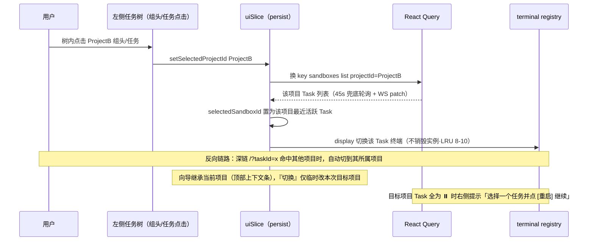

# P21-1 · 工作台 `/`

> 状态：✅ 可评审 · 上级：[P21 页面信息架构总览](../21-页面信息架构与交互.md) · 跳转关系见 [P20 §9](../20-核心使用链路.md)

## 1. 页面目标

用户的主工作区：一览所有已发起的 Task（左侧列表），选中后在右侧即时查看/交互该 Task 的终端。

## 2. 进入方式

| 入口 | 说明 |
|---|---|
| 首次访问 / 刷新 | `src/app/page.tsx` |
| 任何页面点 Logo / Cmd+K → "Home" | 全局逃逸路径 |
| 从向导/设置返回 | 导航回 `/` |
| 深链 `/?taskId=<id>` | 自动选中该 Task 并打开终端 |

## 3. 布局与信息层级

```
┌────────────────────────────────────────────────────────────┐
│  Logo 【📁 ProjectA】(指示器·点击定位) cmdk ⚙️设置 【横幅区】      │
├──────────────────────┬─────────────────────────────────────┤
│  【搜索框】【状态过滤】│  ┌─ 终端标签栏 ───────────────────┐ │
│  [+ 新任务]           │  │ Term-1 [×]  Term-2 [×]  [新建]  │ │
│                      │  ├────────────────────────────────┤ │
│  ▾ ProjectA          2│  │ 【黄条】连接已断开，正在重连…   │ │
│  ● Codex·重构支付模块 │  │  $ _                           │ │
│    活跃于 3 分钟前    │  │                                │ │
│  🟢 Claude Code·… 1h  │  ├ 工具栏: 复制|清屏|字号|[新标签] │ │
│                      │  └────────────────────────────────┘ │
│  ▸ ProjectB          1│   或【空态】"选择左侧一个任务查看终端"│
│  🔵 Codex·分析任务    │   或【只读】选中无头Task时显示输出  │
│    ⚠️ 等待输入（决策4）│                                   │
│                      │                                   │
│  ▾ DataPipeline      3│                                   │
│  ⏸️ Codex·… 上周      │                                   │
│    🎁卷保留中(30天)   │                                   │
└──────────────────────┴─────────────────────────────────────┘
```

说明：左侧列表现分组显示所有项目（包括非当前项目），每个项目组头显示"项目名"和"任务数"；点击项目组头可折叠/展开，折叠状态持久化到 localStorage；顶部为**当前项目指示器**（只读，点击在树中定位展开该组；不再提供下拉切换——新建入口在树底、管理入口在组头「⋯」）。

优先级理由：顶部横幅 = 全局需立即知晓的事（凭证过期可 5s 自动收起，连接异常需手动关闭）；左侧列表承载"该处置哪个 Task"的决策信息（状态/最后活跃时间——**不含资源信息**：资源/配额概念对用户不暴露，后端自动分配，系统资源仅在 21-5 运维视角展示）；右侧终端是停留最久的即时反馈区。

## 4. 组件清单（对应技术 07 分层）

| 区域 | 组件 | 落点 |
|---|---|---|
| 顶部 | **CurrentProjectIndicator**（只读指示器：点击在左侧树定位并展开当前项目组，规格见 pages/21-6） | views/project/CurrentProjectIndicator.view + uiSlice.selectedProjectId |
| 左侧 | 树底 [＋ 新建项目] + 组头 hover「⋯」项目菜单 | views/sandbox-list/ + pages/21-6 |
| 顶部 | Banner / CmdkDialog | views/banner + hooks/useGlobalBanner、cmdk |
| 顶部 | **SettingsMenu ⚙️**（常驻入口 → 设置页三子页） | views/nav/SettingsMenu.view → /settings/* |
| 左侧 | SandboxList / SandboxListItem | views/sandbox-list/*.view + SandboxListContainer + useSandboxList |
| 左侧 | SearchBar / FilterTabs | views/sandbox-list/ + 本地过滤态 |
| 右侧 | TerminalPane / TerminalTabBar / TerminalToolbar | views/terminal/*.view + TerminalContainer |
| 右侧 | ConnectionStatus（终端顶部内嵌条） | useSandboxTerminalSocket 连接态驱动 |
| 全局 | Toast | sonner |

## 5. 状态矩阵

| 状态 | 判定 | 用户看到 |
|---|---|---|
| 加载中 | query.isPending | 骨架屏 |
| 全新用户（无项目） | projects 空 | **建项目引导**（pages/21-6 §5：用我的代码库 / 开空项目） |
| 有项目无任务 | 当前项目下列表空 | "在 ProjectA 中发起第一个任务 →" |
| 常态 | 任一项目下有 Task | 全部项目分组任务树（6 态标记；当前项目组高亮展开）+ 恢复上次选中终端 |
| 等待输入（MVP，决策 4）| running && waiting-input（pty 静默检测） | 列表项 🔵 + "等待你的输入"；侧栏顶部汇总行「⚡ N 个任务等待你输入」；右侧终端可输入 |
| 卷保留中（v1.1决策2） | status=stopped && preserve_volume | 列表项右下 🎁 + "卷保留中(还需 X 天)"（倒计时） |
| 无头输出（v1.1） | Task 类型=headless && 运行中/完成 | 右侧不显示交互终端，改为只读输出面板：exit code + 最后 100 行日志（stdout + stderr 合并，UTF-8 编码，换行符计行数，按时序倒序取最新 100 行）+ [查看完整] / [下载] |
| 全部已暂停 | 所有 Task ⏸️ | 右侧提示"选择一个任务并点[重启]继续" |
| 列表数据降级 | REST 报错或 WS /events 断连 | 列表角标"△ 数据可能非最新"（45s 轮询兜底，恢复后消失） |
| 终端重连中 | connState=reconnecting | 终端顶部黄条"正在重连…（第 n 次）" |

## 6. 交互细节

| 交互 | 行为 |
|---|---|
| **切换项目** | 左侧树点击组头/任务 → currentProjectId 切换 + 组展开 + 终端跟随（顶部指示器只读同步；详见 pages/21-6 §6） |
| 单击项目组头 | 折叠/展开该项目下的 Task 列表；折叠状态 persist 到 localStorage |
| 单击列表项（当前项目）| 右侧切换到该 Task 终端（display 切换不销毁实例，技术 08 §5）；更新 selectedSandboxId |
| 单击列表项（其他项目）| 自动切换 currentProjectId 到该 Task 所属项目 → 右侧切换到该 Task 终端；项目组自动展开 |
| 右键列表项 | 菜单：[重启] [Stop] [销毁] [改名]（1–60 字符，允许重名；破坏性操作二次确认） |
| 终端标签切换 / [×] / [新标签] | 切换同 Task 的多路会话 / 关闭该 pty 会话（Task 继续后台跑）/ 新开 `spawn({tty:true})` 会话 |
| 工具栏 复制/清屏/字号 | 选择复制；仅清前端画布；字号 persist |
| 搜索/状态过滤 | 客户端实时过滤（**防抖 200ms**；名称/runtime）；状态标签集合 = 全部/准备中/运行中/等待输入/已暂停/异常 |
| 侧栏折叠 | 终端 ResizeObserver → debounce fit → resize 帧上报（技术 08 §4） |
| Cmd+K | 快捷面板：新任务 / 切换 Task / 打开设置 |
| Logo 点击 | 回工作台首屏 |




> 交互链路图：补充自 2026-08 三方评审（已按决策 1-6 修订）

## 7. 数据依赖

| 数据 | Query key / 通道 |
|---|---|
| 项目列表 | `['projects','list']`（GET /api/projects，含各项目 Task 数） |
| 任务树（全部项目） | `['sandboxes','list']` **全量拉取**（GET /api/sandboxes，45s 兜底轮询 + WS patch）；带 projectId 的 key 保留给服务端过滤/降级场景 |
| 凭证状态（横幅判定） | `['runtime-auth',{provider},'status']`（首载预取） |
| 状态实时化 | WS `/events` → `sandbox.*` 事件 → setQueryData（技术 15 §2.3） |
| 终端 | WS `/terminal?socket_session_key=`（tmux re-attach，技术 06 §6） |

## 8. 退出路径

[+ 新任务] / Cmd+K → 发起向导；顶栏 ⚙️ / 横幅 [授权] / Cmd+K → 设置页各子页。

## 9. 边界规则

- **Task 视角命名**：列表永不出现 "sandbox/容器" 措辞。**默认任务名规则**（用户改名后不再自动覆盖）：
  - **有任务指令时**：取指令**第一行**（不以空白开头的首个非空行）的**前 20 个字符**（UTF-8 码点计，CJK 各占 1 字符，非按显示宽度），**超长部分加省略号 "…"**；一行内全空白则取下一行。
  - **无指令或指令全空**：回退为 "Runtime 名 · 启动时间戳"（如 "Codex · 2026-08-10 14:23"）。
- **列表参数**：默认按最后活跃倒序；一次拉取上限 200 +「加载更多」；"活跃于 X" 分档：<1min 刚刚 / <1h n 分钟前 / <24h n 小时前 / 更早显日期。
- **横幅优先级**（多条同时命中）：🔴 阻断类（离线模式/运行时无响应）> ⚠️ 治理类（凭证过期/自动化失败，可堆叠最多 2 条 +「还有 N 条」折叠，**不自动收起**、须显式关闭且当天不再弹）> ℹ️ 提示类（5s 自动收起）。
- **Task 列表分组展示**：按项目分组、项目组头显示项目名+任务数、可折叠/展开；折叠状态 persist；点击其他项目 Task 自动切换 currentProjectId 并展开该组。不做全局搜索跨组过滤（搜索/状态过滤均作用于展开的 Task，不跨项目，项目多时再升级 pages/21-6 §1）。
- 凭证任何位置不回显明文。
- 终端实例常驻 + LRU 8–10 上限（技术 08 §5）；被 LRU 淘汰的标签重新点击时**静默重建**（tmux 恢复现场），不提示。
- Stop/销毁一律二次确认；销毁弹层含「☐ 保留工作区成果卷（默认勾选）」，不勾选才永久删除并明示（决策 2）。
- 全局暗色主题，终端区纯黑底。
