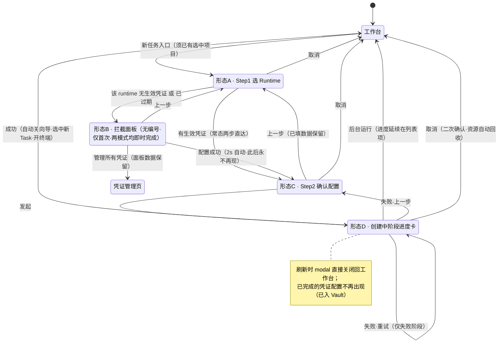
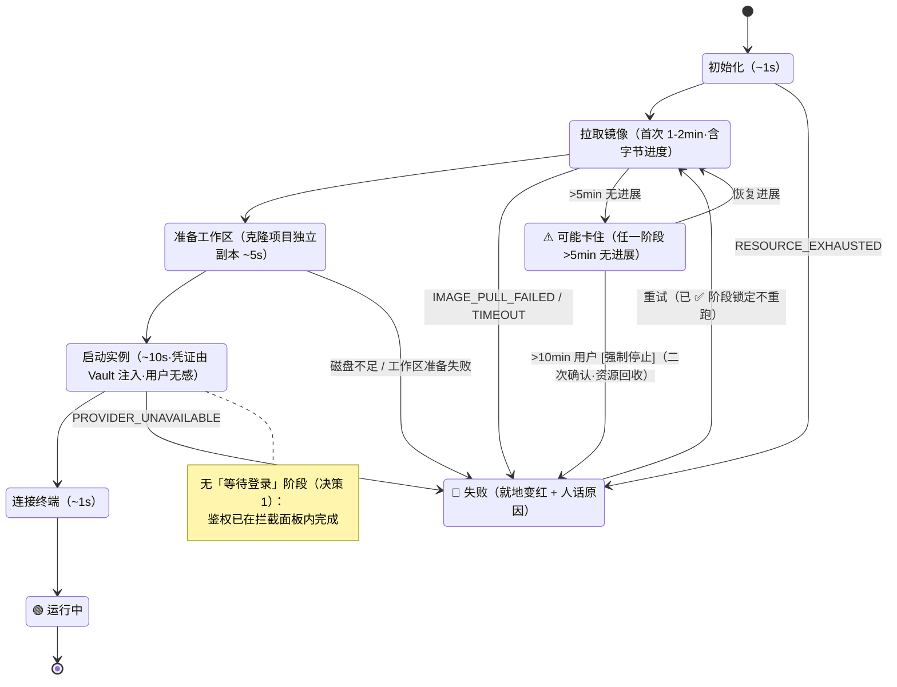

# P21-2 · 发起任务向导（modal，深链路由 `/new`）

> 状态：✅ 可评审 · 上级：[P21 总览](../21-页面信息架构与交互.md) · 流程语义：[P20 §3–§5](../20-核心使用链路.md)

## 1. 页面目标

两步向导完成一次 Task 发起：选 runtime → 确认创建（**鉴权不是步骤**——仅该 runtime 首次配置时插入无编号的一次性全局登录拦截面板），随后进入阶段进度卡。

## 2. 进入方式

工作台 [+ 新任务]；空态主 CTA；Cmd+K → "new task"；深链 `/new?runtime=codex`（预选 runtime）。
形态决策：**默认 modal（不占路由）**，同时提供 `/new` 路由承接深链；modal 刷新即关闭（可接受的权衡，见 P20 §9 状态恢复）。

## 2.5 向导整体状态机



> 交互链路图：补充自 2026-08 三方评审（已按决策 1-6 修订）

## 3. 四个形态

### 形态 A · Step 1 (1/2) 选择 Agent

向导所有形态顶部都有**项目上下文条**：`在 📁 ProjectA 中发起 [切换]`——继承工作台当前项目（P20 §3.2），项目不是向导步骤；[切换] 打开项目下拉临时改目标项目。

```
┌─ 发起任务 (1/2) 选择 Agent ────────────────────┐
│ 📁 在 ProjectA 中发起                  [切换]  │
│ 📌 Codex / Claude Code 是什么？（可展开一句话） │
│ ┌─ Codex ─────────────┐ ┌─ Claude Code ──────┐ │
│ │ OpenAI·ChatGPT 订阅  │ │ Anthropic·Claude 订阅│ │
│ │ ✅ 已登录 a***@gm    │ │ ○ 首次使用需完成一次 │ │
│ │ 上次使用 ✓          │ │   全局登录（约1分钟） │ │
│ └─────────────────────┘ └────────────────────┘ │
│ ▸ 更多 runtime 由 registry 注册后自动出现        │
│                            [下一步]  [取消]     │
└────────────────────────────────────────────────┘
```

### 形态 B · 一次性全局登录拦截面板（无编号；仅该 runtime 无生效凭证时插入）

面板标题：「首次使用 Codex：完成一次全局登录」；正文明示：**"只需配置一次，此后所有任务（包括其他项目）自动使用该凭证。"**——鉴权是全局配置，不是任务创建的流程环节。

顶部**方式切换 Tab：「帐号授权（推荐）」/「API Key」**（可用方式由 `getAuthMethods()` 下发；默认选中该 runtime 的当前生效模式）；Tab 下方一句取舍说明："帐号授权使用订阅额度；API key 按量计费、配置最快"。**在闸门中完成配置的方式即成为该 runtime 的全局生效模式**（二选一，P20 §5.1；此后切换在凭证管理页进行）。

> B1/B2 的登录流跑在**平台 auth helper**（技术 05 §2 决策 A）——面板内**即时完成**，不依赖、不等待任何 sandbox（决策 1）。

**B1 帐号授权 · device-code（Codex）**：大字号设备码 + [复制] + 二维码 + [打开验证链接] + 倒计时（15:00 起；剩 5 分钟转黄，归零转红 + [重新获取]）+ "等待授权中…"自动轮询态 + [后台继续]（关闭面板轮询继续，凭证到位后卡片徽标转 ✅）。

**B2 帐号授权 · setup-token（Claude Code）**：授权链接 + [打开链接] → code 粘贴框（password 遮罩，[展开查看]可切换，纯前端）→ [提交]（提交即清空本地值）。

**B3 API Key（两 runtime 通用）**：key 输入框（password 遮罩）→ [保存并继续]——**不经 sandbox、无需等待 sandbox 步骤**（技术 05 §3.1）。提交 UX：格式前缀校验在前端即时做（Codex `sk-` / Claude Code **`sk-ant-`**，输入时红边提示）；点击提交后按钮转 loading（后端若启用真实有效性校验，最长约 2s）；失败（`AUTH_REJECTED`）**就地红字 + 可能原因列表**（格式错误/无权限/额度不足），不弹层；成功即清空本地值并进确认步。

页脚提供 [管理所有凭证] → 凭证管理页（面板数据保留）。

### 形态 C · Step 2 (2/2) 确认配置

```
┌─ 发起任务 (2/2) 确认配置 ──────────────────┐
│ Runtime: Codex   身份: a***@gm   [更改]     │
│ 项目: ProjectA ▾（选项=全部项目+新建）      │
│       ⬇ 创建成功后自动选中，已填指令等表单值不丢 │
│ 模式: ◉ 交互式终端   ○ 无头任务(v1.1)       │
│   └ 无头模式超时: 30分钟 ▾（选项: 30min/1h/2h/4h，v1.1决策5） │
│ 任务指令 (可选):                            │
│ ┌───────────────────────────────────────┐   │
│ │ 分析这个仓库的架构并输出摘要…          │   │
│ │ placeholder: "分析…"、"实现…"等         │   │
│ │ （上限 8000 字符，超限就地红字计数）      │   │
│ └───────────────────────────────────────┘   │
│ 📦 镜像: AIO（推荐）▾（选项来源 = 镜像管理已启用镜像，默认平台默认镜像，按 runtime 过滤）     │
│ ▸ 高级选项（默认折叠）                       │
│   ├ 隔离等级: ◉ aio  ○ boxlite(v2.0)        │
│   ├ 自定义镜像 URI [输入][验证]              │
│   ├ 运行参数: LOG_LEVEL=info [来自镜像]      │
│   │   CACHE_TTL=600 [来自项目]               │
│   │   DEBUG_MODE=true [来自本次]             │
│   │   [+ 本次覆盖/新增环境变量]              │
│   │   ▸ 查看最终生效值（三层合并，21-4 §10）  │
│   └ idle 回收阈值: 30 分钟(默认) ▾           │
│     （15/30/60/120 分钟/从不；回收后重启为   │
│       新会话，对话上下文不保留——P22 §2）     │
│ ℹ️ 预计耗时: 首次拉镜像 1–2min / 同镜像 ~20s  │
│                [发起]  [上一步]  [取消]      │
└─────────────────────────────────────────────┘
```

### 形态 D · 创建中阶段进度卡

```
🔄 正在发起 Codex 任务（ProjectA）   ⏱️ 已耗时 45s
 ✅ 初始化 (0.2s)
 🔄 拉取镜像 150/800MB（预计还需 40s）
 ⏳ 准备工作区（克隆项目独立副本，pages/21-6 §9）
 ⏳ 启动实例
 ○ 连接终端
          [后台运行]  [取消]  （>10min 出现 [强制停止]）
参考耗时: 初始化 ~1s / 拉镜像 1-2min(首次) / 准备工作区 ~5s
          / 启动实例 ~10s / 连接终端 ~1s；任一阶段 >5min 无进展
          显示 "⚠️ 可能卡住"
```

注：凭证注入由后端在「启动实例」阶段完成，用户无感知（技术 05 §2）。两种鉴权模式均在拦截面板内即时完成，进度卡中不再有等待环节。




> 交互链路图：补充自 2026-08 三方评审（已按决策 1-6 修订）

## 4. 组件清单

| 组件 | 落点 |
|---|---|
| CreateTaskWizard | containers/CreateTaskWizard（纯编排） |
| RuntimeSelector | views/wizard/RuntimeSelector.view |
| DeviceCodeAuth / SetupTokenAuth | views/wizard/auth/*.view + useRuntimeAuthFlow（轮询/遮罩逻辑在 hook） |
| ConfirmConfig | views/wizard/ConfirmConfig.view |
| CreationProgress | views/wizard/CreationProgress.view + useCreateSandbox（mutation） |

## 5. 状态矩阵

| 状态 | 判定 | 用户看到 |
|---|---|---|
| Step 1 首入 | step=1 | 卡片 + 上次选择高亮 |
| →拦截面板 | 选中 runtime 无生效凭证（仅一次） | 一次性全局登录面板 |
| →确认步（常态两步直达） | 有生效凭证 | 确认页 + "将以 a***@gm 身份运行"，鉴权零感知 |
| 面板·轮询中 | status=pending | 倒计时 + 等待授权 |
| 面板·过期 | 倒计时归零 / expired | 红色 + [重新获取]（对齐 P22 `AUTH_CHALLENGE_EXPIRED`） |
| 面板·成功 | status=success | "✅ 配置完成"，2s 后自动进确认步，**此后永不再现** |
| 面板·API key 提交 | secret mutation | 成功即刻进确认步；`AUTH_REJECTED` 就地提示"API Key 无效或无权限 [重新输入]" |
| 创建中 | mutation pending | 进度卡随 WS `sandbox.status_changed` 逐阶段更新 |
| 拉镜像卡住 | 该阶段 >5min 无进展 | "⚠️ 可能卡住" + [强制停止] |
| 失败 | mutation error | 对应阶段变红 + 人话原因（P22 §1 映射）+ [重试]/[上一步] |
| 成功 | status=running | 向导自动关闭 → 工作台新 Task 选中 + 终端自动打开 |

## 6. 交互细节

| 交互 | 行为 |
|---|---|
| 选 runtime 卡片 | 高亮 + persist 记忆；凭证状态决定下一步走向 |
| 项目下拉选择 | 默认=当前项目（上下文继承）；选项=全部项目+底部「＋新建项目…」 |
| 「＋新建项目…」项 | 打开项目创建弹层→创建后回到确认步，新项目已选中，**已填任务指令等表单值不丢** |
| device-code 轮询 | 3–5s 间隔（Query refetchInterval，技术 15 §2.2），到 expiresAt 停 |
| setup-token 提交 | 提交即清空输入框，绝不落 localStorage（P20 §5.2） |
| [上一步] | 返回上一 Step，已填数据保留 |
| [取消] | 关闭向导回工作台（Step 阶段无确认；创建中取消 = 终止创建并自动回收资源，需确认） |
| [后台运行] | 点击立即关闭向导回工作台（**无 toast/横幅提示**，用户自主选择后台运行，无需额外确认），创建继续，列表项状态点旁显示**当前阶段名 + 进度条**（如"🔄 拉取镜像 150/800MB"） |
| 进度卡阶段锁定 | 已 ✅ 的阶段锁定不可重试；仅失败阶段可 [重试] |

## 7. 数据依赖

| 数据 | 来源 |
|---|---|
| runtime 列表 + 各自凭证状态 | `GET /api/runtimes`（聚合端点，技术缺口 P22 §4.11） |
| 镜像列表（按 runtime 过滤） | `GET /api/images?runtime=codex` |
| 鉴权 begin/status/complete | 技术 05 §3 端点表 |
| 创建 | `POST /api/sandboxes { projectId, runtime, image, provider, initialPrompt? }`（projectId 以确认步所选为准，乐观插入该项目列表，技术 15 §2.4） |
| 进度 | WS `sandbox.status_changed` |

## 8. 退出路径

取消/成功 → 工作台；[管理所有凭证] → 凭证管理；[后台运行] → 工作台（进度在列表项上延续）。

## 9. 边界规则

- **确认步「项目」行**：下拉默认 = 当前项目（上下文先行），选项 = 全部项目 + 底部「＋ 新建项目…」；改选后任务归属所选项目。选「＋ 新建项目…」进入创建弹层，创建成功**自动回确认步**且新项目已选中、**已填的任务指令等表单值不丢**（经 wizardData 暂存回填）。
- **Step 1 未选中 runtime 时 [下一步] 置灰禁用**（原型已实现语义）。
- **默认值哲学**：用户唯一必须决策的是 runtime；**任务指令是唯一鼓励填写但不强制的输入**（可选）；确认步可零修改直接 [发起]；**鉴权不占步骤**（全局一次性，常态发起两击直达）。
- 鉴权闸门不可绕过：无凭证必须在拦截面板内完成鉴权才能进确认步；**两种模式都即时完成**（凭证注入由后端在启动实例时无感进行，P20 §5.2）。
- 高级选项内的自定义镜像 URI **仅本次任务生效、不落库**（长期使用请走镜像管理注册——21-4 §6）。
- 向导选择（runtime/镜像）persist 到下次；**任务指令仅在创建请求中传输，不落前端持久化**（可能含敏感上下文，每次发起都重新填或为空）；**资源由后端自动分配，用户不感知**（技术 03 §1）。
- 进度阶段顺序固定：初始化 → 拉镜像 → **准备工作区** → 启动实例 → 连接终端（无等待登录环节，凭证注入由后端无感完成）。
- 无选中项目时向导不可进入（工作台先走建项目引导，P20 §8.2）。
- **"可能卡住"判定标准**：任一阶段**连续 5 分钟（300 秒）无进度变化**时弹 "⚠️ 可能卡住（第 n 次检测）"；进度变化 = **拉镜像阶段字节数增加 / 其他阶段状态转移**，检测间隔 10s；一旦检测到进度变化自动清零计时器并消去提示；用户可点 [强制停止]（二次确认）。
