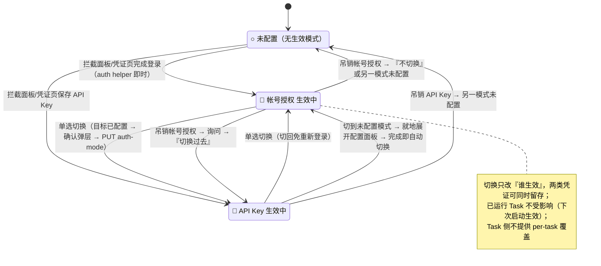
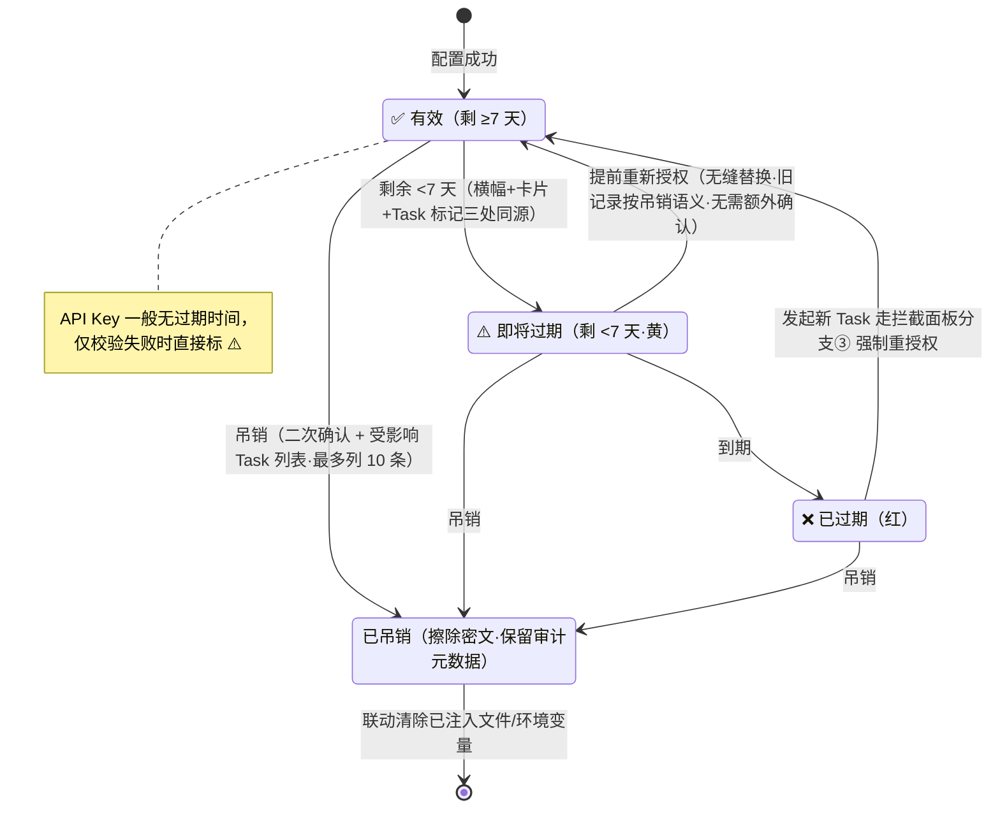
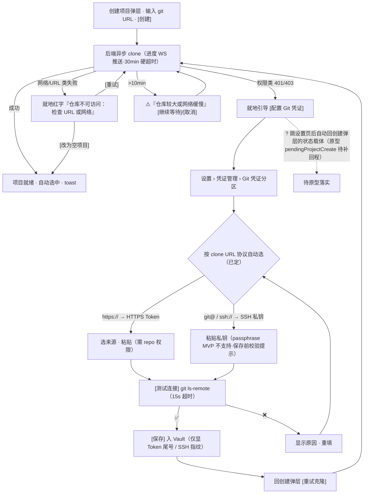

# P21-3 · 设置 / 凭证管理（设置页子菜单） `/settings/credentials`

> 状态：✅ 可评审 · 上级：[P21 总览](../21-页面信息架构与交互.md) · 鉴权语义：[P20 §5](../20-核心使用链路.md)
> **设计变更（v1.0.1）**：凭证管理从独立弹层改为设置页面的左侧菜单子页签；页面布局 = 侧栏菜单（左）+ 内容区（右）；含"← 返回工作台"入口。

## 1. 页面目标

管理两族凭证：**Runtime 凭证**（帐号授权/API key，模式二选一）与 **Git 凭证**（私有仓库访问，SSH 密钥/HTTPS Token，见 §10）——掩码列表、重新授权、添加/更换、吊销。

## 2. 进入方式

工作台顶部设置菜单 ⚙️ → 🔐 凭证管理；Cmd+K → Settings → Credentials；工作台横幅 [授权凭证] → 进设置页/凭证菜单项；向导鉴权拦截面板 [管理所有凭证]。**所有入口均进入设置页面并定位到凭证管理菜单项**（不再打开独立弹层）。

## 3. 布局与信息层级

```
┌─ 设置 > 凭证管理 ────────────────────────────┐
│ Runtime 凭证（本机全局共享）【搜索】           │
│ ┌─ Codex ── 当前模式（二选一，切换全局生效）─┐  │
│ │ ◉ 🎫 帐号授权 · OpenAI ChatGPT   [生效中]  │  │
│ │      帐号: a***@gmail.com                │  │
│ │      有效期: 剩 37 天 ⚠️ 建议提前重新授权  │  │
│ │      [重新授权]  [吊销]                   │  │
│ │ ○ 🔑 API Key · sk-...ab12                │  │
│ │      最近使用: 3 天前   [更换]  [吊销]    │  │
│ │ ℹ️ 切换模式后新任务立即按新模式注入；       │  │
│ │    已运行任务不受影响（下次启动生效）       │  │
│ └──────────────────────────────────────────┘  │
│ ┌─ Claude Code ── ○ 未配置凭证 ────────────┐  │
│ │ [帐号授权]（经发起向导） [添加 API Key]    │  │
│ └──────────────────────────────────────────┘  │
│ ℹ️ 凭证已加密保存在本机，不上传；帐号授权在您  │
│    自己的浏览器中完成，平台不接触您的密码。    │
└──────────────────────────────────────────────┘
```

层级：按 runtime 分组，组内两类凭证并列（类型徽标 🎫 帐号授权 / 🔑 API Key）；已配置在前 > 未配置（简化态）> 页底安全承诺文案。

## 4. 组件清单

| 组件 | 落点 |
|---|---|
| CredentialsPage | app/settings/credentials/page.tsx |
| CredentialsContainer | containers/ + hooks/useCredentials |
| CredentialCard | views/settings/credentials/CredentialCard.view（已授权/未授权/过期三态） |
| ReauthPanel | 卡片内**页内嵌入**鉴权面板（与向导拦截面板同组件复用 auth views，不弹新 modal） |
| RevokeConfirmDialog | 二次确认 + 受影响运行中 Task 清单 |

## 5. 状态矩阵

| 状态 | 判定 | 用户看到 |
|---|---|---|
| 加载中 | isPending | 骨架屏 |
| 无凭证 | 列表空 | 空态 + [立即授权] CTA |
| 有效 | 剩 ≥ 7 天 | 正常卡片 + 绿勾 |
| 即将过期 | 剩 < 7 天 | ⚠️ 黄色 + "建议在 X 前重新授权"（与全局横幅同源，P22） |
| 已过期 | expiresAt < now | ❌ 红色"已过期" + [重新授权] |
| 重授权中 | 点击后 | 卡片展开内嵌鉴权面板（device-code / setup-token 按 runtime，auth helper 即时完成） |
| 重授权成功 | mutation 成功 | 卡片即时更新 + toast；`invalidateQueries(['runtime-auth'])` |
| 吊销确认中 | 点击吊销 | 确认框 + 受影响 Task 列表 |
| 吊销成功 | mutation 成功 | 卡片转未授权态 + toast + 相关 Task 标 ⚠️ |






> 交互链路图：补充自 2026-08 三方评审（已按决策 1-6 修订）

## 6. 交互细节

| 交互 | 行为 |
|---|---|
| **◉/○ 模式单选切换** | 点击未生效模式的单选钮 → 若该模式已配置凭证：确认弹层"切换后新任务将使用 API Key（按量计费），已运行任务不受影响" → `PUT /api/runtimes/:rt/auth-mode` → 卡片 [生效中] 徽标移动 + toast；若未配置：就地展开该模式的配置面板，**配置完成即自动切换** |
| [重新授权]（帐号授权类） | 页内直接展开授权面板（device-code/setup-token，与向导 Step 2 同界面，auth helper 即时完成）→ `POST /api/runtimes/:rt/auth/begin` + `GET .../auth/status` 轮询 + `POST .../auth/complete`（技术 05 §2 决策 A）；成功后旧凭证按吊销语义处理（技术 05 §4） |
| **[添加 API Key] / [更换]** | **页内直接展开输入面板**（密码遮罩 → 提交即清空）→ `POST /api/runtimes/:rt/credentials/secret`——API key 不需要 sandbox 宿主（技术 05 §3.1），本页即可完成全流程 |
| [吊销] | 二次确认（列出受影响运行中 Task）→ `DELETE /api/runtimes/:rt/credentials/:id` |
| [帐号授权]（未配置态） | 页内直接展开授权面板（device-code/setup-token 按 runtime）——两种模式都即时完成，无需 sandbox 宿主 |
| 搜索 | 客户端过滤：匹配 runtime 名 + 掩码尾号可见部分（`sk-...ab12` 匹配搜词"ab12"）+ 帐号邮箱可见部分（`a***@gm` 匹配"gm"）；**不匹配被掩码遮蔽的中间段** |

## 7. 数据依赖

凭证列表：`GET /api/runtimes`（聚合端点，含各 runtime 凭证状态；技术缺口 P22 §4.11）；受影响 Task：`['sandboxes','list']` 本地按 runtime 过滤。

## 8. 退出路径

[← 返回工作台] / Logo / Esc → 工作台；左侧设置菜单 → 其他 settings 子页。

## 9. 边界规则

- **无任何查看明文入口**（掩码是显示上限，技术 05 §4；API key 显示为 `sk-...ab12` 形态）。
- **过期预警分级**：<7 天黄、过期红，与全局横幅、Task 列表标记三处联动同源；**"剩 X 天"格式 = 按整数天数向下取整**（expiresAt - now > 0 时显示"剩 N 天"，≤0 时显示"已过期"；不足 1 天显示"剩 <1 天"）；API key 一般无过期时间，仅在校验失败时标 ⚠️。
- 吊销确认必须列出受影响运行中 Task（最多列 10 条 +「等共 N 个」折叠）；吊销联动清除容器内已注入文件/环境变量；重授权成功 = 无缝替换，旧凭证按吊销语义处理、无需额外确认。
- **页内完成**：帐号授权和 API key 都在本页页内直接完成，无需 sandbox 宿主或向导跳转；两种模式都即时完成。
- **模式二选一、全局生效**：同一 runtime 两类凭证可留存（切回免重登），但同一时刻只有一个模式 [生效中]；切换即全局生效（已运行 Task 不受影响，下次启动按新模式注入）；**Task 侧不提供 per-task 覆盖**——模式是全局唯一开关（技术 05 §4 / 13 §2 runtime_settings）。
- 吊销**生效中**模式的凭证时，确认弹层额外提示"该模式将不可用"，吊销后若另一模式已配置则询问是否切换过去，否则该 runtime 转「未配置」态。

## 10. Git 凭证分区（私有仓库访问，MVP）

> 与 Runtime 凭证并列展示但**语义独立**：不参与模式二选一；作用域**全局**（所有项目共用——企业 org 下多仓库通常共用一个 PAT/密钥，per-project 覆盖 v1.1 再评估）。

### 10.1 布局

```
📦 Git 凭证（私有仓库访问）
┌─ 已配置 ─────────────────────────────┐
│ 类型: SSH 私钥                        │
│ 指纹: SHA256:abc123def456...          │
│ 最后使用: 2 小时前                    │
│ [更换凭证] [测试连接] [吊销]           │
└──────────────────────────────────────┘
或未配置态: ○ 未配置 → [配置 SSH 密钥] [配置 HTTPS Token]
ℹ️ Git 凭证用于克隆私有仓库，与 Agent 的 Runtime 凭证无关。
```

### 10.2 交互

| 交互 | 行为 |
|---|---|
| 配置 SSH 密钥 | 弹层粘贴私钥（密码遮罩）→ [测试连接] → [保存]（Vault 加密）；展示时只显**指纹**；**带 passphrase 的私钥 MVP 不支持**（保存前校验并提示） |
| 配置 HTTPS Token | 选来源（GitHub/GitLab/其他，附 scope 提示"需 repo 权限"）→ 粘贴 → [测试连接] → [保存]；展示 Token 尾号 |
| 选型引导 | "GitHub/GitLab SaaS → HTTPS Token；公司自建 Git（SSH 接入）→ SSH 密钥" |
| [测试连接] | 后端 `git ls-remote` 目标/测试仓库（**超时 15s**）→ ✅/❌ + 原因 |
| known_hosts | **自动信任**（首次连接自动记录指纹，指纹在凭证详情可核对）——内网场景 MITM 风险由网络隔离承担，无头容器内交互确认不可行 |
| clone 权限失败引导 | 项目创建 clone 返回 401/403 → 就地 [配置 Git 凭证] → 配置完成 → [重试克隆]（P22 §2 细化链路） |




> 交互链路图：补充自 2026-08 三方评审（已按决策 1-6 修订）

### 10.3 边界规则

- 加密/掩码/吊销与 Runtime 凭证同 Vault 纪律；SSH 私钥**永不回显**，仅指纹。
- **凭证选择规则**：clone 时按仓库 URL 协议自动选——`git@`/`ssh://` 用 SSH 密钥，`https://` 用 HTTPS Token；两者可同时配置，互不冲突。**[测试连接]按当前 UI 所在分区选**——Git 凭证若同时配置 SSH 和 HTTPS，在"配置 SSH 密钥"区块内 [测试连接] 仅测 SSH（执行 `git ls-remote git@github.com:user/repo.git`），在"配置 HTTPS Token"区块测 HTTPS（执行 `git ls-remote https://github.com/user/repo.git`）。
- **使用位置**：MVP 仅平台侧 clone 时使用（不注入 sandbox）；Task 内 agent 做 `git push`（成果汇回 v1.5）时才引入"Git 凭证注入 sandbox"，届时单独设计注入开关与风险提示。
- 版本：**MVP 即提供**（私有化部署前提下，企业内网 git 基本都是私有仓——只支持公开仓等于项目功能不可用）。
