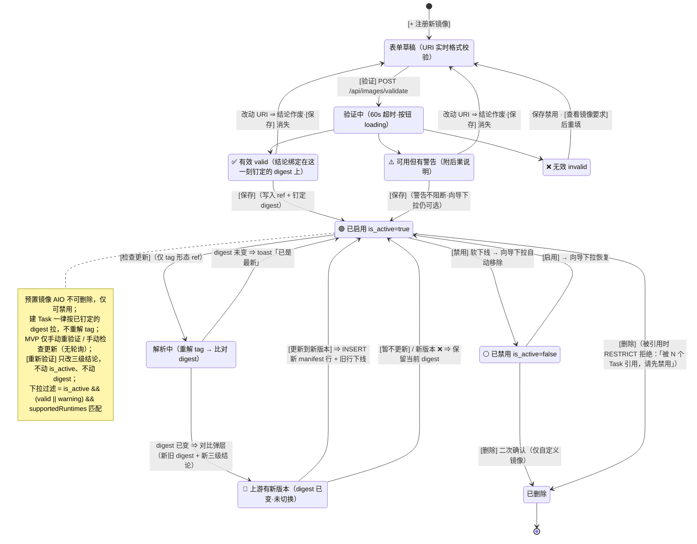
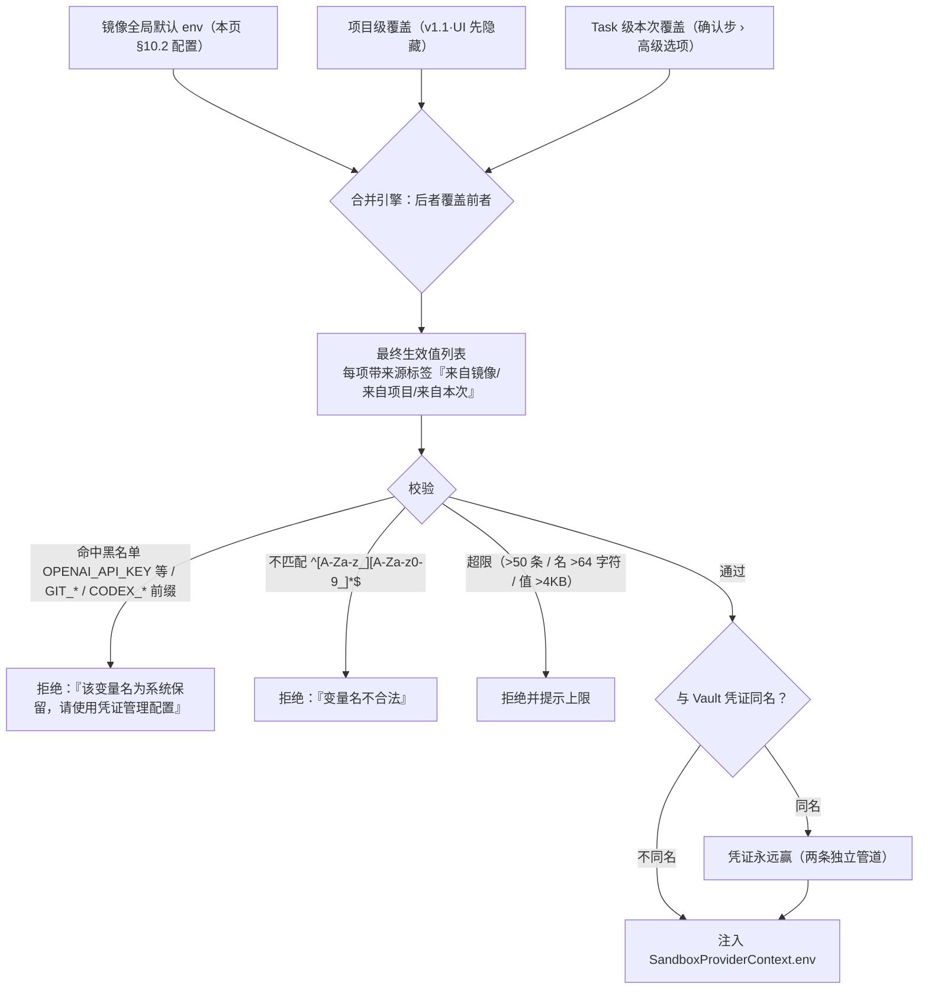

# P21-4 · 设置 / 镜像管理（设置页子菜单） `/settings/images`

> 状态：**设计 ✅ 可评审 · 实现：后端 ✅ 已落地 · 前端 ⏳ 进行中（页面尚不存在，见 §0）** · 上级：[P21 总览](../21-页面信息架构与交互.md) · 镜像契约：技术 04 §7
> **设计变更（v1.0.1）**：镜像管理从独立弹层改为设置页面的左侧菜单子页签。
> **本轮补齐（2026-08）**：tag 漂移与 digest 的交互裁决（§5 ★）、预置镜像的来源、重复注册、验证结论作废（§9）。

## 0. 实现状态：后端已落地，页面还没有

**本节此前整块写的是「零端点 / 零表 / digest 是硬编码常量」，那些话现在全是反的。**
后端切片在 2026-08 落地。但**页面本身仍然不存在**，所以这一节继续留着——只是要分清是哪一半。

| 面 | 今天的真实状态 | 依据 |
|---|---|---|
| 后端端点 | ✅ **8 个 operation / 6 条 path 都在**：`GET`+`POST /api/images`、`POST /api/images/validate`、`POST /api/images/:id/validate`、`PATCH`+`DELETE /api/images/:id`、`POST /api/images/:id/activate`、`POST /api/images/:id/check-update`（比本页原先写的「六个」多了 activate 与 check-update） | `api/openapi.json` · 27 §6 |
| 数据库 | ✅ **两张表都在**：`images` / `image_manifests`，`sandboxes.image_ref` 已改为外键指向 manifest | `api/drizzle/0010_cuddly_screwball.sql` · 13 §2.4 |
| 契约层 | ✅ `IMAGE_SPEC_REGISTRY` 有接口、有实现、有 DI 绑定、有第三方注入点；04 §10.4 的 IS-01…IS-05 **五条都在跑**（`contracts/src/testkit/image-spec.testkit.ts`） | 04 §8 · 04 §10.4 |
| 建 Task 的 `image` 入参 | ✅ 不再是自由字符串：门口经 `IMAGE_FACADE.resolveForTask()` **查库**，逐行判 `isActive`（I-IMG-3）与 `validationStatus != 'invalid'`（I-IMG-2）。**未注册的坐标会被拒** | `sandbox-application.service.ts#resolveImage` |
| `digest` | ✅ 注册期由 `resolve()` 真解出来并冻结进 `image_manifests.digest`；provision 读回它，provider 按 `ref@digest` 拉。§5 ★ 那条「钉住 digest」的裁决**已落地** | `oci-image-spec.provider.ts` · `pinnedImageRef()` · e2e `E2E-7-digestPinned` |
| **页面** | ⏳ **仍不存在**。`web` 只有 `/` 与 `/settings/credentials` 两个路由，没有 `/settings/images`，也没有 `containers/image/`。已落地的是**下面几层**：`services/api/image.service.ts`、`hooks/image/`、`lib/image/`（纯函数 + 测试）、`views/image/`（+ story） | `web/src/app` · `web/src/containers` |
| **内置镜像（本页 §3 画的「AIO（预置）」卡）** | ❌ **没有种子数据**。迁移里没有任何 `INSERT INTO images`，`is_builtin` 在生产路径上恒为 `false`。后果：**全新部署在有人注册第一张镜像之前，连不带 `image` 的建 Task 都会被门口拒**（13 §2.4） | `api/drizzle/*.sql` |

**为什么这一节继续留在最前面。** 本仓栽过两个方向的跟头：`21-2 §9` 的验收清单给 14 条打了 ✅ 而被测组件根本不存在
（[LIVE-RUN-FINDINGS](../../LIVE-RUN-FINDINGS.md) 「三条共性」第 2 条：**绿灯不等于覆盖，得问一句"它红过吗"**）；
而本节自己是**反方向**的同一个病——代码早就有了，文档还在说「一个都没有」，
读的人于是重复造轮子，或者以为某条路走不通而绕开。**两个方向一样有害。**
本页正文默认描述**目标形态**；凡与今天代码不一致处就地标 ⏳。

## 1. 页面目标

注册自定义 OCI 镜像、查看验证结果、管理启用状态；与向导共享数据源，禁用/启用后向导镜像下拉自动联动。

## 2. 进入方式

工作台顶部设置菜单 ⚙️ → 📦 镜像管理；Cmd+K → Settings → Images；向导 Step 2 确认步镜像选择 [注册新镜像]。**所有入口均进入设置页面并定位到镜像管理菜单项**。

## 3. 布局与信息层级

```
┌─ 设置 > 镜像管理 ─────────────────────────────┐
│ 已注册的 OCI 镜像   【搜索】【状态过滤】        │
│ ┌─ AIO（预置）──────────────────────────────┐ │
│ │ ghcr.io/agent-infra/sandbox:latest        │ │
│ │ ✅ 可用 · 适用: Codex, Claude Code         │ │
│ │ 钉定 digest: sha256:9f2a…c31（随发布固化） │ │
│ │ 🟢 已启用    [编辑] [检查更新] [禁用]      │ │
│ └───────────────────────────────────────────┘ │
│ ┌─ ml-agent:v1.0（自定义）───────────────────┐ │
│ │ docker.io/myrepo/ml-agent:v1.0            │ │
│ │ ⚠️ 可用但有警告: 未预装 claude-code →      │ │
│ │    创建时需现装，实测约 12.5 分钟           │ │
│ │ 钉定 digest: sha256:4b17…a02 · 解析于 3 天前│ │
│ │ 🔄 上游 v1.0 已指向新镜像  [查看变更]      │ │
│ │ 🟢 已启用 [编辑][检查更新][禁用][删除]     │ │
│ └───────────────────────────────────────────┘ │
│ [+ 注册新镜像]（打开弹窗）                    │
└───────────────────────────────────────────────┘

【弹窗：📦 注册新镜像】
  镜像 URI: [输入框] 
  ℹ️ 镜像须兼容 OCI 标准；验证会检查可达性及依赖项
  ℹ️ 填 tag 会在此刻**钉定**为一个 digest；上游之后重推同一 tag
     不会自动生效，需在卡片上 [检查更新]（§5 ★）
  
  【验证结果区】（显示在输入框下方；**改动 URI 即整块收起**，§9）
  ✅ 验证通过：镜像可用 · 钉定 sha256:4b17…a02
  ⚠️ 验证通过但有警告：未预装 claude-code → 创建时需现装约 12.5 分钟
  ❌ 验证失败：镜像不符合平台约定（如**缺少 tmux**）

  [验证]  [保存]（仅验证成功时出现）  [取消]
```

列表排序：✅ 可用 > ⚠️ 警告 > ❌ 无效，同组按最后更新倒序。

**卡片操作全集**（ASCII 里因宽度只画了常用几个）：`[编辑]`（只编辑运行参数 §10，**不编辑镜像坐标**）·
`[检查更新]`（重解 tag 比对 digest，digest 形态置灰）· `[重新验证]`（对已钉定的 digest 重跑校验）·
`[禁用]`/`[启用]` · `[删除]`（预置镜像**没有**这一个）。前两个的区别见 §6，别做成一个按钮。

> **卡片上那行时间戳的措辞是有讲究的**：原稿写「最后验证: 3 小时前」，已改为「**解析于**」。
> 「最后验证」暗示结论会随时间烂掉（那就必须回答"烂了怎么办"，而本页原先没有答案）；
> 钉定 digest 之后结论描述的是一个不可变对象、**不会烂**，会变的只是"这个 tag 现在还指向它吗"——
> 那是 [检查更新] 回答的问题。理由展开见 §5 ★。

## 4. 组件清单

ImagesPage（app/settings/images/page.tsx）· ImagesContainer + useImages · ImageCard.view（三态）· RegisterImageModal.view（弹窗形式，验证流）· ValidationResult（✅/⚠️/❌ 分级渲染）· EnableToggle。

## 5. 状态矩阵

| 状态 | 判定（对应 `image_manifests.validation_status`，技术 13 §2） | 用户看到 |
|---|---|---|
| 加载中 / 空 | — | 骨架屏 / 空态 + [注册新镜像] CTA |
| ✅ 有效 | valid | 绿勾 + 适用 runtime 列表 + `钉定 digest`。**这个绿勾属于这个 digest，不属于这个 tag**（★） |
| ⚠️ 警告 | warnings 非空（如 `supportedRuntimes` 声明的 CLI 未预装，技术 04 §7） | 黄色 + **后果说明**，可正常使用。**当前真实存在的只有这一档警告**：「未预装 `claude-code`，创建时需现装，实测约 12.5 分钟」（04 §7 ★ 实测 753 秒）。⚠️ **2026-08 变更**：原例子「缺 tmux → 终端断线恢复将降级」**已移到 ❌ 无效档**——tmux 由「建议」升为「必须」，缺它的镜像不再可保存可用（技术 04 §7） |
| ❌ 无效 | invalid | 红色 + errors 列表 + [查看镜像要求]；不可用于创建 |
| 验证中 | mutation pending | [验证] 按钮 loading |
| 已禁用 | is_active=false | 卡片置灰，创建向导不出现；[启用] 可恢复 |
| 🔄 上游有新版本 | 最近一次 [检查更新] 解析出的 digest ≠ 卡片记录的 `digest` | 蓝色角标「上游该 tag 已指向新镜像 [查看变更]」。**不自动切换**——点开是新旧 digest + 新版本的三级结论对比，用户点 [更新到新版本] 才写（★） |
| ⏳ 结论已作废 | 注册弹窗里 URI 在验证后被改动 | 验证结果区整块收起、[保存] 消失 + 「已修改镜像地址，请重新验证」（§9）——**不保留一个已经不属于当前输入的绿勾** |
| 以 digest 注册 | 用户填的 ref 形如 `repo@sha256:…` | 卡片标「以 digest 注册（无 tag）」；[检查更新] 置灰 + tooltip「该镜像以 digest 注册，不存在上游漂移」 |




> 交互链路图：补充自 2026-08 三方评审（已按决策 1-6 修订）；`RESOLVING` / `OUTDATED` 两态与
> 「改动 URI ⇒ 结论作废」两条边补充自 2026-08 tag 漂移裁决（★）。

### ★ 裁决：注册即**钉住 digest**，tag 只是标签（2026-08）

04 §7 的方法表里那句「`resolve` 必须解出 `digest`，否则同一 tag 前后两次创建可能不是同一镜像」，
落到产品上就是一个必须回答的问题：**用户注册了 `myrepo/ml-agent:v1.0`，三个月后作者重推了同一个 tag，平台该跑哪一个？**
本页此前通篇没有对应交互——没有这条边、没有这个按钮，只有一行「最后验证: 3 小时前」暗示设计者意识到了时效问题却停在了那里。

**裁决：跟 digest，不跟 tag。** 注册时 `resolve` 出的 digest 写进 `image_manifests.digest`（13 §2.4，该列 CHECK 非空），
此后**每一个 Task 都按这个 digest 拉镜像**；tag 只承担两个职责——卡片上的显示名，以及 [检查更新] 的解析入口。
上游重推同一个 tag **不改变**任何已注册镜像的行为，直到用户显式点 [检查更新] → [更新到新版本]。

**为什么（三条，按重要性）**：

1. **它让那个绿勾恒真。** 钉住 digest 之后，「验证结论会不会过期」这个问题不是被缓解而是被**换掉**了：
   结论描述的是一个**不可变的字节序列**，它不会因为时间流逝而失效。剩下的不确定性收敛成一个
   **一次网络往返就能查清**的问题——「这个 tag 现在还指向它吗」，而这正是 [检查更新] 回答的。
   ⇒ 卡片上的时间戳语义随之改写为「**解析于**」（§3）。
2. **不钉住就必须每次建 Task 重解，而发起链路承受不起。** 发起 Task 是全站最讲究「秒级、无决策」的路径
   （P20 §3.2 默认值哲学：用户真正必须决策的只有 runtime）。在里面塞一次镜像仓库往返、外加一个
   「这张镜像的验证结论变了，还建吗？」的对话框，等于把镜像管理搬进了发起链路。
3. **它把校验留在注册期，而不是推给每个 Task 的启动期。** 平台确实已经有运行期兜底——起会话前实测
   `command -v tmux`，未命中即 `IMAGE_CONTRACT_VIOLATION` 响亮失败（04 §7 ★ / P22 §1）。
   但那条兜底**不是**跟 tag 的理由：兜底红的是**用户的 Task**（跑到「启动实例」才红，工作区都准备好了），
   代价远高于在注册页上红一次。兜底是为了"注册期判定可能过期"而存在的最后一道网，不该被当成日常路径。

**被否掉的两个方案**：

| 方案 | 否掉的理由 |
|---|---|
| **每次建 Task 重解 tag**（跟随最新） | ① 同一个 tag 前后两次创建可能不是同一镜像（04 §7 原话）——不可复现被塞进了每一次创建；② 注册时给出的 ✅/⚠️/❌ 与实际要跑的镜像可能对不上，用户看着绿勾点创建、Task 却在启动阶段红；③ 「跟随最新」听上去是便利，实际是把一个**用户没有发起过的变更**默默应用到他的下一个 Task 上 |
| **钉住 + 后台周期自动更新** | 两条岔路都不成立：自动**切换** digest = 在用户不知情时换掉他的镜像，且没有任何一次点击可以归因；自动**只提示不切换** = 那不叫自动更新，只是把 [检查更新] 的触发时机从点击挪到轮询。MVP 先给显式动作；**v1.1 可在进入列表时后台批量只比对 digest 并打角标**（仍然不自动切换），届时再评估轮询对镜像仓库的请求量 |

**digest 形态的 ref 是另一档**：用户直接填 `myrepo/ml-agent@sha256:…` 时，ref 本身就是不可变坐标，**天然不漂移**。
卡片标「以 digest 注册（无 tag）」，[检查更新] 置灰 + tooltip 说明原因。
⚠️ **不要给它编一个 tag 显示**——凭空显示一个 `latest` 会让用户以为可以更新它，那是假信息。

**[更新到新版本] = 新增一行 manifest，旧行下线**（`is_active=false`），
**不是就地改旧行**。用户看到的仍是**一张卡**——卡片按镜像名聚合、只显示当前活行，
历史版本收在卡片背后（§3）。

> ★ **本条 2026-08 被推翻重写，过程值得留档。**
>
> **上一版裁决是「就地换 digest，不新增行」**，给的两条理由是：① 用户心智里
> `myrepo/ml-agent:v1.0` 是一个镜像而不是一串版本，列表里同名两行（一灰一绿）是纯噪音；
> ② 就地更新与 `unique(image_id, version)`（13 §2.4）天然一致，不需要改表。
>
> **两条都不成立：**
>
> - 理由①**把呈现和存储混为一谈**。"列表里不要出现两行"是 UI 的诉求，用聚合渲染就能满足
>   （现在就是这么做的）；它不该反过来决定数据怎么存。
> - 理由②**方向反了——它拿约束去推语义**。`unique(image_id, version)` 编码的前提是
>   「一个 tag 只能有一行」，而在不可变 digest 的模型里，同一个 tag 被上游重推
>   **就该产生第二行**。一个错误的索引前提，反过来决定了产品行为。
>
> **而代价是实打实的**：就地换 digest 会改写历史 Task 的镜像溯源——`sandboxes.image_ref`
> 指向 manifest 行，行里的 digest 一换，三个月前那个 Task 看起来就像用了新镜像。
> 当时的补救是在 `sandboxes` 上加一列 digest 快照（曾登记为 §11 第 1 条缺口）。
> ⚠️ **需要补偿列才能不破坏历史，本身就是在跟 schema 对抗**——那一列已随本次修订撤掉。
>
> **改成 INSERT 之后，三条早就写下的约定自动成立**（23 §9.2）：`I-IMG-6` 说 `digest` 是
> **不可变坐标**、`I-IMG-2` 与 `I-IMG-3` 都承诺**历史引用不受影响**。上一版把这三条同时
> 架空了，而没人注意到——因为它们分别住在三份文档里。
>
> 落到表上是两条索引各说一件真事（13 §2.4.2 ★）：
> `unique(image_id, digest)` 管**身份**（同一份 bits 只入库一次）、
> `unique(image_id, version) WHERE is_active` 管**当前指针**（一个 tag 同时只有一行活的）。
> `images.name` 本来就写着「不含版本」——**这套 schema 原本就是照 OCI 建的**，
> 上一版是在跟它对着干。

**新版本验证是 ❌ 时不更新**：[检查更新] 解析到新 digest 后先跑一次 validate。结论为 ❌（例如上游把 tmux 删了）时，
对比弹层直接给「上游新版本不满足平台约定（缺少 tmux），**已保留当前版本**」+ [查看镜像要求]，**不提供 [更新到新版本]**。
一次检查不该把一张正在好好用着的镜像变成不能用的。

## 6. 交互细节

| 交互 | 行为 |
|---|---|
| [+ 注册新镜像] | 打开弹窗（currentModal = 'registerImage'），焦点入镜像 URI 输入框 |
| [验证] | `POST /api/images/validate`（**超时 60s**，含 pull manifest；超时按 TIMEOUT 处理，可重试）→ 三级结果就地显示，**并回显本次解析出的 digest**；✅/⚠️ 出现 [保存]，❌ 禁用保存；**MVP 仅手动触发重验证**（无周期自动重验证） |
| **改动 URI 输入框**（验证之后） | 结果区整块收起 + [保存] 消失 + 灰字「已修改镜像地址，请重新验证」。判定按 **trim 后的字符串是否变化**，不做花哨的等价归一（`docker.io/x` 与 `x` 视为不同输入，重验一次成本很低）。⚠️ **为什么不是"留着结论、保存时后端再验一次"**：`POST /api/images` 服务端本来就会重跑 resolve+validate（24 §7），前端留着的那个绿勾**已经不属于当前输入**——用户会看到"我明明是绿的却报错"。留一个失效的绿灯，就是本仓一再抓到的那种假证据 |
| [保存] | `POST /api/images` → 表单收起 + 列表更新 + toast「已注册并钉定 sha256:…」 |
| **该 ref 已注册**（重复注册） | **不当错误吓唬用户**：弹窗就地提示「该镜像已注册」+ [定位到该镜像]（关闭弹窗并高亮那张卡）。若本次 resolve 出的 digest 与库里不同，**直接把这次操作当成一次 [检查更新]**——就地展示新旧 digest 对比 + [更新到新版本]。理由：用户把同一个 URI 再粘一遍，八成想表达的就是"更新一下"，回一个 409 只会让他去删了重建（而删除还会被 RESTRICT 挡住）。✅ 27 §6 已收录这一档：`POST /api/images` **按 `(image_id, digest)` 幂等**——命中回 **200** + 现有行（不动 `isActive`），未命中回 **201** + 新行，**刻意不回 409**。⚠️ 但「就地展示新旧 digest 对比 + [更新到新版本]」这段**交互**仍是前端待做的部分（§0）|
| [检查更新]（卡片内，**仅 tag 形态**） | 重解 tag → 比对 digest：未变 → toast「已是最新（sha256:…）」；已变 → 对比弹层「当前 sha256:4b17…a02（解析于 3 天前） → 上游 sha256:8e05…77f」+ 新版本三级结论 + [更新到新版本] / [暂不更新]。新版本 ❌ 时不提供 [更新到新版本]（§5 ★）。**digest 形态的 ref 上此按钮置灰** |
| [重新验证]（卡片内） | `POST /api/images/:id/validate`——**对已钉定的 digest 重跑校验**，写回 `validationStatus`。与 [检查更新] 是两件事：**重新验证不换镜像，检查更新才换**。它存在的意义是平台侧校验规则升级后重判一次（例如 2026-08 tmux 从「建议」升「必须」，存量镜像需要重判）|
| [禁用]/[启用] | 乐观更新 + `PATCH /api/images/:id {is_active}`（软下线，不物删，保护历史引用——技术 13 §2） |
| [删除] | 仅自定义镜像；二次确认"不可逆"；被使用中的镜像后端 RESTRICT 拒绝，文案「该镜像被 N 个 Task 引用，请先禁用后再删除」 |
| 搜索/过滤 | 客户端过滤名称/URI/状态；搜索词持久化存 **localStorage 键 `imageSearchQuery`**，仅当前会话保留、**切走设置页即清**（不跨会话、刷新不恢复） |

## 7. 数据依赖

`GET /api/images`（列表 + validation_status + is_active + **digest + 解析时间**）；validate/create/patch/delete 四个 mutation
（权威清单 10 §6 / 27 §6）。✅ **八个端点全部已实现**（§0）；[检查更新] 所需的那个端点也补上了——
**`POST /api/images/:id/check-update`**（重解 tag 比对 digest，不落库；ref 是 digest 形态时 409）。
它与 `POST /api/images/:id/validate` 是两件事，别互相顶替：后者是「对这一行重跑校验」，
digest 没变才写回结论，变了只报告不写回（27 §6）。

## 8. 退出路径

[← 返回工作台] / Logo / Esc → 工作台；左侧设置菜单 → 其他 settings 子页；注册完成后镜像自动出现在向导确认步镜像下拉（按 supportedRuntimes 过滤）。

## 9. 边界规则

- 验证三级反馈每级都给**后果说明**，不裸报技术词。
- 禁用（软删除）与删除（硬删除）是两个分开的操作；**预置镜像（AIO）不可删除**，仅可禁用。
- 使用中镜像不可删（后端 image_ref RESTRICT，技术 13 §2）——前端提前置灰并提示原因。
- 适用 runtime 由 manifest 的 supportedRuntimes 自动计算，不允许手填。
- **向导下拉过滤规则**：`is_active && (valid || warning)`。⚠️ **`supportedRuntimes` 不参与过滤**（2026-08 改，原文含「&& supportedRuntimes 含所选 runtime」）——**⚠️ 警告级镜像仍可选**，选项旁就地显示后果说明：**「未预装 claude-code，创建时需现装，实测约 12.5 分钟」**；该 runtime 无任何可用镜像时下拉置灰 + 「该 runtime 暂无可用镜像 [去镜像管理]」+ 禁用 [发起]。

  > ⚠️ **这句文案被订正过，理由要留着**：原文举的例子是「不支持断线现场恢复」——那是**缺 tmux 的后果**，
  > 而 tmux 已于 2026-08 从「建议」升为「必须」，缺它的镜像整档移进了 ❌（§5 变更注 / 04 §7 ★）。
  > 也就是说那个例子**已经不可能出现在警告档里**，它描述的是一张根本保存不下来的镜像。
  > 换成上面那句的依据是 04 §7 ★ 的 S5 实测：AIO 默认镜像预装了 codex 但没有 claude-code，
  > 现装 `npm i -g @anthropic-ai/claude-code` **实测 753 秒（12.5 分钟）**。
  > **⚠️ 档目前就这一种**——三级里的中间档不是一个装各种小毛病的筐，写文案时不要再举别的例子。

**镜像坐标（★ 裁决的边界形态）**

- **建 Task 一律按已钉定的 digest 拉，永不在发起链路里重解 tag**；tag 只在 [检查更新] 时被解析一次。
- **manifest 行不可变**（23 I-IMG-7）：[更新到新版本] = **INSERT 一行新 manifest + 旧行 `is_active=false`**，不改旧行。两条唯一索引分担职责——`unique(image_id, digest)` 管身份、`unique(image_id, version) WHERE is_active` 管「一个 tag 当前指向哪一行」（13 §2.4.2 ★）。列表仍是一张卡：按镜像名聚合、只显示当前活行。
- **digest 形态的 ref 不参与更新流**：[检查更新] 置灰；也不为它伪造 tag 显示。
- **[检查更新] 与 [重新验证] 语义不可混**：前者换镜像（digest 变），后者不换镜像只重判结论（平台校验规则升级后用）。
- **✅ 更新不再改写历史 Task 的镜像溯源**（本条此前是 ⏳）：`sandboxes.image_ref` 存的是**那一行 manifest 的 id**（外键，`drizzle/0010`），而 manifest 行不可变（I-IMG-7），所以历史 Task 当时跑的 digest 仍可精确复原。**一个例外**：切片之前建的 sandbox 行在迁移里被置 NULL，它们的 digest 不可复原（13 §2.4）。
- **[重新验证] 判定为 ❌ 时不自动禁用**：`is_active` 是**用户意图**、`validation_status` 是**平台判定**，两者不互相写。
  结果是该镜像从向导下拉消失（过滤规则里 `valid || warning` 不再满足）但卡片仍是 🟢，并就地给出「平台校验规则已更新，该镜像现已不满足约定」+ [查看镜像要求]。
  ⚠️ **为什么不顺手禁用**：那会让用户之后点 [启用] 也没用（下拉里依然不出现），变成一个解释不了的死状态；
  更要紧的是——平台替用户改了一个用户自己设的开关，下次他看到 ⚪ 时无从知道是谁关的。

**预置镜像 AIO 从哪来（原文只说了"不可删除"，没说"怎么进来的"）**

- **来源：后端首次启动 seed，不是初始化向导的一步。** 理由：P21-8 §2 的向导 Step 1 只检测 ghcr.io 可达性，
  且**检测失败仍可 [继续]**（离线模式）；把 seed 挂在向导里，等于让一个允许失败的步骤去产出一条必需数据。
  seed 走后端首次启动（`system_settings.initialized != true` 那一次，P21-8 §2）在事务内写入
  `images`（`is_builtin=true`）+ 一行 `image_manifests`。
- **它的 digest 随平台发行版固化，不在 seed 时联网解析。** `image_manifests.digest` 是 CHECK 非空的（13 §2.4），
  而 seed 时机上**可能根本没有网**（air-gapped 部署，P21-8 §1 第三档）——不能设计成"联网解析成功才有预置镜像"。
  所以预置镜像的 digest 与三级结论都是**随平台版本一起发布的固化数据**，与 SSH host-key pin 同性质
  （04 §8 方式三：「host key 是随平台发布固化的安全数据，不该由第三方运行时注入」）。升级平台版本即升级预置镜像坐标。
- ⚠️ **固化进去的 `validation_status` 必须来自发布流程里对该 digest 真跑过的一次 validate**，
  不许直接写 `valid` 图省事——那正是本仓反复抓到的"绿灯不等于覆盖"。13 §2.4 该列默认值是 `pending`，
  **seed 不得沿用默认值**（沿用会让预置镜像以 `pending` 态进列表，而 §5 矩阵里没有这一态的呈现）。⇒ §11 第 3 条。
- 用户仍可对预置镜像点 [检查更新]（把 `:latest` 重新解析）；它同样**不自动跟随**——`latest` 尤其需要钉住，
  它是最容易在上游无声变化的 tag。

**重复注册**

- `POST /api/images { ref }` 命中已存在的 `(image_id, version)` 时**不新建行、不裸报错**：提示「该镜像已注册」+ [定位到该镜像]；
  digest 不同则顺势转入更新对比流（§6）。理由与拒绝路径的对比见 §6 对应行。

**验证与保存之间**

- 验证结论**绑定在被验的那个 URI 字符串上**；输入框一变（trim 后不同）结论即作废，[保存] 不可点。
- 已保存镜像的 URI **不可编辑**——改 URI 等于换一张镜像，走"注册新镜像 + 禁用旧的"，不走编辑。
  （卡片上的 [编辑] 只编辑运行参数 §10，不编辑坐标。）

### ★ 为什么 `supportedRuntimes` 不再参与可选性（2026-08，真机实测否掉原规则）

原规则的最后一条把「**预装了没有**」当成了「**能不能跑**」，而这两件事不一样。

**本地起服务时它当场发作**：给平台预制镜像打上诚实标签（上游预装 codex、**没有**
claude-code，`command -v` 实测）之后——

```
GET /api/images?runtimeId=codex        → 1 张可选
GET /api/images?runtimeId=claude-code  → 0 张可选     ← 而那是平台唯一的镜像
```

于是 claude-code 任务**根本建不出来**；更讽刺的是 ⚠️ 档那句「未预装 claude-code，
创建时需现装约 12.5 分钟」**永远显示不出来**——用户选不到那张卡，那句话没有出场机会，
整个 install-plan 现装兜底（技术 04 §3）也就没人走得到。

**新规则的依据是一条被保证的能力，不是宽容**：自定义镜像必须基于平台预制镜像
（血统由 `rootfs.diff_ids` 前缀校验，技术 04 §7），而预制镜像带 node
⇒ **任何合规镜像一定装得上任何 runtime**。再用「预装了没有」去否决可选性，
等于**否认一个已经被保证的能力**。

⇒ `supportedRuntimes` 改为**只驱动 ⚠️ 档的后果说明**：选项旁显示「未预装 X，需现装约
12.5 分钟」。真的装不上（例如运维方把根镜像指到一个没有 node 的东西）在「启动实例」
阶段响亮失败 `INSTALL_FAILED`，那条路本来就在。

> ⚠️ **顺带修掉一处替身与生产的分叉**：MSW 替身此前实现的是另一条规则
> （`validationStatus !== 'invalid'`，会把 13 §2.4 的 `pending` 默认值漏进下拉）。
> **替身与生产实现两条不同的规则，是最难发现的一种错**——集成测试全绿，而它验证的
> 是替身的行为。

## 10. 运行参数体系（Docker 式，MVP 含 env）

镜像不只是"注册与校验"——参照 `docker run` 的参数面，每个镜像可**全局配置运行参数**，sandbox 启动时注入（技术面 `SandboxProviderContext.env` 已支持）。

### 10.1 参数集与版本

| 参数 | 类比 | 版本 |
|---|---|---|
| **环境变量**（key-value，支持 secret 类型） | `docker run -e` | ✅ MVP |
| 启动命令覆盖 | ENTRYPOINT/CMD override | MVP 只读展示，v1.1 可编辑 |
| 工作目录 / 额外卷挂载 | `-w` / `-v` | v1.5 |

### 10.2 镜像卡片新增「运行参数」区

```
🔧 运行参数：
  环境变量: LOG_LEVEL=info · CACHE_TTL=3600 · MY_SECRET=***  [编辑]
  启动命令: python -u agent.py（只读，v1.1 可编辑）
```

[编辑环境变量] 弹层 = 键值表格：`KEY | VALUE | ☐ Secret | [删除]` + [+ 添加变量]。勾选 Secret 的值**加密存储、永远掩码展示**（同 Vault 密钥体系）；**已存 secret 值再次编辑时输入框显示为空** + placeholder「（保持不变，输入即覆盖）」——原值不写入 DOM。

### 10.3 三层合并语义（生效值可溯源）

```
镜像全局默认（本页配置）
  → 项目级覆盖（v1.1，UI 先隐藏）
    → Task 级本次覆盖（向导 Step 2 高级选项）
      → 合并注入 SandboxProviderContext.env
```

Task 向导中每个变量带来源标签 `[来自镜像] [来自项目] [来自本次]`，并可展开"最终生效值"完整列表——用户一眼看清什么覆盖了什么。




> 交互链路图：补充自 2026-08 三方评审（已按决策 1-6 修订）

### 10.4 与凭证管道的边界（安全红线）

- 凭证注入（Vault materialize）与镜像参数注入是**两条独立管道**；同名时**凭证永远赢**。
- **保留变量名黑名单**：`CLAUDE_CODE_OAUTH_TOKEN / ANTHROPIC_API_KEY / OPENAI_API_KEY / CODEX_* / GIT_*` 等禁止在镜像参数中配置——防止绕过 Vault 用明文塞 key；违规保存被拒绝并提示"该变量名为系统保留，请使用凭证管理配置"。
- **变量名校验**：须匹配 `^[A-Za-z_][A-Za-z0-9_]*$`；`GIT_`/`CODEX_` 前缀整体拦截；**完整保留名单为本节黑名单 ∪ §10.6 系统保留清单（KUBECONFIG/HOME/PATH 等）的并集**（技术 05 §4.1 为唯一权威）。**数量与长度上限**：每镜像 ≤50 条、变量名 ≤64 字符、value ≤4096 字节（UTF-8）。

### 10.5 完整参数清单（30+ 参数，六大分类）

> ⚠️ **示例说明**：下表列出的参数**仅为常见示例建议**；业务方可自行定义所需环境变量。**平台不校验范围/格式列中的业务变量取值范围**——该列仅为使用建议，实际值由业务镜像内部 agent CLI 校验。黑名单（§10.4/10.6）与长度限制（§10.6）是平台硬性约束。

#### 环境变量（推荐 MVP 重点）

| 参数 | 默认 | 范围/格式 | 说明 |
|---|---|---|---|
| `LOG_LEVEL` | INFO | DEBUG/INFO/WARN/ERROR | 日志级别 |
| `CACHE_TTL` | 3600 | 60-86400(秒) | 缓存过期时间 |
| `MAX_RETRIES` | 3 | 0-10 | 重试次数 |
| `TIMEOUT_MS` | 30000 | 1000-300000 | 单次操作超时(ms) |
| `WORKERS` | 4 | 1-16 | 并发工作线程数 |
| `BUFFER_SIZE` | 8192 | 512-65536 | I/O 缓冲区大小 |
| `ENABLE_PROFILING` | false | true/false | 性能剖析 |
| `CLEANUP_INTERVAL` | 3600 | 60-86400 | 清理间隔(秒) |

#### 代理与网络

| 参数 | 说明 | 版本 |
|---|---|---|
| `HTTP_PROXY` | HTTP 代理地址 | v1.0 |
| `HTTPS_PROXY` | HTTPS 代理地址 | v1.0 |
| `NO_PROXY` | 代理例外列表（逗号分隔） | v1.0 |
| `CONNECT_TIMEOUT` | 连接超时(秒) | v1.1 |

#### 存储与卷

| 参数 | 说明 | 版本 |
|---|---|---|
| `WORK_DIR` | 工作目录（相对于 /workspace） | v1.1 |
| `DATA_DIR` | 数据目录 | v1.1 |
| `PRESERVE_VOLUME` | 是否保留数据卷（Task 结束时） | v1.1 |

#### 智能体配置

| 参数 | 说明 | 版本 |
|---|---|---|
| `AGENT_NAME` | Agent 标识符 | v1.0 |
| `AGENT_TIMEOUT` | Agent 单个任务超时(秒) | v1.1 |
| `AGENT_MEMORY_LIMIT` | Agent 内存限制(MB) | v1.1 |

#### 安全与凭证（受限）

| 参数 | 说明 | 限制 |
|---|---|---|
| `SSL_VERIFY` | 是否验证 SSL | 本地信任度控制 |
| `JWT_ISSUER` | JWT 发行者 | 只读，系统设置 |

#### 调试与监控

| 参数 | 说明 | 版本 |
|---|---|---|
| `DEBUG_MODE` | 启用调试输出 | v1.0 |
| `VERBOSE` | 详细输出 | v1.0 |
| `METRICS_ENABLED` | 启用性能指标 | v1.1 |
| `TRACE_LEVEL` | 追踪级别 | v1.1 |

### 10.6 参数校验规则与黑名单

**命名规则**：变量名必须匹配 `^[A-Za-z_][A-Za-z0-9_]*$`（与 §10.4 同源；**推荐**全大写惯例但不强制，UI placeholder 用大写示例引导）

**保留黑名单**（禁止在参数中配置）：
```
ANTHROPIC_API_KEY / CLAUDE_CODE_OAUTH_TOKEN / OPENAI_API_KEY / 
CODEX_API_KEY / CODEX_CLIENT_ID / CODEX_CLIENT_SECRET / 
GIT_PRIVATE_KEY / SSH_PRIVATE_KEY / 
KUBECONFIG / HOME / USER / PATH / PWD / 
DOCKER_HOST / DOCKER_CONFIG
```

**长度与内容限制**：
- KEY：1-64 字符
- VALUE：≤4096 **字节**（UTF-8 计——与 §10.4/技术 13 §2 同源；Secret 值加密存储）
- ⏳ ~~禁止 shell 元字符 `; | & $() \`等`（防注入）~~ **本条待产品确认，落地时先不实现**（2026-08 提出质疑）

> ⚠️ **这条规则两种方式同时错，而且它没有对应的错误码。**
>
> - **对 KEY 是冗余的**：`^[A-Za-z_][A-Za-z0-9_]*$`（§10.4）已经排除了所有 shell 元字符，
>   命中的一律先报 `ENV_NAME_INVALID`，这条永远轮不到。
> - **对 VALUE 是有害的**：环境变量的值**合法地**含 `$` / `|` / `&` —— 连接串、JSON、
>   正则、带 `$` 的密码。禁掉它们会让一批正常配置存不进去。
> - **而且没有注入面**：env 到容器走的是运行时的 **env 数组 API**
>   （`provider.create({env})` → docker `Env: ["K=V"]`，04 §2.4），**不经过 shell**。
>   「防注入」防的是一条不存在的路径。
>
> **它还没有码**：§10.4 的四码契约（`ENV_NAME_INVALID` / `_RESERVED` / `_LIMIT_EXCEEDED` /
> `_DUPLICATE_KEY`）里没有它。实现方**不要为它发明第五个码** —— 前端造一个后端不会说的码，
> 就是造出下一次「前端说 OK、后端换个说法拒绝」（10 §6.8 那批码的教训）。
>
> **真要防的是别的地方**：`imageConfig.cmdOverride` 如果被拼进 shell 才有注入面，
> 那是另一个字段、另一条规则，不该借 env 的壳来写。

### 10.7 三层合并规则与冲突解决

合并优先级（从低到高）：
1. **镜像全局默认** — 来源标记 `[来自镜像]`
2. **项目级覆盖** — 来源标记 `[来自项目]`（v1.1 UI 隐藏，仅查看）
3. **Task 级本次覆盖** — 来源标记 `[来自本次]`

同名变量以高优先级覆盖低优先级；冲突时向导确认步显示"⚠️ 该变量被覆盖"。

### 10.8 技术落地标记

⚠️ 实现缺口（本节范围内；整页范围见 §11）：
- `image_config` JSON 列（secret 值采用字段级加密，13 §2）
- 参数校验引擎（变量名正则、黑名单、长度、内容）
- 三层合并与冲突检测（application 层）
- 黑名单 violation 前置校验（保存前拦截）
- 参数历史追踪（审计日志）

## 11. 本页对技术方案的反向要求（开工时逐项对表）

§0 说的是**后端已落地、页面还没有**；本节只列**本轮补齐的交互所额外要求、而现有技术文档里还没有的东西**。
前三条是 2026-08 tag 漂移裁决（§5 ★）逼出来的，不补就等于裁决没落地。
**五条里四条已经结清**（下表逐条标了 ✅）；**唯一还开着的是第 3 条「预置镜像 seed」**——
后端切片落地后复核确认：迁移里没有任何 `INSERT INTO images`，`is_builtin` 在生产路径上恒为 `false`。

| # | 缺口 | 落点 | 不补的后果 |
|---|---|---|---|
| 1 | ~~**sandbox 侧固化发起时刻的 digest**~~ ✅ **缺口已消失（2026-08 二次修订）**：不是补一列，而是**改掉制造它的设计**——更新改成 INSERT 新 manifest 行、旧行下线（§5 ★），`sandboxes.image_ref` 指向的行永不变，历史天然正确。曾加的 `sandboxes.image_digest` 快照列**已撤**（13 §2.1 ★ 留档） | 13 §2.4.2 两条唯一索引 | ~~答不出"这个 Task 当时跑的是哪张镜像"~~ —— 不再需要额外的列来回答 |
| 2 | ~~**[检查更新] 的端点**~~ ✅ **已定案（2026-08）**：`POST /api/images/:id/check-update`（重解 tag、只比对 digest、不落库；digest 形态 → 409）已进 10 §6 与 27 §6。切换版本另有 `POST /api/images/:id/activate`。原描述：重解 tag → 只比对 digest、不落库。现有 `POST /api/images/:id/validate` 是"对已钉定 digest 重跑校验"，语义不同 | 10 §6 + 27 §6 各补一行 | 要么没有更新入口（钉住变成钉死），要么被错当成 revalidate 实现（用户点"检查更新"却什么也没更新） |
| 3 | ~~**预置镜像 seed 的固化数据**~~ ✅ **已落地（2026-08，改用开机解析而非固化）**：`ImageSeeder` 在 `onApplicationBootstrap` 播种自带镜像，标 `isBuiltin:true`（I-IMG-4 不可删）。**不固化 digest**——那需要发布流程里真跑一次 validate，今天没有发布流程，硬编码一个 digest 就是 `'sha256:unresolved'` 换个马甲。代价：**开机解析要触网**，但只取 manifest+config、**零字节层下载**（3.3GB 那次发生在 `provider.create()`）。失败**不阻断启动**，由门口的 `IMAGE_NOT_REGISTERED` 接住并指向本页。原描述：`digest` + `validation_status` 随发行版固化，且结论必须来自发布流程里对该 digest 真跑过的一次 validate | 部署侧（P21-8 §6 的技术缺口清单）+ 发布流程 | 离线部署起不来预置镜像；或者写死 `valid` 却没验过——正是本仓一再抓到的"假证据" |
| 4 | ~~**重复注册的返回档**~~ ✅ **已定案（2026-08）**：不用 409——按 `(image_id, digest)` 幂等，命中回 **200** + 现有行，未命中 **201** + INSERT（27 §6）。原描述：27 §6 的 `registerImage` 只列了 `REF_NOT_FOUND` / `REGISTRY_UNREACHABLE` / `MANIFEST_INVALID`，没有"该 ref 已注册"这一档 | 27 §6 | 后端各自发挥（409？200 幂等？），前端做不出 §6 要求的"提示 + 定位 + 顺势更新" |
| 5 | ~~**列表要返回 digest 与解析时间**~~ ✅ **已定案（2026-08）**：`ImageManifestDto` 必带字段清单已写进 27 §6 `listImages` 行。原描述：§3 卡片、§5 「🔄 上游有新版本」、§6 对比弹层都依赖它 | `ImageManifestDto`（10 §6） | 卡片只能退回"最后验证: N 小时前"那种没有下文的时效暗示 |

> ⚠️ **第 1 条经历了两轮，两轮的教训不一样，都值得记。**
>
> **第一轮（跨文档漏传播）**：本页的裁决（§5 ★）与它的代价（本表第 1 行）是同一轮写下的，
> 而 13 当时对这个裁决一无所知——三份文档分头都说得通，合起来漏一列。
> 正因为第 1 行**把代价写进了表里、并写明落点是 13 §2.1**，它才会被人接住。
> 剩下四条也一样：它们不是备忘，是**别人要接的活**。
>
> **第二轮（补丁掩盖了病因）**：接住之后加的那一列 `image_digest` 是**对的补丁、错的方向**。
> 一个需要补偿列才能不破坏历史的设计，问题不在缺那一列，而在设计本身——
> 领域模型早就说 `digest` 是不可变坐标（23 I-IMG-6），是裁决在违反它。
> ⚠️ **补丁能让后果不可见，不能让它不发生**。第二轮的做法是撤掉补丁、改掉裁决。
> 遇到"要加一列来兜住某个行为"时，先问一句**这个行为本身对不对**。

> **验收纪律**（写在这里是因为本页最容易被当成验收清单用）：上面每一条落地后都要有一条**红过的**用例——
> 尤其是第 1 条与第 3 条，它们的"通过"在没实现时也可能是绿的（查不到就当没问题 / 默认值恰好是想要的值）。
> 判据见 [LIVE-RUN-FINDINGS](../../LIVE-RUN-FINDINGS.md) 「三条共性」第 2 条。
