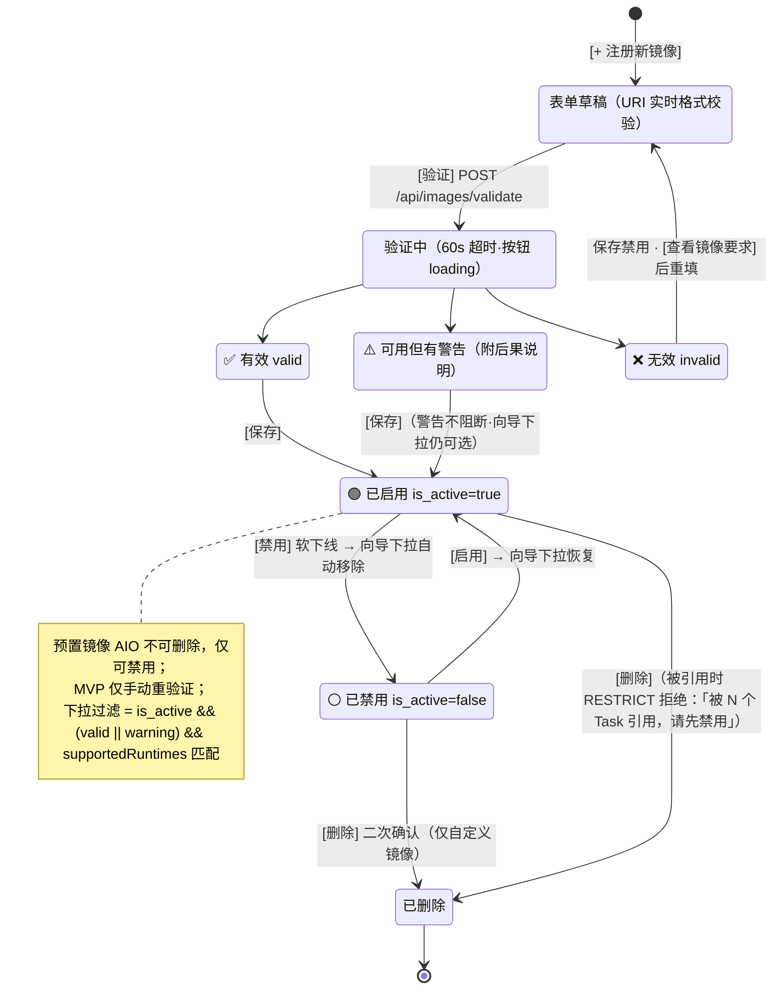
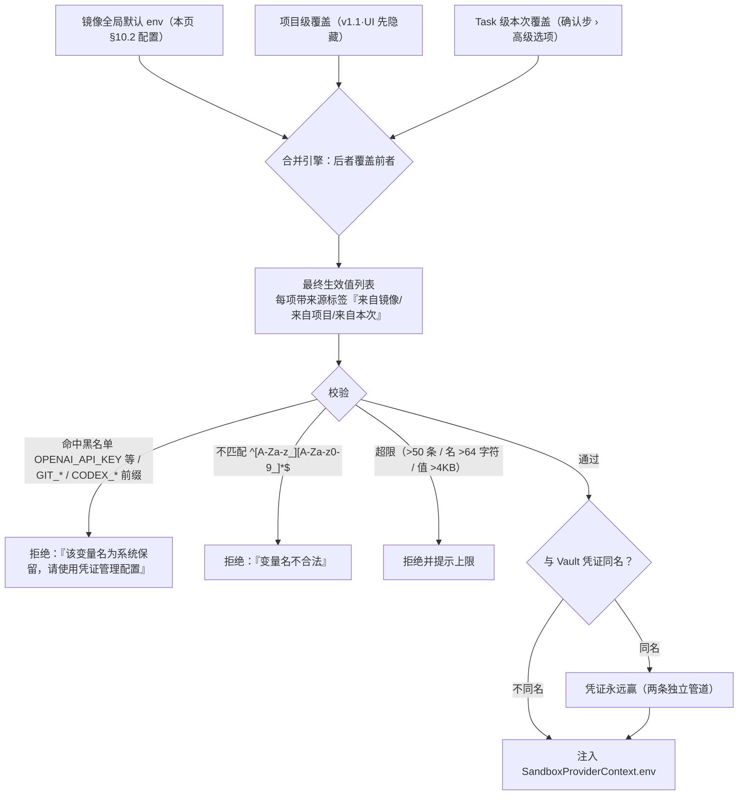

# P21-4 · 设置 / 镜像管理（设置页子菜单） `/settings/images`

> 状态：✅ 可评审 · 上级：[P21 总览](../21-页面信息架构与交互.md) · 镜像契约：技术 04 §7
> **设计变更（v1.0.1）**：镜像管理从独立弹层改为设置页面的左侧菜单子页签。

## 1. 页面目标

注册自定义 OCI 镜像、查看验证结果、管理启用状态；与向导共享数据源，禁用/启用后向导镜像下拉自动联动。

## 2. 进入方式

工作台顶部设置菜单 ⚙️ → 📦 镜像管理；Cmd+K → Settings → Images；向导 Step 2 确认步镜像选择 [注册新镜像]。**所有入口均进入设置页面并定位到镜像管理菜单项**。

## 3. 布局与信息层级

```
┌─ 设置 > 镜像管理 ─────────────────────────────┐
│ 已注册的 OCI 镜像   【搜索】【状态过滤】        │
│ ┌─ AIO（预置）──────────────────────────────┐ │
│ │ ghcr.io/agent-infra/sandbox:latest        │ │
│ │ ✅ 可用 · 适用: Codex, Claude Code         │ │
│ │ 🟢 已启用          [编辑] [禁用]           │ │
│ └───────────────────────────────────────────┘ │
│ ┌─ ml-agent:v1.0（自定义）───────────────────┐ │
│ │ docker.io/myrepo/ml-agent:v1.0            │ │
│ │ ⚠️ 可用但有警告: 未预装 claude-code →      │ │
│ │    创建时需现装，约 12 分钟                 │ │
│ │ 最后验证: 3 小时前                         │ │
│ │ 🟢 已启用     [编辑] [禁用] [删除]         │ │
│ └───────────────────────────────────────────┘ │
│ [+ 注册新镜像]（打开弹窗）                    │
└───────────────────────────────────────────────┘

【弹窗：📦 注册新镜像】
  镜像 URI: [输入框] 
  ℹ️ 镜像须兼容 OCI 标准；验证会检查可达性及依赖项
  
  【验证结果区】（显示在输入框下方）
  ✅ 验证通过：镜像可用
  ⚠️ 验证通过但有警告：未预装 claude-code → 创建时需现装约 12 分钟
  ❌ 验证失败：镜像不符合平台约定（如**缺少 tmux**）

  [验证]  [保存]（仅验证成功时出现）  [取消]
```

列表排序：✅ 可用 > ⚠️ 警告 > ❌ 无效，同组按最后更新倒序。

## 4. 组件清单

ImagesPage（app/settings/images/page.tsx）· ImagesContainer + useImages · ImageCard.view（三态）· RegisterImageModal.view（弹窗形式，验证流）· ValidationResult（✅/⚠️/❌ 分级渲染）· EnableToggle。

## 5. 状态矩阵

| 状态 | 判定（对应 `image_manifests.validation_status`，技术 13 §2） | 用户看到 |
|---|---|---|
| 加载中 / 空 | — | 骨架屏 / 空态 + [注册新镜像] CTA |
| ✅ 有效 | valid | 绿勾 + 适用 runtime 列表 |
| ⚠️ 警告 | warnings 非空（如 `supportedRuntimes` 声明的 CLI 未预装，技术 04 §7） | 黄色 + **后果说明**（"创建时需现装，约 12 分钟"），可正常使用。⚠️ **2026-08 变更**：原例子「缺 tmux → 终端断线恢复将降级」**已移到 ❌ 无效档**——tmux 由「建议」升为「必须」，缺它的镜像不再可保存可用（技术 04 §7） |
| ❌ 无效 | invalid | 红色 + errors 列表 + [查看镜像要求]；不可用于创建 |
| 验证中 | mutation pending | [验证] 按钮 loading |
| 已禁用 | is_active=false | 卡片置灰，创建向导不出现；[启用] 可恢复 |




> 交互链路图：补充自 2026-08 三方评审（已按决策 1-6 修订）

## 6. 交互细节

| 交互 | 行为 |
|---|---|
| [+ 注册新镜像] | 打开弹窗（currentModal = 'registerImage'），焦点入镜像 URI 输入框 |
| [验证] | `POST /api/images/validate`（**超时 60s**，含 pull manifest；超时按 TIMEOUT 处理，可重试）→ 三级结果就地显示；✅/⚠️ 出现 [保存]，❌ 禁用保存；**MVP 仅手动触发重验证**（无周期自动重验证） |
| [保存] | `POST /api/images` → 表单收起 + 列表更新 + toast |
| [禁用]/[启用] | 乐观更新 + `PATCH /api/images/:id {is_active}`（软下线，不物删，保护历史引用——技术 13 §2） |
| [删除] | 仅自定义镜像；二次确认"不可逆"；被使用中的镜像后端 RESTRICT 拒绝，文案「该镜像被 N 个 Task 引用，请先禁用后再删除」 |
| 搜索/过滤 | 客户端过滤名称/URI/状态；搜索词持久化存 **localStorage 键 `imageSearchQuery`**，仅当前会话保留、**切走设置页即清**（不跨会话、刷新不恢复） |

## 7. 数据依赖

`GET /api/images`（列表 + validation_status + is_active）；validate/create/patch/delete 四个 mutation。

## 8. 退出路径

[← 返回工作台] / Logo / Esc → 工作台；左侧设置菜单 → 其他 settings 子页；注册完成后镜像自动出现在向导确认步镜像下拉（按 supportedRuntimes 过滤）。

## 9. 边界规则

- 验证三级反馈每级都给**后果说明**，不裸报技术词。
- 禁用（软删除）与删除（硬删除）是两个分开的操作；**预置镜像（AIO）不可删除**，仅可禁用。
- 使用中镜像不可删（后端 image_ref RESTRICT，技术 13 §2）——前端提前置灰并提示原因。
- 适用 runtime 由 manifest 的 supportedRuntimes 自动计算，不允许手填。
- **向导下拉过滤规则**（与原型 getAvailableImages 一致）：`is_active && (valid || warning) && supportedRuntimes 含所选 runtime`——**⚠️ 警告级镜像仍可选**（选项旁就地显示后果说明，如「不支持断线现场恢复」）；该 runtime 无任何可用镜像时下拉置灰 + 「该 runtime 暂无可用镜像 [去镜像管理]」+ 禁用 [发起]。

## 10. 运行参数体系（Docker 式，MVP 含 env）

镜像不只是"注册与校验"——参照 `docker run` 的参数面，每个镜像可**全局配置运行参数**，sandbox 启动时注入（技术面 `SandboxProviderContext.env` 已支持）。

### 10.1 参数集与版本

| 参数 | 类比 | 版本 |
|---|---|---|
| **环境变量**（key-value，支持 secret 类型） | `docker run -e` | ✅ MVP |
| 启动命令覆盖 | ENTRYPOINT/CMD override | MVP 只读展示，v1.1 可编辑 |
| 工作目录 / 额外卷挂载 | `-w` / `-v` | v1.5 |

### 10.2 镜像卡片新增「运行参数」区

```
🔧 运行参数：
  环境变量: LOG_LEVEL=info · CACHE_TTL=3600 · MY_SECRET=***  [编辑]
  启动命令: python -u agent.py（只读，v1.1 可编辑）
```

[编辑环境变量] 弹层 = 键值表格：`KEY | VALUE | ☐ Secret | [删除]` + [+ 添加变量]。勾选 Secret 的值**加密存储、永远掩码展示**（同 Vault 密钥体系）；**已存 secret 值再次编辑时输入框显示为空** + placeholder「（保持不变，输入即覆盖）」——原值不写入 DOM。

### 10.3 三层合并语义（生效值可溯源）

```
镜像全局默认（本页配置）
  → 项目级覆盖（v1.1，UI 先隐藏）
    → Task 级本次覆盖（向导 Step 2 高级选项）
      → 合并注入 SandboxProviderContext.env
```

Task 向导中每个变量带来源标签 `[来自镜像] [来自项目] [来自本次]`，并可展开"最终生效值"完整列表——用户一眼看清什么覆盖了什么。




> 交互链路图：补充自 2026-08 三方评审（已按决策 1-6 修订）

### 10.4 与凭证管道的边界（安全红线）

- 凭证注入（Vault materialize）与镜像参数注入是**两条独立管道**；同名时**凭证永远赢**。
- **保留变量名黑名单**：`CLAUDE_CODE_OAUTH_TOKEN / ANTHROPIC_API_KEY / OPENAI_API_KEY / CODEX_* / GIT_*` 等禁止在镜像参数中配置——防止绕过 Vault 用明文塞 key；违规保存被拒绝并提示"该变量名为系统保留，请使用凭证管理配置"。
- **变量名校验**：须匹配 `^[A-Za-z_][A-Za-z0-9_]*$`；`GIT_`/`CODEX_` 前缀整体拦截；**完整保留名单为本节黑名单 ∪ §10.6 系统保留清单（KUBECONFIG/HOME/PATH 等）的并集**（技术 05 §4.1 为唯一权威）。**数量与长度上限**：每镜像 ≤50 条、变量名 ≤64 字符、value ≤4096 字节（UTF-8）。

### 10.5 完整参数清单（30+ 参数，六大分类）

> ⚠️ **示例说明**：下表列出的参数**仅为常见示例建议**；业务方可自行定义所需环境变量。**平台不校验范围/格式列中的业务变量取值范围**——该列仅为使用建议，实际值由业务镜像内部 agent CLI 校验。黑名单（§10.4/10.6）与长度限制（§10.6）是平台硬性约束。

#### 环境变量（推荐 MVP 重点）

| 参数 | 默认 | 范围/格式 | 说明 |
|---|---|---|---|
| `LOG_LEVEL` | INFO | DEBUG/INFO/WARN/ERROR | 日志级别 |
| `CACHE_TTL` | 3600 | 60-86400(秒) | 缓存过期时间 |
| `MAX_RETRIES` | 3 | 0-10 | 重试次数 |
| `TIMEOUT_MS` | 30000 | 1000-300000 | 单次操作超时(ms) |
| `WORKERS` | 4 | 1-16 | 并发工作线程数 |
| `BUFFER_SIZE` | 8192 | 512-65536 | I/O 缓冲区大小 |
| `ENABLE_PROFILING` | false | true/false | 性能剖析 |
| `CLEANUP_INTERVAL` | 3600 | 60-86400 | 清理间隔(秒) |

#### 代理与网络

| 参数 | 说明 | 版本 |
|---|---|---|
| `HTTP_PROXY` | HTTP 代理地址 | v1.0 |
| `HTTPS_PROXY` | HTTPS 代理地址 | v1.0 |
| `NO_PROXY` | 代理例外列表（逗号分隔） | v1.0 |
| `CONNECT_TIMEOUT` | 连接超时(秒) | v1.1 |

#### 存储与卷

| 参数 | 说明 | 版本 |
|---|---|---|
| `WORK_DIR` | 工作目录（相对于 /workspace） | v1.1 |
| `DATA_DIR` | 数据目录 | v1.1 |
| `PRESERVE_VOLUME` | 是否保留数据卷（Task 结束时） | v1.1 |

#### 智能体配置

| 参数 | 说明 | 版本 |
|---|---|---|
| `AGENT_NAME` | Agent 标识符 | v1.0 |
| `AGENT_TIMEOUT` | Agent 单个任务超时(秒) | v1.1 |
| `AGENT_MEMORY_LIMIT` | Agent 内存限制(MB) | v1.1 |

#### 安全与凭证（受限）

| 参数 | 说明 | 限制 |
|---|---|---|
| `SSL_VERIFY` | 是否验证 SSL | 本地信任度控制 |
| `JWT_ISSUER` | JWT 发行者 | 只读，系统设置 |

#### 调试与监控

| 参数 | 说明 | 版本 |
|---|---|---|
| `DEBUG_MODE` | 启用调试输出 | v1.0 |
| `VERBOSE` | 详细输出 | v1.0 |
| `METRICS_ENABLED` | 启用性能指标 | v1.1 |
| `TRACE_LEVEL` | 追踪级别 | v1.1 |

### 10.6 参数校验规则与黑名单

**命名规则**：变量名必须匹配 `^[A-Za-z_][A-Za-z0-9_]*$`（与 §10.4 同源；**推荐**全大写惯例但不强制，UI placeholder 用大写示例引导）

**保留黑名单**（禁止在参数中配置）：
```
ANTHROPIC_API_KEY / CLAUDE_CODE_OAUTH_TOKEN / OPENAI_API_KEY / 
CODEX_API_KEY / CODEX_CLIENT_ID / CODEX_CLIENT_SECRET / 
GIT_PRIVATE_KEY / SSH_PRIVATE_KEY / 
KUBECONFIG / HOME / USER / PATH / PWD / 
DOCKER_HOST / DOCKER_CONFIG
```

**长度与内容限制**：
- KEY：1-64 字符
- VALUE：≤4096 **字节**（UTF-8 计——与 §10.4/技术 13 §2 同源；Secret 值加密存储）
- 禁止 shell 元字符 `; | & $() \`等`（防注入）

### 10.7 三层合并规则与冲突解决

合并优先级（从低到高）：
1. **镜像全局默认** — 来源标记 `[来自镜像]`
2. **项目级覆盖** — 来源标记 `[来自项目]`（v1.1 UI 隐藏，仅查看）
3. **Task 级本次覆盖** — 来源标记 `[来自本次]`

同名变量以高优先级覆盖低优先级；冲突时向导确认步显示"⚠️ 该变量被覆盖"。

### 10.8 技术落地标记

⚠️ 实现缺口：
- `image_config` JSON 列（secret 值采用字段级加密，13 §2）
- 参数校验引擎（变量名正则、黑名单、长度、内容）
- 三层合并与冲突检测（application 层）
- 黑名单 violation 前置校验（保存前拦截）
- 参数历史追踪（审计日志）
