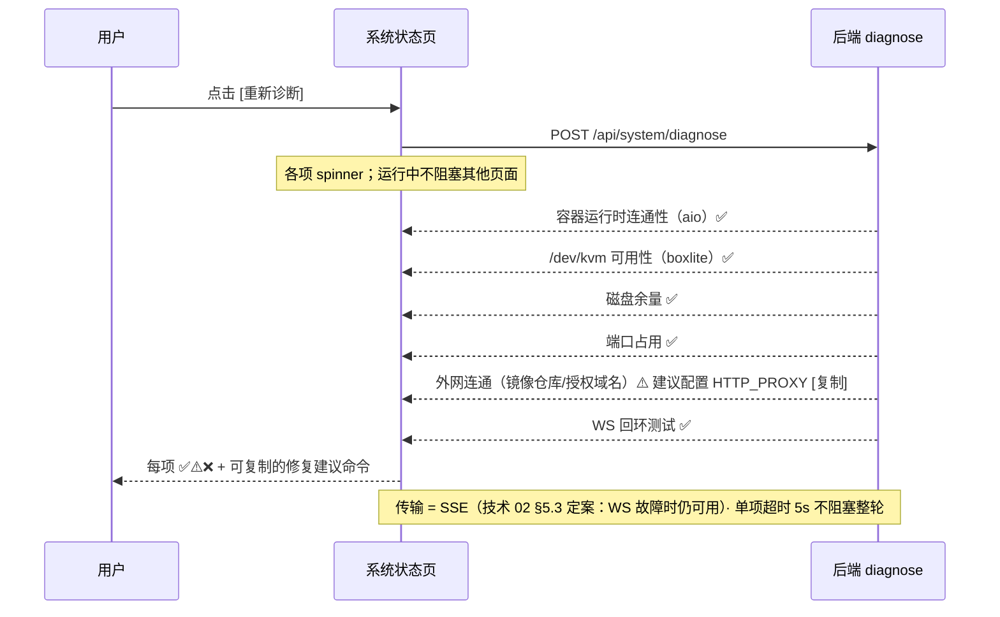

# P21-5 · 设置 / 系统状态（设置页子菜单） `/settings/system`

> 状态：✅ 可评审 · 上级：[P21 总览](../21-页面信息架构与交互.md) · 诊断语义：[P22 §3](../22-异常场景与产品补充要求.md)
> **设计变更（v1.0.1）**：系统状态从独立弹层改为设置页面的左侧菜单子页签。

## 1. 页面目标

查看系统健康：资源池水位、provider 可用性、连接状态；一键诊断与日志导出。

## 2. 进入方式

工作台顶部设置菜单 ⚙️ → 📊 系统状态；Cmd+K → Settings → System；全局异常横幅 [诊断]。**所有入口均进入设置页面并定位到系统状态菜单项**。

## 3. 布局与信息层级

```
┌─ 设置 > 系统状态 ──────────────────────────┐
│ 📊 资源池水位                               │
│   CPU: ▓▓▓▓░░ 4.2/8 核 (52%)               │
│   RAM: ▓▓▓░░░ 5.8/16 GB (36%)   预留 15%   │
│   💾 磁盘: ▓▓▓▓▓░░░░ 150/200 GB (75%)        │
│            ⚠️ 已使用超 75%，建议清理          │
│   🎁 保留卷占用: 45 GB （30 天内 Task 成果） │
│            ⏱️ 最早的成果将在 6 天后清理       │
│   ✅ 系统就绪 · 当前活跃 Task: 5            │
│                                            │
│ 🏃 Provider 状态                            │
│   ✅ aio（容器运行时）正常 · socket proxy 可达│
│   ⏸️ boxlite（micro-VM）未启用 · v2.0 开放   │
│   ⚠️ custom-xx 最近 1h 失败率 5% [查看日志]  │
│     （告警阈值: >1% ⚠️ · >10% ❌）           │
│                                            │
│ 🌐 连接状态                                 │
│   REST ✅ · WS /events ✅(15ms) · 终端 2 连接│
│   上次事件推送: 1 秒前                       │
│                                            │
│ 🔒 访问保护（MVP，规格见 21-8 §3）           │
│ ⬆️ 升级与备份（v1.5，规格见 21-8 §4）        │
│                                            │
│ 📜 审计日志（新增 v1.1，规格见 §10）          │
│   [全部▾][沙箱▾][仅告警] 最近 200 条 · 增量刷新│
│   14:22 ⚠️ sandbox a3f2 探测失败 codex 未就绪  │
│   14:21 ✅ sandbox a3f2 provision 完成 (4.2s)  │
│   14:21 ✅ sandbox a3f2 工作区就绪 2 个条目     │
│          [查看该沙箱完整时间线] [导出]         │
│                                            │
│ 🔧 诊断（逐项结果 + 修复建议）               │
│   ✅ 容器运行时可达（aio）                   │
│   ✅ /dev/kvm 可用（boxlite 就绪）           │
│   ✅ 磁盘余量 200GB · ✅ 端口未占用          │
│   ✅ DATA_ROOT(/data) 文件系统: ext4         │
│   ⚠️ reflink 不支持（CoW 加速功能受限）→     │
│       建议: 使用 Btrfs/XFS（支持 reflink）  │
│   ⚠️ 镜像仓库连接超时 → 建议: 配置 HTTP_PROXY │
│              [重新诊断]  [导出日志]（最近 24h 或 50MB 取小）          │
└────────────────────────────────────────────┘
```

层级理由：资源水位回答"还能再发几个 Task"（最高频，含磁盘与保留卷治理）> provider 健康 > 连接状态（排障用）> 诊断（故障触发的深度动作）。

## 4. 组件清单

SystemStatusPage（app/settings/system/page.tsx）· SystemStatusContainer + useSystemStatus · ResourcePoolCard.view · ProviderStatusCard.view · ConnectionStatusCard.view · DiagnosticsCard.view。

## 5. 状态矩阵

| 状态 | 判定 | 用户看到 |
|---|---|---|
| CPU/RAM 充足 / 警告 / 耗尽 | <80% / 80–95% / ≥95% | ✅ 绿 / ⚠️ 黄"建议停止部分 Task" / 🔴 红"无法创建新 Task" |
| 磁盘充足 / 警告 / 严重 | 使用率 <75% / 75–90% / ≥90% | ✅ 正常 / ⚠️ 黄"已使用超 75%，建议清理" / 🔴 红"已满（无法创建 Task）" |
| 保留卷占用正常 / 过量 | 占 DATA_ROOT 总容量 <80% / ≥80%（治理阈值） | ✅ 占用量 + 倒计时 / ⚠️ 黄"保留卷已占 DATA_ROOT 的 80%+，建议手动清理" + 全局治理横幅 |
| provider 正常 / 故障 / 未启用 | 探测成功 / 失败 / 未配置 | ✅ 版本与通道信息 / ❌ 错误 + [查看日志] / ⏸️ "v2.0 开放" |
| WS 正常 / 断连 | readyState | ✅ 延迟数字 / 🔴 "已断开，等待重连…"（自动恢复） |
| 诊断运行中 / 完成 | mutation | 逐项 spinner / 每项 ✅⚠️❌ + 修复建议命令（可复制） |
| reflink 支持 / 不支持 | DATA_ROOT 文件系统能力 | ✅ "支持（CoW 加速就绪）" / ⚠️ "不支持（CoW 加速功能受限）建议: 使用 Btrfs/XFS" |

## 6. 交互细节

| 交互 | 行为 |
|---|---|
| 自动刷新 | 资源/provider/保留卷 数据 30s 轮询；手动 [刷新] 即时 |
| 磁盘 ⚠️ 警告 / 保留卷 ⚠️ 过量 | 全局横幅"磁盘空间不足/保留卷超容量 [清理]"（治理类，堆叠显示） + 本卡片详情 |
| [查看日志] | 卡片内展开最近 20 行（滚动） |
| [重新诊断] | `POST /api/system/diagnose`；**诊断项按固定顺序展示**：① 容器运行时 ② /dev/kvm ③ 磁盘余量 ④ 端口占用 ⑤ 外网连通 ⑥ WS 回环 ⑦ DATA_ROOT 文件系统；异步并行但顺序固定（已完成项即刻 ✅/⚠️/❌，未完成项 ⏳）；运行中不阻塞其他页面 |
| 修复建议 | 点击复制命令到剪贴板 |
| [导出日志] | 浏览器下载；**导出前脱敏**凭证/token |
| 保留卷倒计时 | 按 FIFO 顺序删除最老任务成果卷；倒计时 = 任务停止/销毁时间 + 30 天，显示**整数天数**（不足 1 天显示"不足 1 天"，≥1 天显示"还需 N 天"，四舍五入向下取整） |




> 交互链路图：补充自 2026-08 三方评审（已按决策 1-6 修订）

## 7. 数据依赖

`GET /api/system/resources`（CPU/RAM/磁盘水位，30s）· `GET /api/system/volumes`（保留卷占用统计 + 30 天倒计时，30s）· `GET /api/system/providers`（capabilities + 健康，技术 04 §5）· WS 状态本地测量（心跳延迟）· `POST /api/system/diagnose`（P22 §3 检测项清单，含 DATA_ROOT 文件系统类型与 reflink 能力）。 · `GET /api/system/audit`（审计流，游标增量）· `GET /api/system/audit/export`（打包导出，§10.3）。

## 8. 退出路径

[← 返回工作台] / Logo / Esc → 工作台；左侧设置菜单 → 其他 settings 子页。

## 9. 边界规则

- 诊断非阻塞、可重复执行；后端进程本身起不来的场景由 `./diagnose.sh` 脚本兜底（P22 §3）。
- 日志导出一律脱敏（与技术 05 §4 日志脱敏同源）。
- provider 三态口径固定：✅ 正常 / ❌ 故障 / ⏸️ 未启用。

## 10. 审计日志与运行日志（v1.1 新增）

### 10.1 为什么是两样东西，不是一样

| | 审计流（`audit_events`） | 运行日志（stdout / 落盘文件） |
|---|---|---|
| 回答 | **发生了什么**（谁、对谁、结果、耗时） | **为什么**（栈、第三方库输出、原始报文） |
| 形态 | 结构化、可筛、可分页 | 非结构化文本行 |
| 读者 | **产品用户 / 管理员**，在页面上看 | 运维 / 开发，出问题时翻 |
| 留存 | 30 天 + 总量双闸（13 §2.8.2） | 按大小轮转 |

⚠️ **不要把运行日志灌进审计面板**——那会让页面变成一屏刷不完的噪音，用户第一次点开就再也不点第二次。反过来也不行：审计流刻意**不含**栈和原始报文，深度排障仍要看运行日志。

### 10.2 审计面板（本页新增区块）

- **筛选**：类别（沙箱 / 项目 / 凭证 / 镜像 / 系统）· 严重度（仅告警）· 时间范围；默认「最近 200 条」

  ✅ **五个类别现在都有产出了**（2026-08-28 后端补齐镜像 / 系统 / 项目改动型 / auth-mode 四组写入点；逐类 `type` 清单见 13 §2.8.2「各 `category` 的生产者清单」）：

  | 类别 | 后端是否在写 | 说明 |
  |---|:--:|---|
  | 沙箱 `sandbox` | ✅ | 创建 / 状态流转 / 无头任务 / provision 阶段 / 探测 / 工作区 / 会话 / 凭证缺席 / 运行时安装 |
  | 项目 `project` | ✅ | 创建 · **重试克隆 / 转空项目 / 取消克隆 / 同步基线 / 删除** |
  | 凭证 `credential` | ✅ | 存 / 吊销 / 注入 · **切换生效凭证方式（`PUT /auth-mode`）** |
  | 镜像 `image` | ✅ | **注册 / 校验 / 启用 / 停用 / 改运行参数 / 删除** |
  | 系统 `system` | ✅ | **访问口令：解锁成功 / 失败 / 达阈值锁定 / 锁定期内再试** |

  ⚠️ **这不等于「尚未记录」那句文案可以删。** 判定逻辑与那句话都保留：类别是**开放增长**的（automation 是 v1.1，13 §2.7；`sandbox.health` 也还空着，03 §7.8），下一个新类别落地前照样会有一段「契约允许但后端不写」的窗口。把机制拆掉，那段窗口里用户又会对着「当前筛选无匹配记录」徒劳地调筛选。

  ⚠️ 两句必须分开的理由不变：**用户的下一步动作不同**——「尚未记录」该等平台补上，「筛选无匹配」该去调筛选条件。⚠️ **类别的判定压过其它筛选**：某个未产出的类别 + 仅告警而空时仍然说「尚未记录」。

  ⚠️ **这份「哪些类别已产出」的知识在前端是一份手抄**（真实来源在后端仓，openapi 表达不了「契约允许 ≠ 今天在写」）。所以它被两道锁夹着：编译期的穷尽性检查（契约增删改名一个类别就红），加上与 msw 替身的**双向**对账（标已产出的替身里必须有、标未产出的一条都不许有）——**单改一边过不去**。⇒ 本轮后端补上镜像/系统写入点，前端那道守卫**会红，这正是设计意图**：替身补上镜像与系统事件、`AUDIT_CATEGORY_EMIT_STATUS` 两项改成 `emitted`，两边同时动才过得去。
- **增量刷新**：按 `seq` 游标拉取，不整页重刷——⚠️ 不用时间戳翻页，同毫秒多条会漏
- **每条**：时间 · 严重度图标 · 一行 `summary`；展开看 `detail`（已脱敏）
- **[查看该沙箱完整时间线]**：跳到工作台沙箱详情的时间线视图（按 `subject_id` 筛），回答「这个沙箱经历了什么」
- **空态**：「暂无记录」而不是空白——空白让人以为坏了

### 10.3 [导出日志] 的准确定义

⚠️ **本页此前写着「导出最近 24h 或 50MB」，而平台当时根本没有日志留存**：后端只有 `Logger` 打 stdout，没有任何落盘设施——那个按钮无物可导。本节把它定死：

导出物是一个 **tar.gz 包**，含三份：

1. `audit.jsonl` —— 审计流（时间范围内，脱敏后）
2. `runtime.log` —— 运行日志（同范围，脱敏后；见 §10.4）
3. `diagnose.json` —— 导出时刻的一次诊断快照（§6）+ 版本 / 资源水位
4. **`export-range.json`** —— 实际截取范围说明（实现时补）

取「最近 24h」与「50MB」中**先到的那个**，包内注明实际截取范围——⚠️ 截断了却不说，会让人以为日志本来就只有这些。

⚠️ **为什么范围说明要单独成第 4 份**：前三份各有固定格式（jsonl / 纯文本 / 诊断快照），把范围塞进任何一份都要么破坏格式、要么藏在读者不会看的地方。它记录：实际时间窗、是否 `truncated`、以及**每一份缺失时的 `omittedReason`**——`runtime.log` 有三种缺法（日志设施未启用 / 范围内无内容 / 读取失败），三者对排障的含义完全不同，混成"文件不在"等于没说。

### 10.4 运行日志要落盘（技术缺口）

⚠️ **现状：没有落盘。** 单机私有化部署里，平台自己必须能读到日志才能提供导出——依赖 `docker logs` 不行：平台不一定跑在容器里（boxlite 档位下可裸跑），而且要挂 docker socket + 知道自己的容器 id，绕且脆。

要求：写 `${DATA_ROOT}/logs/`，按大小轮转（初值 20MB × 5 份），与审计流**同一套脱敏**（05 §4）。技术侧落点见 11 §部署配置。

### 10.5 边界

- 审计写入**永不阻断业务**：它是观察设施，不是账本（13 §2.8.2）。极小概率会「操作成功但没记上」，产品文案不得声称审计流"完整无遗漏"。
- 审计与运行日志**都不含凭证明文**，脱敏发生在**写入口**而非导出时——否则 DB 文件与备份包两条路仍会漏。

