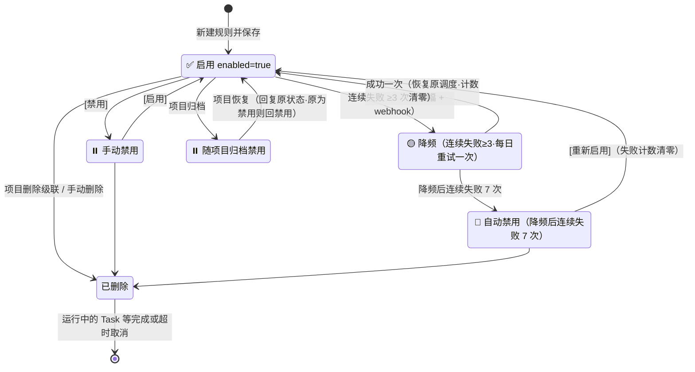
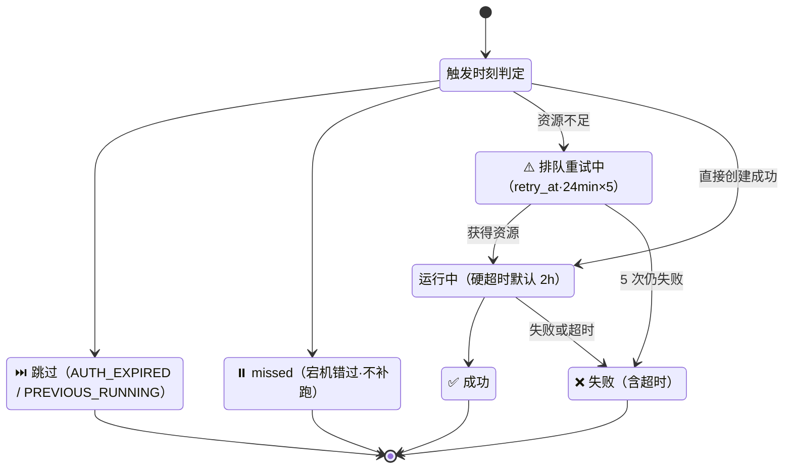
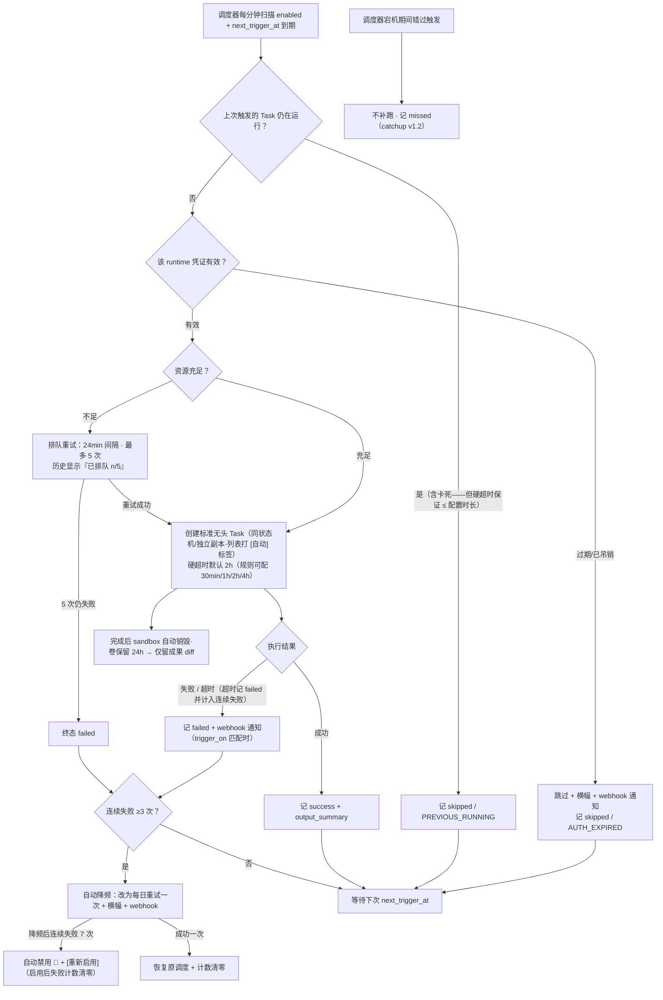

# P21-7 · 自动化（项目菜单侧弹层，v1.1）

> 状态：✅ 可评审 · 上级：[P21 总览](../21-页面信息架构与交互.md) · 挂靠模型见 [pages/21-6](./21-6-项目管理.md)
> **版本定位：v1.1**（与无头 Task 形态配套——定时唤起必然无头，两者共用执行引擎；MVP 核心是交互式终端链路）

## 1. 概念与职责

**自动化规则（Automation）= 项目 + runtime + 任务内容（prompt）+ 调度配置**；每次触发产生一个**标准 Task**（走同一状态机/资源分配/工作区独立副本），自动化只是"定时的发起者"。规则**挂靠在 Project 下**（非全局）：删除项目级联删规则、归档项目自动禁用规则。

触发产生的 Task 在工作台列表用 `[自动]` 标签区分，详情可溯源到规则。

## 2. 进入方式

左侧任务树组头 hover「⋯」→ 项目菜单 → [⚙️ 自动化规则]（侧弹层）；Cmd+K → "自动化"。无独立路由（与 21-6 的轻量化决策一致；规则数多时再升级独立页）。

## 3. 布局与信息层级

### 3.1 规则列表（侧弹层主视图）

```
┌─ ProjectA 的自动化规则 ──────────────────┐
│ ✅ 每天凌晨数据分析                        │
│    Codex · 每天 08:00 · 下次: 8-10 08:00  │
│ ✅ 每周一日志备份                          │
│ ⏸️ 每小时内存检查（已禁用）                 │
│ 🔴 每日报表（连续失败已暂停 [查看原因]）     │
│ [+ 新建规则]                              │
│ ── 选中规则 ──────────────────────────    │
│ 配置详情 · [编辑] [禁用/启用] [删除]        │
│ 运行历史（最近 10 条，[查看全部]）          │
└──────────────────────────────────────────┘
```

### 3.2 创建/编辑表单

```
名称 / 描述（可选）
Runtime: Codex ▾（复用向导的 RuntimeSelector 组件）
任务内容: [多行 prompt，无头执行]
超时配置: ○ 30分钟 ○ 1小时 ◉ 2小时(默认) ○ 4小时——无头任务硬超时，超时记 failed 并计入连续失败
调度（简化预设，MVP 不支持裸 cron）:
  ◉ 每天 [08:00] 时区 [默认取浏览器时区，可改]
  ○ 每小时 分钟 [00]
  ○ 每周 [一三五] [08:00]
  ○ 自定义 cron（v1.2，高级 Tab）
▸ 高级选项（折叠）:
  并发模式 ◉跳过 ○排队(v1.2) ○并发(v1.2)
  成果保留期 3/7/30 天
  Webhook 通知（v1.1决策3）:
    [启用] → URL [输入] + 触发事件 ☐成功 ☐失败 ☐超时 + [测试连接]
[保存规则] [取消]
```

镜像 v1.1 用项目默认值不暴露；资源由后端自动分配（无配额概念）；"把手动 Task 一键保存为规则"是 v1.2 优化。

「任务内容」上限 8000 字符（与任务指令一致）；每项目规则数上限 20 条。「任务内容」与发起向导确认页的「任务指令」是**同一字段**（`RuntimeTaskSpec.prompt`，技术 04 §3）：交互式 Task = 带初始指令的会话（可继续交互），自动化 = 定时触发的无头版（只有指令无终端）。

### 3.3 运行历史

列表：日期 / 触发时间 / 状态（✅ 成功 ⏭️ 跳过 ❌ 失败 ⚠️ 资源重试中 ⏸️ missed）/ 耗时 / 操作；[查看全部] 分页每页 20 条。
单条详情：状态 + 耗时 + output_summary（最后 1KB UTF-8 字节，截断点按字符边界对齐，防止截断中文；来自 stdout + stderr 合并流的最新内容）+ [打开 Task]（跳工作台看只读输出流）+ [下载成果 diff] + [查看规则]。

**无头 Task 的输出查看**：完成后右侧面板是**只读输出流**（非交互终端）：任务元信息 + exit code + [查看完整日志] [导出日志]。

## 4. 状态矩阵

| 状态 | 判定 | 用户看到 |
|---|---|---|
| 规则启用 | enabled=true | ✅ + 下次触发时间 |
| 规则禁用 | enabled=false（手动或项目归档联动） | ⏸️ 灰显 |
| 连续失败暂停 | 连续 3 次失败自动 enabled=false | 🔴 + "[查看原因]"（全局横幅同步提示） |
| 空态 | 该项目无规则 | "为重复性工作创建一条自动化规则 [+ 新建]" |

> **连续失败计数口径**（验收标准，与技术 13 §2 `consecutive_failures` 同源）：**仅 `failed`（含无头任务硬超时转 failed）计入连续失败计数**；`skipped`（凭证过期/上次未完 PREVIOUS_RUNNING）与 `missed`（调度器宕机错过）**不计入**——它们不是任务执行失败，而是"这次没跑"。据此，"≥3 降频、降频后 7 次禁用"的计数只累加真正的执行失败：**一次成功执行把计数清零**，`skipped`/`missed` 对计数无影响（既不 +1 也不清零，视同该次未发生）。






> 交互链路图：补充自 2026-08 三方评审（已按决策 1-6 修订）

## 4.5 触发时刻决策图




> 交互链路图：补充自 2026-08 三方评审（已按决策 1-6 修订）

## 5. 边界场景决策表（触发时刻）

| 场景 | 决策 | 历史记录 |
|---|---|---|
| 凭证过期/吊销 | **跳过本次 + 通知**（不排队等鉴权——用户可能不在线，任务不能无限期卡住）；横幅引导重新授权 | `skipped / AUTH_EXPIRED` |
| 资源不足 | **排队重试**：24 分钟间隔、最多 5 次（≈2 小时窗口），仍失败则终态失败 | `resource-exhausted → retry_at` / 最终 `failed` |
| 上次触发的 Task 未跑完 | **默认 skip**（安全第一，防积压）；queue/concurrent v1.2 可配 | `skipped / PREVIOUS_RUNNING` |
| 调度器宕机期间错过触发 | **默认跳过不补跑**（补跑会让"凌晨任务"在中午执行，破坏定时语义）；记录 missed；catchup 选项 v1.2 | `missed` |
| 连续失败 ≥3 次 | **先降频再禁用**：仅 `failed` 态计入连续失败计数（**`skipped`/`missed` 不计入**——前者因凭证过期/前次未完，后者因系统宕机，均非规则问题）；失败 1-2 次提示 ⚠️；失败 3 次自动降频（改为**每日重试一次**）+ 横幅 + webhook 通知；降频后连续失败 7 次自动禁用（防无谓轮询与刷屏）；成功一次计数清零 | 规则转 🟡 降频，最终 🔴 禁用 |
| 项目删除/归档 | 删除→级联删规则（运行中的等完成或超时取消）；归档→规则自动禁用，恢复时回复原状态 | 删除确认文案列出规则数（21-6 §6 扩展） |

## 6. Task 完成后的处置与清理

- 完成（成功/失败）后 sandbox **自动销毁**；工作区卷保留 24h（可查快照/导出 diff）后清理，仅留成果 diff（artifact）。
- 成果保留期按规则配置（3/7/30 天，默认 7 天）；定期清理任务 v1.2。
- 与手动 Task 的差异：无"询问是否保留卷"环节（无人守终端）。

## 7. 通知（单机无用户体系的现实方案）

v1.1 范围：页面横幅 + 规则列表红标 + 运行历史失败行，**加 webhook 通知（v1.1，决策 3 提前）**——规则表单一个 URL 输入框 + `trigger_on: failure/success/all`（默认 failure），失败时 POST 规则名/项目/时间/原因/[打开 Task] 链接；定时任务的价值恰恰在"我不在时"，仅页面横幅不可接受。本机命令钩子 v1.5 再评估。

## 8. 数据依赖（产品视角端点清单）

`GET/POST /api/projects/:id/automations` · `GET/PUT/DELETE /api/automations/:id` · `POST .../enable|disable` · `GET .../runs`（分页）· `GET .../runs/:runId`；v1.2：`trigger-now`、`runs/:id/logs`（完整日志流）、`runs/:id/retry`。

## 9. 边界规则与技术缺口

- 触发产生的就是标准 Task——自动化层**不得**绕过资源登记/状态机/独立副本（后端内部机制，技术 03）。
- 运行历史保留 ≥30 天（归档策略 v2.0）。
- ⚠️ **技术缺口**（需补进技术文档）：① 后端调度器（每分钟检查 + next_trigger_at 计算 + 宕机恢复按 §5 语义）；② **无头 Task 的 stdout/stderr 完整捕获与存储**（RuntimeAdapter parseOutput 之外还需原始日志落盘/轮转/查询接口）；③ automations/automation_runs 表（已落 13 §2）。
