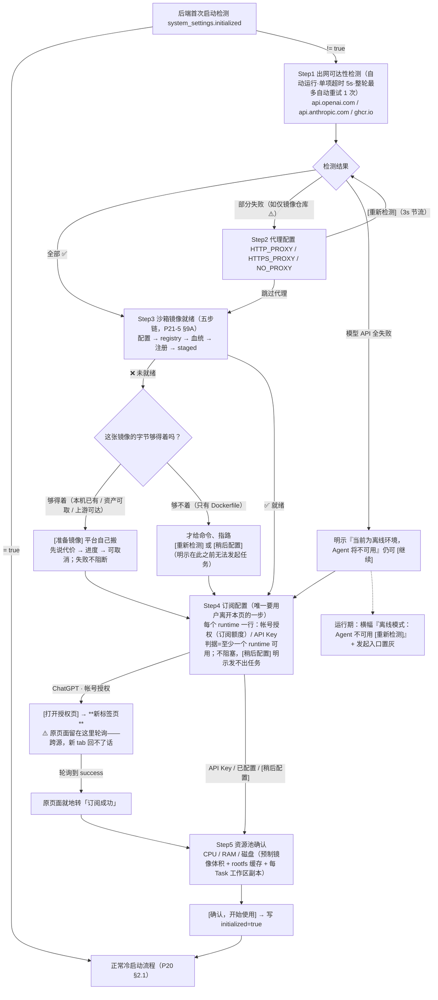

# P21-8 · 部署与初始化（私有化部署专题）

> 状态：✅ 可评审 · 上级：[P21 总览](../21-页面信息架构与交互.md) · 技术对端：[11 部署](../../shared/11-部署与扩展预留.md)
> 定位：私有化部署是产品一等公民。本页承载"部署阶段与管理员视角"的产品面；21-5 系统状态是"运行时看板"，两者互补不重叠。

## 1. 目标部署环境画像（三档）与产品边界

| 档位 | 特征 | 产品要求 | 可用性 |
|---|---|---|---|
| 个人机器 | 单机 compose，外网通畅 | 零配置开箱 | ✅ 完全可用 |
| 企业内网（有代理） | 出网需代理/认证；镜像走企业仓库 | 初始化向导代理配置；诊断区分"代理不通"与"网络不通"；**私有 git 仓库支持（Git 凭证，见 21-3 §Git）** | ✅ 完全可用 |
| 完全离线（air-gapped） | 无外网 | 镜像可 `docker load` 离线导入，平台功能可用 | ❌ **Agent 不可用——物理约束**：codex/claude code 必须能访问各自模型 API |

**产品边界文案（写进官网/README/初始化向导）**：
> "支持私有化部署（内网/本地）：数据、代码与凭证不出你的机器。Agent 运行需要能访问 OpenAI / Anthropic API——不支持完全离线运行 Agent。"

## 2. 初始化向导（首次冷启动，阻塞性）

触发：后端首次启动检测 `system_settings.initialized != true` → 工作台首屏显示向导，完成前不进入正常流程。

```
Step 1 · 出网可达性检测（自动运行）
  • api.openai.com ✅ / api.anthropic.com ✅ / 镜像仓库(ghcr.io) ⚠️
  全部失败 → 明示"当前为离线环境，Agent 将不可用（§1 边界）"，仍可[继续]
Step 2 · 代理配置（检测失败时展开，否则可跳过）
  HTTP_PROXY / HTTPS_PROXY / NO_PROXY → [重新检测]
Step 3 · 沙箱镜像就绪（v1.1 新增·自动运行；v1.2 起「够得着就自己搬」）
  跑 P21-5 §9A 那条五步检查链：配了没有 → registry 里有没有 → 是不是平台自建的那张
  → 注册进来没有 → 本机 staged 没有
  ❌ 未就绪 → **先问「这张镜像的字节够不够得着」**（判据见下 ⇒ 新判据那张表）
     · 够得着 → [准备镜像 · 约 431MB · 从本机资产装载]  平台自己搬
                 按之前先说清代价（多少字节 / 从哪到哪 / 约多久），按之后带进度、可取消
     · 够不着（只有 Dockerfile，非 build 不可）→ 才给命令、指路
     ⚠️ 这一步**不阻塞**：允许 [稍后配置] 继续，但明示"在此之前无法发起任何任务"
     ⛔ **搬运失败不许把向导卡住**：如实说失败在哪一步（下载 / 校验 / 装载 / 注册），
        `[稍后配置]` 与 `[重新检测]` 全程可用 —— 与 `ImageSeeder` 纪律② 同一条口径
  ✅ 已就绪但未 staged → ℹ️「首个任务需要数分钟准备镜像」
  ⛔ **✅ 的那一步不再给"下一步动作"**（2026-08-29 真机订正）：五步链每一步都配一句
     "现在该做什么"，但那句话只属于**没过**的那一步。真机上第 5 步是 ✅（镜像已在本机铺开），
     而那句「首个任务需要数分钟准备镜像」照样渲染在它下面 —— 与同一行的
     「可以立即发起任务」直接打架。⇒ **✅ 不带动作**；ℹ️（已就绪但未 staged）才带，
     因为那时"等几分钟"确实还没发生。
Step 4 · 订阅配置（v1.2 新增·需要用户动手）
  ⛔ **平台备齐了自己那份，还差用户那份。** 前三步问的都是「这台机器行不行」与「平台自己
     备齐了没有」；而 agent 要跑起来还差一样东西 —— **用户自己的模型帐号**。
     少了它,八项诊断可以全绿、镜像可以就绪,而第一个任务照样发不出去。
  显示已注册的每个 runtime 一行(codex / claude-code)+ 各自凭证状态,任选其一或都配:
    ◉ 帐号授权(推荐·用你的订阅额度)   ○ API Key(按量计费·配置最快)
  ⚠️ **不强制两个都配**:一台只跑 codex 的机器不该被 claude-code 的空凭证挡住。
     判据是「**至少一个 runtime 可用**」——那正是「能不能发出第一个任务」的门槛。
  ⚠️ 这一步**不阻塞**:允许 [稍后配置] 继续,但明示"在此之前无法发起任何任务"
     (与 Step 3 同一条口径 —— 它们挡住的是同一件事)。
  ⛔ **复用拦截面板那一套,不另写一份**(F07 §6.1):同一个 `AuthGateContainer`、同一批 view。
     两份「怎么算授权成功」迟早对不上,而其中一份还管着运行期的凭证过期判定。

Step 5 · 资源池确认
  检测到 CPU 8 核 / RAM 16G / 磁盘：可用 62G / 总 200G（预留 15%）
  ⚠️ 资源偏低警告：CPU < 2 核 / RAM < 4GB / **可用磁盘 < 50GB**（`availableBytes`，⛔ 不是总量）
     任一命中 → 显示黄色 ⚠️（"当前资源配置较低，建议增加…"），但仍可继续；资源充足则绿色 ✅
  ⚠️ **磁盘要按真实构成说，不能只报总量**（2026-08 实测）：预制镜像约 13GB、
     boxlite 的 rootfs 缓存实测 31GB、每个 Task 还有一份工作区副本。
     只说"磁盘 200G ✅"会让人以为宽裕，而这三项是持续增长的。
  ⛔ **偏低阈值判的是可用量，磁盘一行必须把「可用 / 总」两个数都显示出来**
     （2026-08-29 真机订正）：本条此前与上一行的容量列在一起，字面读成总量 ——
     而实测机是 **926.3 GB 总量 / 28.9 GB 可用**，按总量会报「磁盘 926 GB ✅」，
     **正是上一条 ⚠️ 点名要避免的那种谎**。只报可用又对不上用户在系统里看到的数字，
     所以两个都给。CPU/RAM 那两条仍按总量（它们没有"可用量"这个概念）。
  → [确认，开始使用] → 写 initialized=true → 进入冷启动建项目引导（P20 §2.1）
```

### 2.1 ChatGPT 帐号授权：开新标签页，原页面等结果（v1.2）

**改的是什么**：此前这一格是「大字号设备码 + [打开验证链接]」，用户要**自己记住/抄下那串码**
再去别处输入。现在把「去授权」做成一次明确的动作 —— **[打开授权页] 开新标签页**，
原页面留在这里等结果，成了就地转「订阅成功」。

```
┌─ Step 4 · 订阅配置 ──────────────────────────────────┐
│  ChatGPT（codex）        ○ 未配置                    │
│  ◉ 帐号授权（用你的订阅额度）  ○ API Key             │
│                                                      │
│  ①  [ 打开授权页 ↗ ]     ← 点它：新标签页 + 码已复制  │
│  ②  在新标签页粘贴这串码：                            │
│        ┌──────────────┐                              │
│        │  ABCD-2WXYZ  │ [复制]   还剩 14:32          │
│        └──────────────┘                              │
│  ③  ⏳ 等待授权中…（本页会自己变，不用回来点什么）     │
└──────────────────────────────────────────────────────┘
                      ↓ 授权完成
┌──────────────────────────────────────────────────────┐
│  ChatGPT（codex）        ✅ 订阅成功 · a***@gmail.com │
└──────────────────────────────────────────────────────┘
```

⛔ **免输码做不到，别把码藏起来。** RFC 8628 允许服务端下发一个把码内嵌进去的
`verification_uri_complete`，那样用户点开就只剩确认。**但 codex CLI 今天不给这个东西** ——
实测录制（`fixtures/cli-output/codex/v0.43.1/device-auth.txt`）逐字是：

```
To authenticate, visit:
  https://auth.openai.com/codex/device
and enter the code:
  ABCD-2WXYZ
```

**纯 URL + 独立的码，两截。** ⇒ 自己拼一个 `?user_code=…` 是在赌 OpenAI 认这个参数；
赌输了用户会落在一个空白输入框前，而**我们刚把码从界面上藏起来了** —— 比现在更糟。
⇒ **码继续留在原页面显眼处**，并在点 [打开授权页] 的同时**自动复制到剪贴板**（那一下是
用户手势，复制合法），用户到新标签页直接粘贴。将来 adapter 真解析出 `verificationUriComplete`
时再让第 ② 步消失 —— 契约里留字段，界面上不撒谎。

⚠️ **原页面凭什么知道成了？只能靠它自己轮询。** 新标签页在 `auth.openai.com` 上，与本页
**跨源**：`postMessage` / `BroadcastChannel` / `localStorage` 事件**一个都跨不过去**。
⛔ 任何「让新标签页回调通知原页面」的实现都是错的方向 —— 那条路在浏览器里根本不存在。
原页面用的仍是既有的 `GET /api/runtimes/:rt/auth/status` 轮询（3–5s，F07 §6.2），
**这一改动没有新增任何后端接口**。

⚠️ **`window.open` 必须在点击回调里同步调用。** 先 `await` 一次 `POST /auth/begin` 再开
标签页，浏览器会当成非用户手势**直接拦掉**（Safari 尤其严）。⇒ 面板展开时就 `begin`
（码与倒计时随之出现），[打开授权页] 只做一件事：同步 `window.open`。

⚠️ **拦截了要看得出来。** `window.open` 返回 `null` ⇒ 浏览器拦了。此时**不能装作开了** ——
原地把链接显示成可点的 `<a target="_blank">` 并说明「浏览器拦了弹窗，点这里手动打开」。
⛔ 静默失败在这里格外贵：用户会盯着「等待授权中…」等到码过期，而什么都没发生。

⚠️ **[稍后配置] 之后这条路不消失**：凭证管理页与发起任务的拦截面板用的是同一套面板
（F07 §6.1），跳过只是把它推迟到下一次撞上。

⚠️ **为什么订阅排在镜像之后、资源池之前**：它是整个向导里**唯一需要用户离开这个页面
去别处操作**的一步（去 chatgpt.com / claude.ai 完成授权）。⇒ 放在平台能自己搞定的事情
（出网、代理、镜像）全部落定之后 —— 否则用户人在授权页，而这边镜像还在拉，回来发现
**设备码已经过期**（codex 的码 15 分钟，实测 fixture 里写着 "The code expires in 15 minutes"）。
⛔ 让一个有时限的凭证跨过一个分钟级的等待，是拿用户的时间去赌。

⚠️ **为什么镜像这一步排在资源池之前**：它依赖出网/代理（要拉镜像），而它的体积又是资源池那一步的主要输入——顺序反过来，磁盘评估就少算了最大的一块。

### ⛔ 订正：「不替用户准备镜像」错在把**搬运**和**构建**当成了一件事（2026-09-05）

> 本节此前写的是：
>
> > ⚠️ **向导只检测和指路，不替用户构建镜像**：平台自建镜像要 `docker build` 一个 13GB
> > 的东西再推到 registry，那是一次分钟级、可能失败、需要 registry 凭证的操作，塞进一个
> > "首次启动向导"里既跑不完也不该跑。向导的职责是**在用户撞墙之前把墙指出来**。
>
> **那段论证的是 `build`，得出的结论却盖住了 `pull`。** 三条实测各推翻它的一个前提。

⚠️ **前提①「用户得自己 build」在真实部署路径上不存在。** 发布版 compose 里有一个
**永不启动**的 service，唯一作用就是让 `compose up` 把镜像拉到宿主机：

```yaml
# PULL vehicle for the per-task AIO sandbox image ... Non-runtime: it never starts.
aio-sandbox-image:
  image: ghcr.io/xeonice/cap-aio-sandbox:${CAP_VERSION:-latest}
```

⇒ 真实部署里没有人 build。镜像是自动到位的，**只不过那件事发生在产品之外**——
产品既不知情、也管不着、更报不出来。于是文档守着一个不存在的场景，而用户撞的是另一堵墙。

⚠️ **前提②「13GB」的量级在 boxlite 档上是 431MB。** 发布侧的资产清单
（`cap-image-assets.json`，`schemaVersion: 1`）按 provider × platform 列资产：

| provider | platform | kind | 体积 | 坐标 |
|---|---|---|---|---|
| aio | linux/amd64 | `docker-archive` | 2.07 GB | `ghcr.io/xeonice/cap-aio-sandbox:<ver>` |
| boxlite | linux/arm64 | `oci-layout` | **0.43 GB** | `ghcr.io/xeonice/cap-boxlite-sandbox:<ver>` |
| boxlite | linux/amd64 | `oci-layout` | 0.44 GB | 同上 |

⇒ 13GB 是**本地开发那张 `docker build` 产物**的体积，不是发布物的体积。拿它论证
「跑不完」，量级差了一个数量级。

⚠️ **前提③「平台没能力做」——而 2026-09-05 重置实测给出了最直接的反例。**
清空 registry 后，那张镜像**的字节仍然躺在本机 docker 镜像库里**
（`localhost:5001/platform/sandbox:v2`，13GB），只是不在 registry 里。此时平台做的是：
报一个 ❌，让用户去敲两条命令——**其中一条还是让他重新 build 一遍已经有的东西**。

### ⇒ 新判据：先问「**这张镜像的字节够不够得着**」，够得着就自己搬

| 情形 | 字节在哪 | 平台该做什么 |
|---|---|---|
| **搬运** · 本机已有 | docker 镜像库里有，registry 里没有 | ✅ **自己 push**（本机回环，不出网） |
| **搬运** · 资产可取 | 发布资产清单列了它（或已下载到本机） | ✅ **自己校验 + 装载**（sha256 对得上才用） |
| **搬运** · 上游可达 | 上游 registry 有，本地没有 | ✅ **纯 HTTP 自己搬**（`SANDBOX_PRESET_IMAGE_SOURCE`）—— ⚠️ **不碰 docker**，这正是它独占的场景：boxlite 档的宿主可以根本没有 docker |
| **构建** · 只有源 | 哪儿都没有，只有 Dockerfile | ❌ 才轮到**指路**——这一格原决定是对的，保留 |

⚠️ **保留原决定里对的那一半：不闷头跑。** 搬运仍是分钟级、可能失败的操作，向导
**不自动开始**——它给一个 **[准备镜像]** 按钮，并在按之前就把代价说清：
**搬多少字节、从哪搬到哪、大约多久**。按下之后带进度、可取消、失败不阻断向导
（`[稍后配置]` 那条路原样保留）。

### ⚠️ 搬运的终点是「注册进来」，不是「推进 registry」（2026-09-05 实跑订正）

第一版实现把 `register` 阶段做成了「`docker push` 完就报成功」。真跑一次的结果是：
3.56GB 推上去了，诊断链**从第 2 步前进到第 4 步**——「平台里没有它的注册记录」，
因为 `ImageSeeder` 只在 `onApplicationBootstrap` 跑，而开机那一刻镜像还不在。

⛔ **那不是修好了，是把「你自己动手」从第 2 步挪到了第 4 步**：用户的下一步从
「敲两条 docker 命令」变成了「重启平台」。**一个把问题往下挪一格的修复，比不修更难发现**
——因为它看起来是成功的（`done ok=true`），而阶段名 `register` 当时还在撒谎（它只 push、不注册）。

⇒ 搬运的完成判据是**诊断第 ⑧ 项转 ✅/ℹ️**，不是「推送返回 200」。实现上推完就地再播一次种
（`ImageSeeder` 自带 `alreadySeeded` 短路，重复调用幂等）。
⚠️ **前端也照这条**：`usePresetImageProvision` 搬完后触发**重新检测**，而不是自行宣布就绪
——两个真相源会打架，用户不知道该信谁。

⛔ **「给命令」不是「指路」的同义词。** 指路的前提是平台确实无能为力；平台明明能做而让
用户去敲命令，那不是指路，是**把自己的活派给用户**。这条与诊断三条误判同一个病根
（P21-5 §9F）：**只报事实，不问谁该动手**。

与 21-5 的关系：向导是**启动卡点**（一次性），21-5 是**常态运维面**（持续）；向导内的检测能力与 21-5 诊断复用同一后端接口。




> 交互链路图：补充自 2026-08 三方评审（已按决策 1-6 修订）

## 3. 访问保护（MVP）

无用户体系下的轻量应用层保护——**访问口令**（落点 21-5 新增区块，本页定义规格；审计决策 P0-3 确认为 MVP 核心——默认监听 127.0.0.1 + 访问口令防护是 NoopAuthGuard 唯一实现的验证机制）：

- **默认启用状态**；启用后首次访问弹口令输入；通过后 session 标记（**有效期 7 天，滑动窗口——每次请求自动刷新倒计时**），已通过的 session 不再重新要求输入直至过期；**连续 5 次错误锁定 5 分钟**。
- **session 边界**：**换浏览器/无痕窗口需重新输入口令**（session 存储在浏览器 Cookie，跨浏览器/无痕不共享）；**[重新生成]口令后所有既有 session 立即失效，下次访问弹输入框**（安全更新）。
- 可在 21-5 系统状态中手动禁用；首次启用自动生成口令（**16 位随机串**）+ [复制]/[重新生成]。
- **安全边界明示文案**："访问口令提供基础隐私保护，不是加密安全边界；生产部署请配置 HTTPS + 网络隔离。"
- 技术映射：`NoopAuthGuard` 实现（技术 11 §3），REST/MCP/WS 三面同时生效；MVP 等级验证。

## 4. 升级与备份（v1.5）

```
┌─ 升级与备份（21-5 内新增区块，规格属本页）──┐
│ 当前版本 v1.x · [检查更新]                  │
│   离线/受限环境下检查失败一律【静默】，        │
│   只显示"无法连接更新源"，绝不阻塞任何功能     │
│ [立即备份]：SQLite + 可选卷压缩 → tar.gz 下载 │
│ [导出全量数据]：含项目/Task/凭证元数据（脱敏） │
│ 更新预期管理："更新有短暂停机（<5min）"        │
└────────────────────────────────────────────┘
```

## 5. 状态矩阵

| 状态 | 判定 | 用户看到 |
|---|---|---|
| 未初始化 | initialized!=true | 阻塞式向导（§2） |
| 初始化完成·出网正常 | 检测通过 | 正常冷启动流程 |
| 初始化完成·离线模式 | 模型 API 均不可达 | 工作台可用但全局横幅"离线模式：Agent 不可用 [重新检测]"；发起向导入口置灰并说明 |
| 代理失效（运行期） | 诊断/请求失败 | 21-5 诊断引导回代理配置 |

## 6. 数据与接口（产品视角，标技术缺口）

⚠️ 技术缺口：`system_settings` 单行表（initialized / proxy 配置 / access_passcode_hash / 版本信息，13 §2 需补）；`GET/POST /api/system/init`（检测 + 保存配置）；`POST /api/system/backup`；版本检查源与静默失败策略。

## 7. 边界规则

- **资源预留 15% 计算方式**：系统报告的 RAM/磁盘总容量为分母，调度时扣除该总容量的 15% 作为系统保留空间，实际可调度上限 = 总容量 × 0.85（例：RAM 16GB → 可调度 13.6GB；磁盘 200GB → 可调度 170GB）；用户看到的百分比进度条 = 已用 ÷ 总容量（分母不变）。
  - ⚠️ **磁盘的那一半还要与当前可用量取小**（2026-08-29 真机订正）：公式的分母是**总容量**，于是一块 926GB、只剩 28.9GB 的盘会算出「磁盘可调度上限 787.4 GB」——它就渲染在「可用 28.9 GB ⚠️」的下一行，两个数字直接打架，而大的那个更醒目。**公式不改**（它是本节定的），但界面上必须把这条边界说出来。
- 初始化向导**只出现一次**；此后配置修改全部走 21-5。
- **离线模式入口置灰清单**（完整范围，防止误操作）：
  - **置灰**（需出网调用模型 API）：`[+ 新任务]` 按钮、向导内 `[发起]` 按钮、自动化 `[立即触发]` 按钮；tooltip 文案"离线模式：需连接网络才能发起任务"
  - **不置灰**（可离线操作）：项目管理（创建/删除/重命名）、凭证/镜像配置、系统状态诊断、设置菜单全项（不依赖出网的都可用）
  - 模式不隐藏功能，只置灰 + 说明（用户配好网络后无需重装）。
- 访问口令 hash 存储（不存明文）；口令不参与 Vault 体系（不是凭证）。
- **初始化检测参数**：单项检测超时 5s、整轮最多自动重试 1 次；[重新检测] 3s 内不可重复点击（节流）。
- 备份导出中的凭证只含**脱敏元数据**，密文与主密钥**不进备份包默认项**（防止备份文件成为凭证泄露面；全量含密钥的迁移备份是显式高级选项 + 强警示）。
