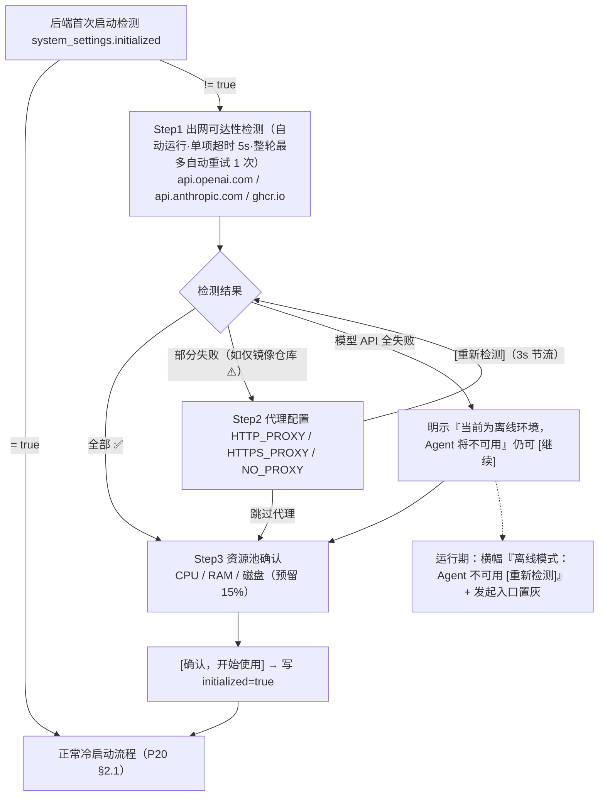

# P21-8 · 部署与初始化（私有化部署专题）

> 状态：✅ 可评审 · 上级：[P21 总览](../21-页面信息架构与交互.md) · 技术对端：[11 部署](../../shared/11-部署与扩展预留.md)
> 定位：私有化部署是产品一等公民。本页承载"部署阶段与管理员视角"的产品面；21-5 系统状态是"运行时看板"，两者互补不重叠。

## 1. 目标部署环境画像（三档）与产品边界

| 档位 | 特征 | 产品要求 | 可用性 |
|---|---|---|---|
| 个人机器 | 单机 compose，外网通畅 | 零配置开箱 | ✅ 完全可用 |
| 企业内网（有代理） | 出网需代理/认证；镜像走企业仓库 | 初始化向导代理配置；诊断区分"代理不通"与"网络不通"；**私有 git 仓库支持（Git 凭证，见 21-3 §Git）** | ✅ 完全可用 |
| 完全离线（air-gapped） | 无外网 | 镜像可 `docker load` 离线导入，平台功能可用 | ❌ **Agent 不可用——物理约束**：codex/claude code 必须能访问各自模型 API |

**产品边界文案（写进官网/README/初始化向导）**：
> "支持私有化部署（内网/本地）：数据、代码与凭证不出你的机器。Agent 运行需要能访问 OpenAI / Anthropic API——不支持完全离线运行 Agent。"

## 2. 初始化向导（首次冷启动，阻塞性）

触发：后端首次启动检测 `system_settings.initialized != true` → 工作台首屏显示向导，完成前不进入正常流程。

```
Step 1 · 出网可达性检测（自动运行）
  • api.openai.com ✅ / api.anthropic.com ✅ / 镜像仓库(ghcr.io) ⚠️
  全部失败 → 明示"当前为离线环境，Agent 将不可用（§1 边界）"，仍可[继续]
Step 2 · 代理配置（检测失败时展开，否则可跳过）
  HTTP_PROXY / HTTPS_PROXY / NO_PROXY → [重新检测]
Step 3 · 资源池确认
  检测到 CPU 8 核 / RAM 16G / 磁盘 200G（预留 15%）
  ⚠️ 资源偏低警告：CPU < 2 核 / RAM < 4GB / 磁盘 < 50GB 时显示黄色 ⚠️（"当前资源配置较低，建议增加…"），但仍可继续；资源充足则绿色 ✅
  → [确认，开始使用] → 写 initialized=true → 进入冷启动建项目引导（P20 §2.1）
```

与 21-5 的关系：向导是**启动卡点**（一次性），21-5 是**常态运维面**（持续）；向导内的检测能力与 21-5 诊断复用同一后端接口。




> 交互链路图：补充自 2026-08 三方评审（已按决策 1-6 修订）

## 3. 访问保护（MVP）

无用户体系下的轻量应用层保护——**访问口令**（落点 21-5 新增区块，本页定义规格；审计决策 P0-3 确认为 MVP 核心——默认监听 127.0.0.1 + 访问口令防护是 NoopAuthGuard 唯一实现的验证机制）：

- **默认启用状态**；启用后首次访问弹口令输入；通过后 session 标记（**有效期 7 天，滑动窗口——每次请求自动刷新倒计时**），已通过的 session 不再重新要求输入直至过期；**连续 5 次错误锁定 5 分钟**。
- **session 边界**：**换浏览器/无痕窗口需重新输入口令**（session 存储在浏览器 Cookie，跨浏览器/无痕不共享）；**[重新生成]口令后所有既有 session 立即失效，下次访问弹输入框**（安全更新）。
- 可在 21-5 系统状态中手动禁用；首次启用自动生成口令（**16 位随机串**）+ [复制]/[重新生成]。
- **安全边界明示文案**："访问口令提供基础隐私保护，不是加密安全边界；生产部署请配置 HTTPS + 网络隔离。"
- 技术映射：`NoopAuthGuard` 实现（技术 11 §3），REST/MCP/WS 三面同时生效；MVP 等级验证。

## 4. 升级与备份（v1.5）

```
┌─ 升级与备份（21-5 内新增区块，规格属本页）──┐
│ 当前版本 v1.x · [检查更新]                  │
│   离线/受限环境下检查失败一律【静默】，        │
│   只显示"无法连接更新源"，绝不阻塞任何功能     │
│ [立即备份]：SQLite + 可选卷压缩 → tar.gz 下载 │
│ [导出全量数据]：含项目/Task/凭证元数据（脱敏） │
│ 更新预期管理："更新有短暂停机（<5min）"        │
└────────────────────────────────────────────┘
```

## 5. 状态矩阵

| 状态 | 判定 | 用户看到 |
|---|---|---|
| 未初始化 | initialized!=true | 阻塞式向导（§2） |
| 初始化完成·出网正常 | 检测通过 | 正常冷启动流程 |
| 初始化完成·离线模式 | 模型 API 均不可达 | 工作台可用但全局横幅"离线模式：Agent 不可用 [重新检测]"；发起向导入口置灰并说明 |
| 代理失效（运行期） | 诊断/请求失败 | 21-5 诊断引导回代理配置 |

## 6. 数据与接口（产品视角，标技术缺口）

⚠️ 技术缺口：`system_settings` 单行表（initialized / proxy 配置 / access_passcode_hash / 版本信息，13 §2 需补）；`GET/POST /api/system/init`（检测 + 保存配置）；`POST /api/system/backup`；版本检查源与静默失败策略。

## 7. 边界规则

- **资源预留 15% 计算方式**：系统报告的 RAM/磁盘总容量为分母，调度时扣除该总容量的 15% 作为系统保留空间，实际可调度上限 = 总容量 × 0.85（例：RAM 16GB → 可调度 13.6GB；磁盘 200GB → 可调度 170GB）；用户看到的百分比进度条 = 已用 ÷ 总容量（分母不变）。
- 初始化向导**只出现一次**；此后配置修改全部走 21-5。
- **离线模式入口置灰清单**（完整范围，防止误操作）：
  - **置灰**（需出网调用模型 API）：`[+ 新任务]` 按钮、向导内 `[发起]` 按钮、自动化 `[立即触发]` 按钮；tooltip 文案"离线模式：需连接网络才能发起任务"
  - **不置灰**（可离线操作）：项目管理（创建/删除/重命名）、凭证/镜像配置、系统状态诊断、设置菜单全项（不依赖出网的都可用）
  - 模式不隐藏功能，只置灰 + 说明（用户配好网络后无需重装）。
- 访问口令 hash 存储（不存明文）；口令不参与 Vault 体系（不是凭证）。
- **初始化检测参数**：单项检测超时 5s、整轮最多自动重试 1 次；[重新检测] 3s 内不可重复点击（节流）。
- 备份导出中的凭证只含**脱敏元数据**，密文与主密钥**不进备份包默认项**（防止备份文件成为凭证泄露面；全量含密钥的迁移备份是显式高级选项 + 强警示）。
